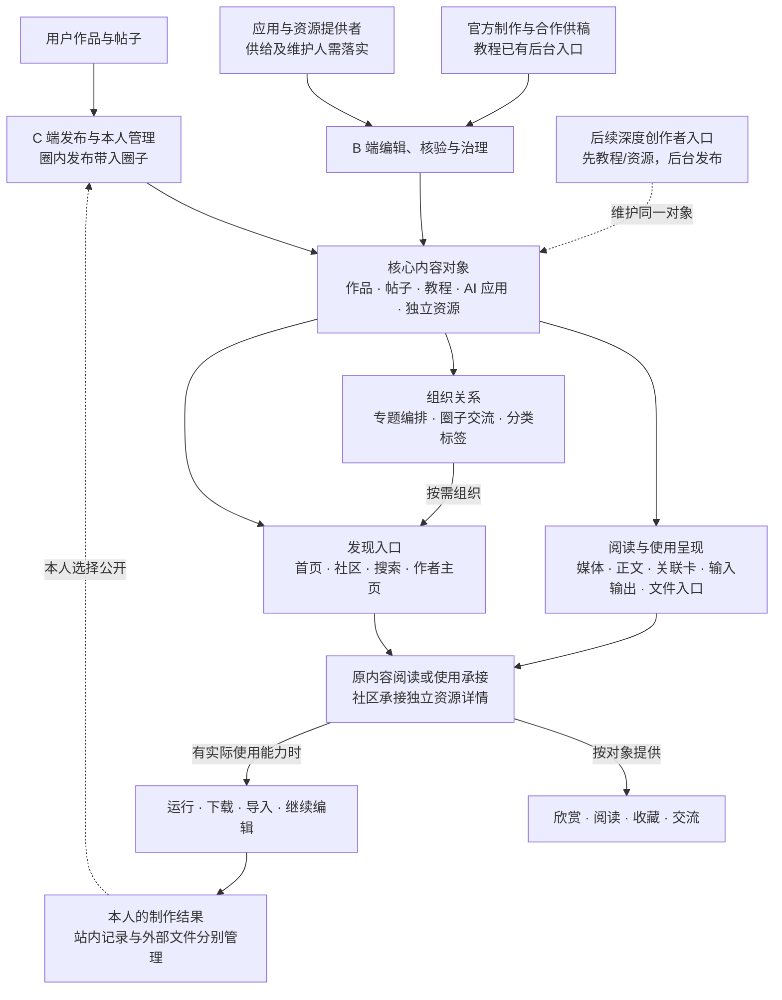

# 多元拾光全站内容关系图

日期：2026-09-25｜产品模型讨论稿，非菜单定稿或上线清单

当前版本范围已确认：只处理文字、图片、视频；音频、3D、代码等纳入后续版本。该范围限制应用面向用户处理和交付的内容，不限制底层使用工作流或程序实现。

当前推进优先级已确认：先以内容展示与交流为主，不是先以表单式应用为主。分步引导是否纳入仍待具体场景决策；此前表单、多轮对话、固定分步三种方式的建议未定版。

互通目标已确认：社区承接展示、浏览与交流，MakeNow 承接画布/工作流的实际查看、编辑和制作。用户说明 MakeNow 已有自由素材画布、多轮画布和 Agent；现有只读观察不证明代码、接口、权限与 ComfyUI 兼容性。互通不等于在社区重建编辑器，也不默认公开私人项目。公开版本、三档权限、副本独立及主动发布回社区的原则按下文已确认记录执行；账号、定向打开及具体接口实现仍须核验，移动端复杂操作转 PC 的边界保留。

本次重大改版范围补充确认：面向社区的公开分享与复用纳入本期开发需求；现有能力缺口不作为推迟本期范围的理由。当前授权仍为产品定义、原型和研发交接，不因此开始修改或发布生产代码。分享权限、公开版本、撤回影响、成果回流、来源关联及衍生工程再次分享选项按下述已确认规则执行。

分享权限已确认：默认“仅分享成果”，用户可浏览作品、阅读说明和交流，不开放工程；作者可主动选择“允许查看制作项目”，用户在 MakeNow 查看公开画布但不能复制；或选择“允许复用制作项目”，用户可查看并复制为个人项目继续创作。公开内容在社区维护，工程及副本在 MakeNow 维护。三档是本期目标规则，不代表现有系统已完整实现；查看不等于获得编辑原工程的权限，复用不等于与原作者协同编辑。

公开版本已确认：发布时确定供他人查看或复制的公开版本；作者在 MakeNow 对原工程的日常编辑不自动同步到公开版本，只有主动选择“更新公开版本”后才提供新版。他人已复制的个人项目保持独立，不因原作者更新被覆盖。此规则不预设向访客开放历史版本列表或版本切换。

撤回与权限收紧已确认：从“允许复用”改为“仅允许查看”后，后续访问可查看但不能再复制；关闭项目分享、仅保留成果后，成果仍可浏览，工程不可再查看或复制；撤下社区成果后，原内容不再公开，关联分享入口停用。以上作者主动调整均保留他人已复制的个人项目，不追溯删除；首次开放复用时须向作者明确提示。违规或侵权处置另按平台规则处理。该规则不将某条内容的撤回扩大为删除原工程或其他独立内容。

成果回流与来源关联已确认：用户在 MakeNow 主动选择文字、图片或视频成果，发起“发布到社区”，预览并补充说明后发布为本人名下的新作品；新作品拥有独立评论与互动，不覆盖原作品。系统保留来源项目、原作者及复用版本，作品显示“基于 ×× 项目创作”，不要求用户手填来源。原分享撤回后，来源显示为不可访问，不绕过权限展示原工程。成果发布与工程再次开放复用分开处理：允许复制创作不自动等于允许将整个工程再次公开；发布成果后，个人画布仍保持私有，除非后续按已授权的工程分享规则主动开放。

衍生工程分享选项已确认：原作者选择“允许复用制作项目”时，保留附加选项，默认“仅允许用于创作”，复用者可复制、修改和发布成果，但不能再次公开工程；原作者可主动选择“允许衍生工程再次分享”，复用者可公开修改后的工程，并保留来源关联。该选项不新增第四种分享档位，不自动公开任何副本。多级衍生逐级显式授权、下游不能扩大上游权限已确认；已有副本按取得时有效授权保留再次分享资格已按 D-X09 确认；收紧影响此后从该来源新取得的副本，既有合法衍生工程不自动下架。首次开放时须告知作者，撤回不能终止已有授权允许的衍生传播，违规侵权处置另行处理。

MakeNow 现状核查（2026-09-25，登录后只读浏览）：项目列表有复制项目入口；已有项目可打开节点画布，包含 Agent、历史会话及每步确认入口；协同面板支持按账号 ID 邀请成员。首页公开案例的“查看画布”可打开[案例画布](https://www.makenow.tv/case-share/6/canvas)，加载节点与素材，并禁用所见编辑/生成控件；页面提供“复制画布”，提示复制完整节点到个人新项目。本轮未执行复制、邀请、保存或生成，未验证未登录访问、权限隔离、普通作者发布入口、版本快照、撤回分享、跨产品账号与成果回流接口；这些入口证据不能等同完整互通已经实现。MakeNow 节点画布也不能据此认定兼容 ComfyUI。

全站以作品、帖子、教程、AI 应用、独立资源为核心内容对象。图片、视频、长文等是表达形式；专题、圈子和分类负责组织；首页、社区与搜索负责发现；后台和创作者入口负责维护。它们共同服务浏览、交流、学习、使用与创作，不要求用户依次完成所有环节。

独立资源发布已确认：画布、工作流、模板可以脱离成品作品在社区独立发布，不强制先发布作品或配套教程。资源应提供效果示例或工程预览、用途、使用条件和明确维护人；预览不要求另建一件公开作品。前期官方后台维护、后续创作者入口的既有阶段安排保持不变；此决定不自动确认独立资源频道、列表及搜索归属，也不意味着支持任意工作流在线运行。

资源发现方式已确认：主要在浏览作品、学习教程时通过关联发现，不要求固定入口。本期不建设独立资源频道、资源市场或固定浏览入口；资源仍独立发布和维护，相关内容引用同一资源。此前增加资源浏览入口与搜索类型的配套建议不纳入当前确定范围，不通过“独立发布”推导固定分发入口。

五类对象沿用已确认边界，本图对它们与其他全站对象的关系作统一整理。划分对象不等于新增五个频道、五套编辑器或五个后台菜单。

## 1. 全站关系图

下图表达改版目标结构。标注“现有基础”只表示已有部分入口或能力；完整维护与消费关系仍需按后文现状对照实现。

图中引用不复制正文、文件或评论。作品可以没有教程，教程可以没有资源，应用可以不公开底层工作流；没有配套材料时仍可独立成立。内容可以直接访问，不强制先经过专题或圈子。

**闪念已融入圈子与社区，不再单设频道。**目标模型统一用“帖子”表示想法、经验、问题等原内容，用“圈子”表示组织这些内容的空间。圈内发布默认带入该圈子；沿用圈子选填决定，未选圈子的帖子进入社区内容流。后文“闪念”只用于定位现有线上入口，不代表改版保留独立模块。

## 2. 五类核心对象：形式、展示、维护与消费

本表为目标模型；实际已有能力见第 6 节。表中的收藏、评论、下载、运行等按对象、权限和真实能力提供，不承诺所有对象拥有相同操作。

| 对象：主要目的 | 表达与展示 | 从哪里被发现 | 谁维护、维护什么 | 用户如何消费、下一步是什么 |
| --- | --- | --- | --- | --- |
| **作品：看创作结果** | 单图、多图、视频、文本成果；卡片突出结果，详情展示完整成果、作者与说明 | 首页作品流、作者主页；按实际关系进入专题、社区或活动作品集合 | 用户从 C 端发布，官方作品由 B 端维护，平台治理；维护成果、媒体顺序、署名、说明、公开状态和可复用关联 | 欣赏、互动、收藏；有真实能力且允许复用时进入同款或应用；可直接投稿活动，不必先生成 |
| **帖子：表达与交流** | 短文、图文、经验长文、过程对照、问题；社区流显示正文摘要与媒体，详情承接完整讨论 | 社区、圈子、作者主页、搜索；可被专题收录 | 用户轻发布，官方帖及深度编辑能力需补；维护正文、媒体、原内容引用、圈子归属和后续补充 | 阅读、回复、交流；引用作品、教程、应用或资源继续了解；独立提问帖拥有自己的讨论 |
| **教程：理解与学会方法** | 图文、章节、步骤、视频配说明、表格/代码/Prompt；资源放在相关讲解处 | 社区教程入口、搜索、专题及内容关联 | 当前官方后台维护；后续创作者教程进入同一教程列表与搜索体系，区分真实作者、官方原创与平台推荐。具体开放资格、时间及操作待定 | 阅读、学习、讨论；按需打开相关应用或取用资源；无需为了阅读先下载、运行或创作 |
| **AI 应用：介绍一项可完成的任务** | 按任务介绍用途、效果示例、所需输入、输出形态和使用条件；表单/对话/Agent/批量属于能力属性 | 首页金刚区进入应用列表，专题、搜索、作品/教程关联；两端共享目录，设备限制在详情引导 | 优先官方已有能力，再精选创作者资源应用化；前期后台统一维护介绍，MakeNow 能力维护者保障执行、条件和可用性；后续应用先由作者供稿/申请更新，正式发布由后台负责 | 社区展示与介绍后进入 MakeNow；输入、费用、生成、任务和结果由 MakeNow 承接，结果主动发布才形成社区作品。底层用工作流不等于必须在 PC 使用 |
| **独立资源：复用与继续编辑** | 工作流、画布项目、模板等；预览、文件/项目、格式、依赖、版本、许可与使用说明 | 可独立发布，不依赖作品或教程；也可被教程、专题、作品或应用引用；主要经作品、教程等内容关联发现，不设置固定资源入口；社区承接独立资源详情，具体字段与操作待细化 | 前期后台独立管理、提供者或维护者持续维护；保留身份、文件/项目位置、版本、许可、引用关系与失效状态 | 阅读条件后下载、导入或打开项目；复杂工作流/画布编辑到 PC。取用不等于运行，运行不等于发布 |

作品/帖子/教程可相互引用；它们还可引用应用和资源。应用可关联底层资源，但不要求公开资源。资源更新需要识别引用影响，不自动改写相关文章。

### 内容关联的含义与变更处理（原则已确认）

用户已确认“制作来源、配套内容、推荐参考”的区分及对应更新、失效处理原则符合实际维护需要。沿用同一对象可被多处引用、评论不复制、公开权限与可用性分开的规则。下列分类用于解释关系，不要求发布时新增复杂分类问卷，也不改变原内容的发布权限。

| 关系 | 含义及示例 | 建立方式与维护 |
| --- | --- | --- |
| 制作来源 | 作品实际由某应用生成，或基于某工程版本制作；应用确实由某工作流支撑 | 有真实任务/复用记录时系统带入；外部制作可由作者声明，后台补录需有依据，不标为系统验证。不能因为点击过工具或内容相似就认定使用过 |
| 配套讲解或材料 | 教程对应的练习工程、教程中解说的作品、作品对应的讲解文章 | 作者/编辑按真实关系选择；只说明内容配套，不自动证明读者或作品作者使用过该资源 |
| 推荐参考 | 相似案例、延伸教程、可供尝试的工具 | 作者/编辑推荐，不等于实际来源、原作者背书或共同创作 |

专题收录、圈子归属仍为组织关系，不混入制作来源。关联目标的作者不能仅因被引用就修改引用方内容或接管其评论。编辑只能修改自身负责内容中的引用；平台治理按既定权限处理。

建议保存最少必要关系：当前内容、目标对象、关系含义、来源依据（系统记录或人工说明）；确有项目复用/生成版本证据时保存版本。没有版本信息时不编造，不由此新增复杂来源图谱或用户历史版本选择系统。

系统记录的真实来源与用户自己补充的说明分开维护：作者可纠错，不能通过普通编辑把真实复用来源改为无来源或虚构其他原作者。外部作品允许说明工具和来源，但不冒充平台实测记录；本期不据此新增自动鉴真机制。错误来源的纠正责任与留痕需在后台细化。

公开关联只展示对当前访问者可见的信息。关联私人 MakeNow 工程不会自动公开工程名称、缩略图、节点、素材或会话；作者需要按已确认规则主动开放。无权访问、撤回或违规处置的目标，保留必要的关系记录不等于继续展示原内容，C 端以适当的不可访问状态承接。

| 目标变化 | 关联方怎样处理 |
| --- | --- |
| 名称、封面或简介调整 | 当前公开介绍可更新，作品实际使用过的项目/版本记录不改写；正文引用文字由正文维护者按需修订 |
| 工程发布新公开版本 | 原有复用来源仍指向实际使用版本，个人副本不被覆盖；访问最新公开项目与历史来源需区分，不把新版冒充原制作版本，也不保证旧版仍可取用 |
| 教程配套工程或应用能力更新 | 后台定位受影响引用，交内容维护者判断是否修订步骤或注明适用版本；不自动重写教程，不未经核对就替换配套工程 |
| 仅取消推荐/移出专题 | 原内容及引用仍按原公开权限可访问，不删除对象或评论 |
| 暂时不能运行/取用 | 保留仍公开的介绍与原内容，暂停受影响操作并提示；不将推荐工具自动换成另一工具 |
| 撤回分享、下架或访问权限收紧 | 关联方保留自身内容；目标入口按最新权限限制，必要时说明来源不可访问；不通过缓存卡片泄露已停止公开的内容。已获副本按既有规则保留 |

例如：海报实际使用 A 应用，教程另推荐 B 应用。作品的制作来源是 A，B 是参考推荐；A 暂不可用时不能把作品来源改为 B。若作品基于公开工程 v1，而原作者已发布 v2，原作品仍基于 v1；v2 可以成为当前可获取版本，但不能改写历史制作关系。

本节关联含义、来源依据及版本呈现原则已确认，具体字段与后台纠错操作待细化；更新、撤回、个人副本及推荐恢复沿用已有决定。多级衍生逐级授权已按 D-X08 确认；授权变化按 D-X09 已确认的取得时有效许可处理，不从单纯来源关联推定授权。

### 表达形式不另建内容类型

| 表达形式 | 放在哪里、维护到什么程度 |
| --- | --- |
| 图片、图集、视频、文本 | 可是作品本体，也可是正文素材；按所属对象维护媒体、顺序、图注或说明 |
| 章节、步骤、对照、表格、代码与 Prompt | 是正文结构或组件，服务帖子/教程等；“长文”“深度”“案例”不另建发布类型 |
| 普通附件 | 随正文维护的 PDF、素材或示例文件；需要持续独立复用、换版或多处引用时才作为独立资源 |
| 卡片、列表摘要、封面、Banner | 是呈现或分发形式；内容卡片引用原对象，Banner 自己维护投放素材和目标 |

文本作品沿用现有类型。漫剧已有后台选项，但不能推定分集维护完成；音频、3D、交互网页、整套课程不因这张图进入首期。

### AI 应用的候选形式：供范围决策

整理日期：2026-09-24。以下根据官方产品说明归纳常见形式，是便于决策的产品分类，不是行业统一标准、市场占比统计或已确认建设范围。各行可以组合，一个应用不必只能归一行；前台按主要使用方式呈现，另标资料依赖、运行方式等维度。

| 形式 | 用户怎样使用、得到什么 | 举例 | 移动端判断（产品建议） | 额外维护重点 |
| --- | --- | --- | --- | --- |
| 1. 单次工具/表单 | 输入文字或上传文件，选参数，执行后看结果 | 商品换背景、文案改写、OCR、图生视频 | 少量输入可适配；大文件或复杂参数另判 | 输入输出、限制、运行入口、失败与重试 |
| 2. 多轮对话助手 | 通过追问和修改逐步得到回答或内容 | 写作助手、选题助手、产品答疑 | 普通对话适合；复杂结果需专用展示 | 对话上下文、角色边界、引用与清空/历史规则 |
| 3. 资料/知识库助手 | 先选或上传资料，再问答、提炼、比较并查看出处 | 对一组文档提问、资料研究 | 阅读提问可适配；资料整理通常 PC 更方便 | 资料来源、更新、访问权限、引用定位；不是只维护提示词 |
| 4. 分步引导任务 | 分步骤提供材料、确认中间结果，再继续 | 商品信息→卖点→文案→海报；脚本→分镜→视频 | 步骤简短可适配；不能只按步数禁用 | 中间结果、回退影响、单步失败和恢复 |
| 5. 文档/演示/代码工作台 | 先生成草稿，再在文档、页面或代码中持续修改 | 演示稿、报告、网页原型 | 查看和轻改可；完整编辑通常 PC | 可编辑工程、预览、版本、导出；网页/代码运行另需环境 |
| 6. 画布式创作 | 在空间中摆放参考、素材和结果，局部生成或组合 | 灵感板、视觉方案、设计画布 | 本项目复杂画布编辑交 PC | 工程结构、素材引用、局部操作、保存与导出 |
| 7. 时间线式创作 | 对片段、轨道或镜头生成、剪辑、排列 | 视频剪辑、配音与音效编排 | 轻操作可另评；复杂多轨编辑通常 PC | 时序、轨道、素材、同步、渲染和工程保存 |
| 8. 节点工作流 | 用户连接模型和处理节点，调试再运行 | ComfyUI 图像/视频流程 | 本项目节点编辑、调试交 PC | 节点及模型依赖、工程版本、运行环境与兼容 |
| 9. 任务执行 Agent | 用户给目标，系统调用工具推进，必要时请用户确认 | 收集资料后制作交付物、操作已授权业务工具 | 目标输入/进度查看可适配；执行能力逐项判断 | 工具权限、过程记录、确认点、停止、失败恢复 |
| 10. 批量处理 | 输入一组对象，逐项处理、查看结果并重试失败项 | 批量商品图、文件提取、素材转换 | 少量可；大量材料管理通常 PC | 输入输出对应、部分成功、队列、单项重试与消耗 |
| 11. 自动触发流程（运行方式） | 按时间或事件执行，查看历史结果与异常 | 定时资料汇总、新文件进入后自动处理 | 查看结果可；配置通常 PC | 触发条件、频率、授权、停用、去重与失败通知 |
| 12. 实时语音/音视频交互 | 持续输入与响应，能打断或切换话题 | 语音陪练、实时解说、语音助理 | 语音可适配；摄像与实时视频需单独验证 | 会话、延迟、设备权限、打断和连接恢复 |

第 1/2/4/5/6/7/8 类主要描述交互；第 3 类强调资料依赖，第 9 类强调执行自主性，第 10/11 类强调运行方式，第 12 类强调实时交互。它们不是十二个互斥频道。例如“批量商品换背景”可以同时是表单式、图像产出、批量运行、工作流实现。

**产出另标，不与上表混为一层：**市场包含文本、图片/设计、音频/语音/音乐、视频/数字人、文档/演示/表格、数据分析/结构化提取、代码/网页/软件、3D/空间资产。当前仅文字、图片、视频；音频、3D、代码等后置。文档/演示/表格的文件导入、编辑和导出不因文字范围自动纳入，仍需单独确定。第 12 类当前只比较实时文字/图像/视频交互，不纳入实时语音能力；文字流式输出不直接计为实时交互产品。

12 类竞品映射见[AI 应用形式竞品对照](ai-application-competitor-matrix.md)，其中候选能力仍待选择，不因竞品支持而进入本站范围。

**AI 应用承接已决定：**社区介绍，MakeNow 执行。下载资源后在指定工具使用、安装到宿主软件或由 API 调用，仍须按实际对象和权限判断，不因为带有 AI 就都改称社区应用。工作流文件、画布项目、Prompt/Skill 配置仍可属于资源；只有提供明确可用的 MakeNow 运行入口时才讨论当前应用上架，API 或 MCP 名称本身不证明已有用户界面。

研究站原六类“单图生成、局部修改、文字处理、批量处理、视频生成、分步任务”保留为场景及交互样例，不能当作互斥的全站应用分类。现有 AI 创作与模板配置提供部分基础，尚未证明已经具备以上全部能力。

建议先确定“展示哪些形式、哪些允许站内使用、哪些仅外部承接”，再决定手机操作范围与后台字段。当前不建议因为列全形式就建设对话、画布、工作流、Agent、自动化等多套引擎。

官方依据（只读文档，未实测付费运行）：

- [Dify Workflow Studio](https://www.dify.ai/workflows)：表单/对话式承接、批量、触发器、工具调用与人工确认，说明同一流程可有不同交互入口。
- [Adobe Firefly 功能说明](https://helpx.adobe.com/firefly/web/get-started/learn-the-basics/adobe-firefly-overview.html)：图像、视频、编辑、画布；[画布引导流程](https://helpx.adobe.com/firefly/web/create-mood-boards/firefly-boards/use-quick-guides.html)说明分步骤学习与制作。
- [Gamma 创建说明](https://help.gamma.app/en/articles/7838093-how-do-i-create-a-new-presentation-document-or-webpage-in-gamma)：按主题生成、粘贴及导入后编辑文档/演示/网页。
- [Google 资料研究助手说明](https://support.google.com/gemininotebook/answer/16164461)：基于所选资料问答、引用和转成其他阅读形式。
- [ComfyUI 官方说明](https://docs.comfy.org/essentials/core-concepts/links)：节点界面与推理引擎；[3D 工作流示例](https://docs.comfy.org/tutorials/api-nodes/rodin/model-generation)说明资源形式不限图像。
- [ElevenLabs 对话式 Agent](https://elevenlabs.io/docs/eleven-agents/quickstart)：实时语音助手这一交互方向；具体音视频能力需逐项核对。

## 3. 组织层与入口层各管什么

### AI 应用与 MakeNow：定义已确认，具体范围待定

AI 应用定义口径已确认：按用户要完成的具体任务定义应用，表单、多轮对话、Agent、批量等作为使用方式或能力属性，不分别建立互斥的内容类型。画布、工作流等可复用工程归独立资源；封装成具有明确输入输出和使用入口的任务能力时，可另建立应用并关联资源。此确认不等于下方十二种形式的本期取舍或具体应用清单全部获准。

运行承接口径已确认：社区统一维护应用露出、用途、示例、条件和详情；所有 AI 应用的输入参数、费用、生成、任务和结果由 MakeNow 承接。简单应用也不在社区直接执行。社区不建立第二套模型配置、计费或生成记录。未来电商 Agent 未上线，不列为当前可用执行入口。此决定只针对 AI 应用模块，不推导既有社区 AI 创作及轻创作能力全部迁出；生产定向链接、身份与结果回流仍待核验。

当前回到应用范围决策，暂不深化入口与详情页。建议以明确任务和可用能力定义应用：社区维护用途、输入输出说明、效果示例、条件、维护人及定向入口，MakeNow 承接对应制作操作。不要求社区新增运行引擎；既有社区 AI 创作及轻度尝试能力保留，不由该分工推导全部迁出。应用可关联资源，但一个具体画布或工作流不因可打开就自动成为应用。

以下仍为范围建议，用户已确认上方定义口径，未逐项确认本表取舍。MakeNow 依据为本次已完成的登录只读观察，不是执行验收。

| 形式 | MakeNow 已知依据 | 本期承接建议 |
| --- | --- | --- |
| 1 单次工具/表单 | 全能创作页有图片/视频生成、换背景、局部重绘等入口，未运行 | 纳入应用展示候选，点击进入对应工具；不要求在社区重建工具 |
| 2 多轮对话 | 有 Agent 会话入口，工具页介绍对话式改图；连续执行未验证 | 纳入具体任务型应用候选，例如对话改图；不将每个对话记录当作应用 |
| 3 资料/知识库 | 上传附件入口不证明有知识库 | 暂不列本期应用建设范围，后续按实际需求讨论 |
| 4 分步引导 | 已见故事、角色/场景、参考图、分镜节点；不等于已有固定向导 | 支持多步骤任务的内容介绍和 MakeNow 承接；是否增加有状态固定向导仍待样本判断，不要求社区建设向导 |
| 5 文档/演示工作台 | 未验证完整编辑工作台；文字生成不等于文档编辑器 | 建议后续版本 |
| 6 自由素材画布 | 已打开实际画布；公开案例有查看与复制入口 | 具体工程按已确认独立资源规则承接；只有另提供明确任务能力时才关联应用 |
| 7 时间线剪辑 | 本轮未确认时间线编辑 | 建议后续版本；不影响本期视频作品与视频生成应用 |
| 8 节点工作流 | 已见 MakeNow 自有节点画布，不能认定为 ComfyUI | 工程资源可发布；封装为可用任务能力时可登记应用。ComfyUI 在线执行仍属接入评估，不自动纳入已具备能力 |
| 9 目标执行 Agent | 已见 Agent 面板、任务建议、每步确认入口，未验证执行 | 可由 MakeNow 承担应用执行；不将 Agent 作为必须新增的社区频道或社区引擎 |
| 10 不同输入批量处理 | 已见批量参考图及批量水印入口，逐项结果与失败处理未验证 | 作为具体应用的能力标记，开放前核验，不独立建内容类型 |
| 11 自动触发 | 未核实定时/事件触发 | 建议后续版本 |
| 12 实时图像/视频交互 | 未核实持续输入与实时反馈 | 建议后续版本；普通生成进度和流式文字不算此类 |

用于校准边界的例子：“商品换背景”若有稳定输入输出与对应工具入口，可作为应用；某作者的商品场景画布是资源；用它生成的商品图是作品。“故事转分镜”只有明确任务入口、操作条件及可维护能力才作为应用，仅有节点结构时先按项目资源与方法介绍承接。未验证的能力可列入待开发需求，但不能以可使用状态发布。

社区应用维护建议最小包括：用途、所需输入和输出形态说明、效果示例、提供方、MakeNow 定向入口、设备要求、账号/费用条件说明、维护人、可用状态及关联资源；实际输入表单、工程、执行配置、计费、任务与结果由 MakeNow 维护。不要求十二种形式各建一套后台表单，也不将后台登记等同于生成运行能力。

应用供给顺序已确认：优先接入官方已有能力，再精选创作者资源做应用化；本期不建设任意工程上传后自动部署的平台，不影响资源独立发布。维护的衔接方案见[B 端应用供给与维护细化](b-end-architecture.md#ai-应用供给与维护细化方案)，沿用已确认的官方后台承接、实际可用性核验及更新规则；具体接入、人员及接口仍待落实。

首批候选按任务整理如下，仅用于范围讨论；分组不是已确认导航分类。所有候选都需核实定向入口、输入输出与维护责任，未运行的入口不能标为已验收。

| 任务分组 | 应用候选及输出 | 现有依据与限制 |
| --- | --- | --- |
| 图片生成与修改 | 图片生成、对话改图、局部重绘/消除、扩图、高清放大；输出图片 | MakeNow 工具页已见对应入口，未执行；是否逐项独立登记按实际入口与任务边界决定 |
| 商品与角色视觉 | 电商套图、模特换背景、AI 穿衣/穿戴、商品换色、角色设计；输出图片或图组 | 已见工具入口及说明，未验证结果；同类用途不自动合并成一项运行能力 |
| 视频生成 | 文字/图片生成视频；输出视频 | 首页及工具页已见入口，未运行；不扩成完整剪辑应用 |
| 故事与分镜制作 | 剧本创作、故事转分镜；输出文字脚本或分镜素材 | 已见剧本入口、Agent 任务建议和节点结构；稳定任务入口与端到端执行待核，不承诺一键成片 |

已按用户授权完成[样本 04：模特换背景 AI 应用](content-sample-04-model-background.md)：从实际工具目录进入对应工作区，整理社区介绍、MakeNow 操作与后台维护的对应关系；样本具体内容及维护字段仍待确认，未运行生成或发布正式应用。此前节点/画布资源样本继续用于资源关系，不将其替换或自动改名为 AI 应用。

| 位置或关系 | 职责与维护 | 消费去向 |
| --- | --- | --- |
| 专题 | 编辑围绕主题选择已有内容，维护分组、顺序和收录理由；允许纯作品合集，不强制配齐五类 | 用户按兴趣或任务选择内容，进入原对象；移出专题不删除原内容 |
| 圈子 | 持续组织参与与讨论，维护负责人、归属、公告与置顶；首期官方建圈 | 圈内轻发布与交流；帖子仍是原帖子，不要求先加入圈子才能浏览、参与 |
| 分类、标签 | 分类提供稳定浏览入口，标签补充场景、工具和风格等特征；各类对象不必共用字典 | 筛选或检索；带标签不自动进入专题或圈子。电商、视觉设计等是任务/场景维度，不是内容类型 |
| 首页 | Banner、金刚区、精选专题、分类、多比例作品流及创作入口 | 发现内容、进入应用/专题/活动/签到或直接尝试创作；分类只影响作品流 |
| 社区 | 内容流承接表达与交流，提供圈子及教程入口 | 阅读原内容、加入讨论或发布；不把所有内容强制转换成帖子 |
| 搜索、作者主页 | 搜索公开内容，作者主页呈现主动公开的内容；搜索类型沿用移动端已确认范围 | 去对应内容/专题/圈子/作者，私人生成记录不进入公开搜索；不新增独立资源搜索类型 |
| 我的 | 本人的生成记录、已发布、收藏、参与和账户服务；深度维护入口后续扩展 | 找回作品、帖子的私人手动草稿及管理个人内容；未提交私人草稿最近成功保存起 30 天，生成记录和临时素材期限另核；收藏不替代生成记录 |

同一内容从不同入口打开，保持同一身份和原讨论；另发一条引用它的提问帖，是新帖子而非复制原评论。

## 4. 全站还有哪些对象，不能硬塞进五类内容

| 对象 | 与核心内容的关系 | 维护和消费边界 |
| --- | --- | --- |
| 活动与投稿记录 | 活动独立维护规则，投稿关系连接活动与作品 | 保留发现、参与及个人进度；直接上传或生成后投稿按活动规则。内容公开、投稿资格和奖励分开 |
| AI 创作与生成记录 | AI 创作是生产入口，生成记录是本人的任务与结果；主动发布后才形成公开作品 | 保留创作/发布选择面板；站内自动留记录是已确认目标，外部工具不承诺自动回流；不因有结果而自动公开 |
| MakeNow 制作侧 | 承接全部 AI 应用的输入、费用、生成、任务与结果，以及复杂画布/工作流查看、编辑、复用与已验证的 Agent 操作；与社区关联具体应用、项目及成果，互通为本期目标 | 社区维护公开介绍，MakeNow 维护执行与工程；分享、公开版本、复用和结果回流按上方已确认规则落实。移动端复杂编辑转 PC，不由深度互通推导所有工具均支持手机操作；未来电商 Agent 尚未上线 |
| 模型服务等其他工具 | 内容可介绍或引用；工具入口不等于可交付项目 | 移动端不承载模型广场，金刚区不放 MakeNow/模型直通车；不新增模型托管、训练或交易能力 |
| 评论、回复、收藏、关注 | 是附着于内容或用户的互动关系，不是新的主内容类型 | 平台独立审核治理，用户管理自己的关系；评论交流留在原内容 |
| Banner、金刚区、广告/运营卡槽 | 独立维护展示素材与跳转目标，可指向内容或其他业务 | 复用既有配置；不证明跨对象推荐编排已具备。目标不可访问时由目标页说明状态 |
| 商城商品、积分任务、签到、邀请、通知 | 保留各自业务对象，必要时通过入口或关联连接内容 | 商品不是作品，积分任务不是帖子；本图不重定义兑换、奖励规则，也不完成这些模块的字段盘点；会员不在当前范围 |

“全站”在这里是说明内容与全站业务的关系，不将所有页面归为内容发布类型。业务页中的介绍图文由原业务管理，不重复建一篇社区内容。

## 5. 生产、维护、消费怎样闭合

**供给先区分来源。**站内原作品/帖子保留原作者；官方实践可形成教程；合作方可只提供稿件或资源；外部文章和竞品链接属于研究线索，取得适用许可或完成自己的实践之前，不计入可发布库存。现有教程由后台维护，不足以证明它们全部官方原创。

**维护按对象分工。**普通用户继续轻发布。复杂内容前期主要在官方后台维护；合作方先人工供稿，编辑与技术维护者分别核对内容和真实可用性。后续创作者入口维护同一对象，移交保持对象身份与互动、不转移运行权限；先向授权合作作者开放教程和资源，后台正式发布；应用先供稿/更新申请；资格核验细则与开放时间仍待落实。后台应覆盖编辑、保存、预览、公开、更新、下架、引用影响与独立审核治理，已确认细则见 B 端需求，跨产品剩余取舍见评审稿。

**消费允许停在任何一步。**用户可以只看作品、读文章或讨论，不必学习和生成。应用运行和资源下载是不同动作；运行结果可以保留私有，也可主动发布或用于活动投稿。下载、收藏、生成记录和公开发布分别表达。

**状态不能合并。**审核决定能否公开，发布决定是否公开，编排决定出现在哪，可用性决定是否允许运行或取用。取消推荐不删除原内容；资源失效暂停受影响入口，适用的正文仍可读；恢复使用不自动恢复运营推荐。普通交流留在评论/圈子；内容编辑和能力维护者按职责核查所维护对象，违规内容按平台独立审核治理规则处理。

**设备限制落在操作上。**手机可浏览作品、帖子、教程、专题及深度资源说明。应用按实际操作判断手机是否可用；工作流节点编辑与画布编辑到 PC，操作前说明原因并提供复制链接等引导。不预设跨设备同步、自动传图或自动运行。

## 6. 现有线上与研究站怎样汇合

证据口径：现状沿用 2026-09-24 已完成的线上只读页面观察与本地 C/B 代码核查，未验证真实保存发布、执行引擎或服务端权限。本地代码不等于线上部署版本。

| 已有依据 | 能够支持的当前判断 | 改版承接及尚缺部分 |
| --- | --- | --- |
| 线上作品详情已有成果、长 Prompt、工具标识、同款入口；B 端新建作品有图片/视频/文本/漫剧选项 | 作品能承载成果与附加方法，标题含 Skill 不证明已有独立资源 | 保留作品与轻发布，补关联和复用条件；生成/同款实际执行未验证 |
| 线上闪念与 PC 600 字发布弹层；B 端闪念治理 | 轻表达和讨论有现有基础，不能当作成熟长文编辑 | 继续轻发布，融入社区和圈子；深度编辑及后台官方发帖要补 |
| 线上教程正文与 B 端 Markdown 编辑界面 | 教程阅读与后台维护已存在；正文图片工具项不证明上传持久化完成 | 沿用正文基础，补来源、条件、关联与维护；独立修订、视频/附件支持另验 |
| B 端 Banner、金刚区等展示位配置 | 已有运营素材、跳转、排序与启停基础 | 首页沿用配置，补设备和目标失效承接；不等于已有跨类型专题/推荐编排 |
| 现有 AI 创作与模板配置 | 有实际创作业务及工具入口 | 不直接等同通用 AI 应用管理、公开资源仓库或可分享画布项目供给 |
| 研究站内容系统与融合结构 | 提出任务专题、内容互引、方法与资源、制作与互动的目标关系 | 专题、圈子、独立资源、通用应用和后续作者维护仍需设计；原型入口不证明供给和接口已接通 |

研究站早期仍有“案例是内容对象”“教程也是帖子”“方法合并教程与工作流”“草稿已可用”等表述。当前模型以较新的已确认决定为准：案例按目的归属；教程保留独立官方生产路径；资源独立维护；作品与帖子手动草稿已确认为需求，私人未提交稿 30 天期限已确认，真实存储与恢复能力仍待核验。早期概念页面未在本稿中被视为生产事实，也未随本稿批量改写。

### 用现有材料检验归属

| 现有材料 | 在模型中的位置 | 可以怎样继续组织，不凭空补什么 |
| --- | --- | --- |
| “中式意境巨物美学 Skill”的视频成果与长 Prompt | 当前仍是作品；Prompt 是作品附加说明 | 可引用进视觉类专题；只有取得真实独立交付物和维护条件后才另建资源，不能由标题推断 Skill 安装包 |
| 闪念里的使用问题或失败经验 | 帖子，图片/视频是表达素材 | 可归圈子、引用相关作品或应用，讨论留在该帖；不因为正文变长就自动改成教程 |
| 单变量测试方法文章与 OMate 配置教程 | 教程，当前后台维护 | 可单独阅读或收录专题；不强制附工作流。涉及资源时引用独立资源，来源与实测记录缺口仍需补证 |

## 7. 当前需要确认的层级

阶段约束已确认：当前继续产品需求梳理与完善，不进入原型制作；入口讨论只确定产品职责与去向，不确定页面布局或启动页面开发。

MakeNow 内容承接的具体样本见[样本 03：社区展示与维护](content-sample-03-makenow.md)。展示顺序已确认：成果预览、用途说明、制作方法、关联工程、复用条件，按需展示可选区域；兼顾社区内容消费与向 MakeNow 对应项目导流。具体字段、维护映射及接口仍待深化，不将样本整体视为已实现能力，也不强制每件作品关联工程。

当前回到全站主线：五类对象、文字/图片/视频范围、圈子与专题组织职责、AI 应用定义/承接/供给方向，以及 MakeNow 分享复用原则均作为既定依据，不重复投票。AI 应用已经形成产品层面的方向闭环，具体名单、接口、运行验收及部分权限细则仍未完成，不视为上线能力闭环。

材料归属、维护分工、跨内容关联、旧内容承接、维护权移交、教程版本与统一组织、社区资源详情等原则已确认，汇总见[全站内容维护总览](content-maintenance-matrix.md#全站内容维护总览)。具体字段与权限操作、真实供给及接口、迁移实施仍需细化或验证，不代表已完成生产闭环。

作品与帖子的普通发布、修改、审核生效、活动约束及手动草稿原则，连同 B 端信息分工已确认。现已展开为[原型前需求集中评审](product-requirements-review.md)，统一维护 C 端、B 端及跨产品已确认流程与异常。主决定已确认，剩余细节及实现核验在主入口单列；原型尚未启动。

已知缺口包括资源详情的具体字段与操作、深度创作者开放范围、旧内容映射与迁移实施，以及跨产品身份、权限与结果回流的具体实现。资源详情归属与旧内容承接原则已确认；各项实现按依赖逐步确定，不以一个完整样本替代全站必要验收，也不直接先深化教程页面。

## 8. 五栏与五类内容的入口、去向梳理

下表汇总已确认分工；标“建议/待定”的内容仍为提案，不作为已确认功能或现有线上能力。入口出现不代表该栏目维护一份内容副本，原详情、讨论与身份保持一致。

| 五栏 | 作品 | 帖子 | 教程 | AI 应用 | 独立资源 |
| --- | --- | --- | --- | --- | --- |
| 首页 | 多比例作品流进入作品详情 | 可经搜索或专题发现，不将首页作品流改成混合帖流 | 经专题、搜索和内容关联进入原教程 | 已确认金刚区进入应用列表，再到应用详情与使用 | 通过作品、教程等内容关联发现，不新增资源金刚入口或固定目录 |
| 社区 | 按表达与交流需要呈现，不要求所有作品进入社区流 | 内容流和圈子进入帖子详情，轻发布继续保留 | 已确认教程入口，进入原教程 | 经帖子/教程等关联进入应用，独立应用列表仍由既定入口承接 | 主要在作品、教程等内容中顺带发现，不设置固定资源浏览入口 |
| AI 创作 | 保留创作/发布选择，直接上传或生成后主动发布 | 按既有面板确认范围承接轻发布，不由本表增加发布类型 | 不新增教程生产入口 | 不改成应用列表切换页；既有制作能力保留 | 不把该栏变为资源市场；复杂工程查看/编辑/复用在 MakeNow 等制作侧 |
| 活动 | 按活动规则浏览投稿作品与参与，保留直接上传和生成后投稿 | 活动说明可引用讨论内容，不新增帖子投稿赛道 | 可引用活动相关教程，不新增教程投稿赛道 | 可关联辅助制作应用，是否使用由活动规则决定 | 可按活动需要引用制作资源，不由此承诺工程类投稿或新活动规则 |
| 我的 | 找回本人已发布作品；生成记录与公开作品分开 | 管理本人已发布帖子 | 收藏查找沿用既有规则；授权作者可按 D-B14 维护教程，正式发布在后台，开放时间另核 | 收藏及使用结果按已确认业务承接；不承诺外部全部历史自动回流 | 资源专用收藏查找暂不纳入确定范围；授权合作作者资源维护范围按 D-B14，开放时间另核；MakeNow 私人工程不默认复制成社区资产库 |

活动关联的具体入口与“我的”深度内容管理只是职责边界，不以该表新增业务规则。引用、收藏等操作仍按对象已有规则和后续确认范围提供。

#### 已确认：独立资源通过内容关联发现

资源主要在看作品、学教程时被发现。本期不提供固定资源浏览入口，不新增资源频道、底部栏或金刚入口。资源在后台独立维护，作品与教程引用其介绍、预览、使用条件及按权限开放的入口；不复制工程，也不要求把资源改发成帖子或 AI 应用。

此前关于增加资源搜索范围、作者主页资源类型与资源专用收藏查找的配套建议，不因资源独立发布而自动纳入本期；按后续实际找回需求再判断，不改变已确认的公开搜索范围。已有内容引用资源的关系继续保留。

手机可浏览资源说明、预览和讨论；复杂工程操作仍由 PC 承接，不能因为不能在手机编辑就隐藏全部资源。实际下载、导入或复用权限分别按资源条件判断。

#### 已确认：社区资源详情与工程操作的分工

作品、教程中的资源引用展示名称、用途和简短预览，点击进入社区内同一份独立资源详情，不新增固定资源频道。详情集中呈现效果、使用条件、来源作者、版本、复用权限及可用状态；多处引用共用该对象，说明更新或暂停复用由资源维护者统一维护。历史制作来源仍保留实际使用版本，不因详情更新改写来源记录。

查看、复制和编辑 MakeNow 画布或工作流时，按权限进入 MakeNow 对应项目；文件类资源按权限下载，不由此承诺任意外部工作流已接入 MakeNow。手机可阅读详情，需要 PC 的操作提前说明并引导，不直接进入难以操作的编辑界面。此为需求决定，具体页面、字段及接口尚未实现或验收。

资源发现及详情承接方向已确认，具体字段和操作继续按维护总表细化，仍在需求完善阶段，不提前开始原型。

## 9. 旧内容在重大改版中的承接（原则已确认）

用户已确认本节产品承接原则，依据第 6 节已有观察与已确认内容模型。尚未核对真实数据结构、数量及完整关系，不代表已具备迁移条件，也不涉及实际数据操作。

原则：保留原内容身份、作者、首次发布时间及有效关系，调整归属与展示；不把承接行为记为用户重新发布。

| 现有对象 | 建议承接方式 | 不自动推导的内容 |
| --- | --- | --- |
| 作品 | 继续作为作品，保留成果、原说明及已有有效关联 | 长 Prompt 不自动变成教程；工具名称不证明存在可复用工程或已验证制作来源 |
| 闪念 | 作为帖子进入社区；已有圈子关系如存在则核对保留，没有的允许不归圈子 | 不自动给帖子分配圈子，不替用户加入圈子，不因篇幅长改成教程 |
| 教程入口中的教程 | 保持教程对象及后台维护路径，保留原作者、正文和媒体引用 | 后台维护不改署名为官方原创；正文附件不自动拆成独立资源 |
| 私人生成记录、创作模板 | 按原业务和权限承接；主动发布的作品继续与私人记录区分 | 不自动公开记录，不把每个模板登记成通用 AI 应用 |
| 活动投稿 | 保留作品与活动的原投稿关系及对应状态 | 不因改版重新投稿、重算资格或重复发奖 |

承接约束：

- 原公开内容按有效公开状态承接；私有、审核未通过、下架或已删除内容不能因迁移重新公开。内容可读与执行入口可用分别判断。
- 对实际存在的评论、回复、点赞、收藏等关系核对保留；只有汇总数的历史数据不能伪造用户明细，差异需单独处理。
- 旧链接应定位同一逻辑内容；内容已不可访问时说明状态，不统一跳到首页，也不泄露私有正文或预览。
- 缺少改版新增的非必要字段，不作为正常旧内容下架理由。缺少来源、授权或运行条件时不自动填“已验证”“可复用”；受影响操作待核实后开放。
- 运营推荐、专题收录和圈子归属分别核对；保留内容不等于自动获得新增推荐位。

例：一条包含图片和失败经验的旧闪念，可承接为社区帖子，保留作者、原发布时间及已有评论，没有圈子也可阅读；不会因此生成一篇教程或一份资源。

后续实施前需在真实项目中核对对象标识、状态及关联映射，确认旧链接兼容、重复执行保护、迁移核验与回退办法。本节不预设具体数据迁移方案或时间表。

## 依据

- [现有 C/B 能力与维护总表](content-maintenance-matrix.md)：线上入口、代码位置及能力限制。
- [线上内容供给样本](content-supply-current-review.md)：作品、闪念、方法文章、配置教程与创作入口；不代表全站比例。
- [移动端已确认架构](mobile-architecture.md)：五栏、首页/社区分工、应用设备边界、私人记录与活动承接。
- [B 端已确认架构](b-end-architecture.md)：五类对象、组织关系、生产责任、状态和维护规则。
- 研究站 `app/community-options/content-system/page.tsx`、`content-system/shared-design.tsx`、`fusion/structure/page.tsx`：任务组织、关联与供给方案。研究目标与后续决定有冲突时按上文明确取舍，不静默混用。
