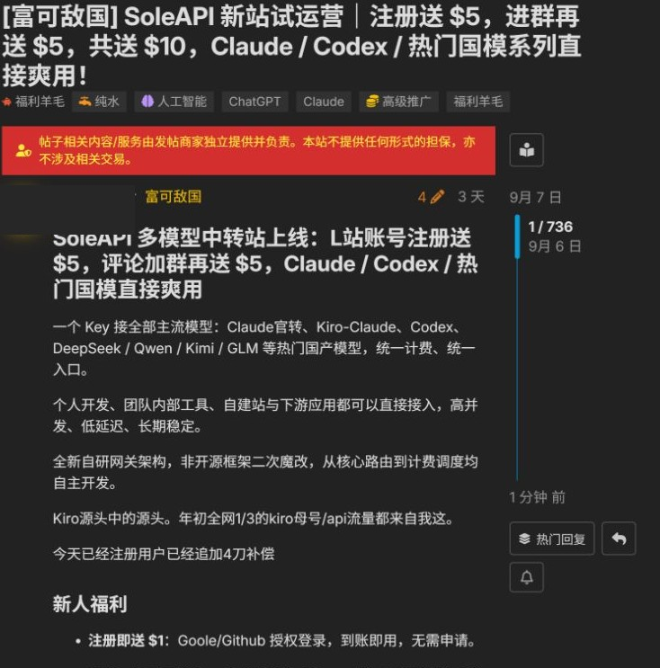
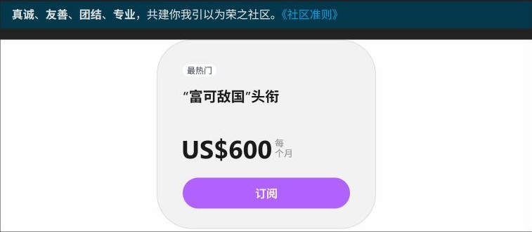

# LINUX DO：登录后的内容与运营补核

2026-09-09

登录后，已经看到从求助、建议到作者反馈的完整实例，也看到图片尝试回传、共建修订和推广领取等不同参与形式。LINUX DO 值得研究的是这些行为怎样被组织、找回和约束。回复、编辑、投票的数量需要分别解释，不能合成一个代表内容价值的活跃指标。

## 范围

在用户已登录的内置浏览器中只读查看首页、6 个主题、话题通知选项、Wiki 修订历史和官方订阅页；另复核公开管理公告与文档。6 个主题按内容用途有意选择，并非随机样本；长帖只检查列明的部分，不代表全站分布。未发帖、评论、点赞、投票、编辑、改变订阅设置或发起付款。

## 已确认事实与判断

### 一次求助能留下可追踪的处理结果

已确认：NEWAPI 接入样本的首帖显示解决方案摘要，第 7 帖带解决方案标记，第 8 帖由提问者确认已解决，第 9 帖继续引用维护公告。另一个工具延迟样本共 5 帖，成员提供环境猜测和相似经历，截至查看时未见提问者结果反馈。

分析与边界：价值差别在于读者能否看到条件、尝试和结果。没有反馈不等于问题仍未解决；有采纳标记也不等于研究者已复现。两例不能计算社区解答成功率。

[关于应用接入的问题请教佬友](https://linux.do/t/topic/1537782) · [工具首字延迟求助](https://linux.do/t/topic/2880961)

### 图片内容可以在回复里继续生长

已确认：提示词样本的首帖包含一段提示词与两张结果图；第 2、3 帖各上传图片并评价效果。它们保留在同一讨论中，可以与首帖对照。

分析与边界：这里已经出现尝试与结果回传。相比只有封面的作品，后来者能看到其他人交回的材料；但回复不足以证实完全沿用首帖提示词，也没有统一的模型、参数、成本和失败记录。

[壁纸提示词与结果回传](https://linux.do/t/topic/2879086)

### 共建入口和有效维护需要分开判断

已确认：徽章教程有长文目录、编辑入口和修订历史。打开历史可查看最近 100 次修订；本次所见最新差异包含追加“+1”。正文 Wiki 编辑段混入大量打卡式文字，开头也提醒不要破坏教程。

分析与边界：修订工具能让文档继续更新，也会产生清理负担。不能把编辑历史入口的计数解释为有效修订数、作者人数或内容正确率。该样本仍包含有用材料，不能因局部噪声否定整篇。

[盘点 L 站的徽章：长期更新](https://linux.do/t/topic/342888)

### 推广活动的回复量包含领奖动作

已确认：SoleAPI 样本带高级推广标签、付费头衔和商家独立负责的提示。正文把评论与加群设为领取额外额度的条件；本次抽看的末尾 7 条回复均围绕注册、领取或支持，未说明使用结果。

分析与边界：这 7 条不能作为深度使用反馈，也不能证明参与者没有真实需求。采样位置和活动要求都会影响所见内容；商家的宣称、实际交付和论坛自身收入应分开核实。

[SoleAPI 新站试运营高级推广](https://linux.do/t/topic/2866001)

### 推广收费已经取得官方页面标价

已确认：登录后打开官方 /s 页面，嵌入的订阅卡显示“富可敌国”头衔，US$600，每个月。主站准则把该头衔与高级推广权限关联。

分析与边界：可以确认当时展示的产品和价格，尚不能确认结算税费、实际成交、付费人数或续订。它说明推广方有一个明确采购入口，不能据此断言这是论坛唯一收入。

[富可敌国官方订阅入口](https://linux.do/s) · [LINUX DO 社区准则](https://linux.do/guidelines)

### 板块扩张也能成为公开讨论内容

已确认：“1818黄金眼”申请帖列出拟用名称、简介、申请理由和版主人选，页面有投票入口，观察时显示 182 票。

分析与边界：新增内容方向先被写成可讨论的申请，有机会同时暴露供给和维护责任。票数不证明板块已经成立，也不能代表持续需求或独立用户规模。

[1818黄金眼板块申请](https://linux.do/t/topic/2848343)

## 运营思路

### 把作者、答疑者和整理者的工作拆开

已确认：公开邀请函鼓励作者提供完整内容、为社区读者重写项目介绍，并由成员协助整理、管理者精选。登录样本中，提问者反馈结果、回复者引用公告、成员修订 Wiki，各自补充不同材料。

分工：作者提供完整材料；提问者补结果；成员协助整理；管理者选择精选并维护秩序。这是公开主张与样本行为的归纳。

分析：运营不必包办所有产出，但需要有人负责把可用结论留在首帖、摘要或目录里。内容产生与内容整理是两份工作。

持续投入：选题与精选、旧文核对、补充材料、维护争议都需要持续处理；当前没有足够资料估算人力。

证据边界：精选频率、资料失效比例和整理工时未知；少数维护样本不能证明稳定供给。

[秘密花园园丁邀请函](https://linux.do/t/topic/847468) · [关于应用接入的问题请教佬友](https://linux.do/t/topic/1537782) · [盘点 L 站的徽章：长期更新](https://linux.do/t/topic/342888)

### 让未结束的讨论容易继续

已确认：登录首页可见最新、新、未读、热门、排行榜、已读和书签入口。话题菜单列出关注、跟踪、常规和免打扰，并说明新回复、提及和回复通知的差别。

分工：成员选择阅读范围和通知级别；界面提供进度与通知选项。未实际改变设置或检查发送过程。

分析：用户能按阅读进度和感兴趣的讨论接续访问。入口和选项已核实，通知送达、算法排序与真实复访效果未测试。

持续投入：需要控制通知噪声和处理过期讨论。对于内容还少的社区，先让少数重要问题能找回，比同时建设多个榜单更有依据。

证据边界：有入口不等于通知已送达，也不能证明用户实际复访或偏好的排序。

[LINUX DO 登录首页](https://linux.do/) · [工具首字延迟求助](https://linux.do/t/topic/2880961)

### 为知识贡献保留结果，为社交回应保留位置

已确认：已解决主题把采纳的回复带回首帖；图片样本把其他成员的结果留在回复中；Wiki 则同时出现资料、修订和打卡文字。

分工：提问者确认结果，回答者提供依据，图片尝试者回传材料；共建成员可在相应权限内修订。未实际执行这些写入动作。

分析：采纳说明、结果图和实质修订可以作为不同的内容质量信号。感谢、支持和闲聊可以有社交价值，但不能与完成任务的证据混计。

持续投入：采纳可能出错，结果图可能缺参数，修订可能无意义；仍需作者和管理者判断。

证据边界：未独立复现答案与图片；有采纳、有回复和有修订均不能单独证明内容正确。

[关于应用接入的问题请教佬友](https://linux.do/t/topic/1537782) · [壁纸提示词与结果回传](https://linux.do/t/topic/2879086) · [盘点 L 站的徽章：长期更新](https://linux.do/t/topic/342888)

### 积分规则需要持续应对实际行为

已确认：2026-01-05 的站长公告说明刷分造成服务器压力，并调整得分项目，保留获认可贡献与每日访问等计分。这个历史事件与 Wiki 打卡、推广领取样本分别构成证据。

分工：管理者解释规则调整并处理异常；成员按规则参与。内部防刷分工和自动化比例未公开。

分析：奖励某种动作，未必得到预期的内容。公告证明平台曾作防刷调整；观察不证明调整的净效果，也不能把全部低信息量回复归因于积分。

持续投入：计分调整、异常处理和成员解释会增加运营工作；未取得调整前后的内容质量或留存数据。

证据边界：历史公告没有提供调整前后的质量、留存或服务器负载对照；不作净效果判断。

[别刷了，别刷了，服务器顶不住了](https://linux.do/t/topic/1409175) · [盘点 L 站的徽章：长期更新](https://linux.do/t/topic/342888) · [SoleAPI 新站试运营高级推广](https://linux.do/t/topic/2866001)

### 商业身份先让读者看见

已确认：推广样本在正文前展示责任提示，并带高级推广标签和身份头衔。官方开源推广公告另提供按项目性质填写的声明格式。

分工：推广作者披露身份与承诺；成员可据材料提出问题，管理者按规则处置。未提交举报。

分析：同是项目介绍，公益、开源和商业承诺需要让读者辨认。规则页存在，并不意味着每条推广都已经审查合格。

持续投入：作者要理解资格，成员与管理者要核实声明和处理争议。不能只做标签而省略执行责任。

证据边界：未核样本的全部推广条件或承诺履行；身份标识不是平台担保，执行效率未知。

[SoleAPI 新站试运营高级推广](https://linux.do/t/topic/2866001) · [新推广方式：开源推广](https://linux.do/t/topic/1776670)

### 跨站服务把社区身份延伸到工具使用

已确认：Connect 官方文档说明身份授权及信任等级用途；Credit 文档说明贡献积分划转、服务接入与争议处理。登录样本中的 NEWAPI 问题属于这一类接入过程。

分工：Connect提供身份授权能力，接入方使用身份与等级信息；Credit文档另区分使用者、服务提供者和争议处理角色。

分析：社区成员能把身份与贡献带到外部服务，但外部工具交付依赖接入方。Connect 与 Credit 不能笼统等同于论坛自营 API 中转站。

持续投入：身份滥用、服务中断和争议都会带来支持成本；真实接入数量、交易规模和导回流量资料不足。

证据边界：未授权接入、交换积分或使用服务；应用规模、交付质量与导回流量未知，身份服务本身不证明收费。

[LINUX DO Connect 文档](https://wiki.linux.do/Community/LinuxDoConnect) · [LINUX DO Credit 使用指南](https://credit.linux.do/docs/how-to-use) · [关于应用接入的问题请教佬友](https://linux.do/t/topic/1537782)

## 内容形态

### 技术求助与采纳答案

列表：标题、用途分类、快问快答标签、回复数、浏览量和最后活动信息。

详情：错误描述 → 补充环境 → 排查建议 → 作者反馈；已采纳答案可出现在首帖摘要。

内容价值（分析）：后来者能看到适用条件和处理结果；回答者有机会凭有效解答获得认可。

边界：两条样本的结果记录完整度不同。未复现，不把采纳当作技术正确性保证。

[关于应用接入的问题请教佬友](https://linux.do/t/topic/1537782) · [工具首字延迟求助](https://linux.do/t/topic/2880961)

### 提示词、结果图与成员回传

列表：仍以话题标题和标签呈现，读者进入详情后才看到图片材料。

详情：首帖给提示词和结果图，成员以回复上传自己的图片并评价。

内容价值（分析）：同一讨论里出现多个结果，能为尝试方向提供参考。

边界：没有统一运行环境、完整参数或工作流文件；未核实每张图是否使用首帖方案，也未完成生成。

[壁纸提示词与结果回传](https://linux.do/t/topic/2879086)

### 可以修订的长文与知识目录

列表：标题注明长期更新；文档共建分类和精华标签帮助辨认用途。

详情：正文按主题分节，配操作示意、原页链接、说明与目录；另有修订历史和讨论。

内容价值（分析）：经验能在原位置继续补充，读者不用从大量楼层重新拼出完整说明。

边界：本样本存在打卡内容混入。最新活动时间不等于知识更新时间，标题更新日也不等于每段材料都已核查。

[盘点 L 站的徽章：长期更新](https://linux.do/t/topic/342888)

### 商业推广与领取活动

列表：标题强调服务或优惠，分类、推广标签和商家头衔提示身份。

详情：责任说明、服务介绍、费用口径、领取条件、使用入口及回复；活动也可能要求站外步骤。

内容价值（分析）：读者可发现服务、查看条件；推广方收集线索和处理咨询。

边界：样本注册赠额在标题与正文不同位置有差异；不能据此承诺优惠。未领资源、未加入群组、未验证服务质量或合规履行。

[SoleAPI 新站试运营高级推广](https://linux.do/t/topic/2866001)

### 社区建设申请与投票

列表：申请类标题配当前票数与讨论活动信息。

详情：拟建板块名称、用途、理由、版主人选，以及成员回复和投票入口。

内容价值（分析）：把“开一个新板块”变成能讨论用途与维护责任的材料。

边界：仅检查一条申请的首帖与入口；未确认审批结果、投票去重口径或后续供给。

[1818黄金眼板块申请](https://linux.do/t/topic/2848343)

### 管理公告与规则修订

列表：公告标签与置顶让共同规则持续可见。

详情：说明调整原因、适用范围和后续要求，讨论可继续引用原公告。

内容价值（分析）：管理员公开解释方向与治理变化，为后续判断提供出处。

边界：新旧官方页面也可能不一致，规则存在不代表执行效果已经验证。

[秘密花园园丁邀请函](https://linux.do/t/topic/847468) · [别刷了，别刷了，服务器顶不住了](https://linux.do/t/topic/1409175) · [注册机制调整](https://linux.do/t/topic/2317378)

## 6个主题的读取范围

### 工具首字延迟求助

范围：首帖及全部 4 条回复，共 5 帖。

观察：问题提出不同工具的响应差异；成员补充可能原因和类似经历。

结果与限制：截至观察未见提问者的结果反馈；不能据此判断问题是否在站外解决。

[工具首字延迟求助](https://linux.do/t/topic/2880961)

### NEWAPI 接入求助

范围：首帖、前部追问和第 7–9 帖；沿用样本并在登录界面复核。

观察：首帖有已解决摘要，第 7 帖带解决方案标记，第 8 帖由提问者确认，第 9 帖链接维护公告。

结果与限制：确认结果记录与采纳展示；未独立复现，未保存配置截图。

[关于应用接入的问题请教佬友](https://linux.do/t/topic/1537782)

### 壁纸提示词与图片反馈

范围：首帖及第 2、3 帖；未审阅后续全部讨论。

观察：一段提示词、首帖两张图；两个后续帖子各回传一张图并评价。

结果与限制：观察到尝试与结果反馈，模型名称、完整参数和是否完全沿用原方法均未核。

[壁纸提示词与结果回传](https://linux.do/t/topic/2879086)

### 长期更新的徽章教程

范围：首帖目录、关键段落、修订入口与最新可见差异；未审阅全部修订。

观察：历史窗口显示最近 100 次修订，最新差异含“+1”；Wiki 编辑段混有打卡文字。

结果与限制：有效资料与低信息量改动并存；入口数字 4603 仅记录为页面显示，未作为有效修订数使用。

[盘点 L 站的徽章：长期更新](https://linux.do/t/topic/342888)

### SoleAPI 高级推广

范围：首帖与末尾 7 条已加载回复；末尾入口为 /753，不把帖子序号当回复总数。

观察：领取规则要求评论与加群；7 条回复围绕注册、领取或支持，未见使用结果说明。

结果与限制：只证明这组回复的内容，不能推算全帖反馈分布、领取完成率或实际客户数。

[SoleAPI 新站试运营高级推广](https://linux.do/t/topic/2866001)

### 1818黄金眼板块申请

范围：首帖申请材料、投票入口与首条回复。

观察：列出用途、理由和版主人选；观察时显示 182 票。

结果与限制：确认意见征集的形态，未确认板块成立，也不把票数当独立需求人数。

[1818黄金眼板块申请](https://linux.do/t/topic/2848343)

## 商业化与规模

### 论坛出售什么

官方订阅卡展示“富可敌国”头衔，US$600/月。结合准则，其可见用途是高级推广权限：更宽的发布范围、相应标签与频率条件。当前规则还写明头衔失效后删除相关推广帖。标价已核，结算与实际续费未核。

[富可敌国官方订阅入口](https://linux.do/s) · [LINUX DO 社区准则](https://linux.do/guidelines)

### 商家出售什么

抽样推广方出售第三方 API 服务，并用赠额吸引注册。商家的服务收入属于其自身业务；论坛内的评论、注册自述或商家规模宣称均不能转换成 LINUX DO 营收。

[SoleAPI 新站试运营高级推广](https://linux.do/t/topic/2866001)

### Credit 承担什么

Credit 文档描述社区贡献积分进入服务交换，以及服务方和平台的争议处理责任。积分划转、积分手续费与现金收入是不同口径；未查看用户账户、发起交换或核实真实流水。

[LINUX DO Credit 使用指南](https://credit.linux.do/docs/how-to-use)

### 规模还缺什么

[富可敌国官方订阅入口](https://linux.do/s)

## 参与者分析

### 求助者与答疑者

行为线索：补充实际环境、解释已尝试步骤、回来报告结果。

边界：可以辨认行为，不能据此确认职业、收入、长期贡献或付费意愿。

[工具首字延迟求助](https://linux.do/t/topic/2880961) · [关于应用接入的问题请教佬友](https://linux.do/t/topic/1537782)

### 图片尝试者

行为线索：在同一主题回传图片并评价结果。

边界：反馈强于单纯点赞，但没有证明持续创作需求或对 MakeNow 的偏好。

[壁纸提示词与结果回传](https://linux.do/t/topic/2879086)

### 资料维护者与徽章参与者

行为线索：整理长文、补充说明、修改 Wiki；部分改动只表达打卡。

边界：同一人可能承担多种角色，不能按是否参加奖励活动永久贴标签。

[盘点 L 站的徽章：长期更新](https://linux.do/t/topic/342888)

### 推广方与资源领取者

行为线索：前者披露产品与领取规则，后者回报注册或请求领取。

边界：领取者是否使用、商家是否成交均未知；帖子热度不能替代这些结果。

[SoleAPI 新站试运营高级推广](https://linux.do/t/topic/2866001)

## 界面与阅读体验

列表把标题、类别、标签、回复数和活动放在一起，适合筛选讨论。进入长文后，目录与时间线承担定位；它与靠封面选作品的画廊有不同分工。当前视口中导航与工具较密，新手要理解多个入口。

话题通知把“每条新回复”“只显示进度”“被提及或被回复”“免打扰”区分开。选择权有助于控制打扰，但只打开菜单，没有改变设置或验证送达。

已解决摘要减少了从头翻楼的需要，但答案仍要连同前提阅读。模板化的采纳展示无法保证结论正确。

提示词样本以横向滚动代码行展示文字，图片则纵向展开。可以复制文字再自行尝试，但没有发现与本站生成器直接相连的做同款按钮；不据此推定其他主题也都没有复用入口。

共建长文同时提供目录、时间线和修订比较，可查结构与改动；成员需要理解正在读正文、讨论还是历史差异，运营仍要清理正文噪声。

## 团队的取舍

### 优先借鉴问题条件、结果反馈与采纳说明

接近多元拾光已有 API 服务与工具答疑，且有完整竞争样本支持。

需要付出：运营整理材料，产品检查结果记录，研发只核实涉及工具和服务的技术结论；不能把回复数当验收。

采用条件：先保持少量用途分类。问题量和维护人手尚不足时，不照搬完整板块体系。

### 把成员回传结果作为案例详情的一部分

提示词样本说明，其他人的结果可以接续在同一讨论里。对 MakeNow，输入差异、结果图和失败说明比单独增加点赞更接近复用判断。

需要付出：需要作者或运营补齐材料与方法，明确哪些结果无法复现；截图不能代替画布复制功能的实际开发与验证。

采用条件：先保留结果与讨论的关联，再依据真实使用记录决定需要暴露多少工作流参数。

### 开放共建之前，先明确谁审改动、谁维护正文

Wiki 样本同时证明协作入口和噪声成本。

需要付出：开放编辑节省部分录入，却增加校对、争议和回退工作。指定维护者更慢，但责任清楚；不作未经核算的人天估计。

采用条件：没有稳定维护者时，先由运营收集修改建议，不把编辑次数与积分直接挂钩。

### 先披露推广身份，再考虑出售推广权限

平台标价依赖已有读者、讨论和治理，不能脱离这些条件复制。

需要付出：需要处理服务承诺、过期优惠、投诉和赞助关系，可能与自身 API 业务产生利益冲突。

采用条件：当前没有证据支持多元拾光采用同样价格，也不宜立即扩展跨站积分交换与争议仲裁。

## 页面截图

### 登录首页：发现入口与置顶话题卡片

可见阅读进度入口、分类、标签和置顶主题；卡片同时显示回复、浏览与活动。

边界：人物头像已遮挡。新话题提示数与账号和时点有关，不作为平台规模。

[LINUX DO 登录首页](https://linux.do/)

### 同一话题的四种通知选择

菜单解释关注、跟踪、常规和免打扰的区别。

边界：只打开查看，未选择其他选项；没有验证通知送达。

[工具首字延迟求助](https://linux.do/t/topic/2880961)

### 长文的修订比较与维护提示

历史弹窗允许比较修订，正文开头提醒避免破坏教程。

边界：编辑者身份已遮挡。截图并非全部修订记录，不能推算有效编辑人数。

[盘点 L 站的徽章：长期更新](https://linux.do/t/topic/342888)

### 提示词详情：文字与两张结果图

结果与提示词保留在同一首帖；提示词使用横向滚动文本区。

边界：作者身份已遮挡。模型名称为原帖标题，研究者未验证；图片不是生成结果。

[壁纸提示词与结果回传](https://linux.do/t/topic/2879086)

### 成员在回复中回传图片

第 2、3 帖出现不同角色的图片结果，其中一帖同时评价效果。

边界：身份已裁去或遮挡。尚未核实参数、素材与是否完全沿用原提示词。

[壁纸提示词与结果回传](https://linux.do/t/topic/2879086)

### 高级推广：身份、责任提示和服务介绍

推广标签、付费头衔和商家独立负责提示与正文同时可见。

边界：商家身份已遮挡。服务能力和赠额均为作者宣称，不构成研究背书。

[SoleAPI 新站试运营高级推广](https://linux.do/t/topic/2866001)

### 官方订阅页的当前展示价格

页面显示“富可敌国”头衔 US$600，每个月。

边界：未点订阅、未进入结算、未扣款；价格为 2026-09-09 页面快照。

[富可敌国官方订阅入口](https://linux.do/s)

## 规则与材料的版本差异

### 当前主站规则与旧 Wiki 的普通推广版块不同

主站准则版本 2608252340 使用扬帆起航，旧 Wiki 仍出现深海幽域。引用时优先写清主站版本，不拼接为一套同时生效的规则。

[LINUX DO 社区准则](https://linux.do/guidelines) · [LINUX DO Wiki 守则](https://wiki.linux.do/LinuxDo/rules)

### 注册机制的页面描述仍有冲突

6 月公告宣布调整邀请渠道并取消申请自述审核，主站准则仍残留审核注册资料的表述。使用已有账号，没有重走注册；完整现行流程继续待核。

[注册机制调整](https://linux.do/t/topic/2317378) · [LINUX DO 社区准则](https://linux.do/guidelines)

### 历史流量期间不能自行修正

准则中的历史 UV/PV 自报期间字符串存在格式疑点，不把它转换成当前月活，也不与 About 的滚动账号计数混用。

[LINUX DO 社区准则](https://linux.do/guidelines)

### 推广承诺与可见页面要分别记录

SoleAPI 标题和正文不同位置的注册赠额并不完全一致；只研究内容结构，不替商家确认实际赠额。页面带付费头衔与责任提示，也不等于平台担保或全部活动条件已合规。

[SoleAPI 新站试运营高级推广](https://linux.do/t/topic/2866001)

## 仍缺的证据

- 没有通知送达、再次访问和长期使用的跟踪记录，不能用入口证明留存效果。
- 没有随机或分层内容样本，不能估算问题解决率、低质回复占比、作者集中度。
- 没有订阅成交、有效付费人数、续费、定制推广金额和论坛财务数据。
- 没有验证 Credit 交换、Connect 授权接入、实际生成或第三方 API 服务交付。
- 没有核实管理工时、编辑回退情况、举报处理质量或积分规则调整的净效果。
- 没有联系成员或获取人口属性，不能把这些角色分析当作第一批种子用户已找到。

## 来源登记

- [LINUX DO 登录首页](https://linux.do/)：登录界面；访问 2026-09-09。导航和两条公开置顶卡片；不读取个人消息、草稿或账户资料。
- [工具首字延迟求助](https://linux.do/t/topic/2880961)：成员内容＋登录界面；2026-09-09。共 5 帖及通知菜单；作者体验不等于工具性能实测。
- [关于应用接入的问题请教佬友](https://linux.do/t/topic/1537782)：成员内容＋登录界面；2026-01-29；复核 2026-09-09。采纳展示、作者自述和公告引用；未独立复现。
- [壁纸提示词与结果回传](https://linux.do/t/topic/2879086)：成员内容；2026-09-09。首帖和第 2、3 帖；未核标题中的模型版本及生成过程。
- [盘点 L 站的徽章：长期更新](https://linux.do/t/topic/342888)：成员共建文档＋修订界面；标题标注 2026-02-17 更新；访问 2026-09-09。目录、关键段落和最新可见修订；成员文字不作为官方规则。
- [SoleAPI 新站试运营高级推广](https://linux.do/t/topic/2866001)：第三方商业内容；页面显示 2026-09-06/07；访问 2026-09-09。首帖、责任标识及末尾 7 条回复；不收录联系人、群号、二维码或领取码。
- [1818黄金眼板块申请](https://linux.do/t/topic/2848343)：成员申请；2026-09-03；访问 2026-09-09。首帖、投票入口和首条回复；未核审批结果。
- [富可敌国官方订阅入口](https://linux.do/s)：登录官方页面；访问 2026-09-09。嵌入订阅卡的产品、币种、价格与月周期；未核交易。
- [LINUX DO 社区准则](https://linux.do/guidelines)：官方规则；版本 2608252340；复核 2026-09-09。推广、分类及规则边界；部分描述与较早或专题公告有差异。
- [秘密花园园丁邀请函](https://linux.do/t/topic/847468)：官方管理公告；首发 2025-08-07；访问 2026-09-09。作者投稿、成员整理与管理精选的主张，不代表效果已经测量。
- [别刷了，别刷了，服务器顶不住了](https://linux.do/t/topic/1409175)：官方历史公告；2026-01-05；访问 2026-09-09。刷分压力与当时计分调整；不冒充当前全部运行配置。
- [新推广方式：开源推广](https://linux.do/t/topic/1776670)：官方历史公告；2026-03-18；访问 2026-09-09。开源与公益推广的声明材料；当前要求还需结合主站准则。
- [注册机制调整](https://linux.do/t/topic/2317378)：官方历史公告；2026-06-06；访问 2026-09-09。邀请渠道与自述审核调整；未重新注册。
- [LINUX DO Connect 文档](https://wiki.linux.do/Community/LinuxDoConnect)：官方 Wiki；未标明确更新时间；访问 2026-09-09。身份授权与等级用途；未测真实授权、应用数或服务量。
- [LINUX DO Credit 使用指南](https://credit.linux.do/docs/how-to-use)：官方文档；更新 2026-04-20；访问 2026-09-09。贡献划转、服务角色和争议处理；不是经营报表。
- [LINUX DO Wiki 守则](https://wiki.linux.do/LinuxDo/rules)：官方 Wiki 历史描述；未标明确更新时间；访问 2026-09-09。仅记录与当前主站指南的差异，不作为优先规则。
