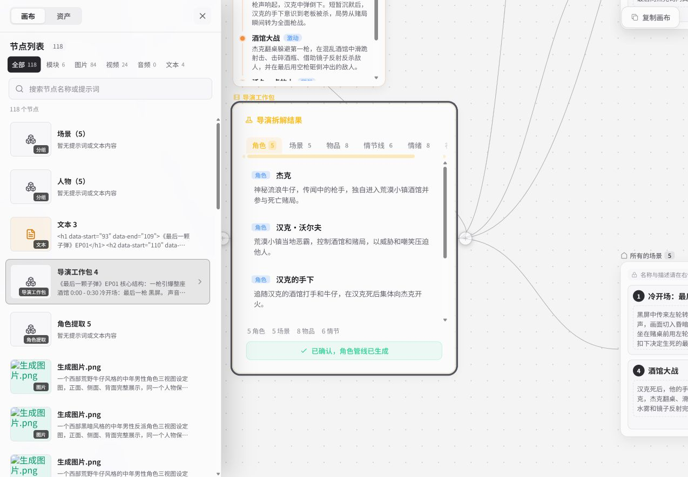
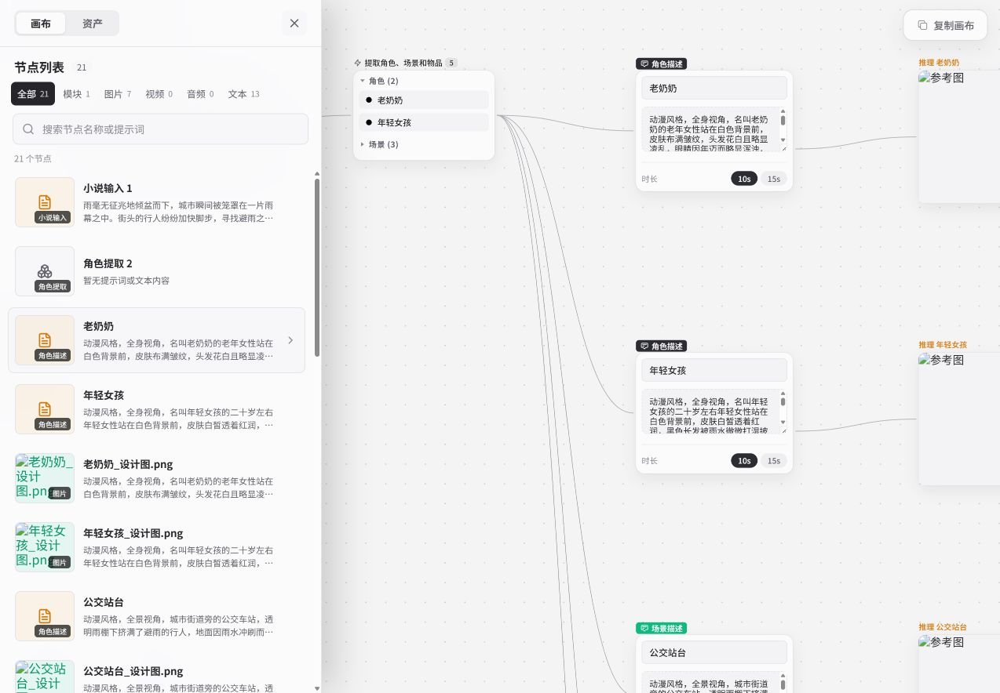

# 多元拾光 · MakeNow登录研究

2026-09-10

MakeNow：技能、公开作品与源画布

已检查技能发现、Agent入口、技能创建表单和两条TV作品源画布。随后对其中一个案例完成副本创建、文本修改保存重开及原件回查；素材和完整生成仍未验证。

## 观察范围

记录11项精选条目，深入1项技能，检查1个项目界面，以及首页前两条 TV 作品的公开画布。按可访问路径取样；页面日期为观察日期。

入口观察覆盖市场、详情、项目、协同面板、创建表单和公开案例，该组观察未提交生成或保存。后续副本操作另见M20记录；私人项目与账号资料不公开。

## 登录观察时的精选技能

小说一键成片、画面提示词导演、动态镜头设计、角色一致性导演、创意混搭短视频、爆款短视频编排、电商视觉故事板、素材到画布编排、分镜一致性质检、视频复刻生产规划、画布整理与清理。

当前列表均标官方；仅画面提示词导演抽查详情及进入Agent的路径，其余名称不代表已验收功能。

## 观察结果

### 作品与过程已经连接

已确认：两条TV作品都能通过“查看画布”进入公开项目。西部题材样本包含剧本、导演拆解、角色、场景、情节线、情绪曲线及图片、视频节点；另一条样本包含小说输入、角色描述、图片和分镜。

分析：成片与源画布分别提供观看和制作过程。若作为教程交付，还需说明起点、必要步骤和可用素材。

边界：两条画布均显示复制入口；此次入口检查未创建副本，也未核对成片与源节点的逐镜对应。

依据：M19-07、M19-08、M19-09

### 技能是进入 Agent 的方法入口

已确认：技能的“试试看”先进入项目列表；打开项目后，Agent 输入框带入技能指令。创建页说明了从案例视频到拉片、提炼与审阅的流程，尚未执行。

分析：技能通过指令为 Agent 指定创作方法；成片、画布和 SKILL.md 文件的交付另需核对。

边界：未发送指令，尚未看到实际技能加载、输出质量、修改范围或运行后的保存结果。

依据：M19-02、M19-03、M19-06

### 展示完整性与素材可用性需要分开

已确认：源画布可读，但两条样本都出现部分图片缩略图未显示；第一条的文本预览还直接露出部分HTML标记。

分析：用户能够看到节点关系，仍可能难以判断该从哪一步开始、哪些素材可取用。内容形态的质量需要检查实际阅读和接手过程。

边界：没有把加载现象归因为素材删除或权限错误；未进行网络故障定位。未显示图片也不能算生成失败。

依据：M19-08、M19-09、M19-10

### 供给入口已有，持续供给仍缺记录

已确认：当前11项精选技能都标为官方。创建表单写出案例视频要求和审阅步骤；历史方案也已要求非制作账号复验、记录失败与成本、失效时停止推荐。

分析：下一步需要查实际交付和维护记录，而不只是再写一份相同的要求。作者提供素材、编辑提炼方法、工具维护和答疑可能由不同人承担。

边界：精选标签不能代表全部作者构成；未取得作者收入、审核结果、发布频率、复验工时或停荐记录。

依据：M19-01、M19-06、D19-01、D19-02

## 实际路径

### 找一个方法，进入创作

1. 技能市场：选择画面提示词导演
2. 详情：用途、来源、类型、价格与试试看
3. 点击试试看：进入项目列表
4. 打开既有项目：Agent带入未发送的技能指令

到达：已到达可发起调用的位置。

未验证：实际加载技能、执行、生成质量及输出保存没有验证。

依据：M19-01、M19-02、M19-03

### 看一条作品，查看制作过程

1. MakeNow TV作品卡片
2. 作品播放浮层：查看画布
3. 公开画布：节点和文本内容加载
4. 节点清单：按类型筛选与定位

到达：两条样本都到达其页面关联的公开画布，并可阅读制作结构。

未验证：此次入口检查未创建副本。后续已验证一个案例的复制与文本保存，素材完整性和再次生成仍未验证。

依据：M19-07、M19-08、M19-09

### 把案例提炼成技能

1. 表单字段：技能方向与提炼重点
2. 视频输入要求：至少1条，建议3–5条
3. 页面说明：逐镜头拉片、提炼方法论、构建技能
4. 页面说明：审阅保存

到达：已查看空白表单、输入要求与流程说明，尚未提交。

未验证：没有填写、上传、执行提炼或保存；后续审核和发布流程未验证。

依据：M19-06

## 两条案例与现场截图

### [暗黑系西部牛仔](https://dream.ai666.net/case-share/2/canvas)

页面分类：全部118；模块6、图片84、视频24、文本4、音频0。

观察：导演工作包按角色、场景、物品、情节、情绪、视觉拆解；存在情节线、情绪曲线和视觉关键词节点。点击节点清单中的导演工作包可以定位到该节点。

分析：它披露了作品的制作结构。要作为教学案例或复用模板，还需要说明关键分支、第一步、可替换输入、依赖和哪些结果只是历史尝试。

边界：分类数字是页面显示的节点数量；不是118次成功生成、84张可下载图片或24条完整视频。当前部分缩略图未显示；没有完整观看成片或逐镜匹配源节点。

登录只读观察：节点清单与导演拆解结果。保留了缩略图未显示和文本预览出现HTML标记的现场状态。2026-09-10。

截图链接使用本地服务，服务需保持运行。

### [母亲节主题短片](https://dream.ai666.net/case-share/6/canvas)

页面分类：全部21；模块1、图片7、视频0、文本13、音频0。

观察：可读小说输入、角色提取、人物与场景描述、智能分镜和分镜条目；同样显示复制画布。

分析：相同的“查看画布”入口可能交付不同范围的过程材料。视频作品旁的源画布，不应自动承诺覆盖全部最终视频的制作与编辑过程。

边界：视频分类显示0，只说明本页分类结果，不能据此认定作品没有生成过视频或画布无价值。素材与最终成片对应关系还未检查。

登录只读观察：角色与场景描述及节点分类。图中部分参考图未显示，原因未查明。2026-09-10。

截图链接使用本地服务，服务需保持运行。

## 内容承载形式

### TV作品卡片与播放详情

用户看见：题材封面、标题、署名、播放和点赞，详情连接画布。

怎样使用：先决定是否值得看，再决定是否查看做法。

设计原因（分析）：视频能直接传达风格、节奏和故事；卡片承担选择，播放器承担观看，避免在列表塞满制作参数。

持续供给：按此形态交付，需要有人提供成片；若宣传可复用，还要整理关联画布并核对两者。当前具体分工未确认。

待补：未确认投稿、收录和替换规则；两条样本不足以证明稳定UGC供给。

依据：M19-07 / M19-09；设计原因是分析。

### 公开源画布与节点清单

用户看见：原始文本、拆解结果、素材节点、连线、分组，以及按类型筛选的清单。

怎样使用：读过程，找局部节点，进一步选择复制。

设计原因（分析）：当作品依赖多步骤和多种资产时，空间结构可以保留上下游关系；节点清单让用户不必只靠缩放寻找内容。

持续供给：按此形态交付，需要有人整理项目，并核对素材、依赖、起点说明和失效处理。当前具体分工未确认。

待补：未确认能从起点连续跟做的完整路径，部分图片未显示；源画布中的探索分支也需与必要步骤区分。

依据：M19-08 / M19-09 / M19-10；D19-02为历史验收要求。

### 技能卡片、详情与Agent入口

用户看见：按任务分类的用途、来源、类型和价格；进入Agent后由指令引用技能。

怎样使用：先选方法，再把方法用于自己的项目。

设计原因（分析）：卡片可帮助用户按意图找方法；如果实际执行由Agent完成，详情还需要帮助人理解适用条件、输入和将发生的修改。

持续供给：当前精选标为官方。按此形态交付，需要有人维护方法质量、工具调用能力和使用说明，当前实际分工未确认。

待补：仅抽查1项详情，未见输入输出示例或方法正文；实际执行、版本维护及使用人数口径未核实。

依据：M19-01 / M19-02 / M19-03。

### 视频案例到技能的创建表单

用户看见：案例视频、技能方向、提炼重点，以及五步过程说明。

怎样使用：尝试将一组案例中的做法转化为可调用技能。

设计原因（分析）：要求具体案例可以为方法提供观察材料；提炼和审阅承接从个别作品到通用规则的转换，质量取决于案例选择与审阅。

持续供给：提供案例的人、审阅提炼结果的人、维护执行依赖的人，职责可能不同。

待补：尚无技能创建成功样本，提炼准确性、作者耗时与审核通过率未知。

依据：M19-06；角色划分为分析。

### 个人项目列表、详情和画布

用户看见：项目入口、复制项目、材料与消耗汇总、打开画布、保存进度。

怎样使用：管理自己的制作任务，查看工作区和结果所在位置。

设计原因（分析）：以项目组织长任务，便于后续回来继续处理；这类工具回访需要与社区阅读、讨论和作者关系分别观察。

持续供给：按此形态交付，需要使用者管理项目内容，平台保障保存和材料访问；当前维护分工与效果未确认。

待补：已对一个案例完成复制和一个文本字段的保存重开；多设备、全部节点、素材依赖、长期保存和完整生成仍未验收。

依据：M19-04 / M19-05。

## 社区增量与取舍

### 作品展示还缺什么？

已有：MakeNow已能承载作品卡片、播放及源画布入口。

可能增加的价值（待研究）：社区可以补做题材策展、作者解释、作品讨论和跨工具比较；是否有人需要这些，还要从内容与反馈证据继续判断。

负担：若只复制同一封面与标题，会增加一次发布和更新；要确认新增说明由谁写、两处修改怎样同步。

继续核对：用已有两条样本比较在社区和MakeNow各能读到什么、能做什么；记录独有信息和重复维护项。

### 欣赏作品与学做案例如何共存？

已有：TV支持先看结果，画布支持阅读结构；两者服务的深度不同。

可能增加的价值（待研究）：保留纯欣赏作品的价值。只有条目承诺教学或复用时，才要求输入、步骤、限制和对应材料。

负担：所有作品都强制补齐教程会提高作者负担；所有教程只放成片又无法兑现学习承诺。

继续核对：对样本逐条记下承诺和实际交付，不用同一标准给所有内容打分。

### 社区Skill与MakeNow技能是否重叠？

已有：社区规范里的SKILL.md文件资产与MakeNow的Agent技能入口来自不同交付方式。

可能增加的价值（待研究）：可以比较发现、理解、调用和反馈分别由哪里承接；互相关联有待验证，不预设文件可以导入或直接执行。

负担：如果维护两份方法说明，要查版本、适用模型和问题修订是否同步；还可能有封装与兼容负担。

继续核对：选同一种方法，核对两端实际字段、可取走的对象和执行入口；目前只具备规范与页面对照。

### 低价API能否转化为内容优势？

已有：用户确认文档中的API模型可提供支持；已核对五页文档。MakeNow又提供上层工作区与技能入口。

可能增加的价值（待研究）：潜在价值可能在可复现结果、选型依据、成本说明和失败替代，不能仅从模型清单或Token价格推导用户留存。

负担：除了调用成本，还要核对重试、制作、审阅、答疑和模型变化后的维护时间。

继续核对：将同一条内容的任务承诺、所需模型、材料和费用口径对齐；当前没有运行数据，不填毛利或成功率。

## 持续供给与维护

以下是职责，不是新增岗位建议。团队仍按两名全栈、一名产品、一名运营计算。

### 作品提供者

职责：交出成片，并说明愿意公开哪些输入、过程和源项目。

依据：当前TV有署名与画布入口；未取得其实际合作和交付记录。

未知：持续创作频率、修改意愿、公开材料范围。

### 案例编辑或方法作者

职责：提炼可用步骤，交代适用条件、输入和限制，让下一位用户能开始。

依据：创建技能表单写出提炼与审阅；历史方案已要求起点说明和非制作账号复验。

未知：当前谁完成审阅、耗时多久、成片与方法是否一致。

### 执行能力维护者

职责：核对模型、技能、素材访问及失败替代；失效时修订或停止推荐。

依据：已有历史停荐要求，本次出现部分图片未显示现象。

未知：故障原因、复验频率、版本记录和当前责任人。

### 社区运营

职责：决定怎么被找到、怎样提出问题、修订如何回到正文，并记录新增价值。

依据：这些是待比较的运营职责，不是已确认执行结果。

未知：制作、审阅、答疑与更新分别需要多少可分配工时。

## 既有规范与当前证据

### D19-01 · MakeNow Q4方案 V1.2

日期：2026-08-26

来源：MakeNow/resources/MakeNow_2026_Q4运营与商业化方案_V1.2.md；行 37–42、491–496、549–555

既有要求：已记载官方技能与首页作品查看/复制画布；要求模板更新、记录模型成本变化，频繁失败时停止推荐。

当前：今天确认了技能入口及两条作品关联的公开画布。

缺口：未取得模板更新、停荐和支持工时的执行记录。

### D19-02 · MakeNow冷启动完整执行方案 V3.0

日期：2026-08-27

来源：MakeNow/resources/MakeNow_商业化冷启动运营与商业化完整执行方案_V3.0.md；行 232–257、574–602、626–636、982、986–988

既有要求：要求说明第一步、非制作账号复验、完整节点素材、失败替代、实测成本和案例授权范围。

当前：公开结构能打开，复制入口可见；说明与素材还需按条目核对。

缺口：首次生成、完整素材与依赖、独立接收者权限和实际成本仍未验收；复制与文本保存不代表整套交付通过。

### D19-03 · 社区C端原型功能设计规范

日期：文档头2026-06-02；本次读取2026-09-10

来源：docs/product/AI666_C端原型功能设计规范.md；行 214–235、239–251

既有要求：社区Skill原型以文件包或SKILL.md为输入，记录来源、许可、用途及使用说明。

当前：与当前MakeNow视频案例提炼流程及Agent入口不同。

缺口：规范不是上线证据，也未证明两端格式兼容或可互相执行。

### D19-04 · 社区与MakeNow跨平台账户互通规则 V0.2

日期：2026-08-12

来源：docs/versions/v1.0/business-logic/cross-page/AI666_社区与MakeNow跨平台账户互通规则_V0.2.md；行 3、7–9、41、51、59–60

既有要求：该稿只定义登录、失败提示和跳转，作品回流与积分互通不在其范围。

当前：已检查 MakeNow 内部路径，尚未验证从社区内容进入项目再返回的完整过程。

缺口：账户互通、内容交接与作品回流需要分别取证，不能用内部画布链接代替跨平台验收。

## 待补证据

### 源画布到底交付了哪些可用材料？

状态：已部分观察，完整交付未验证

已知：两条样本能打开结构；部分图片未显示。

待补：核对材料能否正常查看、哪些输入可替换、哪些分支只是历史过程，再检查与作品的关系。

影响判断：决定内容应标为作品过程、教程还是可复用模板。

### 其他用户复制后能否接手？

状态：单案例复制与文本保存已验证，完整接手待核

已知：一个案例已创建个人副本，文本修改保存重开仍保留，公开原件对应字段未变化。

待补：核对独立接收者权限、全部节点与素材依赖、首次生成和实际费用；已有文本保存结果限于当前账号及一个字段。

影响判断：决定可复用承诺能否成立，以及作者必须交付什么。

### 技能具体怎样修改项目？

状态：未提交调用

已知：技能试用可以把指令带入Agent；页面有每步确认和按次计价提示。

待补：核对加载说明、预览修改、输出质量、实际费用、失败与重试；费用边界清楚后再运行。

影响判断：决定它是可信的任务方法、辅助建议还是仍需强人工干预的过程。

### 谁持续提供和维护？

状态：仍缺执行与经营记录

已知：11项精选标为官方，创建表单和历史交付要求已找到。

待补：已有作品交付、技能审阅、修订、素材问题和停止推荐记录；再追踪具体承担者和工时。

影响判断：决定内容合作需要采购什么，以及现有团队能承担多少。

### 社区应额外承担哪部分？

状态：已形成比较问题，尚无取舍结论

已知：MakeNow已承载作品、过程、技能和项目管理；API支持已由用户确认。

待补：把这些既有路径与竞品的发现、解释、讨论、关系和维护机制逐项比较。

影响判断：供未来多份方案比较，当前不选方向，不将工具回访直接当作社区留存。

## 观察索引

### M19-01 · [精选技能列表](https://dream.ai666.net/skill-market)

登录页面观察 · 2026-09-10

事实：当前11项精选条目均标官方；有分类、我的技能、积分收入和创建技能入口。

边界：未打开收入；不是全站供给普查，无法推导真实作者数和收入。

### M19-02 · [画面提示词导演详情](https://dream.ai666.net/skill-market)

登录详情观察 · 2026-09-10

事实：样本展示用途、图片类型、系统内置来源、免费、使用人数0和试试看；抽查详情未见方法正文、输入输出例或版本记录。

边界：限这一个条目；免费是页面技能标签，不证明执行免费；0的统计口径未核实。

### M19-03 · [技能进入Agent](https://dream.ai666.net/project)

实际走查至未发送草稿 · 2026-09-10

事实：试试看进入项目列表；打开既有项目后，Agent输入框预填了调用该技能的指令。

边界：未发送；仅证明到达发起位置，不证明实际加载和执行。私人项目标识和正文未纳入。

### M19-04 · [个人项目与材料入口](https://dream.ai666.net/project)

登录页面观察 · 2026-09-10

事实：项目菜单有详情、复制和删除；详情页有材料与消耗汇总、打开画布。

边界：未复制、删除、修改或保存；汇总字段不代表本次取得制作成本数据。

### M19-05 · [画布中的交互边界](https://dream.ai666.net/project)

登录面板观察 · 2026-09-10

事实：既有画布可见保存进度、节点清单、按次计价提示、每步确认和协同入口；协同面板使用账号邀请。

边界：未邀请或改变权限；协同不是公开副本，保存入口不是持久化通过证据。

### M19-06 · [视频案例提炼技能表单](https://dream.ai666.net/skill-market/create)

表单观察与页面流程声明 · 2026-09-10

事实：至少1条案例视频，建议3–5条，支持MP4/MOV/AVI；要求技能方向和提炼重点。页面说明逐镜头拉片18维、提炼方法论、构建技能与审阅保存。

边界：未填写上传；没有创建成功、提炼准确性或审核通过证据。

### M19-07 · [TV作品进入画布](https://dream.ai666.net/)

两条实际导航 · 2026-09-10

事实：从首页前两条作品进入播放浮层，再点击查看画布，分别抵达公开案例2和6。

边界：没有完整观看或逐镜比对；只证明页面关联关系和导航落点。

### M19-08 · [西部题材公开画布](https://dream.ai666.net/case-share/2/canvas)

公开结构和文本已读 · 2026-09-10

事实：节点清单显示118个节点，可按类型筛选；可阅读剧本、导演拆解、情节与情绪；有复制画布入口，帮助文本说明复制完整节点到新项目。

边界：复制仅入口可见。节点数不是调用量、完成率或素材可用量。

### M19-09 · [母亲节公开画布](https://dream.ai666.net/case-share/6/canvas)

公开结构和文本已读 · 2026-09-10

事实：节点清单显示21个节点，含输入、角色场景描述、图片、智能分镜和分镜条目；视频分类显示0；有复制画布入口。

边界：分类口径未经实现核验，不据视频0断言从未生成；没有成片完整制作覆盖证据。

### M19-10 · [阅读与素材加载现象](https://dream.ai666.net/case-share/2/canvas)

两条现场截图；第一条局部DOM读取 · 2026-09-10

事实：两条样本截图都有部分图片未显示。第一条节点清单的文本摘要露出HTML标记；一次局部读取时当前挂载26个img元素中6个有像素。

边界：这是当前渲染范围与时刻，不代表全部图片或源素材；不计算全站加载率，不推断故障原因。
