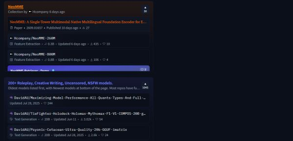
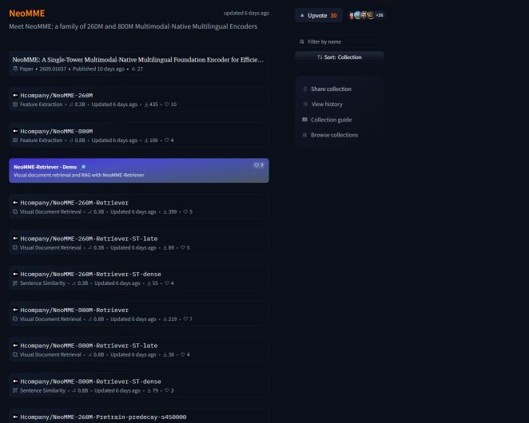
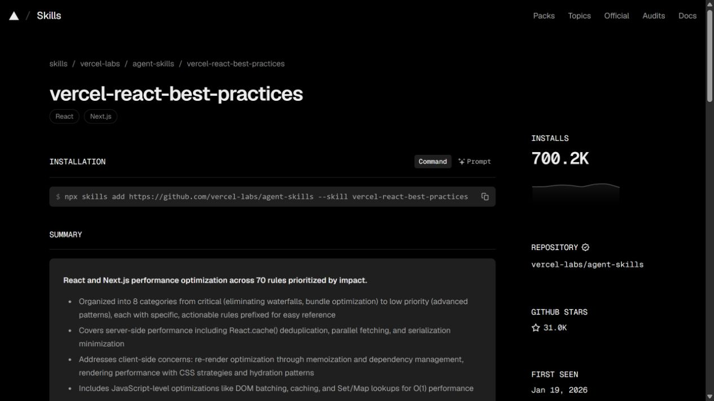
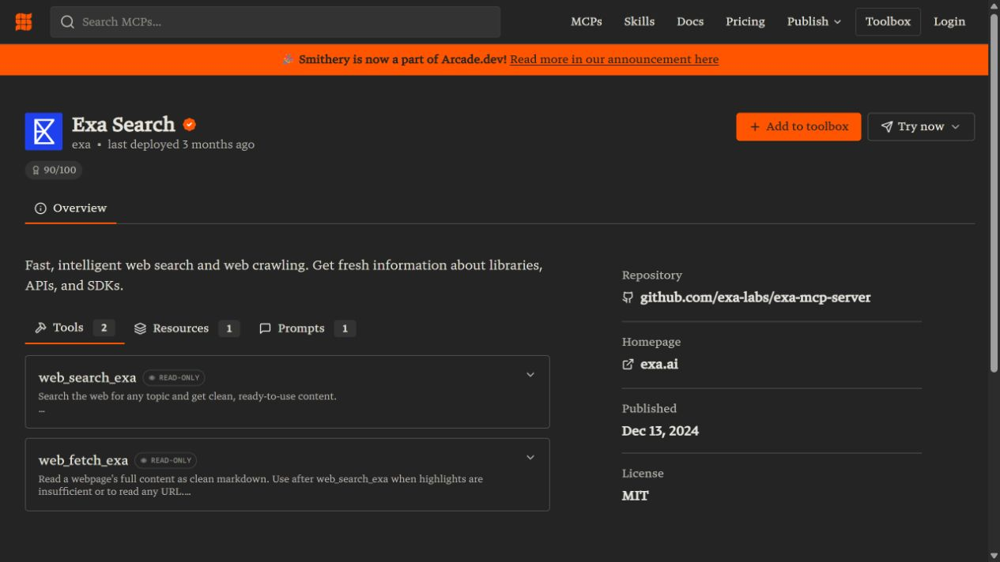

# AI社区内容承载形式：市场样本与设计原因

## 形式总览

| 形式 | 实际承载 | 为什么采用（分析） | 竞争成立条件（分析） |
| --- | --- | --- | --- |
| 作品图文流 | 结果图＋生成上下文＋再创作入口 | 用画面判断偏好，再决定是否学习或尝试 | 生成信息完整、相关作品可发现；瀑布流本身不是优势 |
| 视频作品与合集 | 影片＋简介＋片单；部分另有幕后文章 | 运动、叙事和音画关系需要完整观看 | 播放与选片质量、作品语境和制作说明 |
| 短动态与闪念 | 正文直接进入内容流，附图片、链接与回复 | 让进展和未完成想法及时被看见 | 短而有上下文，能连接长材料与后续更新 |
| 长图文与案例 | 顺序讲解＋示例＋输出对照＋可查阅章节 | 解释选择、错误和修改依据 | 过程真实、材料可用、信息可查与持续修订 |
| 分章课程 | 学习目标＋分章内容＋练习材料 | 技能有前后依赖，学习需要分步安排 | 目标与任务匹配，练习材料能用 |
| 讨论与Wiki | 问题正文＋连续回应＋可整理的结论 | 答案常在讨论中形成，而非发布时已有 | 回应质量、上下文清楚和结论维护 |
| 专题合集 | 编选说明＋有序资源条目＋原始入口 | 读者需要理解资源关系与选择理由 | 有理由的取舍、关联与更新 |
| 提示词配方 | 用途说明＋完整文本＋可替换位置 | 重复任务可以复用部分表达结构 | 明确变量与适用条件，有结果和修订依据 |
| 模型版本资源 | 项目＋版本＋基座＋例图＋获取方式 | 效果依赖具体资源和版本，需要准确定位 | 版本可追溯、适配条件清楚、资源可取得 |
| 工作流文件 | 结果示例＋流程＋参数依赖＋使用入口 | 用户需要继承处理过程并替换输入 | 原始流程可交接，依赖清楚，能选择简易或完整操作 |
| 共享画布项目 | 节点、素材、中间结果组成可分享项目 | 接续创作需要保留参考、分支和过程关系 | 项目可读、权限清楚、复制后能继续工作 |
| 在线AI应用 | 可操作的输入输出界面＋状态与说明 | 用自己的输入直接判断能力，省去部分环境准备 | 运行可用、错误可理解、费用与限制清楚 |
| Agent Skills | 任务目录＋方法正文＋资源包＋安装路径 | 方法要让人看懂，也要进入智能体工作过程 | 适用条件、配套材料、来源与维护可检查 |
| MCP能力目录 | 能力说明＋连接信息＋配置与认证前提 | 客户端必须找到服务并满足实际调用条件 | 能力与接入条件透明，连接问题可诊断 |
| 命题挑战 | 命题规则＋投稿池＋评选阶段＋结果归档 | 共同题目和阶段组织创作、观看与反馈 | 题目有吸引力，规则可信，作品与结果可回看 |

## 比较依据

**选择前能否判断：**看到用途、样例、条件与来源后，读者能否判断是否值得继续，而不必逐个打开猜测。

**读完能否继续：**需要取用的内容是否给出材料、使用入口或连接条件；欣赏和讨论型内容则看完整表达、回应与找回。

**价值能否延续：**版本、关联作品、后续更新和反馈是否保留，避免内容在首次发布后迅速失效。

**代价是否可承担：**便利是否依赖持续供给、人工整理、托管、推理与支持；隐藏这些成本会夸大形式优势。

页面和官方文档能证明形式或机制存在；“为什么采用”“优势与代价”是据此作出的分析，不冒充平台内部决策。计数、徽章、排行榜和Running状态不证明用户规模、使用成功或商业效果。

## 跨样本发现

### 图文与视频的教学能力

Datawhale案例以文字、代码和输出解释修改，Runway以片单、简介和幕后文章介绍作品。内容深度取决于材料和解释，媒介的新旧不足以判断质量。 [第三章：迭代优化](https://github.com/datawhalechina/llm-cookbook/blob/main/docs/C1/3.%20%E8%BF%AD%E4%BB%A3%E4%BC%98%E5%8C%96%20Iterative.md)，[Gen:48](https://runway.com/gen48)，[Generating a film in 48 hours with director/producer Gabe Michael](https://runway.com/customers/48-hours-to-generate-a-film)

### 为直接使用与修改流程设置不同入口

RunningHub将AI应用与完整工作流分开，让使用者直接提交素材，也让作者检查和修改节点。这样可减少初次使用时读懂整张节点图的负担；实际体验仍取决于资源可用性。 [一键换背景：产品图摄影](https://www.runninghub.ai/zh-cn/post/1845758651062743041)，[新版Fill-OneReward万物消除](https://www.runninghub.cn/ai-detail/1966722305902718977)

### 用合集说明资源关系

Hugging Face合集将论文、模型和Demo按主题组织。编辑需要说明入选原因及资源之间的关系，并保留原始链接。 [Collections](https://huggingface.co/docs/hub/collections)，[NeoMME Collection](https://huggingface.co/collections/Hcompany/neomme)

### 运行内容的维护要求

Space依赖运行环境，工作流依赖模型和节点，MCP依赖服务连接。页面需说明适配条件、失败处理和维护责任。 [Spaces Overview](https://huggingface.co/docs/hub/spaces-overview)，[一键换背景：产品图摄影](https://www.runninghub.ai/zh-cn/post/1845758651062743041)，[The MCP Registry](https://modelcontextprotocol.io/registry/about)，[Connect to MCPs](https://smithery.ai/docs/use/connect)

### 短动态与讨论承接进展和问题

Hugging Face Posts支持分享进展与想法，LINUX DO话题保留追问和回应。这些内容提供线索和反馈，可关联后续结果，无需每条都写成教程。 [Hugging Face Posts](https://huggingface.co/posts)，[AI时代大家是怎么管理自己的知识库的？](https://linux.do/t/topic/2868771)

## 作品图文流

**详情如何展开：**作品是主视觉，生成信息解释它如何产生，再创作动作连接下一步。这里的参数属于作品上下文，不等于完整项目、所有输入素材或稳定复现保证。

**最后交付什么：**用户获得可欣赏的图像，以及供后续创作使用的提示词、参考图或风格线索；运行工具仍受账户与功能条件约束。

**为什么采用这种形式：**用户先看图选择风格，再查看提示词和参数；直接将这些材料带入工具，可减少重新准备输入的步骤。

**竞争价值分析：**分析：同一份作品兼具欣赏、学习与尝试价值，比孤立结果图提供更多可行动信息。

**基础承载分析：**分析：清楚的作品预览、作者归属、详情入口、发现与找回方式；详情说明可复用哪些内容。

**持续成本分析：**分析：依赖持续作品供给、内容审核、可检索标签与生成信息完整性；风格相近作品过多会增加筛选负担。

**取舍分析：**分析：强视觉容易让封面效果代替适用性判断；开放参数利于学习，也会使部分作者更谨慎地公开作品。

**证据边界：**本次确认官方描述，未在登录态逐项实跑；旧版 Leonardo 教程不单独证明当前像素布局。未得到再创作成功率、留存或付费提升数据。

## 视频作品与合集

[Runway Gen:48 / AIF](https://runway.com/gen48)（15家）

**已确认事实与样本：**Gen:48 页面按届次归档获奖影片，条目可见片名、封面、导演、时长及奖项。AIF 2026 影片展示还提供故事简介。Runway 的创作者案例文章把完整影片播放器与分步骤幕后记录放在同页。 [Gen:48](https://runway.com/gen48)，[AIF 2026](https://aif.runwayml.com/)，[Generating a film in 48 hours with director/producer Gabe Michael](https://runway.com/customers/48-hours-to-generate-a-film)

**发现入口：**从某届、某奖项的片单进入作品语境，封面吸引注意，片名与时长帮助判断观看投入；这与不设主题的连续视频推荐流不同。

**详情如何展开：**AIF 提供影片简介；幕后文章进一步解释构思、镜头、素材处理和剪辑。两者是已观察到的不同页面，未确认每个片单条目都直连幕后文档。

**最后交付什么：**完整影片及策展片单；部分作品另有制作叙述。用户首先消费叙事、运动、声音和节奏，不能只凭封面判断作品。

**为什么采用这种形式：**镜头衔接、表演与音画关系需要完整播放。合集提供选片范围，幕后文章补充制作方法，便于看完后继续查阅。

**竞争价值分析：**分析：适合表达镜头衔接、表演和音画关系；按届次归档使一次活动产出成为可再次浏览的内容集合。

**基础承载分析：**分析：可靠播放、清晰封面、时长、作者和作品说明；移动端应让用户可控地选择观看。

**增强做法与分析：**已观察：奖项、故事简介、制作过程提供额外判断线索。分析：进一步竞争发生在选片与讲清作品，而非仅增加自动播放。

**持续成本分析：**分析：除了制作，还涉及转码带宽、封面、字幕、授权和编辑选片；策展质量取决于审片能力。

**取舍分析：**分析：观看时间高于扫图，复杂制作不容易一键迁移；精选获奖作品也不能代表普通用户产出。

**证据边界：**确认网页结构与播放器入口，未测播放质量、完播率或观看后转化。Gen:48 历届归档不是连载剧集；幕后旧案例中的工具步骤不作为当前操作指南。

## 短动态

[Hugging Face Posts](https://huggingface.co/posts)（15家）

**已确认事实与样本：**Posts 页面可见作者、时间、正文、图片、链接、表情反应和回复入口。样本同时包含成果发布、尚在测试的体验，以及发布受挫后准备继续实验的更新。功能说明将想法和新发布均列为用途。 [Hugging Face Posts](https://huggingface.co/posts)，[Social Post Explorers — About Posts](https://huggingface.co/social-post-explorers)

**发现入口：**列表直接呈现正文开头，不要求先点标题；作者与时间交代谁正在做什么。

**详情如何展开：**单条有独立链接并可进入回复。短说明可链接完整文章、模型或代码，读者自行选择继续深入。

**最后交付什么：**一个有上下文的观察、进展、疑问或资源入口，不要求交付完整教程。

**为什么采用这种形式：**短动态适合及时记录进展或问题。图片展示现象，链接指向完整材料，回复允许他人补充建议。

**竞争价值分析：**分析：缩短从发生到分享的间隔，让过程也能被看见；简短与质量高低是不同维度。

**基础承载分析：**分析：作者、时间、基本上下文、独立详情及回复；链接需要说明值得打开的原因。

**增强做法与分析：**已观察：Hub 资源链接可格式化显示。分析：短动态负责发现，长文、仓库和后续更新承接持续查阅。

**持续成本分析：**分析：单条制作较轻，但需作者持续更新、回复与平台处理广告和失实信息。

**取舍分析：**分析：便于参与，也容易碎片化；只有宣传链接而没有具体信息时，读者承担额外判断成本。

**证据边界：**功能说明仍标 feature preview，不据此确认现行发布频次或权限。用户动态只证明承载结构，不证明其中技术主张，更不能推断留存提升。

## 长图文、教程与案例

[Datawhale：LLM Cookbook迭代优化章节](https://github.com/datawhalechina/llm-cookbook/blob/main/docs/C1/3.%20%E8%BF%AD%E4%BB%A3%E4%BC%98%E5%8C%96%20Iterative.md)（15家）

**已确认事实与样本：**Datawhale项目同时提供在线阅读、PDF和Notebook材料。迭代优化章节按任务、初始提示、输出问题和后续修改展开，正文穿插代码、结果与解释；仓库允许通过Issue和PR提出问题或修改。 [LLM Cookbook项目说明](https://github.com/datawhalechina/llm-cookbook)，[第三章：迭代优化](https://github.com/datawhalechina/llm-cookbook/blob/main/docs/C1/3.%20%E8%BF%AD%E4%BB%A3%E4%BC%98%E5%8C%96%20Iterative.md)

**发现入口：**项目目录按课程和章节进入具体问题；文章内部用小标题定位步骤。入口无需每篇都有视觉封面，标题必须交代读者将理解什么。

**详情如何展开：**以同一任务贯穿原始材料、尝试、输出和修订理由，代码与结果就近出现，读者不用从截图重新抄写全部过程。

**最后交付什么：**交付可查阅的解释、示例和部分可取得的实践材料。阅读页、PDF和Notebook是同一知识的不同消费入口，不是三份互不相关的内容。

**为什么采用这种形式：**顺序文字适合解释操作选择和失败原因。小标题与可检索代码帮助读者在后续任务中定位具体步骤。

**竞争价值分析：**读者不只知道做了什么，还能看见为什么修改。内容可能通过修订长期使用，竞争点在解释、证据与维护，不在文章是否采用新媒介。

**基础承载分析：**问题与适用条件清楚，步骤、示例和来源可找到；不能只有泛泛的工具介绍。

**增强做法与分析：**过程对照、可复制材料、章节定位与可追溯修订，让内容兼具学习和日后查阅价值。

**持续成本分析：**需要作者具备实践能力，编辑检查逻辑与材料；工具或接口变化会带来修订工作，长期文章同样会过时。

**取舍分析：**阅读投入较高，不如作品图直观；长并不代表深，缺少真实过程的长文章仍可能信息稀薄。

**证据边界：**已读仓库与具体章节正文；在线阅读站的正文未被网页工具抽取，未运行示例。内容中的旧接口和模型不作为当前操作建议。

## 分章课程

[Runway Academy](https://academy.runwayml.com/course/custom-workflows)（15家）；[Hugging Face Diffusion Course](https://huggingface.co/learn/diffusion-course/unit1/1)（15家）

**已确认事实与样本：**Runway 工作流课程列出学习目标、难度、总时长和三个带时长的章节。Hugging Face 单元页组织文字导读、教学视频、Notebook 和项目任务；练习页给出代码、示例输出及修改提示。 [Building Custom Workflows](https://academy.runwayml.com/course/custom-workflows)，[Unit 1: An Introduction to Diffusion Models](https://huggingface.co/learn/diffusion-course/unit1/1)，[Introduction to Diffusers](https://huggingface.co/learn/diffusion-course/unit1/2)

**发现入口：**先判断要学什么、难度是否适合和时间投入，再按章节学习。Runway 用课程概览说明预期技能；Hugging Face 用单元目录提供学习顺序。

**详情如何展开：**视频解释操作，文字便于查找；Hugging Face 练习材料让读者修改参数、观察差异，再训练和分享自己的模型。不是只把一篇文章切成数页。

**最后交付什么：**可重复查阅的学习路径和材料；练习完成后可能形成作品、代码或模型。本次没有核验学员提交、教师批改或统一结业认证。

**为什么采用这种形式：**有前后依赖的技能适合分章教授。练习材料让读者检验理解，遇到问题时返回对应章节。

**竞争价值分析：**分析：比零散演示更容易说明先学什么、之后做什么，并让用户在遇到问题时返回相应章节。

**基础承载分析：**分析：学习目标、适用程度、章节顺序、必要条件；如果宣称可练习，需提供可获得的材料和明确任务。

**增强做法与分析：**已观察：Hugging Face 提供可修改的 Notebook、示例结果和项目任务。分析：材料可用性比课程封面数量更能区分学习内容质量。

**持续成本分析：**分析：选题、教学拆解、录制和练习校验都需要专业投入；模型与界面变化还会产生持续重录、修订及答疑成本。

**取舍分析：**分析：系统性提高进入门槛；学会操作不必然形成持续需求，章节播放完成也不等于掌握技能。

**证据边界：**Runway 本次只确认课程公开概览，未确认随课练习包；练习材料证据来自 Hugging Face。未运行课程代码，旧示例的依赖兼容性、完课率和付费收益未知。

## 主题讨论、问答与Wiki

[LINUX DO：知识库管理讨论](https://linux.do/t/topic/2868771)（15家）；[Discourse：主题与Wiki机制](https://www.discourse.org/features)（专项参照）

**已确认事实与样本：**LINUX DO实际话题将问题、不同成员回复、引用和作者追问保留在同一页面。Discourse官方说明支持帖子修订历史、引用上下文和多人编辑Wiki；Solved插件可让话题采纳答案。这些是不同能力，不能把某个普通讨论帖默认称为Wiki或已解决问答。 [AI时代大家是怎么管理自己的知识库的？](https://linux.do/t/topic/2868771)，[Discourse Features](https://www.discourse.org/features)，[Configuring wiki settings](https://meta.discourse.org/t/configuring-wiki-settings/30802)，[Discourse Plugin Directory](https://www.discourse.org/plugins)

**发现入口：**主题标题、分类和最近活动形成列表；带着问题的人可以搜索或从分类进入，不要求先认出一张图片。

**详情如何展开：**正文保留提问背景与连续回复，引用解释在回答谁；Wiki让有权限成员更新某条正文，采纳答案则帮助定位解决方案。

**最后交付什么：**普通话题交付交流过程；整理后的首帖或Wiki交付可继续修订的知识。交流多、浏览多与问题得到解决是不同结果。

**为什么采用这种形式：**发帖时答案可能尚不完整，回复可以逐步补齐条件和尝试结果。将结论整理进正文，能减少后来者翻阅全部对话的工作。

**竞争价值分析：**能覆盖长尾、未完成和存在分歧的问题；成员之间的持续回应也是独立价值，不必都转化为工具使用。

**基础承载分析：**问题可描述清楚，回复关系可辨认，图片或代码能辅助说明，后续更新可找回。

**增强做法与分析：**引用、修订记录、采纳答案和Wiki各解决不同阅读问题；这些结构只有在有人回应和维护时才有实际价值。

**持续成本分析：**需要稳定的回应者、主持与知识整理；权限和争议处理会占用运营资源，功能本身不能制造专业回答。

**取舍分析：**保留过程有利于追溯，也会累积重复与噪声；Wiki与采纳答案提高可读性，但可能遗漏仍有争议的条件。

**证据边界：**LINUX DO样本仅证明该话题结构与公开交流。Discourse能力不等于该站全部启用；未评估答案正确性、解决率或回访率。

## 专题合集与策展

[Hugging Face：NeoMME合集](https://huggingface.co/collections/Hcompany/neomme)（15家）

**已确认事实与样本：**Hugging Face合集支持把模型、数据集、应用和论文放在同一页，并允许排序、说明与图片补充。NeoMME实际合集把论文、多个模型版本和检索Demo关联在一起；发现页的合集卡片先预览其中部分条目。 [Collections](https://huggingface.co/docs/hub/collections)，[Collections发现页](https://huggingface.co/collections)，[NeoMME Collection](https://huggingface.co/collections/Hcompany/neomme)

**发现入口：**合集名称和编选说明交代为什么把资源放在一起，卡片预览帮助读者决定是否进入；不会把所有条目的全文同时展开。

**详情如何展开：**完整列表继续保留各资源的类型与直接入口；说明和顺序承担编辑判断，资源本身仍链接到自己的详情。

**最后交付什么：**交付经过组织的资源关系和阅读顺序，不是重新复制所有原始内容。一个项目的论文、模型与演示可以通过合集共同呈现。

**为什么采用这种形式：**共同主题、入选理由和阅读顺序帮助用户缩小比较范围，同时保留回到原始资料的入口。

**竞争价值分析：**同样一批资源，经过有理由的编选可以更易理解和分享；价值来自取舍与关联，不能仅以收藏数量证明。

**基础承载分析：**清楚的主题、编选者、条目摘要与来源；不把无关链接堆在一起。

**增强做法与分析：**条目说明、顺序、类型标识和变更记录让合集可持续维护；真实样本把论文、模型和应用连接起来。

**持续成本分析：**需要判断纳入与排除理由，维护失效链接、版本和重复条目。聚合减少原创负担，但编辑责任仍持续存在。

**取舍分析：**给读者省去一部分筛选，也引入编选偏差；多种类型放在一起时仍要保持可辨认，不能掩盖资源访问条件不同。

**证据边界：**读取文档及NeoMME详情，并采集同一合集的入口和详情截图。未评估资源性能；点赞、下载和排列位置不用于证明市场份额或编选质量。

NeoMME卡片先给主题、来源和部分条目预览；论文、模型、Demo仍保留不同类型。 采集于2026-09-10。[来源页面](https://huggingface.co/collections)

进入后沿用同一主题，展开论文、模型和演示的关联。截图裁去侧栏头像，未改写页面内容。 采集于2026-09-10。[来源页面](https://huggingface.co/collections/Hcompany/neomme)

## 提示词与变量模板

[WaytoAGI：Deep Research产品对比](https://www.waytoagi.com/zh/prompts/1940)（15家）

**已确认事实与样本：**WaytoAGI具体条目提供用途说明、完整提示词、待替换的产品与需求位置，以及同主题的其他提示词入口。Datawhale的具体章节进一步展示提示词怎样按输出问题迭代；两者分别偏直接取用与方法讲解。 [Deep Research：产品对比](https://www.waytoagi.com/zh/prompts/1940)，[第三章：迭代优化](https://github.com/datawhalechina/llm-cookbook/blob/main/docs/C1/3.%20%E8%BF%AD%E4%BB%A3%E4%BC%98%E5%8C%96%20Iterative.md)

**发现入口：**以要完成的任务命名，而不是仅展示一段长文本。用途摘要与同主题条目帮助发现。

**详情如何展开：**主体是可读取的完整文本；变量位置告诉用户需要替换哪些个人输入。适用环境、示例输出和验证情况若未提供，就不能由目录代为保证。

**最后交付什么：**交付可修改的文字配方；不包含模型能力、全部上下文、后续工具连接或稳定效果保证。

**为什么采用这种形式：**重复任务可以复用提示结构，使用者再替换变量和补充情境。模板应写明输入、约束及调整方式。

**竞争价值分析：**取得与修改成本较低，适合分享具体任务做法；若同时解释变量、限制和调整依据，比只喊“万能提示词”更容易被正确使用。

**基础承载分析：**完整文本可取得、用途明确、替换位置能看懂；清楚区分作者示例与平台验证。

**增强做法与分析：**把结果对照、变量解释与修订依据和配方放在一起。Datawhale案例展示了这种讲解方式；WaytoAGI本条目并未提供完整效果验证，不能把增强建议算成它已有能力。

**持续成本分析：**需要维护模型适配、输入示例和结果边界；文字好复制，并不意味着测试与筛选没有成本。

**取舍分析：**容易传播，也容易脱离任务条件被机械照抄。只收集提示词文本可能缺乏持续差异，解释与案例更难被替代。

**证据边界：**WaytoAGI正文和既有浏览器页面已读；目录直开失败，未执行提示词。模板形式存在，不证明它优于用户自己提问，也不证明稳定产出。

## 模型版本资源页

[Tensor.Art：MooMooE-commerce V1](https://tensor.art/models/662744072865292090)（15家）；[LiblibAI：电商产品商业级渲染精修模板](https://www.liblib.art/modelinfo/b3c0dc71aabb4496af0d178bfa347bc8)（15家）

**已确认事实与样本：**Tensor具体模型页将CHECKPOINT类型、V1版本、例图、运行/下载、SD1.5基座、训练参数与权限区分开。吐司官方公告确认模型及Tools仍可运行、下载和单独付费。Liblib模板结构沿用9月9日截图，未冒充读取。 [MooMooE-commerce V1](https://tensor.art/models/662744072865292090)，[致吐司创作者的一封信](https://tusi.cn/articles/1000707189326777005)，[电商产品商业级渲染精修模板](https://www.liblib.art/modelinfo/b3c0dc71aabb4496af0d178bfa347bc8)

**发现入口：**模型名称、类型与效果例图帮助发现；模型项目下再选版本。模板则更强调一个任务的预期结果。

**详情如何展开：**模型页说明该版本依赖什么基座、何时上传、如何使用及许可范围。Liblib模板样本另列推荐模型、参考图数量和提示词支持。

**最后交付什么：**模型交付特定权重或其在线使用权；模板交付预设任务与配置。两者都可能使用相似效果卡片，但取得的材料和可调整层次不同。

**为什么采用这种形式：**模型效果随版本、基座和设置变化。项目页组织版本，例图展示效果，让用户找到实际使用的资源。

**竞争价值分析：**资源有可持续引用的页面，版本和相关作品围绕它积累；运行、下载、付费访问各有入口。

**基础承载分析：**样本可见名称、类型、版本、基座、例图、作者、说明和获取方式。仅有好看的模型封面无法交代适配条件。

**增强做法与分析：**版本详情、在线运行、关联作品及独立付费把资源从附件变成可维护的商品；模板进一步压缩模型选择与参数准备。

**持续成本分析：**分析：平台承担存储、部署与权限呈现，作者承担版本说明和效果维护；精美例图的制作成本与模型实际适配成本并不相同。

**取舍分析：**按版本组织便于复用，却会增加选择与迁移负担。例图帮助比较，但若缺生成数据，仍不能照图复现。

**证据边界：**Tensor样本较早，本文不采用索引中的价格作现价；文本无法判断权限选项的勾选状态。国内吐司与Tensor.Art政策不可互推，模型页也不能证明训练素材权利已核验。

## 工作流文件与节点图

[RunningHub：一键换背景工作流](https://www.runninghub.ai/zh-cn/post/1845758651062743041)（15家）；[RunningHub：万物消除AI应用](https://www.runninghub.cn/ai-detail/1966722305902718977)（15家）

**已确认事实与样本：**换背景详情列出示例图、关键模型、采样参数、节点清单及下载、运行工作流、打开AI应用入口。万物消除应用页显示按用量结算；作者说明应用默认消除，完整工作流另有重绘和扩图。 [一键换背景：产品图摄影](https://www.runninghub.ai/zh-cn/post/1845758651062743041)，[新版Fill-OneReward万物消除](https://www.runninghub.cn/ai-detail/1966722305902718977)

**发现入口：**以结果图、用途标题和作者吸引进入，先判断要做什么；流程复杂度在详情展开。

**详情如何展开：**说明输入位置与处理顺序，再给模型、参数和节点依赖。所读换背景样本列有60项节点信息，展示方法的构成。

**最后交付什么：**原始层交付可载入编辑器的流程及配置；应用层只开放完成任务所需的输入。样本有相应入口，未核下载文件与实际继承范围。

**为什么采用这种形式：**直接使用者可通过应用提交素材，进阶用户可检查和修改节点。两类入口共用同一方法，减少初次操作的学习负担。

**竞争价值分析：**过程成为可检查、修改的材料；同一方法可换素材再使用，应用与原始图之间保留追溯入口。

**基础承载分析：**样本常规承载为效果示例、用途说明、作者、参数与运行或下载入口。节点截图只说明结构，不能替代实际流程。

**增强做法与分析：**样本的增强点是同页分流到AI应用与完整工作流，并展示节点依赖；应用将任务相关控制从整张流程中抽出。

**持续成本分析：**分析：发布之后还需维护模型、第三方节点和运行环境；每次执行与失败重试存在资源成本，说明页本身不能消除这些费用。

**取舍分析：**完整图保留控制但增加理解成本；简化应用容易开始，却可能隐藏分支、调参空间和失败原因。

**证据边界：**换背景资源标2024-11-23更新，读取正文但未验证现时可运行。节点清单不等于已检查原始图；另一个应用的功能范围来自作者说明。

## 共享画布与创作项目

[FLORA：共享项目](https://app.flora.ai/community)（专项参照）；[FLORA：Character Lock具体入口](https://app.flora.ai/techniques/character-lock)（专项参照）

**已确认事实与样本：**FLORA官方文档确认画布可连接文字、图像和视频节点。项目分享公告确认查看、编辑及克隆改作权限。Character Lock详情明确1张输入图、6个角度输出，并说明可在画布继续编辑或下载结果。 [Project Sharing & Open Collaboration](https://flora.ai/updates/project-sharing-open-collaboration)，[Canvas](https://docs.flora.ai/editor/canvas)，[Character Lock](https://app.flora.ai/techniques/character-lock)，[FLORA Community](https://app.flora.ai/community)

**发现入口：**从共享链接或社区进入项目；也可从具名Technique的任务与输入输出示例开始，再进入画布继续处理。

**详情如何展开：**画布承载节点、连线、素材和参数，能并列不同尝试；共享权限决定接收者是在同一项目协作，还是取得副本继续改作。

**最后交付什么：**交付对象是带创作结构的项目访问权或副本；成片下载是另一种交付。官方确认可克隆，未确认能导出为通用离线文件。

**为什么采用这种形式：**画布保存参考、分支和中间结果，接收者据此延续创作，减少在聊天记录与文件间还原过程的工作。

**竞争价值分析：**接收者可以理解并延续一条创作路径；同一空间也能比较不同方向，减少在聊天记录和素材文件间拼接过程。

**基础承载分析：**所读文档的基础能力是节点、连线、参数和项目链接；它首先承载创作过程，而非只展示一张超大预览图。

**增强做法与分析：**项目级权限、跨工作区协作、克隆改作和批量参数编辑，让完整项目同时服务交接与再创作；Technique提供较轻的进入方式。

**持续成本分析：**分析：需要运行环境、素材引用、权限与并发编辑支持；复制结构不消除模型调用费，接收方仍需承担自己的生成成本。

**取舍分析：**信息与控制更完整，但阅读负担、权限理解和平台依赖增加。下载成片易传播，共享项目更适合需要接续工作的接收者。

**证据边界：**FLORA是15家之外的新增形式参照。社区动态正文未取得，未读到具体共享项目内部；Character Lock是Technique详情，不冒充完整共享画布实测。克隆机制依据官方文档，未执行复制或生成。

## 在线AI应用与Demo

[Hugging Face Spaces：Ultralytics YOLO11](https://huggingface.co/spaces/Ultralytics/YOLO11)（15家）；[Dify：应用发布与分享](https://docs.dify.ai/en/quick-start)（15家）

**已确认事实与样本：**Spaces以应用目录承载可托管的ML应用；目录能看到运行、休眠和构建错误等状态。YOLO11真实条目显示作者、点赞、Running及嵌入应用入口。Dify官方示例则把编排好的内容生成流程发布为可分享应用。 [Spaces：Image Classification目录](https://huggingface.co/spaces?filter=image-classification)，[Ultralytics YOLO11 Space](https://huggingface.co/spaces/Ultralytics/YOLO11)，[Spaces Overview](https://huggingface.co/docs/hub/spaces-overview)，[30-Minute Quick Start](https://docs.dify.ai/en/quick-start)

**发现入口：**任务分类、搜索与筛选进入具体应用；标题、用途、作者和运行状态帮助判断是否值得打开。直接分享或嵌入链接也是入口，不必先看源码。

**详情如何展开：**面向使用者的输入与输出界面，和面向复用者的代码、说明、依赖及协作材料可以分开。HF文档明确公开、受保护、私有应用的访问与源码权限不同；能打开应用不一定能复制源码。

**最后交付什么：**首先交付一个接收输入并返回结果的使用界面；公开Space还可交付仓库和复制路径。复制不包含原作者的私有凭证，运行资源也须重新满足。

**为什么采用这种形式：**应用界面接受用户素材并返回结果，省去部分环境安装和节点配置。开放源码时，还能供需要调整方法的人继续修改。

**竞争价值分析：**结果体验直接，单一任务容易被分享；应用可关联底层模型与材料，使展示和继续使用保持联系。

**基础承载分析：**用途、输入要求、结果形式、实际入口、可用状态和限制清楚；不能只有效果图而没有可达的执行页面。

**增强做法与分析：**示例输入、清楚的报错与排队状态、可追溯版本、依赖说明，以及符合权限条件的复制和继续编辑，使后续使用更完整。

**持续成本分析：**托管、模型调用、依赖更新、文件处理与运行支持持续发生。HF文档中，创建计算型Space与更强硬件有计划或计费条件；浏览者和资源付款人未必相同。

**取舍分析：**简化界面降低操作负担，也压缩可调整范围；源码开放与受保护应用满足不同需求，不能同时默认完全公开和完全私有。

**证据边界：**没有提交输入。YOLO11外壳及目录状态已读，嵌入界面正文未抓取；Running不是成功率或稳定性证明。发布成功也不证明存在公开社区分发或持续使用。

## Agent Skill资源包

[skills.sh：Vercel React Best Practices](https://www.skills.sh/vercel-labs/agent-skills/vercel-react-best-practices)（专项参照）

**已确认事实与样本：**skills.sh提供分类、检索、趋势与安装排行。已读实际条目包含摘要、SKILL.md内容、安装入口、源码、关联技能和审计结果。Agent Skills规范定义以SKILL.md为核心、可附脚本、参考资料与模板的目录。 [The Agent Skills Directory](https://www.skills.sh/)，[vercel-react-best-practices](https://www.skills.sh/vercel-labs/agent-skills/vercel-react-best-practices)，[Skills Documentation](https://www.skills.sh/docs)，[Agent Skills Specification](https://agentskills.io/specification)

**发现入口：**用户按任务或主题发现技能，也可从作者仓库进入；标题、用途摘要和来源先解释能辅助什么任务，安装入口再交给相应智能体使用。

**详情如何展开：**展示何时适用、操作规则与示例，并连接完整资源。规范区分名称/描述、按需加载的正文及附加文件；兼容条件可以注明所需产品、依赖和网络条件。

**最后交付什么：**交付可被智能体读取的程序性知识和配套材料，不是最终成品。脚本是可选部分，执行能力取决于宿主智能体、环境和可用工具。

**为什么采用这种形式：**目录帮助人选择方法，Skill将步骤和资源交给智能体执行。概要便于筛选，详细材料支持实际调用和修改。

**竞争价值分析：**同一套方法可反复调用和修订，源码便于检查；比仅供人阅读的教程多了进入智能体工作过程的交付方式。

**基础承载分析：**来源可追溯，任务与触发条件明确，正文及必要资源可取得，安装范围和兼容条件有说明。

**增强做法与分析：**任务示例、版本变化、可检查测试材料、依赖清单与针对具体版本的审计结果，比只堆名称和安装数字更能帮助判断。

**持续成本分析：**需要维护规则、资源及依赖；智能体版本、工具权限和行为差异也会增加验证成本。安装轻便不意味着执行与维护没有成本。

**取舍分析：**可迁移性有助分发，但文件格式相同不保证不同宿主执行一致；自然语言规则保留弹性，也更依赖任务上下文和智能体能力。

**证据边界：**skills.sh明确不保证每项质量或安全。安装排行来自CLI遥测，不能视为独立用户数、活跃使用或成功率；审计Pass也不覆盖所有版本、环境及后续调用。

skills.sh将安装入口、方法摘要与仓库来源同页呈现。安装量是页面数字，不能当作独立用户或实际效果。 采集于2026-09-10。[来源页面](https://www.skills.sh/vercel-labs/agent-skills/vercel-react-best-practices)

## MCP能力目录与配置

[Official MCP Registry](https://registry.modelcontextprotocol.io/)（专项参照）；[Smithery：Exa Search](https://smithery.ai/servers/exa)（专项参照）

**已确认事实与样本：**官方Registry保存服务发现元数据，指向实际软件包或远程服务。Smithery的Exa真实条目展示用途、仓库、主页、许可及Try now入口；Exa官方仓库继续列出工具范围、客户端配置与认证条件。 [Official MCP Registry](https://registry.modelcontextprotocol.io/)，[The MCP Registry](https://modelcontextprotocol.io/registry/about)，[Exa Search — MCP](https://smithery.ai/servers/exa)，[Connect to MCPs](https://smithery.ai/docs/use/connect)，[Exa MCP Server官方仓库README](https://github.com/exa-labs/exa-mcp-server)

**发现入口：**按服务名称或任务搜索，先找提供所需能力的服务，再进入详情或连接流程。Registry的元数据也可供下游市场消费，不等同所有最终用户都在Registry完成安装。

**详情如何展开：**需要说明服务来源、可调用能力、包或远程地址、版本、运行方式和必要配置；认证与额度还须查看服务方说明。Smithery文档区分待授权、缺配置、已连接及错误状态。

**最后交付什么：**目录交付发现和配置材料；真正消费的是连接后的工具或资源能力。Exa示例把网页搜索、抓取与可选研究工具分开，部分能力或更高额度需要认证。

**为什么采用这种形式：**服务目录说明用途，配置与授权信息帮助客户端接入。能力、输入输出和错误信息齐全，使用者才能判断能否连接及怎样排错。

**竞争价值分析：**能力可进入多个兼容客户端和应用，不要求每个服务都做一套完整用户界面；统一描述有助组合不同服务。

**基础承载分析：**提供方与能力明确，安装或远程连接方式可查，运行前提、认证、权限和费用条件不被藏在宣传摘要之后。

**增强做法与分析：**分能力展示输入输出、客户端差异、配置状态与维护信息；把缺材料和认证失败解释清楚，减少接入过程中的猜测。

**持续成本分析：**除目录维护外，还涉及服务托管、上游API、认证续期、会话、兼容与支持。目录方、连接管理方和实际服务方可能分别承担成本。

**取舍分析：**标准化减少重复接入工作，但没有消除权限与运行差异；托管连接更便利，也增加中间服务依赖和数据经过的环节。

**证据边界：**官方Registry的命名空间验证证明发布来源关系，不等同代码安全审计；它不托管所有运行代码。收录、评分或已连接均不能证明实际调用成功、安全或用户规模。只读，未连接或授权。

Smithery Exa条目区分Tools、Resources和Prompts，并给出仓库与使用入口。评分和Verified不作为本报告的效果或安全结论。 采集于2026-09-10。[来源页面](https://smithery.ai/servers/exa)

## 命题挑战与结果归档

**发现入口：**先看主题、参与条件和阶段，再进入投稿或评选。相同主题提供共同的比较语境，时间和资格决定当前能做什么。

**详情如何展开：**详情承载规则、作品池和评选状态；结束后显示结果，参与者还能看到自己的作品位置与评分。默认仅收站内创作，主持人可允许上传。

**最后交付什么：**一组回应同一命题的作品、投票反馈与结果记录；活动本身组织内容，而非单纯给帖子附加一个话题标签。

**为什么采用这种形式：**主题帮助参与者确定选题，提交、投票和结果公布提供不同阶段的参与机会。持续吸引力取决于题目和评审可信度。

**竞争价值分析：**分析：将创作、浏览与反馈放进同一上下文，便于比较不同表达；用户组织挑战还能扩展选题来源。

**基础承载分析：**分析：主题、时间、资格、投稿入口、作品展示及结果；规则应在创作前可见，结束后仍可回看。

**持续成本分析：**分析：持续命题、规则维护、主持、审核、争议处理和防作弊；有奖励时另需承担奖励兑现成本。

**取舍分析：**分析：名次会强化反馈，也可能鼓励迎合评分；限时活动可能带来短期参与，无法直接证明结束后仍有需求。

**证据边界：**已读官方机制正文，文档中的公开挑战实例链接本次打不开，因此不声称亲见当前作品池规模或实测投票。资格预检不覆盖全部祖先作品检查；未取得留存、收入或反作弊效果数据。

## 资料不足与适用边界

- 未统计行业普及率；样本覆盖不能换算成市场份额。Shared Canvas、Skills和MCP的比较引入专项参照，不扩大15家竞品统计。

- 以公开正文、官方文档与局部页面为依据。部分动态页面、挑战实例、共享项目内部未读到，已逐项标明；旧教程或截图不作为当前像素布局与运行效果证明。

- 没有安装、连接、复制项目或提交生成；既有实操结果仍需按原记录的时间和范围阅读。

- 未取得不同承载形式的可比留存、转化、内容生产耗时和全成本数据。当前可以比较机制与条件，不能确认哪种形式商业表现最好。

## 来源

1. Datawhale：[LLM Cookbook项目说明](https://github.com/datawhalechina/llm-cookbook)。未标注，main持续修订。2026-09-10，仓库正文已读。课程组织、在线阅读/PDF/Notebook及贡献方式；未采信旧接口为当前建议

2. Datawhale：[第三章：迭代优化](https://github.com/datawhalechina/llm-cookbook/blob/main/docs/C1/3.%20%E8%BF%AD%E4%BB%A3%E4%BC%98%E5%8C%96%20Iterative.md)。未标注，main持续修订。2026-09-10，具体章节正文已读。任务、初始提示、结果与修订的文章结构；未运行其代码

3. LINUX DO社区成员：[AI时代大家是怎么管理自己的知识库的？](https://linux.do/t/topic/2868771)。2026-09-07起的讨论。2026-09-10，公开正文已读；另有9月9日截图。真实话题、回复与追问；未验证各回复建议

4. Discourse：[Discourse Features](https://www.discourse.org/features)。未标注。2026-09-10，官方正文已读。引用、阅读上下文、修订与Wiki能力；不推定LINUX DO配置

5. Discourse Meta：[Configuring wiki settings](https://meta.discourse.org/t/configuring-wiki-settings/30802)。初发2015-07-05；正文标2024-07-10检查。2026-09-10，官方说明正文已读。Wiki编辑与权限机制；不把文章发布时间当当前平台配置时间

6. Discourse：[Discourse Plugin Directory](https://www.discourse.org/plugins)。未标注。2026-09-10，官方正文已读。Solved采纳答案等能力；不据此判断其他站启用情况

7. Hugging Face：[Collections](https://huggingface.co/docs/hub/collections)。未标注。2026-09-10，官方正文已读。合集、排序、说明、图片和历史；非市场普及率统计

8. Hugging Face：[Collections发现页](https://huggingface.co/collections)。动态目录。2026-09-10，正文与浏览器页面已读并截图。合集卡片及其条目预览；未把动态数字作为规模

9. Hcompany / Hugging Face：[NeoMME Collection](https://huggingface.co/collections/Hcompany/neomme)。动态资源页。2026-09-10，正文与浏览器详情已读并截图。同一主题下论文、模型与Demo的实际关联；未测试资源

10. WaytoAGI / 条目作者：[Deep Research：产品对比](https://www.waytoagi.com/zh/prompts/1940)。未标注。2026-09-10，网页正文与已有浏览器页面已读。提示词条目的描述、替换位置和相关推荐；未执行文本任务

11. RunningHub平台及资源作者：[一键换背景：产品图摄影](https://www.runninghub.ai/zh-cn/post/1845758651062743041)。2024-11-23更新。2026-09-10；已读公开详情正文。实例的说明、节点清单和入口；未读下载文件，未运行

12. RunningHub平台及资源作者：[新版Fill-OneReward万物消除](https://www.runninghub.cn/ai-detail/1966722305902718977)。未标注。2026-09-10；已读公开详情正文。应用功能说明、计费提示与运行入口；未生成

13. Tensor.Art平台及模型作者：[MooMooE-commerce V1](https://tensor.art/models/662744072865292090)。页面标2024-09-08更新；版本上传2023-11-21。2026-09-10；已读网页索引全文，索引抓取较早。版本资源页结构；不采旧价格与权限文本为当前购买或许可结论

14. 吐司官方：[致吐司创作者的一封信](https://tusi.cn/articles/1000707189326777005)。2026-05-20。2026-09-10；已读公开全文。保留模型/Tools运行、下载与独立付费；仅国内站规则

15. LiblibAI平台及模板作者：[电商产品商业级渲染精修模板](https://www.liblib.art/modelinfo/b3c0dc71aabb4496af0d178bfa347bc8)。未标注。2026-09-09既有卡片和详情截图；9月10日直开未取得正文。沿用v10配对截图的推荐模型、参考图、模板字段；不作现时可用性证据

16. FLORA官方：[Project Sharing & Open Collaboration](https://flora.ai/updates/project-sharing-open-collaboration)。2025-11-26，版本2.1.8。2026-09-10；已读公告全文。项目分享、权限、克隆与跨工作区协作；未实操

17. FLORA官方文档：[Canvas](https://docs.flora.ai/editor/canvas)。未标注。2026-09-10；已读文档正文。节点连接、多模态关系、颜色标签和批量参数编辑

18. FLORA官方产品页：[Character Lock](https://app.flora.ai/techniques/character-lock)。未标注。2026-09-10；已读具体详情正文。输入输出展示、上传入口与画布编辑说明；能力效果未测试

19. FLORA官方：[FLORA Community](https://app.flora.ai/community)。未标注。2026-09-10；官方链接可打开，未取得动态正文。仅确认公开入口，不证明某个共享项目内容

20. Hugging Face：[Spaces：Image Classification目录](https://huggingface.co/spaces?filter=image-classification)。未标注（动态目录）。2026-09-10；目录正文已读。实际目录的任务筛选、条目用途、作者与运行/错误/休眠状态；未把计数用作规模。

21. Ultralytics / Hugging Face：[Ultralytics YOLO11 Space](https://huggingface.co/spaces/Ultralytics/YOLO11)。未标注（动态条目）。2026-09-10；条目外壳正文已读，嵌入正文为空。真实条目的作者、运行状态与嵌入入口；未测试模型、未上传文件。

22. Hugging Face：[Spaces Overview](https://huggingface.co/docs/hub/spaces-overview)。未标注（持续更新）。2026-09-10；正文已读。可见性、源码与应用权限、复制、资源、生命周期及私有凭证边界。

23. Dify：[30-Minute Quick Start](https://docs.dify.ai/en/quick-start)。未标注（持续更新）。2026-09-10；原应用创建链接重定向后正文已读。内容生成示例从工作流编排到发布、分享与修改后重新发布；不证明公开应用市场存在。

24. Vercel / skills.sh：[The Agent Skills Directory](https://www.skills.sh/)。未标注（动态目录）。2026-09-10；目录正文已读。主题、官方、审计与安装排行入口；新增专项参照。

25. Vercel / skills.sh：[vercel-react-best-practices](https://www.skills.sh/vercel-labs/agent-skills/vercel-react-best-practices)。页面First Seen为2026-01-19，并非本版发布日期。2026-09-10；条目正文已读。摘要、SKILL.md、安装入口、源码、关联条目与审计展示；未运行安装命令。

26. Vercel / skills.sh：[Skills Documentation](https://www.skills.sh/docs)。未标注（持续更新）。2026-09-10；正文已读。技能用途、安装与排行遥测说明；明确不保证每项质量和安全。

27. Agent Skills：[Agent Skills Specification](https://agentskills.io/specification)。未标注（持续更新）。2026-09-10；正文已读。SKILL.md及可选目录、兼容字段、逐步加载；规范不等于所有宿主支持完全相同。

28. MCP contributors：[Official MCP Registry](https://registry.modelcontextprotocol.io/)。未标注（动态目录）。2026-09-10；目录外壳正文已读，列表显示Loading。搜索及最新版本筛选入口；未据未加载列表统计服务量。

29. Model Context Protocol：[The MCP Registry](https://modelcontextprotocol.io/registry/about)。未标注（持续更新，正文仍称preview）。2026-09-10；正文已读。元数据、包仓库、下游目录、命名空间验证及安全扫描职责边界。

30. Smithery：[Exa Search — MCP](https://smithery.ai/servers/exa)。页面Published为2024-12-13，版本日期未标注。2026-09-10；实际条目正文已读。用途、仓库、主页、许可与Try now入口；评分未作质量证明。

31. Smithery：[Connect to MCPs](https://smithery.ai/docs/use/connect)。未标注（持续更新）。2026-09-10；正文已读。连接生命周期、认证、配置与状态；未使用文中命令或创建连接。

32. Exa：[Exa MCP Server官方仓库README](https://github.com/exa-labs/exa-mcp-server)。未标注（main持续更新）。2026-09-10；正文已读。真实服务的远程配置、工具清单、匿名限额、OAuth/API认证；未读取账户或调用服务。

34. Leonardo.Ai：[How to Write Great Text-to-Image Prompts](https://intercom.help/leonardo-ai/en/articles/8942657-how-to-write-great-text-to-image-prompts)。2024-03-20。2026-09-10，公开正文已读取。从 Community Feed 看图进入提示词；历史教程不证明当前布局。

35. Leonardo.Ai：[Commercial Usage](https://intercom.help/leonardo-ai/en/articles/8044018-commercial-usage)。未标注。2026-09-10，公开正文已读取；页面仅列相对更新时间。公共作品的 Remix 等动作及公开/私密区别；不据此作法律结论。

36. Runway：[Gen:48](https://runway.com/gen48)。未标注。2026-09-10，公开正文已读取。历届影片集合与条目信息；Aleph 区域正文仍显示 Loading。

37. Runway：[AIF 2026](https://aif.runwayml.com/)。未标注。2026-09-10，公开正文已读取。2026 影片、奖项、时长与简介；不代表平台全部视频供给。

38. Runway：[Generating a film in 48 hours with director/producer Gabe Michael](https://runway.com/customers/48-hours-to-generate-a-film)。未标注。2026-09-10，公开正文已读取。历史作品的幕后步骤与完整影片播放器；作者自述，非成本审计。

39. Runway Academy：[Building Custom Workflows](https://academy.runwayml.com/course/custom-workflows)。未标注。2026-09-10，公开正文已读取。课程目标、难度、章节和时长；未进入登录课程或验证附件。

40. Hugging Face：[Unit 1: An Introduction to Diffusion Models](https://huggingface.co/learn/diffusion-course/unit1/1)。未标注。2026-09-10，公开正文已读取。单元组织、视频、Notebook、项目及分享指引；未加入学习群。

41. Hugging Face：[Introduction to Diffusers](https://huggingface.co/learn/diffusion-course/unit1/2)。未标注。2026-09-10，练习正文已读取。代码、示例和修改练习；未运行、未验证依赖时效。

44. Hugging Face（含用户发布内容）：[Hugging Face Posts](https://huggingface.co/posts)。未标注。2026-09-10，公开正文已读取。更新流、图片链接、回复入口；样本内容未经技术核验。

45. Hugging Face 功能预览组织：[Social Post Explorers — About Posts](https://huggingface.co/social-post-explorers)。未标注。2026-09-10，公开正文已读取。想法、发布、媒体与资源链接格式；保留功能预览时效边界。

查阅日期：2026-09-10。配套图片位于网页报告和带图下载包中。
