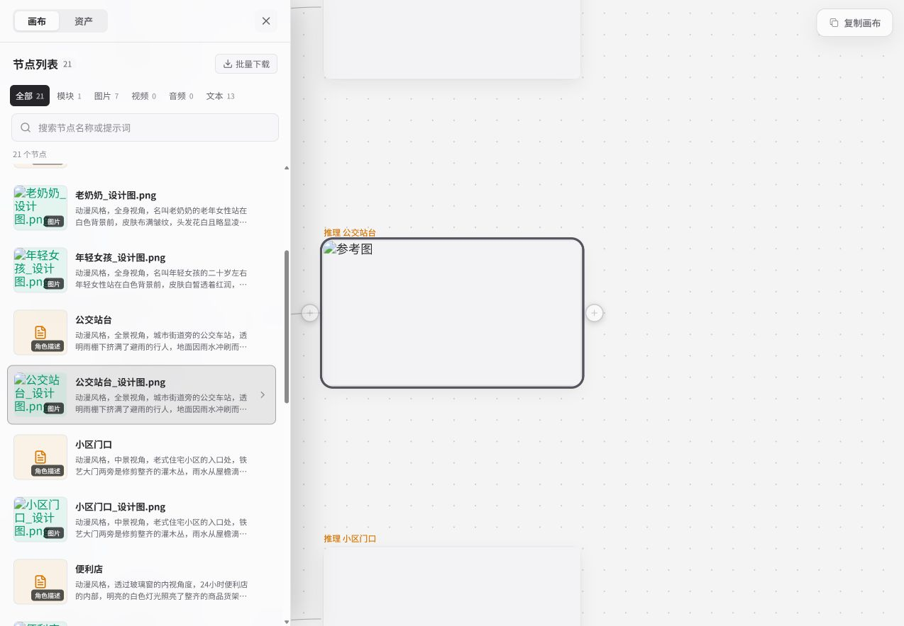

# 多元拾光｜内容与运营组织方式：发现、实践、创作与反馈

2026-09-11

三个候选方向与指标见[持续活跃与执行计划](community-north-star.md)。A—D是可组合的内容与服务组织方式。

> 条件式比较，未确定定位、招聘或开发排期。

优先检验视觉兴趣创作，应用与资源实践作为备选；学习交流在主持与反馈能力落实后启动。A筛选发现、B解法实践、C视觉创作、D练习反馈是可组合的内容与服务组织方式，不能直接当作四条独立业务线。

| 共同前提 | 已知 | 不能据此推出 |
| --- | --- | --- |
| 目标 | 先建立目标用户规模与持续活跃。北极星为连续两周发生有效内容消费或参与的外部目标用户数；社区不承担收入或付费转化指标。 | 相邻完整自然周为统一观察窗口；有效行为阈值、身份识别覆盖、基线和投入上限需在试点前固定。 |
| 供给 | 现有内容由平台维护，后续运营继续通过用户侧账号发布；自然UGC按尚无可用供给处理。 | 账号外观不改变供给责任；独立作者、合作产能和用户互评都不是现有资源。 |
| 人员 | 2名全栈研发同时负责MakeNow与社区，另有1名产品、1名运营。 | 研发剩余时间、内容制作技能、审校能力与预算未知，四方案不能同时各占用全部人员。 |
| 工具 | 用户说明API可支持文档中的模型，尚未逐模型实测；MakeNow一个案例已留下复制和文本保存证据。 | 素材显示、完整再生成与同一任务费用未核完；这些缺口影响可承诺范围，不否认已观察到的能力。 |
| 经营数据 | 已有匿名历史访问与部分注册汇总，最新已找到观察日为2026-08-27。 | 缺少9月同口径的活跃、留存与外部内容反馈，缺失值不填0。 |

比较材料包括竞品运营机制、六条内容样例与四种浏览路径。阅读和收藏为本页演示，不计入用户行为。

## 一、竞品做法的采用条件

编选、作品过程说明、教程和讨论主要依靠编辑与回应；资源交接、在线应用、作者分成和高频比赛，还需要技术维护、结算或外部参与。采用前需分别核算持续工作。

2026-09-10

综合既有原页、官方规则和自身代码/实操记录。不是15家全部再次实访。

目的抽样，不用于推算市场普及率、普通作者产能、留存、成功率或收入因果。Tusi/Tensor为同一产品组时仍保持站点与规则边界。

用户确认当前独立自然UGC按尚未形成处理；平台将持续通过用户侧账号发布。不是数据库为0，也不否定真实用户消费。运营组织行为与外部自主行为须分开。

有条件采用=可以进入内容展示和方案比较，不是研发开工或已证效果；依赖尚缺=先补具体材料或责任；暂不优先=当前不以该机制作为供给起点，不永久排除。

自身能力依据代码检查与 MakeNow 操作记录，具体日期和范围见相应条目。

只写研究输入。工时、人数和预算无实测时保留未知，不给经验数字冒充产能。

| 做法 | 当前判断 | 可承担的承诺 |
| --- | --- | --- |
| 按主题策展，保留不同内容的阅读方式 | 有条件采用 | 推荐条目需要分别交代方法价值与入口当前状态。没有运行核验时，保留带来源和日期的阅读参考，不能标作可直接运行。 |
| 作品结果优先，过程与再创作按需展开 | 有条件采用 | 系列作品可按项目连续阅读；作品欣赏、过程学习和取得源材料分别承诺，展示出的结果不自动证明读者能复现。 |
| 教程先讲真实过程，系列课程要有连续供给条件 | 有条件采用 | 教程和投稿需要经审阅、修订后接纳；合并记录可证明维护过程，学习效果仍需参与者实际完成记录。 |
| 用真实进展和可回应的问题组织轻量交流 | 有条件采用 | 轻量交流保留有信息的更正与进展；编辑次数、徽章动作和回复数量不直接作为贡献质量。 |
| 把讨论结果整理回来，让再次访问有内容可接续 | 依赖尚缺 | 把本人确认的处理步骤整理回问题正文，注明环境和时间；维护者回复、旁人恢复与原提问者解决分别记录。 |
| 资源按版本交付，更新要说明兼容条件 | 依赖尚缺 | 版本交付同时保留输入、依赖、变更说明和已核结果；作者说修复、代码改动与读者采用成功分开呈现。 |
| 同一方法提供简易应用和完整流程两种入口 | 依赖尚缺 | 简易应用与完整流程只在确有两类使用任务时提供；站点入口、账户权益、API及界面使用条件要分别核对。 |
| 主题活动与公开认可分开建设 | 有条件采用 | 主题编选、活动主持和投稿规则分别安排责任；主持人退出或交接未确认时，保留已发表内容并调整后续活动安排。 |
| 作者合作按交付判断，自动运行分成另看条件 | 自动分成暂不优先 | 合作交付区分作品、源材料、改动说明和后续维护。持续贡献个案可以帮助设计验收项，不能据此预估合作意愿或履约产量。 |
| Skill、MCP和小工具按交付责任逐级承载 | 有条件采用 | 资源阅读、文件交付、配置帮助与托管运行分别标明范围。页面存在、客服已回应或提供替代入口，都不足以证明任务完成。 |

### 按主题策展，保留不同内容的阅读方式

**有条件采用**。推荐条目需要分别交代方法价值与入口当前状态。没有运行核验时，保留带来源和日期的阅读参考，不能标作可直接运行。

[R23-HF-COL](#r23-hf-col) · [v15-r-neomme](#v15-r-neomme) · [V20-S01](#v20-s01) · [C22-S01](#c22-s01) · [C22-S03](#c22-s03) · [U22-S01](#u22-s01) · [COND-29](#cond-29) · [COND-30](#cond-30)

页面事实：

- Hugging Face 合集支持混合资源、调整顺序和编写条目说明，公开预览展示部分条目。NeoMME 样本关联了论文、模型和 Demo。
- Runway After Light 单片页提供观看与返回频道入口，未取得工程文件或完整教程。

分析：共同主题说明条目间的联系，类型与摘要帮助读者选择观看、学习或取得资源的路径。

读者价值：欣赏者有选择理由；学习者找到过程；有任务的人识别能取得的材料；用户可沿主题继续发现。

平台工作：

- 运营/编辑：确定本期主题、入选和排除理由，整理条目摘要，检查链接与署名。
- 素材作者或合作方：提供允许展示的内容与准确来源。
- 核验与维护责任：编辑维护失效记录、替代入口及适用条件；只在重新核验后恢复使用推荐。

代价：持续选片、比较和清理重复条目；专题过多会分散更新力量。使用外部资源可减少原创制作，但不能省去筛选、授权核对和失效维护。

失效条件：

- 合集只有相近标签，没有编选说明。
- 同一素材拆成多篇近乎重复内容，增加数量而没有新增信息。
- 冷门栏目长期空置，首页被大量入口占满。

反证与局限：Hugging Face：可以确认答疑者提供过替代应用，当前读取时应用暂停；未找到A或B采用后的成功反馈。

现有承载：社区作品、教程和闪念已有各自的 C端页面；专用资源详情仍为冻结原型。专题可先用编辑内容和研究示意比较。

缺口：尚未核实真实产品是否具备可维护的多类型专题关系与对应入口，不把研究效果图算成上线功能。

改变判断的证据：用同一批已有样例对照混排与专题组织，检查读者能否说出条目差异、找到下一条相关内容；另记录编辑整理和一轮更新的工时。

工具关系：工具是可选后续入口。专题的独立价值在选择与关联；没有数据证明它带来额外工具订单。

### 作品结果优先，过程与再创作按需展开

**有条件采用**。系列作品可按项目连续阅读；作品欣赏、过程学习和取得源材料分别承诺，展示出的结果不自动证明读者能复现。

[v15-g1](#v15-g1) · [V20-S01](#v20-s01) · [C22-S01](#c22-s01) · [C22-S02](#c22-s02) · [COND-10](#cond-10) · [COND-11](#cond-11) · [COND-12](#cond-12) · [COND-13](#cond-13) · [COND-14](#cond-14) · [COND-01](#cond-01)

页面事实：

- 社区作品详情代码已有提示词与参考媒体；同款输入包含模型等参数，并检查参考素材权限。

分析：先用结果判断兴趣，再决定是否付出学习或操作成本；将欣赏和制作意图放在同一对象上，但保留不同结束点。

读者价值：观看、寻找风格、收藏和交流；愿意尝试者可更少地重建输入。

平台工作：

- 编辑：选取能说明看点的结果与标题，写真实制作背景。
- 制作者/复核者：只有在承诺复用时才补齐实际输入、参数、素材用途和适用限制。
- 核验与维护责任：制作人说明实际用到的工具与素材，编辑核对公开材料覆盖到哪一步。

代价：精选画面的审美判断和素材核验持续发生；开放复用后还增加参数与模型变化的检查。不能把纯展示与可复用案例按同一生产工时估算。

失效条件：

- 以精修成品暗示一键即可得到同样效果。
- 标题承诺教程或画布，详情只给成品图。
- 卡片堆满参数，妨碍观看却没有把真实材料交付出去。

反证与局限：Runway：可以确认同一项目在不同日期持续发布与解释过程，制作人明确自述已完成40集。没有逐集观看、核对工程文件或验证所有集数现在均能访问，不能把发帖持续时间当作每天使用Runway的日志。 LiblibAI：确认有具名功能调整及作者所述反馈关系；不能确认任何一位反馈者已成功完成换背景，也不能将作者意图视作稳定生成效果。与 D21-LL-FIX 为同一资源复核，不新增独立观察点。

现有承载：作品详情和同款字段已有代码，可先补齐素材与使用说明。

缺口：当前线上材料可用性、生成成功及外部用户观看/收藏/回访尚未完成对应核验。

改变判断的证据：各选一件纯展示和承诺复用的作品，分别验收可观看、可理解与输入实际可取得；有真实外部行为时再区分欣赏和制作两类结果。

工具关系：再创作可引出调用费用，但工具消费只是其中一种结果。不能用未生成否定观看价值。

### 教程先讲真实过程，系列课程要有连续供给条件

**有条件采用**。教程和投稿需要经审阅、修订后接纳；合并记录可证明维护过程，学习效果仍需参与者实际完成记录。

[v15-r-cookbook](#v15-r-cookbook) · [v15-r-iterative](#v15-r-iterative) · [C22-S03](#c22-s03) · [C22-S04](#c22-s04) · [COND-22](#cond-22) · [COND-23](#cond-23)

页面事实：

- Datawhale 迭代章节连续呈现任务、输出问题和提示修改，并关联实践材料。
- 社区教程代码可从正文前三个有效标题生成学习路径，页面已有正文、日期和评论。

分析：教学竞争点在能否解释选择与错误，而非篇幅、视频数量或课时包装。改善已有标题和过程材料就能检验部分质量问题。

读者价值：理解方法、排查差异、之后按章节查找；不必每位读者都立即操作。

平台工作：

- 实际会做的人：提供输入、过程、失败样例、修改理由和可核结果。
- 运营编辑：写清适用起点、章节与检查项，将重复问题补回正文。
- 核验与维护责任：内容核验者阅读修改、检查对应结果；普通学员成功与作者评测分开记载。

代价：编辑不能替代复做。工具更新会带来步骤修订、素材重做和答疑；长周期课程增加维护多个章节的一致性工作。

失效条件：

- 只有成功截图，没有可用过程。
- 运营改写工具介绍但没有人核对步骤。
- 先承诺系统课程和随问随答，后续没有对应时间。

反证与局限：Datawhale：审查、作者回应和合并均有公开记录；效果数字仅来自作者评测说明。 Datawhale：同一贡献者数周内两次贡献被接纳。结果改善是作者的对照自述，不是独立学员成功。

现有承载：已有教程可先靠内容改进，不必等新教学系统；真实学习路径取决于正文标题质量。

缺口：未有完整实做内容包和准确工时，不能推定一名运营可以独立承担课程制作与技术答疑。

改变判断的证据：由非原作者按一份教程指出无法理解或缺失的材料；记录修订次数与不同角色耗时，再判断适合单篇还是系列。

工具关系：教程可解释通用方法，也可衔接 MakeNow 或 API。需要使用特定工具时，应在适用条件中说明。

### 用真实进展和可回应的问题组织轻量交流

**有条件采用**。轻量交流保留有信息的更正与进展；编辑次数、徽章动作和回复数量不直接作为贡献质量。

[V20-S02](#v20-s02) · [V20-S03](#v20-s03) · [C22-S05](#c22-s05) · [C22-S06](#c22-s06) · [U22-S01](#u22-s01) · [COND-26](#cond-26)

页面事实：

- HF Pebble 动态记录了未达预期的进度、资源链接、成员建议与作者回复，未见建议后的实验结果。
- 社区闪念代码支持短正文、图片、视频和列表内评论；提交审核事件不代表已公开内容。

分析：未完成内容也可提供表达和交流价值，前提是读者能明白发生了什么、哪里需要帮助。平台持续填充时，运营承担发起与跟进责任。

读者价值：了解他人在做什么、表达判断、交换经验；交流未必收束为工具使用或一份教程。

平台工作：

- 运营/项目制作者：提供真实观察和必要素材，问具体问题，追踪回复并回传进展。
- 技术或领域复核人：针对确有能力判断的问题给出说明；不把猜测写成已验证修复。
- 核验与维护责任：编辑判断修改是否增加可用信息，保留有用更正并处理无信息内容。

代价：单条正文可能较短，线程跟进却会跨多天；要处理重复建议、广告和无关回复。问题数量超过回应能力会留下大量无后续话题。

失效条件：

- 把虚构踩坑或虚构独立用户确认当引导材料。
- 提问只为堆互动，没有对应真实疑问。
- 只记录发帖量，不安排回传结果或回应时间。

反证与局限：LINUX DO：当前正文包含有用途的更正和无信息编辑；未核实对应作者、修订差异及徽章发放结果。

现有承载：已有闪念和评论承载。供给来源通过内部工作记录区分，不要求在前台堆后台治理字段。

缺口：外部回应者规模、运营技术答复能力与长期跟进量未知。

改变判断的证据：先记录平台发起的真实线程里，哪些外部回复提出新问题、建议或作品，哪些只是参与礼貌回应；并核对回应工时与后续结果。

工具关系：工具进展可成为话题来源，但主题的结果可以是理解、表达或认识他人。

### 把讨论结果整理回来，让再次访问有内容可接续

**依赖尚缺**。把本人确认的处理步骤整理回问题正文，注明环境和时间；维护者回复、旁人恢复与原提问者解决分别记录。

[v11-ld-home](#v11-ld-home) · [v11-ld-question](#v11-ld-question) · [v11-ld-solved](#v11-ld-solved) · [C22-S04](#c22-s04) · [C22-S06](#c22-s06) · [COND-24](#cond-24) · [COND-25](#cond-25) · [COND-27](#cond-27) · [COND-28](#cond-28)

页面事实：

- LINUX DO 登录页面有最新、新、未读、已读和书签入口，话题菜单可选择通知级别。
- 已解决接入话题把采纳回复带回首帖；另一个求助没有取得结果回传。

分析：阅读进度与更新线索降低回找成本，首帖整理减少后来者读完整串的负担。但有效内容和实际回应先于高级通知机制。

读者价值：再次找到关注的讨论，知道后来发生什么；检索时更快得到有条件的结论。

平台工作：

- 运营编辑：定期整理已经发生的新信息，标明结论条件和仍未解决处。
- 问题提出者/复核者：确认是否适用于原问题，并提供允许展示的结果。
- 核验与维护责任：答疑整理者核对确认发生的先后顺序和实际采用方法，缺少结果时保留待确认。

代价：整理需要理解原讨论，不是自动把最多赞回复置顶；误归纳会抹掉分歧。通知过量会增加打扰和维护压力。

失效条件：

- 无外部后续仍不断推送更新。
- 用运营自答与采纳制造解决率。
- 新增Wiki但没有负责检查与修订的人。

反证与局限：LINUX DO：提问者本人确认一次解决；公告引用晚于确认，不能认定其实际采用了备用接口。 Hugging Face：B有本人确认的局部恢复；管理员的修复说明不能替代A的验收。

现有承载：社区评论和教程正文可承接人工整理；完整阅读进度与通知跟踪能力尚未核实。

缺口：资料不足：需要哪些返回入口、真实主题更新频次及送达效果尚未知。

改变判断的证据：先在已有内容中完成一次问题—新材料—正文更正的人工整理，检查能否找到原问题和更正原因；有真实回访需求后再比较专用机制。

工具关系：社区可增加的是解释和维护的累积；不能把这部分直接记为 API 或 MakeNow 使用提升。

### 资源按版本交付，更新要说明兼容条件

**依赖尚缺**。版本交付同时保留输入、依赖、变更说明和已核结果；作者说修复、代码改动与读者采用成功分开呈现。

[D21-LL-V1](#d21-ll-v1) · [D21-LL-V2](#d21-ll-v2) · [D21-TA-V32P](#d21-ta-v32p) · [F26](#f26) · [F55](#f55) · [F55-DIFF](#f55-diff) · [M22-S01](#m22-s01) · [C22-S08](#c22-s08) · [U22-S01](#u22-s01) · [COND-09](#cond-09) · [COND-02](#cond-02) · [COND-03](#cond-03) · [COND-04](#cond-04) · [COND-05](#cond-05)

页面事实：

- Liblib 两版电商资源由 SDXL 转向 FLUX，输入与配置要求也随版本改变。
- Tensor 国际站同一模型存在用途不同的多个版本，字段和描述还出现未解释的不一致；不能将其套用到吐司中文站。
- HF FABRIC 的问题、提交和平台迁移记录显示，作者与平台人员都可能投入维护。

分析：版本不是装饰标签。使用者要知道哪一版适合自己，运营需要知道该找谁补材料或修问题。平台维护内容时，这份责任不会因发布成普通用户账号而转移。

读者价值：选择适合的资源、识别旧教程适用范围、让问题和修订可追溯。

平台工作：

- 案例制作者：交付输入、源对象、依赖、输出和版本说明。
- 运营：保持入口和说明一致，收集具体问题。
- 工具/技术维护者：核对依赖、定位故障并复测；运营不自动具备这一能力。
- 核验与维护责任：作者维护依赖，核验者记录对应版本的实际检查；材料失效时收回可复用承诺。

代价：除初次制作还有兼容、素材、解释与复测。维护旧版与新版会同时占用精力；不能从提交数或时间跨度推算工时。

失效条件：

- 只改版本号，不说明输入或环境变化。
- 收到作者修复声明就恢复可用承诺，没有相应检查。
- 平台精选失效资源，却没有接手人。

反证与局限：RunningHub：重新确认同一资源保留三条具体症状和处理声明；没有新增第四次维护或修复成功证据。与 RH21-02 / P25-runninghub-E5 为同一资源、同一作者，不增加独立观察点。 LiblibAI：已确认原始问题、维护者回应及同日发布的具体代码改动。该改动与回复所述问题一致，但问题单未显式关联提交，不能把时间接近写成已证明的因果链。原提问者是否升级并成功生成未知。

现有承载：MakeNow 已验证一个案例的复制和文本保存，随后复查发现原件与副本图片均未正常显示。专用资源详情仍为冻结原型。

缺口：现有案例完整素材、具体费用、生成输出和维护归属还未补齐，不足以承诺稳定可复用。

改变判断的证据：先完成同一个案例的材料可取得、对应版本、替换输入、输出检查和一次保存重开；记录发生的问题由谁处理、实际花费多少。

工具关系：运行消耗算力，版本维护消耗人力。低价Token只能改善其中一项，不能代替内容维护和故障支持。

### 同一方法提供简易应用和完整流程两种入口

**依赖尚缺**。简易应用与完整流程只在确有两类使用任务时提供；站点入口、账户权益、API及界面使用条件要分别核对。

[v15-cn-rh-flow](#v15-cn-rh-flow) · [v15-cn-rh-app](#v15-cn-rh-app) · [C22-S09](#c22-s09) · [M22-S01](#m22-s01) · [COND-06](#cond-06) · [COND-07](#cond-07) · [COND-08](#cond-08)

页面事实：

- RunningHub 换背景资源页提供节点与参数说明，以及运行、下载和应用入口。
- 另一个消除应用的作者说明限定了应用默认能力，完整流程提供更广功能；仅核到页面与说明，未实跑。

分析：减少用户初次需要理解的参数，可以降低操作负担；保留完整流程又允许进一步修改。两层必须说明能力差异，避免简化界面掩盖限制。

读者价值：新手按明确输入尝试，进阶用户检查和改动处理过程。

平台工作：

- 方法作者/工具研发：挑选应开放的输入与控制，维护完整流程和简易入口的一致性。
- 运营：准备示例、解释限制、把问题分配给能处理的人。
- 核验与维护责任：技术维护者记录接入环境与适用入口，未经核验的用户诊断作为排查线索保留。

代价：两套入口增加用法说明与回归检查；应用还产生托管、调用和失败处理成本。不是给现成工作流加一个封面就完成交付。

失效条件：

- 入口多但材料不通，用户仍要重复上传和填写。
- 隐藏了关键参数，遇到非示例输入就无法判断失败原因。
- 免费体验耗用上涨，却无法识别正常尝试、失败和持续使用。

反证与局限：RunningHub：由此前只有报错与关闭状态，补到同一提问者的原因分析。尚不能证明该分析正确，也不能把关闭日期算作恢复日期；本次没有读取对应历史版本的默认配置或复现请求。

现有承载：MakeNow 有画布能力与有限交接证据；社区跳转、具体材料传递和归因是不同环节，当前没有完整证据。

缺口：需先有一个可交付方法，再判断是否值得增加简易应用。当前尚不能把它写成已具备的内容产品。

改变判断的证据：对同一案例比较需要的输入、可改内容和失败处理，检查简易入口是否真的省去步骤；再核实际耗费与后续使用。

工具关系：该机制更靠近工具变现，但社区是否必要取决于发现、比较、解释与反馈是否提供额外价值；直接工具入口也是对照项。

### 主题活动与公开认可分开建设

**有条件采用**。主题编选、活动主持和投稿规则分别安排责任；主持人退出或交接未确认时，保留已发表内容并调整后续活动安排。

[R23-NC-CHALLENGE](#r23-nc-challenge) · [V20-S05](#v20-s05) · [U22-S01](#u22-s01) · [COND-18](#cond-18) · [COND-19](#cond-19) · [COND-20](#cond-20) · [COND-21](#cond-21)

页面事实：

- Runway Gen:48 档案按届次保存作品、作者与奖项，未取得原始评审或投票记录。

分析：共同题目让作品便于比较，阶段和后续点评给人再次关注的理由。公开认可的价值来自选择依据和组织者可信度，不能只复制徽标。

读者价值：有题可做、有作品可看、获得具体评论；参与和欣赏均可成立。

平台工作：

- 运营：设计题目、例子、节奏、投稿条件与结果归档。
- 作品评阅者：给具体、有依据的点评；比赛时另需可信评选与争议处理。
- 核验与维护责任：运营明确谁处理投稿问题、谁主持下一次；未有人接手时不继续承诺周期活动。

代价：命题、作品审核、主持、点评与结果整理会持续占时；有奖后增加费用与异常处理。平台供给作品不等于拥有足够外部参赛者。

失效条件：

- 参赛和评分主要由运营账号完成，却宣传自然比赛热度。
- 先上日赛，再靠降低质量补齐频率。
- 只有排名，没有可理解的选择理由与作品记录。

现有承载：社区作品和评论可承接专题点评，完整竞赛与投票流程尚未核实。

缺口：外部参与者、评阅资源及运营排期未确定，不能承诺固定日赛或稳定奖励回报。

改变判断的证据：先以现有平台作品组成一个明确题目的编辑专题，完成真实点评；之后有外部参与时单列其投稿和反馈，再决定是否增加投票或奖项。

工具关系：活动可以展示创作能力，也可以只是审美表达；不要求所有作品由自营工具产生，工具限制应有明确目的。

### 作者合作按交付判断，自动运行分成另看条件

**自动分成暂不优先**。合作交付区分作品、源材料、改动说明和后续维护。持续贡献个案可以帮助设计验收项，不能据此预估合作意愿或履约产量。

[R23-RH-REWARD](#r23-rh-reward) · [o9-g-run-cpp](#o9-g-run-cpp) · [U22-S01](#u22-s01) · [COND-23](#cond-23) · [COND-22](#cond-22) · [COND-01](#cond-01)

页面事实：

- RunningHub 的激励规则参考有效运行、收藏和原创程度，推荐策略独立于激励计划。
- Runway CPP 文档提供策选合作机会，不要求固定时间或创作投入；该记录沿用此前访问日期。

分析：赠送工具、关系合作、明确稿件采购和按使用结算解决不同问题。希望稳定取得内容时，先验收具体交付比假定作者拿到额度就持续供稿更可靠。

读者价值：用户得到可兑现的内容与回应，合作者清楚交付边界和自己的权益。

平台工作：

- 产品/运营：定义内容包、可展示范围、修订与答疑责任，验收材料。
- 合作作者：按约定提供实际作品和过程；合作意向不预记为自然供给。
- 若采用分成的运营/财务：维护行为口径、异常处理与结算；当前并未具备这份投入证据。
- 核验与维护责任：编辑或核验者接收交付、反馈问题并记录修订；合作费用和响应范围需另行约定。

代价：固定合作有采购与管理成本，分成有数据与争议成本，赠送算力也有机会成本；资料不足，不能比较哪种更便宜。

失效条件：

- 只约定发帖数量，没有原始材料和更新责任。
- 将收藏直接当满意度、运行数直接当成功付费。
- 平台运营自供内容参与激励后，又把内部动作算成作者生态增长。

反证与局限：Datawhale：同一贡献者数周内两次贡献被接纳。结果改善是作者的对照自述，不是独立学员成功。 LiblibAI：确认有具名功能调整及作者所述反馈关系；不能确认任何一位反馈者已成功完成换背景，也不能将作者意图视作稳定生成效果。与 D21-LL-FIX 为同一资源复核，不新增独立观察点。

现有承载：平台持续供给已确定；合作作者数量和意愿未核，现有团队尚无可复做的成型案例。

缺口：需要一份验收清楚的内容包及实际工作量，才能判断招聘、买稿、合作或分成的必要性。

改变判断的证据：记录一份平台内容从制作到一次维护的实际角色和耗时，写出可以交给合作方的具体部分；未授权联系前只完成内部方案。

工具关系：作者收入机制与用户购买工具是两份账；社区增量须另看它是否带来可归因的发现、使用或贡献。

### Skill、MCP和小工具按交付责任逐级承载

**有条件采用**。资源阅读、文件交付、配置帮助与托管运行分别标明范围。页面存在、客服已回应或提供替代入口，都不足以证明任务完成。

[v15-skills-entry](#v15-skills-entry) · [v15-skills-docs](#v15-skills-docs) · [v15-mcp-about](#v15-mcp-about) · [C22-S07](#c22-s07) · [C22-S08](#c22-s08) · [COND-29](#cond-29) · [COND-30](#cond-30) · [COND-15](#cond-15) · [COND-16](#cond-16) · [COND-17](#cond-17)

页面事实：

- skills.sh 条目展示方法正文、源码和安装入口；其文档说明安装遥测不能代表活跃使用或质量。
- 同轮 MCP Registry 资料说明主要承载发现元数据并指向软件包或服务；收录不等于代码审计或可调用保证。

分析：技术名词不应成为频道成立的充分理由。读者需要判断用途、交付物、前提与维护方；它们可以与教程和主题项目关联。

读者价值：了解选择、取得方法或配置材料、在自己的环境使用；也可以只学习其中做法。

平台工作：

- 运营编辑：核对来源、用途、访问条件和近期版本，写清资料与实际资源区别。
- 相应技术复核者：只有承诺某环境可安装或调用时才执行对应检查；托管服务另有运行责任。
- 核验与维护责任：根据实际承诺配置编辑或技术维护责任，运行失败时说明已查结果与可用替代路径。

代价：即使不托管也需维护失效链接和说明；安装验证、权限、依赖、服务运行及上游费用会随承诺加深，不宜由一个运营岗位默认承担。

失效条件：

- 收集一批术语和热度数就宣称完整生态。
- 条目没有真实文件或文档却写可安装。
- 外部服务变化后仍展示旧保证，或把可连接当成功运行。

反证与局限：Hugging Face：可以确认答疑者提供过替代应用，当前读取时应用暂停；未找到A或B采用后的成功反馈。 Runway：有本人确认的修改、重试失败和后续账号状态自述；账户疑虑有所缓解，原任务没有完成确认。说将加入Discord只是意愿，没有加入或在那里解决问题的证据。

现有承载：冻结白色原型有 Skill 与 MCP 的专用说明字段，真实专用消费模块未在既定检索中定位；不据此断言通用文章与附件完全不能承载。

缺口：尚无实际发布包和兼容验证。资料整理、文件交付与运行服务需要分别明确负责人。

改变判断的证据：为一个具体条目核对可取得的交付对象、读者需要的条件以及一次变化后谁更新；有明确使用需求再评估专用功能。

工具关系：便宜Token对部分服务有帮助，不能替代外部账号、权限、宿主和服务维护。第三方资料目录也不自动贡献自营调用收入。

### 继续补证的停止条件

- 每项补证必须能改变一种取舍：承诺层级、首页展示、内容供给责任、维护范围或成本。只增加相似页面不继续扩查。
- 没有完成结果或可用材料时，停止把资源包装为可复用；保留能兑现的展示或说明范围。
- 没有外部贡献与有效行为辨识时，不把自动分成和高频比赛当起点；可先完成内部内容包、编选与真实点评。
- 欣赏、表达、学习、交流和工具使用分别验收；不以每条内容都促成生成作为统一质量标准。
- 工具收入、社区导流和社区增量分别记。公开定价与按钮存在不能证明社区留存或盈利。
- 资料整理、机制判断与自身需求验证分开。此轮不选最终方向、不接触外部用户、不启动真实运营。

## 二、固定内容池与浏览对照

一张历史成图与一个 MakeNow 公开画布整理为六条内容。四种展示方式使用相同正文和素材，比较发现顺序、分组、关联和再次访问路径。

六条正文为研究编辑样例：成图来自历史测试，问题来自材料核对，方法说明属于编辑建议。没有真实用户投稿或公开发布记录。

- 六条材料固定供四种组织方式共用，不为某个方案另加更漂亮的作品、更完整的教程或虚构互动。正文、来源和使用限制保持一致。
- 比较的是同一内容能否被发现、关联内容能否接上、离开后如何再次找到；没有用户参与的浏览演示不能给出偏好、转化、留存或获客效果结论。
- 六条内容主要源于两个样本，不能视为六份独立任务、六种真实需求、六位作者或六份内容产能证据；实际运营不一定值得把这些解释拆成六条发布。
- 现有材料偏向工具交付，尚不足以代表审美欣赏、身份表达、陪伴和同行认同等全部社区需要。P23-01保留纯欣赏入口，但一张图不证明作品社区已具备竞争力。
- 卡片不填虚构点赞、评论、收藏、使用次数或作者身份。无需把内部审核和治理字段设计为真实社区用户卡片必备内容；本研究单独呈现证据状态。
- 不加入没有真实交付文件的Skill或MCP来凑类型，不提供未验证的运行、安装或一键复用动作。

| 组织方式 | 分组与顺序 | 理由 | 代价 | 再次访问 |
| --- | --- | --- | --- | --- |
| A 按专题读 | 先读两篇说明：P23-03 → P23-06；对照原始材料：P23-01 → P23-02；带着问题继续：P23-04 → P23-05 | 编辑决定学习顺序，把相关材料串成可读的小专题。不同媒介共存，但不要求读者先选择技术格式。 | 读者少做一次材料拼接，编辑多承担选择、串联和更新工作。纯欣赏者可能需要更直接的作品入口。 | 回到保存的专题说明，再查看它所关联的材料和待解释问题。 |
| B 按问题找 | 待讨论的问题：P23-04；已有依据：P23-03 → P23-01 → P23-02；处理范围与旁例：P23-06 → P23-05 | 问题承担发现入口，证据和方法围绕它关联。不同内容类型按作用排列，而不是先分成六个频道。 | 排错者容易进入上下文，平台也更容易收到超出能力范围的支持需求；作品欣赏不是这一结构的首要体验。 | 重开保存的问题，沿关联材料复查；没有新处理结果时明确保持未解决。 |
| C 先看作品 | 结果与画布现场：P23-01 → P23-05；这份结果背后的材料：P23-02 → P23-03；继续讨论与维护：P23-04 → P23-06 | 可见图像先承担选择作用，过程材料留在关联阅读中。展示作品与交付可运行模板分别说明。 | 展示所需文字更少，但选片和素材质量要求更高；漂亮结果不能替代可用文件与复用说明。 | 先找到保存的作品，再进入对应输入、说明或公开画布；保存作品不被解释为已运行。 |
| D 围绕讨论 | 本次讨论题：P23-04；参与前可看的材料：P23-01 → P23-03 → P23-02；后续整理与另一个现场：P23-06 → P23-05 | 讨论题把材料变成共同语境，允许表达不同判断；长期价值依赖具体回应与后续整理。 | 读者更容易知道可以参与什么，平台则必须有回应能力。没有讨论素材和回应者时，页面结构本身不会产生关系。 | 重开保存的讨论题，查看真实补充；本示意不制造新回复或通知。 |

### P23-01 · 窗边桌面上的模型卡片

作品 · 2026年6月17日生成图片，标题与解读为编辑整理

一张以卡片、连线和纸张表达模型比较的文章插画。先看画面；需要了解制作输入时，再读关联资料。

已有API历史样本，不是MakeNow生成结果。实际文件尺寸784×1168；生成摘要曾记录1024×1024，差异原因未知。

**画面里有什么**

画面观察：窗边自然光照在桌面和纸张上，浅蓝、浅绿与浅橙色卡片悬浮在上方，以箭头连接。卡片使用图像、代码和音频的抽象符号，没有用可读正文解释流程。读者可以只把它当作一幅工作区插画欣赏。

**为什么这样画**

历史输入要求给模型服务社区文章制作插画，用抽象模型卡片、比较路径和示例材料表现工作区。编辑解读：让连线和卡片承担主要信息，能避开在图内堆叠说明文字；柔和自然光让技术主题更接近日常桌面。这是对当前一张图的解读，不是已验证的传播效果。

**这张图的记录**

脱敏摘要记载模型标签为 grok-4.2-image，日期为2026年6月17日，运行状态为成功。实际保存的 JPEG 为784×1168，与请求尺寸1024×1024不同；展示规格应以文件属性为准。

**继续看什么**

想了解画面是怎样描述出来的，可以看关联的原始Prompt。想把它作为自己的文章素材，需要先按实际用途复核；本研究没有将它发布到社区，也没有完成后续改图。

可以交付：历史图片与研究正文可查看；正式发布和当前复现未完成。

读者价值：可以直接欣赏画面，也能自主选择是否继续了解制作输入；不把每次欣赏都导向付费生成。

运营工作：选图、写简短解读、保留来源与日期；如转作正式内容，另做用途复核，不虚构原作者或外部用户评价。

关联：P23-02、P23-03

[P23-S01](#p23-s01) · [P23-S02](#p23-s02) · [P23-S03](#p23-s03)

### P23-02 · 这张工作区插画的输入是怎样写的

Prompt资料 · 脱敏历史 Prompt 原文与编辑说明

保留原Prompt，并解释画面、风格、限制和背景分别承担什么作用。它是一份历史输入资料，没有承诺照抄即可得到同图。

**先读输入的结构**

历史Prompt先说用途：为模型服务社区文章制作插画；接着写场景、风格和限制；最后补充文章背景。编辑解释：场景交代要画什么，风格交代怎样呈现，限制交代应避开什么，背景帮助理解内容的用途。四部分可以分别调整，不必把所有要求挤进一句话。

**原始Prompt**

Create a clean editorial illustration for an AI model service community article.
Scene: a calm product workspace showing abstract model cards, comparison paths, and reviewable example materials.
Style: modern editorial illustration, soft natural lighting, restrained colors, high detail, no dark background.
Safety: no readable text, no logos, no brand names, no real people, no copyrighted characters, no API keys, no code secrets.
Context to inspire the composition: The model service channel should help a professional beginner compare models by task. The first release focuses on discoverability, model detail pages, and reviewable example material. The page should avoid live calls, account balances, real credentials, and unsupported performance promises. Each published example needs a task context, input fixture, output summary, reviewer notes, and a clear next action. The first dry-run batch covers embedding retrieval, long document summaries, code review, and audio transcript
Target model label for internal evidence only: grok-4.2-image. Do not render the label as text in the image.

**不要只保存Prompt**

历史摘要记载 image_generation 请求、grok-4.2-image 模型标签和1024x1024尺寸。公开文档使用 grok-4-2-image，两种名称是否等价尚未确认，案例保留当时的调用记录。

**如果改成另一篇文章**

编辑建议：先替换用途和场景，再决定是否保留自然光、克制颜色和不出现可读文字等要求。调整Prompt后应重新检查实际输出；这条资料没有提供变更后的结果，也不保证模型会按每个限制执行。

可以交付：历史资料与解释可读；没有当前运行验收或保证一致的复现承诺。

读者价值：既能看到完整输入，也能理解哪些部分是任务条件；不把一段Prompt包装成已经交付的工作流。

运营工作：保留原始输入，核对与输出的对应关系，解释可变条件；后续模型名称或运行条件变化时更新说明。

关联：P23-01、P23-03、P23-04

[P23-S01](#p23-s01) · [P23-S03](#p23-s03)

### P23-03 · 请求写1024×1024，保存的图片却是784×1168

核对说明 · 历史记录、文件属性与编辑方法说明

同一历史样本中，参数摘要与落盘文件尺寸不一致。先把记录讲清楚，再判断差异发生在哪一步。

**两组数字分别来自哪里**

2026年6月17日的 case_materials.md 记录 size=1024x1024；对应 JPEG 的实际属性为宽784、高1168、161037字节。此处采用源文件尺寸。

**成功状态能说明什么**

历史汇总记录一个成功任务，且本地文件可以打开。这支持“已有输出文件”，不支持“所有要求都已满足”。如果任务要求方形插画，当前保存的竖幅文件与摘要要求不同；不能因为任务显示成功就把它写成方形成品。

**把检查写成读者能用的说明**

编辑方法：先写输入记录的规格，再写最终文件属性，最后说明差异是否影响当前用途。对文章配图，可能还要检查横竖构图、正文位置和实际显示区域；这些检查应按使用场景开展，不能从本例直接得出所有图片都需要相同尺寸。

**目前还不能解释原因**

待确认：本研究没有读取原始响应和图片转换链，因此不能判断问题发生在请求记录、模型返回、下载、转码或其他环节。下一步如果取得允许查看的脱敏记录，应按这些环节逐一核对；当前不直接指责API忽略参数，也不补写修复结果。

可以交付：已发生的差异与检查方法可读；根因和修复未验证。

读者价值：理解请求规格、运行成功和可交付文件之间的区别，减少转发案例时的规格误写。

运营工作：核对文件属性，保留历史摘要；证据不足时记录问题，不替研发猜根因。

关联：P23-01、P23-02、P23-04、P23-06

[P23-S01](#p23-s01) · [P23-S02](#p23-s02) · [P23-S03](#p23-s03)

### P23-04 · 尺寸为什么变了？这条记录还缺哪一步

开放问题 · 研究团队提出的问题；不是用户求助帖，没有已发生的评论

研究团队提出的一个未解决问题：已有请求摘要和最终文件，要定位尺寸变化，还需要什么中间证据？

**问题的起点**

历史摘要记录1024×1024，保存的 JPEG 为784×1168，文件可正常打开。缺少原始响应与转换记录，尚未定位尺寸改变的环节。

**什么回答会推进问题**

编辑拟定的讨论范围：如果有人负责这条素材链，最有用的是说明请求实际提交的规格、最初取得的图片属性，以及保存过程中是否有转换。任何说明都应附能公开或脱敏核对的材料；只有“我也遇到过”可以作为线索，不能直接作为本例原因。

**怎样保留后续进展**

待执行的维护方法：取得新证据后，在正文补充它对应的环节、确认了什么、还没确认什么，并关联回原作品和规格说明。如果最后不能找到中间材料，就保留“原因未确认”，不为了结束讨论写出推测结论。

**当前状态**

这个待解问题用于比较讨论内容的上下文展示。尚无外部回复或解决结果。

可以交付：研究讨论样本可读；没有真实外部参与、回复或解决结果。

读者价值：看到一个边界清楚、可以据证据继续讨论的问题，而不是缺少上下文的一句求助。

运营工作：整理已知与未知、核对新增材料、更新问题状态；若正式组织讨论，答疑和后续回应都需安排维护者。

关联：P23-01、P23-02、P23-03

[P23-S03](#p23-s03)

### P23-05 · 母亲节短片画布：现在可以从中读到什么

画布资料 · 同一公开画布的操作记录与编辑说明

小说、角色和场景结构可读；副本的一个文本字段已验证保存。但现有图片未正常显示，完整制作尚未复现。

2026年9月10日公开原件截图，显示图片未正常呈现；原因尚未定位。

**先看制作结构**

已观察事实：这条公开画布名为“母亲节主题短片”，节点清单显示21个节点，分类为1个模块、7个图片、13个文本，视频和音频为0。小说、角色和场景信息可读。节点分类能帮助理解制作结构，但不能只凭片名认定已有短片成品。

**副本检查完成到哪里**

公开画布复制到当前账号后，在副本小说输入末尾加入标记。保存并离开首页再打开，标记仍在，公开原件没有该标记。此操作验证了一个文本字段的保存重开，素材、权限与节点交接还需核对。

**为什么还不称为可用模板**

复查时，原件和副本的7张列表缩略图均未正常显示，公交站台图片节点也相同。图片资源、网络与访问条件尚未排查，不能确定是复制问题；未提交图像生成。

**打开原件时能做什么**

目前可把它作为制作结构资料阅读：看小说如何拆为角色和场景，检查自己需要替换什么。报告只提供公开原件链接，不提供项目下载包，也不自动复制或生成。若以后把它推荐为可继续制作的案例，应先补齐可用素材、确认图片动作的模型和费用，再记录真实输出与保存结果。

可以交付：公开结构资料可读；素材可用性未通过，完整生成、费用与输出未验证。

读者价值：能在进入工具前判断这条内容目前交付的是结构资料，避免把可复制入口误解为完整案例已可运行。

运营工作：解释阅读起点、逐项核对素材与依赖、维护推荐版本；费用或文件可用性没有确认时及时缩小承诺。

关联：P23-06

[P23-S04](#p23-s04) · [P23-S05](#p23-s05) · [P23-S06](#p23-s06)

### P23-06 · 把生成记录整理成别人看得懂的内容

维护方法 · 基于两个已检查样本的编辑方法说明；未实测工时或对外服务效果

用已有成图与画布记录说明：作品、输入资料、教程和可用资源应承诺不同的东西，维护工作也不同。

**先决定这一条交付什么**

编辑方法：如果交付的是作品，首先让读者看清画面，简要说明创作背景即可；如果交付的是输入资料，就保留输入与结果的对应关系；如果承诺教程，要交代起点、关键操作、结果和限制；如果承诺可用画布，还需确认文件、依赖和继续操作的条件。不要仅因页面有按钮就提高内容承诺。

**用现成材料写出完整正文**

已有文章插画能提供成图、Prompt、日期和文件属性，足以写一条有边界的历史案例。尺寸差异可以写清楚，不必等根因查明才能说明已发生的事实。MakeNow画布能讲制作结构和局部保存记录，但图片未正常显示时，不宜写成“复制即可完成”的教程。

**保留别人继续判断的线索**

作品关联输入与规格说明，问题关联已检查材料；出现更正时更新正文，让再次访问的读者能找到最新结论。独立更新页和通知的必要性取决于内容量与维护能力。

**平台供给应计入哪些工作**

平台通过用户侧账号组织内容，需承担选材、制作、核对、发布、回应和失效修订。多账号发布不会增加维护人力，同一素材拆成多条也应按同一选题核算。制作工时尚未记录，暂不能估算周产量。

**这套方法还没有证明什么**

它是根据已有材料整理的可读说明，没有完成独立读者测试，也没有真实评论、留存或使用结果。后续若制作正式内容包，应记录每一步实际花费的时间和得到的反馈，再判断哪些劳动适合内部承担、哪些需要合作。

可以交付：方法正文可读；不是已执行SOP、已交付Skill或经过测算的产能方案。

读者价值：帮助维护者把已有材料整理成可信、可继续阅读的内容，也让读者知道每种内容应提供什么。

运营工作：按实际交付责任编写和维护；方法有变化时保留例子，避免只积累抽象规则。

关联：P23-01、P23-02、P23-03、P23-05

[P23-S03](#p23-s03) · [P23-S04](#p23-s04) · [P23-S05](#p23-s05) · [P23-S07](#p23-s07)

### 素材使用边界

- 现有本地图片沿用报告已保存资产；没有下载远程媒体。MakeNow截图是公开原件的研究证据，不是可复制的完整项目文件，也不是当前生成成品。
- 成图来自2026年6月17日虚构、脱敏输入的历史测试。文件可打开不等于完成一切公开发布审阅；仅用于本地研究报告，不宣布取得新的转载、商用或源文件交付权利。
- Prompt按已脱敏素材摘要保留。参数摘要、模型名称与实际输出分别注明；不承诺当前可复现，也不把模型名差异擅自合并。
- 只设置当前确实存在的阅读、关联或图片查看动作。公开画布链接指向原件，报告不会替用户点击复制或执行生成。

## 三、四种内容组织方式

| 比较维度 | A 精选方法 | B 应用解法 | C 视觉创作 | D 练习反馈 |
| --- | --- | --- | --- | --- |
| 读者首先获得什么 | 围绕眼前任务的精选做法及选择理由 | 可理解的应用问题、复现条件与已核解法 | 值得看的创作结果及与它关联的制作方法 | 有明确目标的练习、示范、具体点评和修订 |
| 首页为什么这样组织 | 任务专题统领方法条目，降低泛内容选择负担 | 按应用问题和处理状态聚集上下文，避免重复问答散落 | 先看结果，过程和资源随后展开，兼容欣赏与继续创作 | 围绕同一道题展示不同尝试和修改，让反馈可理解 |
| 内容形式的主次 | 专题/方法主导，作品作示例，短问答补适用条件 | 问题与解法主导，示例应用/教程/资源证明处理过程 | 作品主导，过程/教程/画布分层提供可选深度 | 练习与作品修订主导，点评/方法短文围绕学习障碍出现 |
| 平台最不可省的能力 | 筛选、核验、解释差异与更新推荐 | 复现问题、排错、标明环境与持续技术维护 | 做出结果、审美判断、交付素材和复核制作方法 | 设题、看懂作品目标、具体点评和跟进修改 |
| 对自然UGC的最低依赖 | 平台可先完整交付精选内容，外部反馈提高选题质量 | 可先交付平台实测解法；真实应用问题仍需后续验证 | 平台可供给作品与案例；外部二创是后续增量 | 平台能供给练习与示范；参与者反馈关系不能靠运营互演形成 |
| 随用户增加最容易增长的负担 | 不同输入与账户条件带来的问题判断、版本变化后的重查，以及有效更正审核。 | 更多环境和个体输入会带来长尾排错；旧示例随依赖变化持续返工。 | 不同输入带来的失败、素材或依赖变动、旧副本更新，以及主题投稿问题和主持交接。 | 每份作品的阅读、追问、点评与修订后再次反馈；参与越深，未必越省工作。 |
| 工具对最低承诺的重要性 | 可选示范工具；筛选价值可独立成立 | 执行与复现依赖工具，但不必须依赖自营API | 作品欣赏不依赖工具交接；承诺画布复用时强依赖 | 可选创作环境；反馈质量不由工具能力替代 |
| 可能收益 | 可以按任务承接广泛来源，并逐步积累可信选择依据 | 解法与持续维护有机会形成较强的使用理由 | 结果容易被理解，平台视觉工具可成为进一步创作的承接 | 回应、进步和识别感有机会形成关系与持续参与 |
| 必须接受的代价 | 长期编辑判断投入，单纯收录很容易被替代 | 技术支持容易挤占研发，读者可能期待超出范围的服务 | 成品制作、复现与资产维护都要投入；漂亮结果不证明可交付 | 人力服务容量限制明显；没有可兑现点评就只剩活动题目 |
| 轻量版本 | 围绕一个任务编排专题，把已有材料整理为方法比较、步骤说明和关联问答；依据不足的比较项保留未知。只有明确实践者、审查人并完成关键结果检查的方法，才标为平台实测推荐。通过现有内容页人工维护来源、入口和更正，不要求先开发开放编辑或奖励系统。 | 以一个材料完整的真实问题为起点，先确认编写、结果检查和维护责任，在限定环境下呈现输入、处理动作与输出对照。通过现有教程和讨论承载，外部资源注明来源、必要设置及检查日期。只有排查过程而没有结果时，发布排查记录；未落实维护责任时，不开放持续排错服务。 | 围绕一份真实作品整理可观看结果与对应制作说明；已有连续内容时用集合和关联链接组织，不预定产量。材料只开放能确认的交付范围，完整复用通过后再承诺相应执行步骤。主题可先采用编辑选集，主持与参与支持落实后再开放投稿；无需为这几种内容同时开发独立频道。 | 在点评者、可用时间和处理范围明确的条件下，围绕一个题目和真实示范开放有限反馈，完成已接手的回应。缺少接手者时，只能准备自主练习材料，尚不足以验证反馈型方案。平台示范与外部尝试分开记录，不用示范稿模拟用户返稿。 |
| 会直接改变取舍的未知 | 平台能否持续核验而非转载，读者是否采用选择理由 | 技术维护时间是否可保障，问题是否反复且具有共性 | 能否稳定制作并交付可用材料，读者是否愿意继续改 | 谁能提供具体反馈，参与者是否愿意返回修订 |
| 目前不能由资料推出 | 编辑内容必然带来搜索流量或留存 | 有廉价API就会吸引开发者或卖出调用量 | 有MakeNow就应选择视觉生产社区 | 活动和积分能够自动产生互评关系 |

## A · 筛选发现

围绕一件想做的事，找到经过说明和核对的做法，知道它适合什么条件，以及为什么选它。

[OPT23-S01](#opt23-s01) · [OPT23-S02](#opt23-s02) · [OPT23-S03](#opt23-s03) · [OPT23-S04](#opt23-s04) · [OPT23-S07](#opt23-s07) · [COND-29](#cond-29) · [COND-30](#cond-30) · [COND-06](#cond-06) · [COND-07](#cond-07) · [COND-08](#cond-08) · [COND-22](#cond-22) · [COND-23](#cond-23) · [COND-26](#cond-26) · [COND-24](#cond-24) · [COND-25](#cond-25) · [COND-01](#cond-01)

### 证据与采用条件

| 判断变化 | 此前设想 | 已观察事实 | 采用条件 | 仍需核对 |
| --- | --- | --- | --- | --- |
| 精选理由要覆盖使用条件和入口现状 | 条目写适用条件、推荐理由和更正入口；使用时再到工具执行。尚未明确入口失效或账户条件不符时，推荐和按钮如何处理。 | Hugging Face 的试衣答疑曾提供适配应用，复查时应用显示暂停，原因未知；RunningHub 接入问题中，原提问者自述购买会员后仍受阻，并提出国内外入口差异的诊断，但未确认生成成功。 | 把任务输入、账户或服务区域、必要付费条件放到方法比较中。卡片说明是阅读方法、取得文件还是在线使用；详情注明检查日期。入口不可用时保留方法说明，调整执行入口与推荐理由。 | 案例没有证明推荐信息改善了采用率；多元拾光能覆盖多少入口检查、多久检查一次及能否提供替代方法，仍缺自身记录。 |
| 方法审查需要看最终答案和启用条件 | 方法实践者提供过程证据，编辑复核关键步骤；轻量范围是一组有选择理由的方法说明。未明确作者与审查者的责任，也未要求检查默认设置下的结果。 | Datawhale 课程贡献在维护者追问后由作者修正并获合并；同一贡献者随后针对答案遗漏步骤继续修改，但相关开关默认关闭。效果数字来自作者评测，未取得普通学员成功记录。 | 实测推荐须明确实践者和审查责任人，留存输入、关键设置与结果检查。学习文章可以只交付方法解释；没有独立复核的作者案例保留作者说明身份，不把它直接写成平台验证结论。 | 未独立复验竞品评测，也不知道其审核成本；多元拾光是否具备作者以外的审查能力和相应工时仍待确认。 |
| 维护围绕有效更正，答复后仍记录使用结果 | 读者反馈补回正文，平台持续更新精选条目；尚未细化什么更正值得接纳，以及答复、作者修订和本人确认如何区分。 | LINUX DO 的 Wiki 同时出现有用更正和领奖式编辑；另一求助中本人确认解决早于后来引用的公告。Liblib 工作流作者说明了版本调整，但没有原始反馈和使用者恢复确认。 | 更正须指明受影响条目、具体条件、来源和修改内容，审核后进入正文。问题记录保留尝试、答复、实际调整和本人结果；没有回传就保留未确认。运营整理与真实读者反馈分别记录，奖励若设置，应围绕被接纳的有效贡献。 | 竞品有效更正比例、响应工时和长期稳定性未知；是否设置奖励及多元拾光的审稿能力尚未确定。 |

### 精选理由要覆盖使用条件和入口现状

精选价值应包括帮助读者排除当前不具备条件的方法。历史上有人提供过入口，不能支撑今天仍可执行；购买会员也不能替代接入条件核对。

[COND-29](#cond-29) · [COND-30](#cond-30) · [COND-06](#cond-06) · [COND-07](#cond-07) · [COND-08](#cond-08)

### 方法审查需要看最终答案和启用条件

步骤存在、代码被接纳和读者拿到完整结果是不同事实。精选方法需要有人审查决定结果的步骤，并写清哪些调整需主动启用。

[COND-22](#cond-22) · [COND-23](#cond-23)

### 维护围绕有效更正，答复后仍记录使用结果

精选内容的维护不能以编辑次数或回复数量替代信息改善。保留处理先后和结果归属，才能避免把热闹误判为方法有效。

[COND-26](#cond-26) · [COND-24](#cond-24) · [COND-25](#cond-25) · [COND-01](#cond-01)

### 内容展示与持续责任

以下为该组织方式需要承担的工作，尚未确认人员具备相应能力或可用工时。

### 任务专题与方法比较

| 部分 | 具体内容 |
| --- | --- |
| 发现入口 | 首页以具体任务为入口，说明所需输入和可得到的结果；相关方法集中比较。 |
| 卡片 | 展示任务标题、结果类型及最影响选择的条件，进入比较页；不在卡片堆参数。 |
| 详情 | 按输入、设置、账户或服务区域、费用条件、检查日期比较方法，附选择依据与对应来源。 |
| 使用动作 | 选择后进入方法正文、取得材料或前往对应工具；条件不符可返回其他方法。 |
| 组织原因 | RunningHub 接入案例提示，账户与入口会影响使用；HF 应用暂停说明历史推荐还需检查当前可用性。比较页应帮助读者排除不适合自己的路径。 |
| 制作 | 需要具备任务理解能力的编辑整理材料，实践者解释关键前提；角色可兼任，能力需确认。 |
| 核验 | 编辑核对引用，审查责任人确认比较是否有依据；执行能力只写到实际检查范围。 |
| 维护 | 该专题的编辑负责变更选择理由、替换入口和关联最新方法；发布前需明确责任人。 |
| 触发处理的情况 | 入口不可用、账户权益改变、关键工具版本或方法前提变化，或收到有材料的读者更正。 |
| 能力不足时的范围 | 保留有来源的资料比较，撤下无法兑现的执行动作；没有合适替代时说明尚无可推荐方法。 |

### 步骤教程与结果案例

| 部分 | 具体内容 |
| --- | --- |
| 发现入口 | 放在对应任务专题中，按要解决的具体步骤被发现；结果例子帮助判断是否值得阅读。 |
| 卡片 | 展示任务结果与一个关键前提，说明文章提供的是作者过程还是平台已检查的方法。 |
| 详情 | 保留输入、关键设置、步骤、结果检查和已知失败条件；需主动启用的设置与默认状态写清。 |
| 使用动作 | 读者照说明执行并对照结果要求；问题回到对应步骤，避免只问是否生成成功。 |
| 组织原因 | Datawhale 的两次贡献涉及审查后修正与答案步骤完整性；代码合并和命中检索都不能代替最终输出检查。 |
| 制作 | 实际完成任务的实践者提供过程，编辑负责可读性和材料关联。 |
| 核验 | 实测推荐需由作者以外的审查责任人检查关键步骤和最终结果；未检查范围留在作者说明中。 |
| 维护 | 实践者负责技术或方法修订，编辑更新正文，审查责任人复核受影响步骤；分工需提前落实。 |
| 触发处理的情况 | 读者提供可复现失败、默认设置改变、模型或依赖更新，或结果要求发生变化。 |
| 能力不足时的范围 | 不能复核时保留制作过程或资料讲解，移除平台实测与直接复用承诺；不编造成功案例。 |

### 方法更正与使用问答

| 部分 | 具体内容 |
| --- | --- |
| 发现入口 | 主要依附任务和方法详情；经审核且影响使用的更正在首页方法更新中出现。 |
| 卡片 | 显示哪个方法、什么条件发生了变化，或解决什么具体问题；不以回复量代替价值。 |
| 详情 | 记录输入条件、已尝试操作、建议、实际调整和本人结果；更正附来源和影响范围。 |
| 使用动作 | 读者可按条件参考处理方式、补充自己的结果，或从问答回到已修订正文。 |
| 组织原因 | LINUX DO 的有用更正与领奖式编辑并存，求助案例又显示解决归因需要按实际先后核对；记录具体变化比堆积编辑数更有用。 |
| 制作 | 实际提问者或贡献者提供条件与证据，编辑可以整理；平台自编内容需按平台材料记录。 |
| 核验 | 编辑核对来源与时序，涉及方法效果时交给具备任务能力的人审查；答复者不能替提问者确认成功。 |
| 维护 | 方法责任人把有效修订写回正文；若考虑奖励，由运营依据已接纳的信息改善处理。 |
| 触发处理的情况 | 出现可核实更正、使用者补充结果、作者修订与现有说明冲突，或重复出现无信息编辑。 |
| 能力不足时的范围 | 无人判断的技术问题保留待确认并链接适当支持入口；没有有效信息的编辑不进入正文。 |

### 谁会来，为什么

有零散AI使用需求、愿意阅读具体做法的人。运营、产品、创作者和独立工作者只是候选来源；起步可按少数相邻任务组织，不先宣布服务所有职业。

- 减少在工具、教程和零散经验间反复筛选
- 理解方法前提与替代选择，知道什么时候不值得继续
- 收藏有用方法，在相邻任务或工具变化时回来查看

### 首页、列表与详情

按具体任务组织精选方法，先让读者比较所需输入、适用条件和能得到什么；把同一方法的补充、更正和使用问题收在一起。

- 任务专题：问题、所需输入与方法选择
- 精选方法：结果例子、推荐理由与关键使用条件
- 方法修订：变动影响、检查日期与相关条目
- 使用问题：具体尝试、处理建议与本人结果

卡片：标题交代任务或方法，预览展示结果类型；用简短文字说明一个决定选择的前提。阅读方法、取得文件、在线使用分别指向对应内容；已知入口失效时撤下执行动作，保留资料入口。

详情：先给方法比较和适用条件，再给输入、关键步骤、需主动启用的设置、结果检查和替代做法。工具入口旁标明账户或服务区域、必要费用条件、检查日期；文末保留具体更正和使用反馈。

组织原因：读者需要判断能否采用，而不只是知道有这种方法。把前提与可用入口放在选择阶段，可以减少读完教程后才发现条件不符；把修订并回同一条目，便于查找最新做法。

| 内容形式 | 承担的作用 |
| --- | --- |
| 任务专题和方法比较 | 按输入、结果要求和使用条件解释选择；方法暂不可执行时，仍可提供有来源的比较。 |
| 步骤教程和结果案例 | 说明关键设置与结果检查，标明作者演示或平台实际复核的范围；作品和短笔记作为对应步骤的材料。 |
| 方法更正和使用问答 | 围绕具体条目补条件、指出错误、记录尝试结果；有用修订进入正文，不以编辑次数代替质量。 |
| Skill、MCP和工作流资料 | 只在支持具体任务时关联；资料介绍、文件取得和在线执行分别写清交付范围。 |

### 读者怎样使用，平台要做什么

| 环节 | 读者动作 | 接下来 | 对应平台劳动 |
| --- | --- | --- | --- |
| 进入 | 从一条具体任务说明进入专题，先看可得到什么及需要准备什么。 | 对照自己的输入、账户与结果要求，选择有条件采用的方法。 | 外部内容与专题回答同一个问题；收录时记录来源、检查日期和重要前提。 |
| 选择 | 比较方法的结果例子、关键设置、费用条件和当前入口。 | 阅读、取得材料或去执行；条件不符时选择其他方法，或只保留资料。 | 核对比较依据；执行入口发生变化时，调整动作和推荐说明。 |
| 使用 | 照说明操作，并检查输出是否满足任务；遇到问题时记录所用版本、尝试与错误。 | 采用结果，或提交可判断的具体问题。 | 实践者提供材料，审查责任人检查关键设置和最终结果；仅有作者演示的范围明确注明。 |
| 更正与查阅 | 查看答复、尝试调整，并在愿意时补充本人结果；以后从收藏回到同一方法查修订。 | 有效更正进入正文，未得到回传的问题保留未确认。 | 审核更正的来源和影响，记录先后顺序；运营补充说明与外部使用者回传分别记录。 |

### 谁持续供给

**任务编辑**

需要有人选择任务、比较方法、编排专题并审核更正。平台可以组织材料，能否承担编辑判断需按具体任务确认。

需要的能力：理解使用条件、核对来源、比较结果，并说明收录或替换的原因。

当前缺口：没有持续编辑和维护工时记录，也未证明可覆盖多类任务。

持续维护：跟进引用变化、失效入口与影响选择的条件，审核读者更正并更新同一条目。

缩小范围：只维护一个有明确范围的专题；没有实践依据时交付资料比较，避免使用实测推荐。

**方法实践者**

由实际完成任务的人提供输入、关键设置、结果与失败条件；可来自平台或合作作者，不能假定已经具备。

需要的能力：能解释最终结果是否合格、哪些设置影响结果，以及哪些条件尚未尝试。

当前缺口：尚无跨任务的稳定案例产能，合作实践者也未落实。

持续维护：收到可复现问题或版本变化后，补充受影响步骤与新的结果记录。

缩小范围：只能取得作者材料时保留作者演示属性，不承诺读者可照做成功。

**方法审查责任人**

发布实测推荐前明确谁检查作者材料，重要执行步骤需由作者以外的人照说明核对；可以兼任编辑，但需具备该任务能力。

需要的能力：检查默认与可选设置、输出完整性，识别来源说明和实际结果的差别。

当前缺口：独立复核能力与可用工时未确认，不能把研发人数视作可承担范围。

持续维护：作者说已修复后仍记录复核结果；涉及使用者的问题，等待并核对该使用者的回传。

缩小范围：无人承担审查时保留方法介绍，收窄到能够确认的阅读价值与材料范围。

### 社区、MakeNow和API各负责什么

社区：负责筛选、解释、组织和更正。

MakeNow：在视觉任务中作为可选演示与执行环境，不能要求所有读者先开户生成。

API：支撑需要调用的示例；应说明适用性，保留外部替代做法。

不用自营工具时：可信的筛选、解释和持续更新可以独立形成消费与回访价值；是否购买工具不影响有效社区行为的统计。

尚未确认：跨工具核验成本、用户为何离开现有搜索/AI助手、内容对工具使用的实际贡献。

### 获客与再次访问

获客设想：假设以具体任务的短说明、方法比较和结果示例承接现有平台流量。到达专题后的第一份价值应可阅读；积分可以独立存在，但不能被当成内容价值的证明。当前未确认哪个任务可带来持续消费。

回访理由：相邻任务、已收藏方法的修订、平台对具体条件的回应；这些是设计理由，尚未取得回访效果。

### 最低承诺与范围

精选方法说明来源、适用条件、选择理由、交付范围与检查日期。实测推荐能指向具体输入、关键设置和结果检查，并有明确审查责任人；有效更正更新到同一条目。已知失效的执行入口及时调整，作者修订与使用者确认分别记录。

承诺边界：不承诺覆盖所有AI任务、替每位读者排除所有环境问题或全天候维护外部工具。方法被收录、作者宣布修复、问题关闭和购买会员，都不直接写成用户已经完成任务。

轻量版本：围绕一个任务编排专题，把已有材料整理为方法比较、步骤说明和关联问答；依据不足的比较项保留未知。只有明确实践者、审查人并完成关键结果检查的方法，才标为平台实测推荐。通过现有内容页人工维护来源、入口和更正，不要求先开发开放编辑或奖励系统。

### 时间和成本

固定工作：方法筛选、材料编辑、关键步骤审查，以及所收录方法的可用入口和更正检查。

随使用增长的工作：不同输入与账户条件带来的问题判断、版本变化后的重查，以及有效更正审核。

容量限制：可维护条目受实践者和审查能力限制；扩充任务范围前需确认存量方法还能得到检查，编辑和评论数量不能替代质量。

成本来源：

- 编辑与核验时间
- 为实际示例使用的工具费用
- 材料取得和授权
- 存量更正与回应

业务关联观察（非验收项）：可能通过适用场景带来工具使用，或在可信积累后形成明确的专题/服务收入；均未验证。商业推荐若左右收录，会损伤筛选价值。

资料不足：编辑与更新的完整成本、读者持续查阅和使用的频率、每名持续活跃用户的获取与服务成本。工具和专题收入仅作附加观察。

### 什么情况下不成立

- 变成工具链接目录，选择负担原样留给用户。
- 为泛流量不断扩题，核验跟不上，旧教程和推荐过期。
- 大量同质短内容增加条数，却没有形成值得收藏的任务资料。
- 自营工具无条件排在前面，使编辑判断不可信。

### 什么证据会改变判断

- 能否持续提供有依据的方法选择，并在账户、入口或版本变化后更新判断。
- 是否有实际完成所选任务的人，以及能审查关键步骤和结果的人。
- 现有工时是否容纳存量检查、问题判断和更正审核。

| 需要的证据 | 改变哪项判断 |
| --- | --- |
| 一组真实材料做成的任务专题及编辑/核验记录。 | 区分平台能够做精选方法，还是目前只能做资料汇编。 |
| 外部读者对适用条件的理解、采用或排除理由，以及之后的查阅行为。 | 判断筛选价值是否成立；属于后续自身验证，不能由竞品表现替代。 |

### 同一批内容如何编排

编辑决定学习顺序，把相关材料串成可读的小专题。不同媒介共存，但不要求读者先选择技术格式。

以下是浏览结构的示意，不是本方案效果验证。

**先读两篇说明**：请求写1024×1024，保存的图片却是784×1168 → 把生成记录整理成别人看得懂的内容。先建立判断方法，减少读者自行拼材料的负担。

**对照原始材料**：窗边桌面上的模型卡片 → 这张工作区插画的输入是怎样写的。说明与结果相互印证，保留历史时间。

**带着问题继续**：尺寸为什么变了？这条记录还缺哪一步 → 母亲节短片画布：现在可以从中读到什么。问题与画布作为延伸，不承诺尚未核实的执行。

代价：读者少做一次材料拼接，编辑多承担选择、串联和更新工作。纯欣赏者可能需要更直接的作品入口。

再次访问：回到保存的专题说明，再查看它所关联的材料和待解释问题。

素材以制作记录和交付说明为主，可比较发现与关联路径；审美吸引力、点评需求与用户偏好尚无测试结果。

[内容组织方式比较正文](strategy-comparison.md)

## B · 解法实践

把AI应用中的具体问题讲清楚，给出有复现条件和检查方法的解法，并说明变化后该如何处理。

[OPT23-S01](#opt23-s01) · [OPT23-S02](#opt23-s02) · [OPT23-S03](#opt23-s03) · [OPT23-S04](#opt23-s04) · [OPT23-S06](#opt23-s06) · [OPT23-S08](#opt23-s08) · [COND-06](#cond-06) · [COND-07](#cond-07) · [COND-08](#cond-08) · [COND-27](#cond-27) · [COND-28](#cond-28) · [COND-24](#cond-24) · [COND-25](#cond-25) · [COND-29](#cond-29) · [COND-30](#cond-30) · [COND-23](#cond-23) · [COND-22](#cond-22) · [COND-02](#cond-02) · [COND-03](#cond-03) · [COND-04](#cond-04) · [COND-05](#cond-05)

### 证据与采用条件

| 判断变化 | 此前设想 | 已观察事实 | 采用条件 | 仍需核对 |
| --- | --- | --- | --- | --- |
| 解法必须交代检查到了哪一步 | 已要求复现条件和真实核验记录，但没有具体区分原因分析、作者修改、运行输出与使用者确认。读者仍可能把有回复或已关闭的问题当作可直接采用的解法。 | RunningHub 接入问题的原提问者于2026-07-20回传站点入口差异的判断，随后问题关闭，未确认生成视频。Hugging Face 管理员于2026-04-02宣布修复，未见提问者A确认；5月7日调整权限后自述恢复的是另一名使用者B。LINUX DO 的提问者于2026-01-29确认接入恢复，但备用接口公告是在确认之后才被引用。 | 解法详情增加本人执行的动作、输出检查与日期；仅有诊断或作者说明的内容按排查记录呈现。卡片说清已确认的范围，使用者回传结果单独记录。 | 这几例没有证明同一种解法被多人持续采用，也不能估算技术内容带来的回访或调用收入。自身尚需确认能否持续提供可检查的例子。 |
| 资源介绍需要区分功能修改与当前可用 | 以限定环境的解法和来源链接起步，维护主要写为版本更新；资源暂停、功能默认关闭时，使用入口应如何处理尚不具体。 | Hugging Face 答疑者于2025-09-23提供兼容Gradio 5的替代试衣Space；2026-09-11沿该链接打开时显示Paused，未见求助者采用后的成功反馈。Datawhale PR #115于2026-05-23合并，相关开关默认关闭，效果对照来自贡献者本人。 | 示例卡片交代运行位置和最近检查日期，详情说明必要设置与依赖。资源暂停时保留说明和问题记录，撤下当前可运行的承诺；替代链接只按已查证的状态介绍。 | 外部资源可用性及其维护安排无法由社区保证；自身能承担多少复查、托管与技术支持工作仍未知。 |
| 技术审查与结果复核分别落实责任 | 平台提供实践材料，研发按约定范围复核，运营整理共性追问；未具体说明代码审查通过之后还需要检查什么。 | Datawhale PR #106在2026-05-02经历维护者指出重复计分问题、贡献者确认并追加修正、维护者合并的过程；未取得学员采用后的结果。非官方Liblib API插件于2025-05-27修改VAE参数处理，并在同日回复、关闭图片生成问题；没有原提问者升级后的成功确认，问题单也未显式关联该提交。 | 供给职责分开编写、技术复核、结果检查与后续维护，允许同一人承担多项，但每项须有实际记录。没有维护负责人时，只发布截至核验日期的例子，不开放持续排错承诺。 | 资料尚未证明现有人员可以承担这些职责，也未取得单篇解法从制作到维护的实际工时。 |

### 解法必须交代检查到了哪一步

问题讨论有助于找出条件差异；能否称为解法，要看具体动作与结果。不同人的经历或前后顺序不能拼接成一次成功使用。

[COND-06](#cond-06) · [COND-07](#cond-07) · [COND-08](#cond-08) · [COND-27](#cond-27) · [COND-28](#cond-28) · [COND-24](#cond-24) · [COND-25](#cond-25)

### 资源介绍需要区分功能修改与当前可用

提供过替代资源、合并过修改，都不能保证读者现在能用。依赖、必要设置、托管状态与输出结果应分别检查；当前暂停也不能倒推该修订从未有效。

[COND-29](#cond-29) · [COND-30](#cond-30) · [COND-23](#cond-23) · [COND-22](#cond-22)

### 技术审查与结果复核分别落实责任

技术审查能发现具体缺陷，但合并和维护者回复只证明处理动作。发布方还需交代谁核对了执行结果；第三方维护者的工作不能归为平台客服能力。

[COND-22](#cond-22) · [COND-02](#cond-02) · [COND-03](#cond-03) · [COND-04](#cond-04) · [COND-05](#cond-05)

### 内容展示与持续责任

以下为该组织方式需要承担的工作，尚未确认人员具备相应能力或可用工时。

### 问题与解法详情

| 部分 | 具体内容 |
| --- | --- |
| 发现入口 | 首页按任务或问题表现聚合，相同问题下并列解法和仍在排查的讨论。 |
| 卡片 | 任务、症状、适用环境、已确认结果与检查日期，避免用一个已解决标记概括全部情况。 |
| 详情 | 最小输入、环境、必要设置、实际动作和输出对照；按时间区分提问者、作者及官方回应。 |
| 使用动作 | 读者先比对条件，再按步骤尝试；回传入口要求描述实际动作与结果，并提醒对私密配置脱敏。 |
| 组织原因 | 解法的迁移价值取决于问题和环境是否接近；只展示答案容易掩盖诊断与完成的差别。 |
| 制作 | 技术实践者提供真实材料，编辑整理；角色分工不代表现有人员已能承担。 |
| 核验 | 技术复核者检查步骤和实际输出，编辑检查归因与时间顺序；使用者确认只记录本人确实回复的内容。 |
| 维护 | 明确的条目维护者负责共性更正和适用条件，运营负责接收问题并按承诺范围分流。 |
| 触发处理的情况 | 出现不同结果、关键步骤遗漏、服务入口或权限变更时复查。 |
| 能力不足时的范围 | 原因尚未确认时保留排查进度；超出范围时说明需要联系的服务方，不包装为已经解决。 |

### 可运行示例与资源页

| 部分 | 具体内容 |
| --- | --- |
| 发现入口 | 嵌在相关任务与解法中展示，也可按应用任务查找；不按Skill、MCP等名称单独扩张频道。 |
| 卡片 | 输入与输出示例、运行位置、必要账号或环境、最近检查日期，以及暂停等已查状态。 |
| 详情 | 原始来源、版本与依赖、必须启用的设置、执行步骤、已检查结果和未覆盖条件；介绍、托管、维护职责分别写清。 |
| 使用动作 | 读者先检查资源状态和条件，再选择运行、复制或按说明自行准备环境；进入页面不算运行成功。 |
| 组织原因 | 修改可能默认关闭，演示也可能暂停。把条件放在运行前，有助于读者判断是否值得继续。 |
| 制作 | 示例作者提供可公开材料，编辑准确整理外部资源；平台自建与第三方资源分别标明。 |
| 核验 | 技术复核者检查所述环境中的执行与输出；只查看到外部页面时，仅记录页面状态，不写成实测。 |
| 维护 | 发布方指定的人负责入口和版本说明；第三方托管的恢复由其提供者决定。 |
| 触发处理的情况 | 资源暂停、依赖或默认设置变化、读者报告无法复现时更新说明。 |
| 能力不足时的范围 | 保留说明、文件来源及失败记录，撤下当前可运行的承诺。替代资源仅按已查事实介绍，无法核查则明确未知。 |

### 版本更正与维护记录

| 部分 | 具体内容 |
| --- | --- |
| 发现入口 | 在首页受影响任务中展示近期更正，并回链到解法或资源页。 |
| 卡片 | 受影响内容、具体变化、适用版本及是否已有结果检查。 |
| 详情 | 关联原始问题、修改动作、必要设置与检查结果；有使用者回传时保留对应日期和条件。 |
| 使用动作 | 读者判断自己是否受影响，再查看修改步骤或暂缓使用；共性信息直接回填主文。 |
| 组织原因 | 修订需要让读者知道自己应改什么，单独发布更新声明不能承担这项作用。 |
| 制作 | 实际修改者写明差异，编辑整理到对应条目；转载说明保留作者身份和来源。 |
| 核验 | 技术复核者检查修改与结果是否对应；编辑不把相近时间的提交和问题关闭自动连成因果关系。 |
| 维护 | 条目维护者负责主文与更正记录一致，运营接收后续差异。 |
| 触发处理的情况 | 出现修订、回滚、兼容变化或同类失败回传。 |
| 能力不足时的范围 | 只有作者声明时保留为修改说明；没有执行或使用者确认的部分不标为已验证效果。 |

### 谁会来，为什么

正在接入、组合或迭代AI能力的人，包括开发者和有实际自动化任务的使用者；技术水平与应用环境不能默认相同。

- 从能调用走到能处理自己的输入和输出
- 理解失败发生在哪个条件，减少反复试错
- 当模型或依赖变化时找到更新过的解法

### 首页、列表与详情

按具体应用问题组织内容，同时展示问题表现、适用条件和已确认的结果；排查讨论与对应解法相邻。

- 按任务和报错查找
- 解法示例：输入、环境与检查结果
- 排查记录：已尝试什么，还缺什么
- 版本与可用性变化：受影响的示例

卡片：写清要解决的问题、适用环境、结果由谁确认及检查日期。只有诊断或修改说明时直接标明；附运行入口的资源同时说明运行位置和当前已查状态。

详情：呈现最小输入、环境或版本、必要设置、问题表现、实际处理动作、输出检查与未解决部分。作者验证与使用者回传分开列明日期；维护记录挂回同一条目。

组织原因：相同报错可能来自不同环境，修改也可能尚未启用。读者需要先判断条件是否相符，再决定复现、提问或寻找其他方法。

| 内容形式 | 承担的作用 |
| --- | --- |
| 问题与解法条目 | 核心知识单位，保留目标、条件、处理与检查方法 |
| 教程与示例应用 | 让读者理解方法如何落地；运行成功与适合真实任务分别核验 |
| Skill、MCP、工作流或代码资料 | 按实际交付说明文件与条件，不因名称流行而独立铺满频道 |
| 问题讨论与更新笔记 | 收集环境差异，向主文回填更正；运营整理不能冒充独立用户证实 |

### 读者怎样使用，平台要做什么

| 环节 | 读者动作 | 接下来 | 对应平台劳动 |
| --- | --- | --- | --- |
| 发现问题 | 从任务或报错进入，比较自己的输入、服务入口、权限和环境与示例是否接近。 | 选择已检查的解法，或阅读仍在排查的记录。 | 编辑区分平台实践、外部作者说明和使用者回传，保留具体来源与日期。 |
| 理解与复现 | 检查必要设置和资源可用状态，阅读最小例子及预期结果，再决定是否运行。 | 比较实际输出与任务要求，记录有效部分和仍失败的位置。 | 技术复核者核对环境、设置和修改；结果检查者记录真实输出。代码合并、接口恢复与任务完成分别判断。 |
| 处理差异 | 在愿意回传时说明自己的条件、尝试动作和结果，补充失败位置。 | 判断是否落在已有解法范围，或需要联系对应服务提供者。 | 接手者先说明处理范围，再排查并回填结果。没有本人确认时保留结果未知，不以问题关闭或另一人的成功代替。 |
| 返回使用 | 再次使用前查看版本、必要设置和最近检查结果；失效时查看已记录的原因及替代方法。 | 复用仍适用的解法，或决定暂缓使用。 | 维护者遇到依赖变化、暂停或新失败回传时复查。尚未复查的条目标明日期；暂停资源不再承诺可直接运行，未经检查的替代资源不标为可用解法。 |

### 谁持续供给

**技术编写、复核与维护**

编写者提供真实问题和最小例子；复核者检查修改与必要设置，并记录实际输出。发布前明确后续由谁维护；这些职责可以由同一人承担，实际分工仍待落实。

需要的能力：问题复现、代码或配置检查、输出判断，以及服务权限、版本和依赖变化的排查。

当前缺口：现有人员可投入的技术内容时间、审查能力与持续维护安排尚未确认；合作作者尚未落实。

持续维护：依赖、服务入口、权限或输出变化时检查示例；记录适用版本、结果和日期。问题关闭不替代使用者回传，合并不替代运行检查。

缩小范围：限定一种环境和一类问题。负责人缺席或资源无法核查时，保留截至检查日期的说明，暂停持续答疑与可运行承诺。

**编辑与问题分流**

编辑整理目标、条件与时间顺序，区分普通使用者、作者和官方回应；运营将范围内问题交给已确认的接手者。

需要的能力：识别缺失条件，准确转述技术结论，区分运行状态、结果质量与维护责任。

当前缺口：运营能否完成基础技术编辑与问题分流尚未验证；不能预设评论会由研发随时处理。

持续维护：共性更正回填正文，具体回传留在对应问题中；外部资源不可用时更新入口说明，并说明替代方法查证到了哪一步。

缩小范围：维护已发布例子的说明和纠错入口；服务端故障与超出范围的个别开发需求转交对应提供者，不承诺接手结果。

### 社区、MakeNow和API各负责什么

社区：负责问题上下文、可迁移解法、讨论与更新。

MakeNow：可承担适合画布表达的视觉应用示例，但不是所有AI应用问题的通用执行器。

API：提供实际调用的一种选择；文档覆盖不能证明各场景输出稳定、成本明确或支持范围完整。

不用自营工具时：独立于自营API的解法仍有价值；使用者选择其他服务时，不能把其调用收入算到社区。

尚未确认：文档模型与真实调用能力、别名和费用映射；技术支持时间；哪些问题具有重复需求。

### 获客与再次访问

获客设想：假设用具体问题的说明、对照结果与可引用解法吸引正在实践的人；外部渠道可以广，落地主题要具体。通过积分接触到的人也可以成为实践用户，但必须看之后是否存在自己的应用行为。

回访理由：下一次输入差异、模型变化或应用迭代需要可靠解法；不能仅由评论数量推断持续实践。

### 最低承诺与范围

标为解法的条目须交代复现条件、实际执行动作、输出检查和日期。只确认诊断、代码修改或作者说明的内容按其进展呈现；使用者是否采用并完成任务另行记录。运行入口写明必要设置、运行位置和最近检查状态。

承诺边界：不保证任意环境适用、第三方资源持续在线或所有模型稳定运行；不以问题关闭、代码合并或另一人的成功代替当前使用者的结果。公开讨论只承担说明过的纠错与排查范围。

轻量版本：以一个材料完整的真实问题为起点，先确认编写、结果检查和维护责任，在限定环境下呈现输入、处理动作与输出对照。通过现有教程和讨论承载，外部资源注明来源、必要设置及检查日期。只有排查过程而没有结果时，发布排查记录；未落实维护责任时，不开放持续排错服务。

### 时间和成本

固定工作：选一个真实问题、构造最小例子、运行核验、技术审校与整理。

随使用增长的工作：更多环境和个体输入会带来长尾排错；旧示例随依赖变化持续返工。

容量限制：技术维护是主要瓶颈，发布账号变多不增加解决问题的能力。

成本来源：

- 技术复现与维护工时
- 测试与失败重试调用
- 示例托管和资源维护（如果提供）
- 范围内技术支持

业务关联观察（非验收项）：可能带来自营API的合适使用，或在范围明确后形成支持服务；均需区分社区内容贡献与API既有客户需求。

资料不足：技术内容的持续消费、问题与方法回访，以及审校和支持的完整成本。调用收益和客户付费另列，不以Token价差判断社区成立。

### 什么情况下不成立

- 公开内容变成免费客服入口，研发被长尾问题拖住。
- 示例能跑但与使用者真实任务无关，访问没有后续应用。
- 只推荐自营模型、忽略输出质量和维护条件，损伤解法可信度。
- 把第三方应用、MCP介绍和平台可提供的托管服务混为一谈。

### 什么证据会改变判断

- 谁能持续复现与审校，主营排期是否允许。
- 问题是否具有共性，哪些追问属于承诺范围。
- 实际模型能力、费用和失败处理是否支持所选例子。

| 需要的证据 | 改变哪项判断 |
| --- | --- |
| 一次真实应用问题的完整复现、编辑、技术审校和后续差异处理记录。 | 判断所需技术时间能否由现有团队承担，以及轻量解法能否保持有效。 |
| 使用者带有目标、输入和环境的真实问题及采用解法后的结果。 | 判断这是重复应用需求还是平台自说自话；属于后续自身验证。 |

### 同一批内容如何编排

问题承担发现入口，证据和方法围绕它关联。不同内容类型按作用排列，而不是先分成六个频道。

以下是浏览结构的示意，不是本方案效果验证。

**待讨论的问题**：尺寸为什么变了？这条记录还缺哪一步。先说明尚未解决的是什么；不虚构回答或采纳结果。

**已有依据**：请求写1024×1024，保存的图片却是784×1168 → 窗边桌面上的模型卡片 → 这张工作区插画的输入是怎样写的。把现象、成图和输入摆在一起，避免靠转述判断。

**处理范围与旁例**：把生成记录整理成别人看得懂的内容 → 母亲节短片画布：现在可以从中读到什么。交付方法与画布检查帮助判断问题属于哪一环。

代价：排错者容易进入上下文，平台也更容易收到超出能力范围的支持需求；作品欣赏不是这一结构的首要体验。

再次访问：重开保存的问题，沿关联材料复查；没有新处理结果时明确保持未解决。

素材以制作记录和交付说明为主，可比较发现与关联路径；审美吸引力、点评需求与用户偏好尚无测试结果。

[内容组织方式比较正文](strategy-comparison.md)

## C · 视觉创作

先看到值得欣赏的创作结果，再按需要了解过程；承诺可复用的案例应让读者清楚取得什么、替换什么、怎样继续做。

[OPT23-S01](#opt23-s01) · [OPT23-S02](#opt23-s02) · [OPT23-S03](#opt23-s03) · [OPT23-S05](#opt23-s05) · [OPT23-S06](#opt23-s06) · [OPT23-S09](#opt23-s09) · [COND-10](#cond-10) · [COND-11](#cond-11) · [COND-12](#cond-12) · [COND-13](#cond-13) · [COND-14](#cond-14) · [COND-18](#cond-18) · [COND-19](#cond-19) · [COND-01](#cond-01) · [COND-09](#cond-09) · [COND-29](#cond-29) · [COND-30](#cond-30) · [COND-15](#cond-15) · [COND-16](#cond-16) · [COND-17](#cond-17) · [COND-20](#cond-20) · [COND-21](#cond-21)

### 证据与采用条件

| 判断变化 | 此前设想 | 已观察事实 | 采用条件 | 仍需核对 |
| --- | --- | --- | --- | --- |
| 复用交付包含当前入口、版本和失败处理 | 标为可复用的案例要求材料、条件和核验范围，失效时暂停可运行承诺；尚未明确版本更新怎样对应使用者手里的副本和当前入口。 | Liblib 作者称工作流版本根据反馈调整，但没有使用者恢复确认；RunningHub 同一工作流连续说明上游适配，实际效果未验证；HF 替代试衣应用当前暂停，原因未知。Runway 求助者按建议修改后仍失败，疑虑缓解不等于完成视频。 | 方法详情对应具体材料版本，写清依赖、可替换输入、已检查输出和入口检查日期。更新说明解释哪些副本受影响、如何继续使用；确认入口不可用或无法核对时调整执行动作，保留作品和过程。失败反馈记录修改与重试结果。 | 未运行这些竞品案例，无法判断其当前生成效果；多元拾光的完整制作链路、复用成功与实际费用仍待自身验证。 |

### 连续作品以项目组织，过程讲解对应具体成片

连续创作既有单件作品的观看价值，也有项目和方法的延续。把每条内容拆成独立图卡，会丢失作品顺序和制作背景；这不等于系列形式已证明能提升回访。

[COND-10](#cond-10) · [COND-11](#cond-11) · [COND-12](#cond-12) · [COND-13](#cond-13) · [COND-14](#cond-14) · [COND-18](#cond-18) · [COND-19](#cond-19)

### 复用交付包含当前入口、版本和失败处理

模板内容发布后仍受模型、素材和外部环境影响。需要把作者修订、入口当前状态、独立检查和使用者结果分开处理；一次保存或作者说修好都不能覆盖这些责任。

[COND-01](#cond-01) · [COND-09](#cond-09) · [COND-29](#cond-29) · [COND-30](#cond-30) · [COND-15](#cond-15) · [COND-16](#cond-16) · [COND-17](#cond-17)

### 主题参与需要主持与接续，不能只安排发作品

主题形式可让作品之间产生联系，但要求有人解释题目、回应参与、处理投稿问题并在主持人退出时接续。创作者愿意供稿，不等于也愿意承担这些职责。

[COND-18](#cond-18) · [COND-19](#cond-19) · [COND-20](#cond-20) · [COND-21](#cond-21)

### 内容展示与持续责任

以下为该组织方式需要承担的工作，尚未确认人员具备相应能力或可用工时。

### 作品与连续项目

| 部分 | 具体内容 |
| --- | --- |
| 发现入口 | 首页先展示可观看的结果；有实际系列时以项目入口关联分集与最新作品。 |
| 卡片 | 展示代表画面、作品看点与已有可访问内容；只有实际取得的媒体才作为可观看数量呈现。 |
| 详情 | 大图或视频优先，项目目录承接连续内容；每件作品关联对应制作讲解，并注明素材来源。 |
| 使用动作 | 用户可以观看、收藏、继续看项目或查看过程，无须先注册生成工具。 |
| 组织原因 | Runway 连续创作案例表明同一项目跨作品和幕后说明持续出现；项目集合能保存这些关联。40集完成是作者自述，不能作为全部成片可播放或单工具产能的证明。 |
| 制作 | 创作者提供成品和可公开材料，项目编辑整理顺序、背景和关联；平台或合作方谁承担需先落实。 |
| 核验 | 编辑检查媒体可访问、来源和实际分集；制作说明需由实际作者解释各工具及人工环节，不能从成品反推。 |
| 维护 | 项目责任人维护媒体、目录与过程链接；作者中断供稿时按实际状态更新集合。 |
| 触发处理的情况 | 发布后续作品、作品被替换或下线、过程说明更正、素材使用范围变化。 |
| 能力不足时的范围 | 没有连续材料时保留单件作品；失效媒体调整为有来源的项目介绍，不把作者宣称的数量写成本站完整内容。 |

### 制作讲解与复用材料

| 部分 | 具体内容 |
| --- | --- |
| 发现入口 | 从对应作品进入，也可在方法案例区按想完成的视觉任务找到。 |
| 卡片 | 结果预览加交付类型，说明是学习过程、下载材料还是在线继续做，并显示一个关键前提。 |
| 详情 | 将真实步骤与成片对应，列出输入、人工处理、工具分工、材料版本、依赖和输出检查；更新说明指出受影响版本与副本。 |
| 使用动作 | 先读过程，再按明确条件取得材料；执行后检查结果并保存。问题回传保留版本、改动、重试与实际结果。 |
| 组织原因 | Liblib 和 RunningHub 的作者修订不能替代使用者恢复确认；HF 适配应用当前暂停且原因未知。材料版本和当前入口需要维护，过程文章则可以在执行暂停时继续提供理解价值。 |
| 制作 | 实际制作人提供过程和可交付材料，编辑负责步骤表达；无法取得的过程不补写。 |
| 核验 | 作者以外的复核者检查关键输入、依赖、结果与保存；当前未通过的部分不作平台可复用承诺。 |
| 维护 | 每份材料需指定维护责任人，更新依赖与受影响版本；工具侧故障转给相应支持者，作者声明和用户结果分别记录。 |
| 触发处理的情况 | 模型或插件变化、素材失效、入口暂停、复现失败、作者发布修改，或使用者回传新的结果。 |
| 能力不足时的范围 | 调整执行动作，保留作品、制作讲解和允许分发的材料；可以提供经检查的替代路径，无法确认时保留未知。 |

### 主题选集与参与作品

| 部分 | 具体内容 |
| --- | --- |
| 发现入口 | 首页展示题目和代表作品，明确是可观看的编辑选集还是正在接受参与的活动。 |
| 卡片 | 题目、作品预览与参与状态为主；开放参与时给出查看参与说明入口，避免用模板封面暗示任何作品都可生成同款。 |
| 详情 | 集合主题说明、作品和可选起始材料；开放参与时写清投稿规则、主持回应范围、问题入口及结束安排。 |
| 使用动作 | 用户可以只看作品和方法，也可按条件投稿；活动结束后仍能查阅获授权的集合与制作说明。 |
| 制作 | 编辑可组织主题选集；参与作品来自实际作者。只有落实主持人后才开放活动，不以潜在作者名单代替供给。 |
| 核验 | 编辑核对作品来源和主题关系；活动责任人检查参与说明、模板范围与投稿问题入口是否能兑现。 |
| 维护 | 主持人回应参与并整理成果，平台负责主持变更和结束安排；需明确谁可接手或决定停止。 |
| 触发处理的情况 | 投稿受阻、主持人退出、规则或模板变化、活动结束，或实际回应量超出已承诺范围。 |
| 能力不足时的范围 | 无人接续时结束参与并保留选集；问题说明和作品整理继续按授权范围处理，不以增加奖励替代主持责任。 |

### 谁会来，为什么

对AI图像、视频和创作方法有兴趣的人，包括欣赏者、学习者与有实际创作需求的人。不能默认所有观看者都需要购买Token或复制画布。

- 发现风格、表达和创作灵感
- 理解好结果怎样产生，哪些条件可以迁移
- 对有明确复用承诺的案例，取得可用材料并继续制作自己的结果

### 首页、列表与详情

以可观看的图像和视频进入，单件作品、连续项目和方法案例各有清楚入口。确有连续内容的项目集中呈现分集、制作过程与更新，不把每次发布拆成无关内容。

- 精选作品与项目：结果、表达和可访问的系列内容
- 制作讲解：对应成片的关键尝试、人工处理与工具配合
- 复用材料：版本、适用输入、交付内容与使用入口
- 主题选集或活动：题目、相关作品；有主持安排后再开放参与

卡片：图片或视频预览为主，标题说明作品看点。项目卡标出已有可访问内容和最近作品；制作讲解、文件取得、在线使用分别进入对应详情。复用案例只补最影响选择的条件，参数和完整步骤放详情。

详情：先观看作品，再按需要展开项目目录、对应过程和材料。过程说明各工具与人工环节的作用；材料页给出版本、输入替换、依赖、检查日期、输出检查与具体更新。主题页说明主持、参与和结束安排。

组织原因：单件作品便于快速判断兴趣，项目集合保留创作延续，制作讲解解释结果如何形成。复用与参与各有额外条件，用户应能看清下一步实际提供什么，而不从漂亮封面猜测。

| 内容形式 | 承担的作用 |
| --- | --- |
| 图片、视频作品与连续项目 | 提供观看和表达价值；有实际系列时关联作品顺序与制作讲解，不要求每件作品交付源文件。 |
| 制作讲解与过程笔记 | 把尝试、失败、选择、工具分工与具体成片对应；能说明多少过程就交付多少，不补造制作经历。 |
| 画布、工作流、源文件与素材 | 按具体版本说明交付、替换输入、依赖和使用条件；作者修订、当前可访问与复核结果分别记录。 |
| 主题选集与参与作品 | 连接题目、作品和可选方法；明确主持及接续责任后才开放投稿或挑战，结束后保留可读集合。 |

### 读者怎样使用，平台要做什么

| 环节 | 读者动作 | 接下来 | 对应平台劳动 |
| --- | --- | --- | --- |
| 观看 | 从作品流、项目集合或外部作品进入，观看完整结果或当前可访问的分集。 | 收藏作品、继续看同项目，或查看对应制作过程；观看本身可以完成本次需求。 | 取得来源明确的可用媒体，整理项目关系；作者自述的产量与本站实际可观看内容分别呈现。 |
| 理解 | 查看与成片对应的输入、关键尝试、人工处理和工具分工。 | 学习方法，或决定是否取得材料；有参与安排的主题也可按说明投稿。 | 编辑核对过程与成片是否对应；主持人解释参与条件，模板与投稿均不强制。 |
| 继续做 | 检查材料版本、依赖和入口，取得副本或文件，替换自己的输入并检查输出。 | 保存或导出自己的结果；遇到问题时回传版本、调整、重试与结果。 | 实践者交付材料，独立复核者检查关键步骤和结果；当前入口不可用时调整使用动作，避免继续引导执行。 |
| 后续使用与参与 | 返回项目观看后续作品，查询材料修订，或在有人主持的主题中交流；不要求公开投稿。 | 按更新说明判断自己的副本是否受影响；活动结束后仍可查阅作品与方法。 | 明确谁维护项目媒体、材料版本与问题；主题主持人负责回应和接续安排，不能将一条答复当作原任务已完成。 |

### 谁持续供给

**创作者与项目编辑**

实际会制作的人交付成片和允许分享的过程，编辑整理项目、分集与方法关系；角色可以来自平台或合作方，但需落实。

需要的能力：画面或叙事判断、制作与后期能力、过程取舍、素材来源和使用范围整理。

当前缺口：没有稳定成型案例及持续供稿能力的证据；潜在作者未形成可确认的合作供给。

持续维护：维护可观看媒体、系列目录、作品和过程对应关系，解释内容失效或改版。

缩小范围：先保留单件作品与真实制作说明；没有实际系列内容就不承诺连载，不同时要求作者担任教程作者和活动主持。

**复用材料维护者与独立复核者**

材料维护者说明版本、输入和依赖；作者以外的复核者照说明检查关键步骤、保存和输出，工具问题由具备相应能力的人处理。

需要的能力：能区分素材缺失、依赖变化、入口不可用和生成结果不合格，并写清调整影响。

当前缺口：MakeNow 目前只完成有限复制保存观察；素材显示、完整生成与费用仍未通过，独立复核产能也未确认。

持续维护：记录依赖变动对应的材料版本、受影响副本、当前入口及复核结果；用户是否恢复由该用户的实际结果确认。

缩小范围：无法确认复用时保留作品和制作讲解，调整材料与执行承诺；仅有作者修订说明时不写成已经恢复使用。

**主题主持与参与支持**

若采用参与型主题，需要明确谁解释题目、回应作品、处理投稿问题并在退出时交接；运营可组织安排，不代表已经具备持续主持能力。

需要的能力：围绕作品给具体回应，理解投稿规则，区分参与问题与工具问题，并能整理主题成果。

当前缺口：主持人、替补或结束安排、可回应范围和报酬均未确定。

持续维护：维护题目说明、作品关联和问题处理入口；活动结束后保留可读内容，主持变动需明确是否继续。

缩小范围：没人承担主持时只做编辑选集；不可持续回应时停止接受新的参与，说明结束并保留已取得授权的作品。

### 社区、MakeNow和API各负责什么

社区：负责结果展示、表达、方法解释、材料交付说明和关联讨论。

MakeNow：可承接画布副本与继续创作。一个案例已验证复制和文本保存，复查时原件与副本图片均未正常显示，完整复用仍待验证。

API：可以提供生成能力，但具体节点到模型、费用和结果检查仍需确认；Token价格不能代替完整制作成本。

不用自营工具时：作品欣赏和方法讲解可独立成立；这不能同时证明自营画布复用方向成立。

尚未确认：代表任务的素材完整性、执行结果、模型/费用、失败重试与独立使用者能否完成。

### 获客与再次访问

获客设想：假设用有辨识度的作品、真实过程和前后结果吸引对表达或创作感兴趣的人。导流到作品就应能完整观看，导流到模板则必须满足材料承诺，不能用同一漂亮封面混淆两者。

回访理由：继续欣赏某类表达、学习相关做法、换下一批素材或查看方法修订；其中哪种成立需要分别观察。

### 最低承诺与范围

作品提供来源明确且可观看的结果；项目只展示实际取得的内容与过程。标为可复用的材料另需说明版本、输入、依赖、检查范围及维护入口，并能追溯到具体结果。开放主题参与前明确主持和结束安排；作品、方法、复用与活动各自兑现所写承诺。

承诺边界：不承诺所有作品都有源文件、任何素材都能一键同款、作者修订等于用户恢复，或复制保存等于完整生成。系列发布和工具使用不能直接作为留存或收入证明；未落实主持责任时不承诺持续活动。

轻量版本：围绕一份真实作品整理可观看结果与对应制作说明；已有连续内容时用集合和关联链接组织，不预定产量。材料只开放能确认的交付范围，完整复用通过后再承诺相应执行步骤。主题可先采用编辑选集，主持与参与支持落实后再开放投稿；无需为这几种内容同时开发独立频道。

### 时间和成本

固定工作：作品制作与后期、项目和过程编辑、材料整理与独立检查；采用主题参与时还需明确主持和成果整理工时。

随使用增长的工作：不同输入带来的失败、素材或依赖变动、旧副本更新，以及主题投稿问题和主持交接。

容量限制：创作、复核和主持需要不同能力，不能用同一作者的供稿意愿覆盖所有责任；扩大作品或活动数量前需确认已发布内容仍可维护。

成本来源：

- 创作与后期时间
- 调用和失败重试
- 素材取得与存储
- 文件和模型变更维护
- 复用问题处理

业务关联观察（非验收项）：可能由适合继续创作的用户带来工具使用或明确授权的案例服务收入；欣赏价值和工具收入需要分别成立，不将观看直接当潜在付费生成。

资料不足：作品与过程的供给成本、欣赏和学习的回访、可复用案例的维护负担；工具迁移与增量收益仅在有实际创作需求的用户中观察。

### 什么情况下不成立

- 只有漂亮结果没有可理解过程，学习和复用承诺落空。
- 把图片加载失败直接归因复制，修错问题；或只证明保存就宣布完整交付。
- 依赖作者在评论里逐人补条件，方法包始终不完整。
- 所有作品都要求附源文件，导致制作成本过高并损害纯欣赏内容的供给。

### 什么证据会改变判断

- 能否取得有辨识度的成品与可信制作过程，并有人维护作品和项目关联。
- 所选任务是否需要MakeNow，能否兑现输入、依赖、执行、保存导出和版本维护责任。
- 若依靠主题参与，谁承担主持、投稿问题和接续；完整工作量能否由可用工时和预算覆盖。

| 需要的证据 | 改变哪项判断 |
| --- | --- |
| 一份真实成品及来源、过程、编辑和维护记录。 | 判断平台能否承担视觉作品供给，不能由画布功能存在替代。 |
| 代表任务可用输入、材料、执行结果、实际费用和保存/再次使用记录。 | 判断可以承诺作品讲解，还是已经可以承诺可复用案例；当前素材问题需先处理。 |
| 外部观看者和继续创作者的实际反馈分别记录。 | 判断欣赏、学习、复用哪项有需求；不能把不点工具的人全部判为无价值。 |

### 同一批内容如何编排

可见图像先承担选择作用，过程材料留在关联阅读中。展示作品与交付可运行模板分别说明。

现有素材只有一张历史插画和一张工具现场截图。这里展示结果优先的浏览结构，尚不能代表视觉作品社区的内容丰富度、审美水平或吸引力。

**结果与画布现场**：窗边桌面上的模型卡片 → 母亲节短片画布：现在可以从中读到什么。历史成图与现场截图分别标明，不能把截图当作新生成作品。

**这份结果背后的材料**：这张工作区插画的输入是怎样写的 → 请求写1024×1024，保存的图片却是784×1168。想继续做的人再阅读输入与规格说明。

**继续讨论与维护**：尺寸为什么变了？这条记录还缺哪一步 → 把生成记录整理成别人看得懂的内容。保留欣赏之外的路径，也允许只观看作品。

代价：展示所需文字更少，但选片和素材质量要求更高；漂亮结果不能替代可用文件与复用说明。

再次访问：先找到保存的作品，再进入对应输入、说明或公开画布；保存作品不被解释为已运行。

素材以制作记录和交付说明为主，可比较发现与关联路径；审美吸引力、点评需求与用户偏好尚无测试结果。

[内容组织方式比较正文](strategy-comparison.md)

## D · 练习反馈

围绕清楚的创作目标练习，看到具体反馈和修改示范，知道下一次可以怎样改。

[OPT23-S01](#opt23-s01) · [OPT23-S02](#opt23-s02) · [OPT23-S03](#opt23-s03) · [OPT23-S04](#opt23-s04) · [OPT23-S06](#opt23-s06) · [OPT23-S10](#opt23-s10) · [COND-18](#cond-18) · [COND-19](#cond-19) · [COND-20](#cond-20) · [COND-21](#cond-21) · [COND-15](#cond-15) · [COND-16](#cond-16) · [COND-17](#cond-17) · [COND-22](#cond-22) · [COND-26](#cond-26)

### 证据与采用条件

| 判断变化 | 此前设想 | 已观察事实 | 采用条件 | 仍需核对 |
| --- | --- | --- | --- | --- |
| 保留未采用、未改善和未继续的真实结果 | 已要求点评具体、关联前后稿，也允许参与者不修改并解释原因；尚未细化未采用、未改善和无回传的内容展示。 | Runway用户在2026-04-27至28日按建议改写文字、重做结束图并重试，仍报告失败；后续账号疑虑有所缓解，没有原视频完成确认。Datawhale PR #106有审查、作者修正和合并记录，不能当作学员获得指导后的成功。LINUX DO的Wiki同时可见有用途的更正和领奖式编辑，未核实有效维护比例。 | 作品详情保留目标、建议、作者是否尝试及实际结果；没有返稿就不补造前后对比。共性方法只提炼已有材料支持的判断，不以任务奖励要求用户交出改善结论。 | 仍需观察本社区的创作反馈能否改变参与者的选择、作品或后续尝试；本次不执行该验证，也不从竞品讨论推导付费意愿。 |

### 主题参与与具体反馈采用不同的参与承诺

这例支持主题和示范可以承接持续创作与作者供给，但不足以证明个别点评带来学习改进。方案可以保留自主练习路径，反馈服务另按实际可承担范围开放。

[COND-18](#cond-18) · [COND-19](#cond-19)

### 点评开放取决于已确认的负责人和接续安排

依赖具体人员的反馈服务需要考虑中断。有人愿意接替，只能作为待落实安排，不能据此继续承诺投稿一定获得回应。

[COND-20](#cond-20) · [COND-21](#cond-21)

### 保留未采用、未改善和未继续的真实结果

这些是建议采纳、协作修订和编辑质量的参照，不能替代创作点评成效证据。内容可记录实际尝试及没有改善的部分，不能以回复、合并或编辑数量代表进步。

[COND-15](#cond-15) · [COND-16](#cond-16) · [COND-17](#cond-17) · [COND-22](#cond-22) · [COND-26](#cond-26)

### 内容展示与持续责任

以下为该组织方式需要承担的工作，尚未确认人员具备相应能力或可用工时。

### 练习题与示范页

| 部分 | 具体内容 |
| --- | --- |
| 发现入口 | 首页按主题与练习目标呈现，读者可选择看示范、自主尝试或查看正在开放的反馈。 |
| 卡片 | 主题、练习目标、示范预览和参与方式；申请反馈时展示范围与当前安排。 |
| 详情 | 题目要求、参考示范、关键选择及判断依据，区分创作要求和所需工具条件；说明反馈如何申请。 |
| 使用动作 | 读者可以旁观或自行创作，需要针对性建议时再提交具体困难；不以公开返稿作为阅读条件。 |
| 组织原因 | 主题可以帮助开始创作，但个别反馈依赖具体人员；两种参与方式需要各自清楚的期待。 |
| 制作 | 有实际能力的设题者制作示范，运营整理说明；是否有适合的人选仍待确认。 |
| 核验 | 设题者说明作品为何符合目标，编辑核对示范确实产生；运营确认反馈安排已被接手者接受。 |
| 维护 | 设题者维护示范与说明，运营更新反馈开放状态和未完成回应的安排。 |
| 触发处理的情况 | 题目或工具条件变化，示范存在错误，点评者不可用或退出。 |
| 能力不足时的范围 | 暂停个别反馈申请，保留适用的题目与示范供自主练习；接替者确认后再恢复。 |

### 作品尝试、点评与修订详情

| 部分 | 具体内容 |
| --- | --- |
| 发现入口 | 在同一练习下浏览不同意图与处理方式；有具体反馈的作品可以进入对应讨论。 |
| 卡片 | 作品、作者意图和本次希望讨论的问题；只有存在实际修订时才显示前后对照。 |
| 详情 | 初稿与目标、收到的建议、作者选择及后续结果按真实顺序关联；未采用、仍失败和没有回传分别保留。 |
| 使用动作 | 参与者可尝试建议后补充结果，也可说明不修改的原因；旁观者可沿具体问题理解判断。 |
| 组织原因 | 点评是否有用要回到作品目标与实际尝试；结果不理想的记录也能帮助看清建议的适用条件。 |
| 制作 | 作品作者提供真实意图与尝试，已接手的点评者给出具体意见，运营整理关系。平台制作的示范如实说明。 |
| 核验 | 点评者核对建议与目标是否相关；编辑核对前后稿及本人说明，不把回复者推测写成作者结果。 |
| 维护 | 作者自愿补充后续，点评者按约定范围回应；运营维护关联并说明尚未完成的反馈。 |
| 触发处理的情况 | 作者返稿、提出不同结果或追问，点评者暂时无法继续，作品记录出现错配。 |
| 能力不足时的范围 | 保留现有尝试与建议，不伪造对照或改善结论；缺少技术能力处理生成失败时转向工具支持说明。 |

### 具体点评提炼的方法与参考

| 部分 | 具体内容 |
| --- | --- |
| 发现入口 | 按表达目标和常见困难嵌入练习页，并与相关作品并列推荐。 |
| 卡片 | 具体问题、可参考的判断与对应作品，避免只写通用技巧标题。 |
| 详情 | 用实际作品说明判断依据、作者尝试和适用条件，链接回完整讨论；建议尚无采用结果时明确其性质。 |
| 使用动作 | 读者先看例子再判断能否用于自己的目标，可返回原讨论查看不同选择。 |
| 组织原因 | 把具体判断整理成可再次阅读的材料，能让旁观者获得参考；是否可复用仍取决于作品目标是否接近。 |
| 制作 | 编辑依据真实点评整理，具备相应能力的点评者核对；不能由运营独立补造专业结论。 |
| 核验 | 检查摘取内容是否保留作品目标及结果，不从一次回应概括普遍改善，不把贡献者修订当作学员学习效果。 |
| 维护 | 材料负责人处理读者更正和新增差异，核对改动是否提供信息，不以编辑或领奖次数判断贡献。 |
| 触发处理的情况 | 出现反例、作品目标或工具条件变化、引用错误及无信息编辑。 |
| 能力不足时的范围 | 缩小适用说明，回到具体案例；依据不足时保留为讨论，不继续推荐为普遍方法。 |

### 谁会来，为什么

愿意展示尝试、听取反馈并返回修改的人；也包括先旁观学习者。不能把所有想看漂亮作品或领积分的人默认当成练习参与者。

- 有合适的练习题和完成标准，减少不知做什么的负担
- 得到与表达目标有关的具体反馈，而不是只有点赞
- 看见自己的改进以及别人为什么这样选择，形成持续参与的理由

### 首页、列表与详情

围绕练习主题展示目标、示范和真实尝试，说明哪些内容可自主练习、哪些目前接受具体反馈。

- 练习题与示范：目标和参与条件
- 同题尝试：意图、困难与选择
- 反馈与修订：建议之后实际发生了什么
- 方法整理：来自具体作品的问题与判断

卡片：作品旁交代意图与当前尝试，题目卡写明是否接受反馈及范围。只有真实发生的点评、修订才显示对应入口；自主练习可直接展示作品。

详情：围绕表达目标呈现初稿、困难、收到的建议及作者回传；有修订时对照前后稿，没有回传时保留现有内容。题目与示范在反馈暂停后仍可阅读。

组织原因：有人只需要题目和示范，有人需要针对自己的帮助。先说明参与方式和反馈范围，读者才能判断是否提交以及期待怎样的回应。

| 内容形式 | 承担的作用 |
| --- | --- |
| 练习题与示范 | 平台稳定供给的起点，说明目标与反馈范围 |
| 初稿、过程与修订作品 | 承载真实尝试；起步示范可以由平台制作但必须如实说明 |
| 具体点评与追问 | 主要服务内容，关注目标、选择和可修改部分 |
| 共性方法与参考作品 | 让一次点评服务更多读者，减少相同问题重复处理 |

### 读者怎样使用，平台要做什么

| 环节 | 读者动作 | 接下来 | 对应平台劳动 |
| --- | --- | --- | --- |
| 选择参与方式 | 阅读题目与真实示范，选择旁观、自主尝试，或在开放范围内申请具体反馈。 | 自主练习者可直接开始，需要点评者先了解接手范围。 | 设题者给出目标和示范，运营根据点评者已确认的安排说明参与方式；有人愿意合作不等于反馈已经可提供。 |
| 展示尝试 | 愿意分享时发布作品并交代意图；需要帮助时补充具体困难和已经试过的处理。 | 自主分享继续参与同题讨论；申请反馈者等待明确的接手安排。 | 运营补齐必要上下文并确认是否在承诺范围内。没有点评者接手时明确说明，避免投稿自动形成个别点评承诺。 |
| 尝试建议 | 阅读针对目标的建议，自行决定是否采用；尝试后可补充改了什么及结果。 | 比较结果，保留有效部分，也可说明不采用或仍有困难。 | 点评者说明判断依据和可尝试的调整；涉及工具报错时先区分执行问题与表达问题，不用反复生成替代具体判断。 |
| 修订或继续练习 | 有修订时关联前后稿，也可只补充解释、暂缓修改或自主进入下一练习。 | 保留自己的尝试记录，并参考同题差异或相关方法。 | 运营如实记录回传；点评者只按已说明范围跟进。负责人退出时暂停接受该项反馈，说明已有提交的处理安排；接替者确认后再恢复。 |

### 谁持续供给

**设题、示范与点评**

设题者提供真实示范与判断依据；只有点评者和可用时间已确认，才开放对应范围的个别反馈。设题与点评可以由不同人承担。

需要的能力：创作判断、示范拆解、理解作品意图，并能提出可尝试的修改；遇到执行失败时识别是否需要工具支持。

当前缺口：现有人员尚无已证明的持续设题和点评能力；合作导师的意愿、投入与接续安排未落实。

持续维护：按约定跟进返稿，记录建议之后的实际结果。退出或无法继续时说明未完成回应的处理；接替人须确认范围后再承接。

缩小范围：可先提供自主练习和真实示范点评；没有接手者时暂停个别反馈入口，不能用同伴接替意愿继续承诺服务。

**作品组织与反馈安排**

运营说明参与条件、补齐作品目标、安排已确认的反馈并关联尝试记录；产品梳理自主练习与申请反馈的展示路径。

需要的能力：准确设定期待、追问上下文、辨认有信息的建议和回传，并把材料整理为可阅读的内容。

当前缺口：真实参与、投稿期待和返稿意愿尚未观察；运营整理不能代替点评者的专业判断。

持续维护：持续更新反馈是否开放，处理未接手和未完成回应，保留没有改善的尝试；平台示范、真实外部参与分别记录。

缩小范围：通过现有作品、教程与讨论人工关联，不以奖励、点赞、回复或编辑次数替代内容质量，也不预设参与者能互相承担点评。

### 社区、MakeNow和API各负责什么

社区：负责题目、示范、具体反馈和修订关系。

MakeNow：可选创作环境；不能用进入画布代替参与练习或获得帮助。

API：可支持示范或参与者创作，算力供给与点评服务分别说明。

不用自营工具时：练习和反馈可以跨工具成立；若主要价值来自高密度指导，经营形态可能更接近指导服务，需要承认其人力特征。

尚未确认：点评能力和可用时间、参与者期待、返稿意愿、算力在练习中的必要程度。

### 获客与再次访问

获客设想：假设用明确的练习题、真实示范修改和公开可看的点评内容吸引愿意进步的人。外部内容先展示学习价值；奖励若存在，不能成为模拟参赛和运营互评的理由。

回访理由：主题与示范可能支持自主练习；具体反馈可能促成再次尝试和返稿。两种返回理由分别观察，活动参与、回复和修改次数都不能直接证明创作有进步。

### 最低承诺与范围

题目、真实示范和参与方式清楚可读；若以练习反馈作为社区承诺，必须落实接手者、回应范围和安排，并完成已接手的反馈。点评说明判断依据，作品只关联实际发生的建议与修订；没有改善或没有返稿的情况如实保留。

承诺边界：不保证提交即获个别点评或每次都有进步，不预设互评和导师资源已经存在。有人表达接替意愿不等于服务已接续，回复、奖励和修订数量也不等于反馈有效。

轻量版本：在点评者、可用时间和处理范围明确的条件下，围绕一个题目和真实示范开放有限反馈，完成已接手的回应。缺少接手者时，只能准备自主练习材料，尚不足以验证反馈型方案。平台示范与外部尝试分开记录，不用示范稿模拟用户返稿。

### 时间和成本

固定工作：设题、示范、参与说明、作品组织和共性问题整理。

随使用增长的工作：每份作品的阅读、追问、点评与修订后再次反馈；参与越深，未必越省工作。

容量限制：反馈容量最直接限制规模。共性点评可复用，但不能假定能替代所有个别回应。

成本来源：

- 示范制作
- 主理与点评时间
- 活动组织和返稿跟进
- 若提供则发生的工具与奖励成本

业务关联观察（非验收项）：可能形成有范围的指导或练习服务，也可能提高相关工具的使用；付费意愿、指导责任和持续成本均未验证。

资料不足：旁观学习、再次参与和得到回应后的回访，点评工时与可服务人数。若未来另售指导服务，再独立验证付费，不把它设为当前活跃试点门槛。

### 什么情况下不成立

- 题目和积分很多，作品得到的只有礼貌性夸奖。
- 平台用多个账号演出参与与互评，无法观察真实关系。
- 没有明确反馈范围，参与增长先转化为等待和失望。
- 点评者只套通用标准，忽略作品意图，参与者没有返回修改的理由。

### 什么证据会改变判断

- 谁能够提供可信、具体且持续的点评，是否确有可投入时间。
- 参与者愿不愿暴露未完成作品并返回修改。
- 平台愿承担多大范围的个别反馈，是否接受这是一项持续服务劳动。

| 需要的证据 | 改变哪项判断 |
| --- | --- |
| 真实示范从初稿到修改的过程，以及点评者给出建议的依据和耗时记录。 | 判断平台具备练习示范能力还是只能做作品展示；不先推导招聘数量。 |
| 少量真实参与者的目标、回应、修订与未继续原因。 | 判断反馈关系是否成立；这是后续自身验证，不能由竞品挑战机制证明。 |

### 同一批内容如何编排

讨论题把材料变成共同语境，允许表达不同判断；长期价值依赖具体回应与后续整理。

当前仅演示讨论与依据的关联，不是D方案完整样本。材料中没有真实创作练习、具体点评和修订结果，因此不能据此比较练习反馈社区的价值。

**本次讨论题**：尺寸为什么变了？这条记录还缺哪一步。仅展示编辑整理的开放问题，当前没有真实参与者回复。

**参与前可看的材料**：窗边桌面上的模型卡片 → 请求写1024×1024，保存的图片却是784×1168 → 这张工作区插画的输入是怎样写的。让观点有共同依据；不把参与门槛设成必须生成作品。

**后续整理与另一个现场**：把生成记录整理成别人看得懂的内容 → 母亲节短片画布：现在可以从中读到什么。可以形成更正和延伸，不填虚构点评或同伴进展。

代价：读者更容易知道可以参与什么，平台则必须有回应能力。没有讨论素材和回应者时，页面结构本身不会产生关系。

再次访问：重开保存的讨论题，查看真实补充；本示意不制造新回复或通知。

素材以制作记录和交付说明为主，可比较发现与关联路径；审美吸引力、点评需求与用户偏好尚无测试结果。

[内容组织方式比较正文](strategy-comparison.md)

## 四、可共用的部分与仍缺的条件

| 工作 | 可共用 | 仍需单独承担 |
| --- | --- | --- |
| 素材、正文、来源和关联内容 | 同一真实制作过程可以派生作品、教程、问题或练习示范，减少重复取材。 | 每份内容仍需提供不同阅读价值；四种表达不等于四份独立需求证据。 |
| 当前内容页、评论和收藏 | 多方案可先使用已有作品、教程与闪念承载，再比较首页编排。 | 页面共用不能替代技术解法、创作制作或具体点评这些不同的供给能力。 |
| 运营组织 | 内部来源记录、发布、更正和反馈归档可以共用工作方法。 | 一个运营账号或多个人物化账号都不会自动增加技术审校和点评产能。 |
| 工具 | 适用的API与MakeNow能力可出现在多个方案的个别任务中。 | B的应用排错、C的素材复用、D的指导服务各有成本，不能只算一次Token费用就认为都已覆盖。 |

| 未知 | 影响 | 最低证据 | 缺失时 |
| --- | --- | --- | --- |
| 实际可投入时间与能力 | A的核验与更新范围；B的技术支持范围；C的制作和复核范围；D的点评范围。 | 对一份真实样本分开记录选材、制作、编辑、复核、回应与修订；再与已有角色可用时间对照。 | 只能比较劳动结构，不能计算周产量、启动周期或同时运营几条线。 |
| 材料和工具的完整可交付程度 | 主要改变B能否称为已核解法、C能否称为可复用案例；也决定A教程和D示范可以承诺的范围。 | 实际输入、可用材料、明确输出检查、必要工具步骤、费用和保存记录。 | 保留阅读、展示或结构讲解的最低承诺，不能补写运行结果。 |
| 外部用户持续选择的理由 | A是否比现有搜索与AI助手有用；B是否有重复应用问题；C欣赏/学习/复用各有多少价值；D是否有反馈后修订。 | 从后续真实外部消费和回应取得情境与结果，供给来源和行为来源分开。 | 形成条件式方案，不将竞品机制或运营填充量解释为本站需求。 |
| 阶段预算、补贴与可用工时 | 内容供给、技术维护、主持和反馈能否持续，以及单位持续活跃用户对应的成本。 | 已有预算区间及能说明用途的匿名成本汇总，再结合实际样本完整成本。 | 可以比较供给结构和准备样例；扩量前需固定现金、算力和人力上限，不以营收或付费数据缺失阻塞消费与回访验证。 |

优先检验视觉兴趣创作，并用筛选发现组织入口；可复用方法与练习反馈按实际能力逐步加入。应用资源实践保留为备选。上述为待验证的投入顺序，最终根据持续活跃与供给成本调整，不能仅凭工具资产定方向。

下一步围绕视觉兴趣创作准备可持续供给的内容和真实回访试点，同时保留应用资源实践备选。比较有效消费、相邻两周持续活跃及全部供给成本；制作、交付和主持能力按各自承诺核验。

## 来源与适用范围

### BASE23-01

平台持续供给的当前前提

日期：2026-09-10

依据位置：outputs/aigc-community-deep-research-2026-09-08/v22-platform-supply/study.json；assumption、measurementAxes、workload

范围：内部确认及分析，不是数据库库存统计。

### BASE23-02

近期经营资料的定向检索结果

日期：2026-09-10重读历史汇总

依据位置：outputs/aigc-community-deep-research-2026-09-08/v22-input-data.json；scope、records、availability

范围：沿用结果，未重新采集经营数据。

### BASE23-03

[MakeNow素材与费用检查](https://dream.ai666.net/case-share/6/canvas)

日期：2026-09-10现场

依据位置：outputs/aigc-community-deep-research-2026-09-08/v22-input-makenow.json；records、generation

范围：一个公开画布及其副本，不代表全站可用性。

### BASE23-04

四方案原稿

日期：2026-09-10

依据位置：outputs/aigc-community-deep-research-2026-09-08/site/lib/integrated-strategies.json；options、basis

范围：名称与讨论脉络的历史对照；重写取代其当前方案地位，原稿保留。

### v15-r-neomme

[NeoMME Collection](https://huggingface.co/collections/Hcompany/neomme)

日期：原观察：2026-09-10，正文与浏览器详情已读并截图；页面日期：动态资源页；为综合，未重新访问

依据位置：项目资料/ai666-codex-audit-pack/outputs/aigc-community-deep-research-2026-09-08/site/lib/market-content-forms.json；sources.v15-r-neomme；对应样本正文

范围：同一主题下论文、模型与Demo的实际关联；未测试资源  继承材料：site/lib/market-content-forms.json。

### V20-S01

[Runway Watch — After Light](https://watch.runwayml.com/after-light)

日期：原观察：2026-09-10；页面日期：未标注；为综合，未重新访问

依据位置：项目资料/ai666-codex-audit-pack/outputs/aigc-community-deep-research-2026-09-08/v20-input-value.json；sources.V20-S01；对应样本正文

范围：影片嵌入、回到TV、CPP及其他频道、片名与署名；未完整播放，未做视觉截图。  继承材料：v20-input-value.json。

### C22-S01

真实C端作品详情模板

日期：原观察：2026-09-10；页面日期：2026-09-10；为综合，未重新访问

依据位置：项目资料/ai666-user/src/components/mod/ModWorksDetail/pc/ui/WorksDetailAside/WorksDetailAside.vue；逐行读1-65；标题、提示词、参考媒体、评论和动作模板

范围：代码存在，非线上验收  继承材料：v22-input-content.json。

### C22-S03

教程卡片栏目与摘要

日期：原观察：2026-09-10；页面日期：2026-09-10；为综合，未重新访问

依据位置：项目资料/ai666-user/src/view/tutorial/discover/ui/TutorialListCard.vue；逐行读65-80

范围：取值逻辑，不证明实际内容完整  继承材料：v22-input-content.json。

### U22-S01

用户关于内容供给的明确说明

日期：原观察：2026-09-10；页面日期：2026-09-10；为综合，未重新访问

依据位置：本任务对话 · 2026-09-10；用户消息

范围：供给模式的用户确认，不是数据库查询或用户活跃统计。  继承材料：v22-platform-supply/study.json。

### v15-g1

日期：原观察：2026-09-10，公开正文已读取；页面日期：未标注；为综合，未重新访问

依据位置：项目资料/ai666-codex-audit-pack/outputs/aigc-community-deep-research-2026-09-08/site/lib/market-content-forms.json；sources.v15-g1；对应样本正文

范围：Explore、作品详情、复用、Style Explorer；官方功能说明，非登录实跑。  继承材料：site/lib/market-content-forms.json。

### C22-S02

同款输入与参考材料权限

日期：原观察：2026-09-10；页面日期：2026-09-10；为综合，未重新访问

依据位置：项目资料/ai666-user/src/components/mod/ModWorksDetail/data/worksDetailRemix.js；逐行读1-108；重点14-24、73-103

范围：没有调用真实接口或生成  继承材料：v22-input-content.json。

### v15-r-cookbook

[LLM Cookbook项目说明](https://github.com/datawhalechina/llm-cookbook)

日期：原观察：2026-09-10，仓库正文已读；页面日期：未标注，main持续修订；为综合，未重新访问

依据位置：项目资料/ai666-codex-audit-pack/outputs/aigc-community-deep-research-2026-09-08/site/lib/market-content-forms.json；sources.v15-r-cookbook；对应样本正文

范围：课程组织、在线阅读/PDF/Notebook及贡献方式；未采信旧接口为当前建议  继承材料：site/lib/market-content-forms.json。

### v15-r-iterative

[第三章：迭代优化](https://github.com/datawhalechina/llm-cookbook/blob/main/docs/C1/3.%20%E8%BF%AD%E4%BB%A3%E4%BC%98%E5%8C%96%20Iterative.md)

日期：原观察：2026-09-10，具体章节正文已读；页面日期：未标注，main持续修订；为综合，未重新访问

依据位置：项目资料/ai666-codex-audit-pack/outputs/aigc-community-deep-research-2026-09-08/site/lib/market-content-forms.json；sources.v15-r-iterative；对应样本正文

范围：任务、初始提示、结果与修订的文章结构；未运行其代码  继承材料：site/lib/market-content-forms.json。

### C22-S04

教程正文与学习路径

日期：原观察：2026-09-10；页面日期：2026-09-10；为综合，未重新访问

依据位置：项目资料/ai666-user/src/view/tutorial/detail/detailIndex.vue；逐行读72-142、182-205

范围：标题提取与正文代码，不是教学效果  继承材料：v22-input-content.json。

### V20-S02

[Pebble模型发布受阻的公开更新与回复](https://huggingface.co/posts/Hoglet-33/620130623473492)

日期：原观察：2026-09-10；页面日期：未标注；为综合，未重新访问

依据位置：项目资料/ai666-codex-audit-pack/outputs/aigc-community-deep-research-2026-09-08/v20-input-value.json；sources.V20-S02；对应样本正文

范围：进展自述、beta链接、一级建议与作者接话、回复/关注入口；只显示部分回复，未核模型性能。  继承材料：v20-input-value.json。

### V20-S03

[Pebble-50M-beta — Model card](https://huggingface.co/basically-experimental/Pebble-50M-beta)

日期：原观察：2026-09-10；页面日期：未标注；为综合，未重新访问

依据位置：项目资料/ai666-codex-audit-pack/outputs/aigc-community-deep-research-2026-09-08/v20-input-value.json；sources.V20-S03；对应样本正文

范围：与动态同一资源的实验状态、评测材料缺失说明和用法入口；不引用下载统计或参数量作分析，未执行推理。  继承材料：v20-input-value.json。

### C22-S05

闪念编辑限制与提交审核事件

日期：原观察：2026-09-10；页面日期：2026-09-10；为综合，未重新访问

依据位置：项目资料/ai666-user/src/view/idea/post/data/useFlashCompose.js；逐行读12-22、154-176

范围：未发帖；submit_review不能充当公开内容数  继承材料：v22-input-content.json。

### C22-S06

闪念卡片正文、媒体与列表内评论

日期：原观察：2026-09-10；页面日期：2026-09-10；为综合，未重新访问

依据位置：项目资料/ai666-user/src/view/idea/post/ui/PostListItem.vue；逐行读15-78

范围：模板承载，不是回应效果  继承材料：v22-input-content.json。

### v11-ld-home

[LINUX DO 登录首页](https://linux.do/)

日期：原观察：2026-09-09；页面日期：访问 2026-09-09；为综合，未重新访问

依据位置：项目资料/ai666-codex-audit-pack/outputs/aigc-community-deep-research-2026-09-08/site/lib/platform-operations.json；sources.v11-ld-home；对应样本正文

范围：导航和两条公开置顶卡片；不读取个人消息、草稿或账户资料。 只读；事实、作者自述和研究判断分开。 继承材料：site/lib/platform-operations.json。

### v11-ld-question

[工具首字延迟求助](https://linux.do/t/topic/2880961)

日期：原观察：2026-09-09；页面日期：2026-09-09；为综合，未重新访问

依据位置：项目资料/ai666-codex-audit-pack/outputs/aigc-community-deep-research-2026-09-08/site/lib/platform-operations.json；sources.v11-ld-question；对应样本正文

范围：共 5 帖及通知菜单；作者体验不等于工具性能实测。 只读；事实、作者自述和研究判断分开。 继承材料：site/lib/platform-operations.json。

### v11-ld-solved

[关于应用接入的问题请教佬友](https://linux.do/t/topic/1537782)

日期：原观察：2026-09-09；页面日期：2026-01-29；复核 2026-09-09；为综合，未重新访问

依据位置：项目资料/ai666-codex-audit-pack/outputs/aigc-community-deep-research-2026-09-08/site/lib/platform-operations.json；sources.v11-ld-solved；对应样本正文

范围：采纳展示、作者自述和公告引用；未独立复现。 只读；事实、作者自述和研究判断分开。 继承材料：site/lib/platform-operations.json。

### D21-LL-V1

[LiblibAI：电商产品精修与背景替换（SDXL版）V1.0](https://www.liblib.art/modelinfo/6f92484476484efeb7bd5a0db113cbc0)

日期：原观察：2026-09-10；页面日期：未标注；为综合，未重新访问

依据位置：项目资料/ai666-codex-audit-pack/outputs/aigc-community-deep-research-2026-09-08/v21-input-domestic.json；sources.D21-LL-V1；对应样本正文

范围：作者公开说明正文；输入、排错和反馈邀请。未返回评论或版本日期。  继承材料：v21-input-domestic.json。

### D21-LL-V2

[LiblibAI：电商产品精修与背景替换（FLUX）V2.0](https://www.liblib.art/modelinfo/7b89bfd25f7f418b82381e893a85c789?from=feed&versionUuid=791ecaae74b44c00a1b4423128084c10)

日期：原观察：2026-09-10；页面日期：未标注；为综合，未重新访问

依据位置：项目资料/ai666-codex-audit-pack/outputs/aigc-community-deep-research-2026-09-08/v21-input-domestic.json；sources.D21-LL-V2；对应样本正文

范围：作者正文对照 V1，描述输入、依赖和配置变化；未验证源文件或效果。  继承材料：v21-input-domestic.json。

### D21-TA-V32P

[KJ-ArtTool V3.2 Polished](https://tensor.art/models/1038064121498574537)

日期：原观察：2026-09-10；页面日期：Uploaded 2026-08-29；项目 Updated 2026-09-02；为综合，未重新访问

依据位置：项目资料/ai666-codex-audit-pack/outputs/aigc-community-deep-research-2026-09-08/v21-input-domestic.json；sources.D21-TA-V32P；对应样本正文

范围：精修分支的作者用途说明；Epoch 9 与说明 E10 的对应关系未解释。  继承材料：v21-input-domestic.json。

### F26

[FABRIC · Runtime error #26](https://huggingface.co/spaces/dvruette/fabric/discussions/26)

日期：原观察：2026-09-10；页面日期：未标注；为综合，未重新访问

依据位置：项目资料/ai666-codex-audit-pack/outputs/aigc-community-deep-research-2026-09-08/v20-input-supply.json；sources.F26；对应样本正文

范围：问题、成员尝试、Owner回应、重开。  继承材料：v20-input-supply.json。

### F55

[FABRIC · Admin maintenance migration #55](https://huggingface.co/spaces/dvruette/fabric/discussions/55)

日期：原观察：2026-09-10；页面日期：未标注；为综合，未重新访问

依据位置：项目资料/ai666-codex-audit-pack/outputs/aigc-community-deep-research-2026-09-08/v20-input-supply.json；sources.F55；对应样本正文

范围：HF Staff身份、迁移PR与merged状态；日期经公开HTML复核。  继承材料：v20-input-supply.json。

### F55-DIFF

[FABRIC · migration #55 Files changed](https://huggingface.co/spaces/dvruette/fabric/discussions/55/files)

日期：原观察：2026-09-10；页面日期：未标注；为综合，未重新访问

依据位置：项目资料/ai666-codex-audit-pack/outputs/aigc-community-deep-research-2026-09-08/v20-input-supply.json；sources.F55-DIFF；对应样本正文

范围：GPU运行适配和依赖调整。  继承材料：v20-input-supply.json。

### M22-S01

[MakeNow公开画布与同一案例研究副本的UI核对](https://dream.ai666.net/case-share/6/canvas)

日期：原观察：2026-09-10；页面日期：2026-09-10；为综合，未重新访问

依据位置：项目资料/ai666-codex-audit-pack/outputs/aigc-community-deep-research-2026-09-08/v22-input-makenow.json；sources.M22-S01；对应样本正文

范围：实际导航、DOM图片属性与公开截图，继承。私人副本地址不进入报告；未提交生成。继承材料：v22-input-makenow.json。

### C22-S08

工作流、Skill与MCP详情示例字段

日期：原观察：2026-09-10；页面日期：2026-09-10；为综合，未重新访问

依据位置：项目资料/ai666-codex-audit-pack/outputs/figma_prototype_work/c-end-detail-page-v1/index.html；逐行读1770-1810

范围：静态原型示例和模拟统计不是内容库存或实际服务  继承材料：v22-input-content.json。

### v15-cn-rh-flow

[一键换背景：产品图摄影](https://www.runninghub.ai/zh-cn/post/1845758651062743041)

日期：原观察：2026-09-10；已读公开详情正文；页面日期：2024-11-23更新；为综合，未重新访问

依据位置：项目资料/ai666-codex-audit-pack/outputs/aigc-community-deep-research-2026-09-08/site/lib/market-content-forms.json；sources.v15-cn-rh-flow；对应样本正文

范围：实例的说明、节点清单和入口；未读下载文件，未运行  继承材料：site/lib/market-content-forms.json。

### v15-cn-rh-app

[新版Fill-OneReward万物消除](https://www.runninghub.cn/ai-detail/1966722305902718977)

日期：原观察：2026-09-10；已读公开详情正文；页面日期：未标注；为综合，未重新访问

依据位置：项目资料/ai666-codex-audit-pack/outputs/aigc-community-deep-research-2026-09-08/site/lib/market-content-forms.json；sources.v15-cn-rh-app；对应样本正文

范围：应用功能说明、计费提示与运行入口；未生成  继承材料：site/lib/market-content-forms.json。

### C22-S09

[MakeNow公开画布有限交接证据](https://dream.ai666.net/case-share/6/canvas)

日期：2026-09-10现场，整理，重读，未再次访问

依据位置：项目资料/ai666-codex-audit-pack/outputs/aigc-community-deep-research-2026-09-08/v20-input-makenow.json；重读全文；records M20-01至M20-05、generation、deliveryLevels、supplyWork

范围：一个案例一个账号一个字段；素材与生成未验证  继承材料：v22-input-content.json。

### V20-S05

[48-Hour AI Film Challenge — Gen:48](https://runway.com/gen48)

日期：原观察：2026-09-10；页面日期：未标注；为综合，未重新访问

依据位置：项目资料/ai666-codex-audit-pack/outputs/aigc-community-deep-research-2026-09-08/v20-input-value.json；sources.V20-S05；对应样本正文

范围：指定条目的作品名、奖项、署名、片长和届次；当前Aleph区域显示加载中，未核完整当前名单、投票与评审过程。  继承材料：v20-input-value.json。

### o9-g-run-cpp

[Creative Partners Program](https://runway.com/creative-partners-program)

日期：原观察：2026-09-09；页面日期：未标发布日期；为综合，未重新访问

依据位置：项目资料/ai666-codex-audit-pack/outputs/aigc-community-deep-research-2026-09-08/site/lib/platform-operations.json；sources.o9-g-run-cpp；对应样本正文

范围：策选、访问/合作机会及没有固定时间或创作投入要求 没有实际合作或现金稿酬记录；Spotlights部分动态未加载。 继承材料：site/lib/platform-operations.json。

### v15-skills-entry

[vercel-react-best-practices](https://www.skills.sh/vercel-labs/agent-skills/vercel-react-best-practices)

日期：原观察：2026-09-10；条目正文已读；页面日期：页面First Seen为2026-01-19，并非本版发布日期；为综合，未重新访问

依据位置：项目资料/ai666-codex-audit-pack/outputs/aigc-community-deep-research-2026-09-08/site/lib/market-content-forms.json；sources.v15-skills-entry；对应样本正文

范围：摘要、SKILL.md、安装入口、源码、关联条目与审计展示；未运行安装命令。  继承材料：site/lib/market-content-forms.json。

### v15-skills-docs

[Skills Documentation](https://www.skills.sh/docs)

日期：原观察：2026-09-10；正文已读；页面日期：未标注（持续更新）；为综合，未重新访问

依据位置：项目资料/ai666-codex-audit-pack/outputs/aigc-community-deep-research-2026-09-08/site/lib/market-content-forms.json；sources.v15-skills-docs；对应样本正文

范围：技能用途、安装与排行遥测说明；明确不保证每项质量和安全。  继承材料：site/lib/market-content-forms.json。

### v15-mcp-about

[The MCP Registry](https://modelcontextprotocol.io/registry/about)

日期：原观察：2026-09-10；正文已读；页面日期：未标注（持续更新，正文仍称preview）；为综合，未重新访问

依据位置：项目资料/ai666-codex-audit-pack/outputs/aigc-community-deep-research-2026-09-08/site/lib/market-content-forms.json；sources.v15-mcp-about；对应样本正文

范围：元数据、包仓库、下游目录、命名空间验证及安全扫描职责边界。  继承材料：site/lib/market-content-forms.json。

### C22-S07

白色聚合内容冻结状态

日期：原观察：2026-09-10；页面日期：2026-09-10；为综合，未重新访问

依据位置：项目资料/ai666-codex-audit-pack/docs/versions/v1.0/status/modules/white-aggregate-content.md；逐行读1-37，重点5-7、19-25、35-37

范围：不解除冻结、不编辑原型  继承材料：v22-input-content.json。

### R23-RH-REWARD

[RunningHub 创作者激励计划（复核）](https://www.runninghub.cn/creator-reward)

日期：原观察2026-09-10；2026-09-10重读；页面修订日期未标

依据位置：项目资料/ai666-codex-audit-pack/outputs/aigc-community-deep-research-2026-09-08/v21-input-runninghub.json；官方页收益说明与内容发布要求；原记录RH21-S06

范围：确认有效运行、收藏、原创及推荐与激励独立；没有结算实绩、成本或维护接管数据。

### R23-HF-COL

[Hugging Face Collections（复核）](https://huggingface.co/docs/hub/collections)

日期：原观察2026-09-10；2026-09-10重读；页面修订日期未标

依据位置：项目资料/ai666-codex-audit-pack/outputs/aigc-community-deep-research-2026-09-08/site/lib/market-content-forms.json；Collections、Ordering、Notes与公开预览；原记录v15-r-collections-doc

范围：确认不同资源组合、条目顺序、说明、公开预览和协作历史；未实操或验证消费效果。

### R23-NC-CHALLENGE

日期：原观察2026-09-10；2026-09-10重读；页面修订日期未标

范围：确认主题、投稿、评选、结果与发现条件；未读取实时参赛池、投票或实际留存。

### P23-S01

已脱敏图像案例摘要

日期：2026-06-17；重读2026-09-10

依据位置：项目资料/ai666-codex-audit-pack/outputs/model_service_case_factory/live_runs/2026-06-17T08-44-27-948Z-image-smoke/case_materials.md；3—20行；Prompt与size原文

范围：文件声明输入为虚构/脱敏brief，不含密钥、请求头或余额。只使用已脱敏正文，不读取原始响应与调用日志。

### P23-S02

[报告保存的历史插画文件](../research-images/v20/api-image-20260617.jpg)

日期：生成2026-06-17；查看2026-09-10

依据位置：项目资料/ai666-codex-audit-pack/outputs/aigc-community-deep-research-2026-09-08/site/public/research-images/v20/api-image-20260617.jpg；JPEG；view_image查看

范围：当前报告中已有本地文件。确认画面为窗边桌面、抽象卡片、箭头与纸张；实际尺寸沿用文件属性记录，没有新生成或改图。

### P23-S03

API交付核对

日期：2026-09-10；重读

依据位置：项目资料/ai666-codex-audit-pack/outputs/aigc-community-deep-research-2026-09-08/v20-input-api.json；API20-01、02、03、06、10及taskChain

范围：支持历史样本、模型名差异、实际尺寸与摘要不一致等事实。没有运行、当前质量、重试成本或根因证据。

### P23-S04

[MakeNow复制与保存检查](https://dream.ai666.net/case-share/6/canvas)

日期：2026-09-10；重读

依据位置：项目资料/ai666-codex-audit-pack/outputs/aigc-community-deep-research-2026-09-08/v20-input-makenow.json；M20-01—M20-05及deliveryLevels

范围：同一案例、当前账号一个文本字段的复制编辑与保存重开记录；没有两名独立用户或完整生成验收。

### P23-S05

[MakeNow素材与费用检查](https://dream.ai666.net/case-share/6/canvas)

日期：2026-09-10；重读

依据位置：项目资料/ai666-codex-audit-pack/outputs/aigc-community-deep-research-2026-09-08/v22-input-makenow.json；M22-01—M22-05及generation、screenshot

范围：原件与副本的7张列表缩略图未解码，费用与免费来源未确认，生成0次。原因未定位，不能称复制故障。

### P23-S06

[MakeNow公开原件图片未显示截图](../research-images/v22/makenow-original-image-unavailable.jpg)

日期：截图2026-09-10；查看同日

依据位置：项目资料/ai666-codex-audit-pack/outputs/aigc-community-deep-research-2026-09-08/site/public/research-images/v22/makenow-original-image-unavailable.jpg；view_image查看既有公开截图

范围：包含公开原件节点列表和公交站台图片占位；不含私人副本地址、账户或余额；不是可交付项目文件。

### P23-S07

平台供给与内容承载分析

日期：2026-09-10；重读相关部分

依据位置：项目资料/ai666-codex-audit-pack/outputs/aigc-community-deep-research-2026-09-08/v22-input-content.json；supplyImplications、recommendations、unknowns及samples相关正文

范围：供给按平台组织成立；作品、说明和可用资源分开承诺。用户最新澄清是任务前提，六份旧草案本身不是真实产能或需求证据。

### OPT23-S01

用户已确认的目标、团队、资源与平台长期供给条件

日期：2026-09-10沿用

依据位置：本任务对话；目标规模与持续活跃；2研发/1产品/1运营；API覆盖文档模型；平台维护并通过用户侧账号持续发布

范围：用户提供的经营条件，非数据库查询、预算确认或能力测试。

### OPT23-S02

四方向原稿

日期：2026-09-10；重读

依据位置：outputs/aigc-community-deep-research-2026-09-08/site/lib/integrated-strategies.json；options A-D、comparison、sources

范围：仅作名称映射和旧方案追溯；正文已按最新条件重写。

### OPT23-S03

六类平台内容与现有承载对照

日期：2026-09-10；重读

依据位置：outputs/aigc-community-deep-research-2026-09-08/v22-input-content.json；rows C22-01至C22-06、supplyImplications、sources

范围：当前代码承载、冻结原型和编辑草案；不证明线上完整使用、内容产能或用户效果。

### OPT23-S04

已有匿名经营汇总及来源拆分

日期：2026-09-10整理；最新观察日2026-08-27

依据位置：outputs/aigc-community-deep-research-2026-09-08/v22-input-data.json；conclusion、availability、supplySegmentation

范围：历史汇总和口径可用性；不能视为9月实际活跃或内容效果。

### OPT23-S05

[MakeNow素材与费用检查](https://dream.ai666.net/case-share/6/canvas)

日期：2026-09-10现场；继承

依据位置：outputs/aigc-community-deep-research-2026-09-08/v22-input-makenow.json；records M22-01至M22-05、generation、implications

范围：同一个案例一次连续检查；生成提交0，图片无法显示原因未定位；不外推全站。

### OPT23-S06

自身页面与约束核对

日期：2026-09-10；重读

依据位置：outputs/aigc-community-deep-research-2026-09-08/v21-input-own.json；rows OWN21-01至OWN21-07、conditions

范围：代码和既有文档核对；供给条件以用户澄清覆盖旧库存建议。

### OPT23-S07

[Hugging Face Collections与Datawhale迭代章节的既有研究](https://huggingface.co/docs/hub/collections)

日期：依据2026-09-10的访问记录

依据位置：outputs/aigc-community-deep-research-2026-09-08/site/lib/integrated-strategies.json；sources v15-r-collections-doc、v15-r-iterative

范围：合集与带过程的学习材料结构实例；不证明本站编辑需求、产能或回访。

### OPT23-S08

[Hugging Face Spaces与Discourse功能的既有研究](https://huggingface.co/docs/hub/spaces-overview)

日期：依据2026-09-10的访问记录

依据位置：outputs/aigc-community-deep-research-2026-09-08/site/lib/integrated-strategies.json；sources v15-hf-spaces、v15-r-discourse、v15-r-linuxdo

范围：应用、上下文与讨论组织实例；不保证本站能提供托管或技术支持，也不推定LINUX DO全部配置。

### OPT23-S09

[RunningHub与FLORA创作方法交付的既有研究](https://flora.ai/updates/project-sharing-open-collaboration)

日期：继承2026-09-10先前访问；FLORA分享公告日期2025-11-26

依据位置：outputs/aigc-community-deep-research-2026-09-08/site/lib/integrated-strategies.json；sources v15-cn-rh-flow、v15-cn-flora-share、v15-cn-flora-canvas

范围：作品、节点与交接的官方/作者说明，旧研究未执行这些流程；不能证明MakeNow具有同等能力。

### OPT23-S10

日期：依据2026-09-10的访问记录

范围：练习组织、作品与参与机制实例；不证明个别点评质量、本站导师供给或参与者关系。

### OPT23-S11

平台持续供给研究前提

日期：2026-09-10；重读

依据位置：outputs/aigc-community-deep-research-2026-09-08/v22-platform-supply/study.json；assumption、changedDecisions、measurementAxes、workload

范围：平台供给责任、来源与外部消费分别判断，不把多账号发布当自然作者规模。

### COND-01

[FLUX 电商产品换背景工作流](https://www.liblib.art/modelinfo/98a6d0dd81634abc8ad973d56971c501?from=feed)

日期：原页未标日期；查阅：2026-09-11

依据位置：研究材料/代表平台过程记录；E29-LIBLIB-WORKFLOW-V2

范围：公开正文中作者对 V1 反馈与 V2 四项调整的说明；有留言邀请和站外教学入口，未取得实际评论及返图。

### COND-02

[图片生成失败 · Issue #2](https://github.com/machinad/astrbot_plugin_liblibapi/issues/2)

日期：2025-05-27T02:40:47Z；查阅：2026-09-11

依据位置：研究材料/代表平台过程记录；E29-LIBLIB-API-VAE

范围：问题标题、原始提交与关闭状态。公开网页评论抽取不全，评论内容由同资源的公开 GitHub API 核对；未读取或归档用户截图。

### COND-03

[插件维护者对 XL VAE 配置的处理回复](https://github.com/machinad/astrbot_plugin_liblibapi/issues/2#issuecomment-2913470329)

日期：2025-05-27T18:03:03Z；查阅：2026-09-11

依据位置：研究材料/代表平台过程记录；E29-LIBLIB-API-VAE

范围：维护者称已在新版本修复，并提出 XL VAE 配置的原因解释；不是平台官方原因确认。

### COND-04

[Issue #2 公开评论数据](https://api.github.com/repos/machinad/astrbot_plugin_liblibapi/issues/2/comments)

日期：评论创建于2025-05-27；接口本身为动态记录；查阅：2026-09-11

依据位置：研究材料/代表平台过程记录；E29-LIBLIB-API-VAE

范围：未经登录的 GET 返回 1 条维护者回复，未见提问者复测确认。仅保存研究摘要；不复制评论引用中的带签名图片地址。

### COND-05

[更新插件至 v1.1.4 并移除 XL 模型的 VAE 配置](https://github.com/machinad/astrbot_plugin_liblibapi/commit/7c99243075d8b76f8acaeb7004c9a179526882ea)

日期：2025-05-27T18:00:03Z；查阅：2026-09-11

依据位置：研究材料/代表平台过程记录；E29-LIBLIB-API-VAE

范围：main.py 的 XL 请求分支注释掉 vaeId 赋值，main.py 与 metadata.yaml 版本号从 1.1.3 改为 1.1.4。提交日期由公开 GitHub commits API 交叉核对；未安装或执行。

### COND-06

[接入 runninghub 生成视频报错 user not exist · Issue #231](https://github.com/ATH-MaaS/Pixelle-Video/issues/231)

日期：2026-07-15T00:47:30Z；查阅：2026-09-11

依据位置：研究材料/代表平台过程记录；E29-RH-API-REGION

范围：原提问者的购买自述、错误与关闭状态；具体创建和关闭时间另由同资源公开 issue API 核对。

### COND-07

[原提问者关于国际站与国内站的诊断回传](https://github.com/ATH-MaaS/Pixelle-Video/issues/231#issuecomment-5018019399)

日期：2026-07-20T01:23:29Z；查阅：2026-09-11

依据位置：研究材料/代表平台过程记录；E29-RH-API-REGION

范围：同一提问者提出入口差异的解释；没有成功生成声明。评论 HTML 本次未抽出，内容通过公开评论接口读取。

### COND-08

[Issue #231 公开评论数据](https://api.github.com/repos/ATH-MaaS/Pixelle-Video/issues/231/comments)

日期：评论创建于2026-07-15—2026-07-20；接口本身为动态记录；查阅：2026-09-11

依据位置：研究材料/代表平台过程记录；E29-RH-API-REGION

范围：4 条公开评论的时间、可区分账号关系与原提问者后续。未保存头像、个人联系信息、签名链接或账号资料。

### COND-09

[Scail-2 长视频手动分段工作流与维护日志](https://www.runninghub.cn/post/2065490120324767746)

日期：页面更新2026-06-29；正文6.20、6.22、6.29未写年份；查阅：2026-09-11

依据位置：研究材料/代表平台过程记录；E29-RH-SCAIL-MAINTENANCE

范围：普通无认证 HTTP200 的公开正文，确认三条依赖适配日志；本次未操作工作流、取得配置或读取真实评论。标题中的无劣化和无缝衔接未作为已验证结论。

### COND-10

[The Finch Files (episode 1/40 for completed vertical drama)](https://www.reddit.com/r/runwayml/comments/1qoofo0/the_finch_files_episode_140_for_completed/)

日期：2026-01-27；查阅：2026-09-11

依据位置：研究材料/代表平台过程记录；R29-RUN-FINCH

范围：主帖及本人回复：首集发布、40集完成自述、后续发布计划、真人配音。公开网页正文读取；绝对日期由同一URL的搜索索引显示。

### COND-11

[The Finch Files - Reality Bleed - Episode 5/40](https://www.reddit.com/r/runwayml/comments/1qu66l2/the_finch_files_reality_bleed_episode_540/)

日期：2026-02-02；查阅：2026-09-11

依据位置：研究材料/代表平台过程记录；R29-RUN-FINCH

范围：同一账号后续发布、表演输入Runway及Act/Act-2的本人说明，和分享幕后方法的意愿。公开正文读取；日期由同一URL的索引显示。

### COND-12

[The Finch Files | She Never Existed | Ep 14/40](https://www.reddit.com/r/runwayml/comments/1r5leo9/the_finch_files_she_never_existed_ep_1440/)

日期：2026-02-15；查阅：2026-09-11

依据位置：研究材料/代表平台过程记录；R29-RUN-FINCH

范围：同一账号继续发布第14集、重申完成及寻找观众；正文可见跨贴被移除标记，因此不作为可播放成片核验。日期由同一URL的索引显示。

### COND-13

[AI-Driven Performance Capture in The Finch Files](https://www.linkedin.com/posts/antneely_thefinchfiles-aifilmmaking-runwayml-activity-7420595408013406208-4UvV)

日期：未显示绝对发布日期；查阅：2026-09-11

依据位置：研究材料/代表平台过程记录；R29-RUN-FINCH

范围：制作人本人公开说明及视频转录，支持输入图、表演、替换声音和输出的过程线索。未播放或独立验证视频。

### COND-14

[The Finch Files | Episode 1: The Historian (1/40)](https://www.linkedin.com/posts/antneely_thefinchfiles-aifilmmaking-innovation-activity-7421597817275723776-lNTZ)

日期：未显示绝对发布日期；查阅：2026-09-11

依据位置：研究材料/代表平台过程记录；R29-RUN-FINCH

### COND-15

[Tried to generate on Kling, failed due to unsafe seatbelt related prompt - runway bot advised to update prompt and try again - failed again.](https://www.reddit.com/r/runwayml/comments/1sxdjf8/tried_to_generate_on_kling_failed_due_to_unsafe/)

日期：2026-04-27；补充回复包含2026-04-28；查阅：2026-09-11

依据位置：研究材料/代表平台过程记录；R29-RUN-RETRY

范围：原始求助、回复建议和本人重试步骤；日期由同一URL搜索索引显示。全文还保留后续账户正常及疑虑缓解的回复。

### COND-16

[本人后续：检查后账号仍正常](https://www.reddit.com/r/runwayml/comments/1sxdjf8/comment/oipliyg/)

日期：页面仅显示相对日期；查阅：2026-09-11

依据位置：研究材料/代表平台过程记录；R29-RUN-RETRY

范围：原帖作者的后续账号状态自述，不是平台后台核验，也不是原任务成功记录。

### COND-17

[本人后续：多数提示未被拒绝，主要担心是连续失败影响账号](https://www.reddit.com/r/runwayml/comments/1sxdjf8/comment/oiq2euf/)

日期：页面仅显示相对日期，并标记编辑；查阅：2026-09-11

依据位置：研究材料/代表平台过程记录；R29-RUN-RETRY

范围：补充本人对提问目的及疑虑缓解的解释，防止只取最初停试表态而误判永久弃用。

### COND-18

日期：2026-08-15；查阅：2026-09-11

依据位置：研究材料/代表平台过程记录；R29-NIGHT-DAILY

范围：官方精选访谈中的入驻日期回顾、每日创作自述、主题与三个模板链接。正文把活动日写为8月17日；链接读取失败，未确认模板执行或参与结果。

### COND-19

日期：2026-08-17；查阅：2026-09-11

依据位置：研究材料/代表平台过程记录；R29-NIGHT-DAILY

范围：同一作者的主题及模板供给说明；正文把活动日写为8月15日，与另一篇冲突。仅用于参与机制与日期核对，不采用健康效果推断。

### COND-20

[Knocked Out (Sora-1)](https://www.reddit.com/r/Crappy_Art_With_Audio/comments/1q93dl7/knocked_out_sora1/)

日期：2026-01-10；回复日期未逐条取得；查阅：2026-09-11

依据位置：研究材料/代表平台过程记录；R29-NIGHT-HOST-EXIT

范围：原作者描述受邀制作、调整、投稿被拒及退出挑战；同伴回复涉及继续主持、关闭频道和参与工时。日期由同一URL搜索索引及页面日期归档入口确认。未播放或采集作品。

### COND-21

[原作者对同伴接手与积分转赠的后续回复](https://www.reddit.com/r/Crappy_Art_With_Audio/comments/1q93dl7/comment/nyyf2b9/)

日期：页面仅显示相对日期；查阅：2026-09-11

依据位置：研究材料/代表平台过程记录；R29-NIGHT-HOST-EXIT

范围：原作者称已转赠积分、同伴感谢并表示继续主持。只采用行为自述与回应，不保存余额、转赠数额、私人联系信息，也不采用对平台命运的情绪化推断。

### COND-22

[PR #106：BM25中文检索与RRF合并修正](https://github.com/datawhalechina/all-in-rag/pull/106)

日期：提交2026-05-01；审查与合并2026-05-02；查阅：2026-09-11

依据位置：研究材料/代表平台过程记录；datawhale-review-merge-106

范围：作者提交、维护者追问、作者追加修正和主分支合并；自建评测未独立验证。

### COND-23

[PR #115：父文档回填与菜谱步骤完整性](https://github.com/datawhalechina/all-in-rag/pull/115)

日期：提交2026-05-19；合并2026-05-23；查阅：2026-09-11

依据位置：研究材料/代表平台过程记录；datawhale-repeat-contribution-115

范围：与#106同一作者的后续提交、对照说明、默认关闭条件与合并记录。

### COND-24

[关于应用接入的问题请教佬友](https://linux.do/t/topic/1537782)

日期：2026-01-29；查阅：2026-09-11

依据位置：研究材料/代表平台过程记录；linuxdo-connect-result-20260911

范围：公开正文第1—9帖；第8帖确认早于第9帖公告引用，以同页帖子顺序核对，不另作时区推断。

### COND-25

[LINUX DO Connect服务端添加备用接口](https://linux.do/t/topic/1144530)

日期：2025-11-07；查阅：2026-09-11

依据位置：研究材料/代表平台过程记录；linuxdo-connect-result-20260911

范围：求助回复引用的先前官方公告；不证明提问者采用该方案。

### COND-26

[盘点L站的徽章：长期更新](https://linux.do/t/topic/342888)

日期：首发2025-01-11；标题标2026-02-17更新；正文含2026-09-04及9月7—9日自标日期；查阅：2026-09-11

依据位置：研究材料/代表平台过程记录；linuxdo-wiki-maintenance-20260911

范围：当前Wiki正文中的入口更正、打卡式编辑及维护提醒；未审修订历史，不把正文日期视为平台时间戳。

### COND-27

[Getting You have exceeded your Pro GPU quota error even with credits loaded](https://discuss.huggingface.co/t/getting-you-have-exceeded-your-pro-gpu-quota-error-even-with-credits-loaded/174850)

日期：2026-03-31；所读回复至2026-07-17；查阅：2026-09-11

依据位置：研究材料/代表平台过程记录；hf-quota-followup-20260911

范围：首帖、修复说明、B的两次反馈和7月故障记录；没有A的成功确认。

### COND-28

[About Hugging Face Forums](https://discuss.huggingface.co/about)

日期：原页未标日期；查阅：2026-09-11

依据位置：研究材料/代表平台过程记录；hf-quota-followup-20260911

范围：官方论坛管理员名单用于核对4月2日回复者角色，不用于验证修复效果。

### COND-29

[Pro Account – ZeroGPU Not Working Despite Subscription](https://discuss.huggingface.co/t/pro-account-zerogpu-not-working-despite-subscription/168446)

日期：2025-09-15至2025-09-23；查阅：2026-09-11

依据位置：研究材料/代表平台过程记录；hf-vton-maintenance-20260911

范围：付费受阻、放弃自述与同一答疑者提供适配版本；未见原提问者复验。

### COND-30

[IDM VTON — Gradio 5适配Space](https://huggingface.co/spaces/John6666/IDM-VTON-GRADIO5)

日期：原页未标日期；查阅：2026-09-11

依据位置：研究材料/代表平台过程记录；hf-vton-maintenance-20260911

范围：本次读取应用页显示Paused；这是当前页面状态，不是运行测试或暂停原因诊断。
