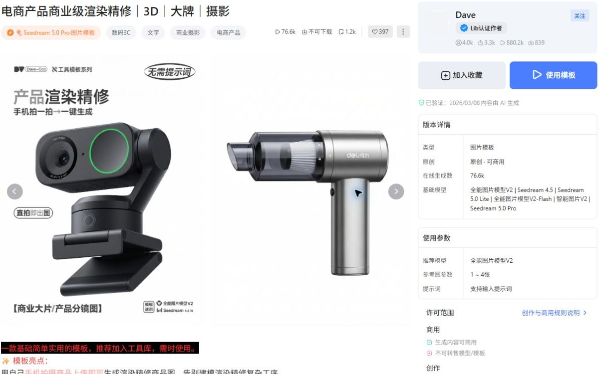
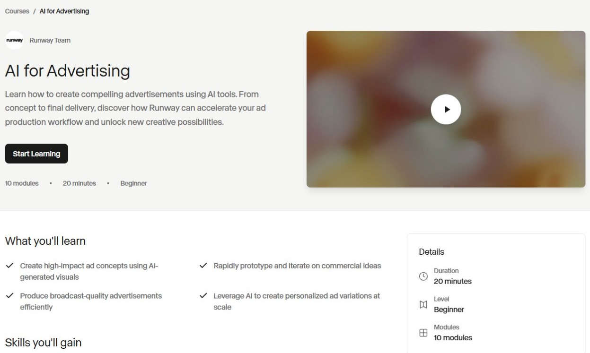

# AI社区竞品调研报告

资料截至2026-09-10；汇报版2026-09-11。

- 同一张效果图可能对应作品参考、套用表单或源流程，详情字段和使用按钮应随实际交付变化。
- 18个样本中15家有平台执行能力资料；工具支持常见，但不能据此认定社区收入来源或用户回访原因。
- 合作计划、开放投稿和运营账号不能保证持续产量。制作、编辑、答疑与修订需要分别安排责任和成本。

## 1. 平台分类与参照关系

研究覆盖18个平台及关联产品组，按内容与使用方式分为五类。每类至少选择一个代表，共7家；流程类同时比较资源库与执行平台，学习与讨论类同时比较课程协作与论坛回应。

### 全部平台分类

| 参照用途 | 平台 | 比较的问题 |
| --- | --- | --- |
| 流程与资源复用 | LiblibAI、RunningHub、吐司 / Tensor.Art、Civitai、SeaArt | 作品到模型、工作流或应用的连接；输入、依赖、版本和使用条件；资源更新、问题回应与收益条件 |
| 创作工具与作品 | OpenArt、即梦 AI、可灵 Kling AI、Midjourney、Leonardo.Ai、Runway | 作品发现与制作入口；参考、参数、项目和再次使用；专业案例、作者合作与订阅条件 |
| 兴趣创作与参与 | NightCafe | 创作题目与投稿入口；评审、回应和结果呈现；活动频率、主持与持续组织工作 |
| 学习与讨论 | WaytoAGI 通往 AGI 之路、Datawhale、LINUX DO | 知识、教材与讨论的组织方式；作者、编辑、领学、答疑和管理分工；反馈修订、成员参与及福利的作用 |
| 开发资源与应用 | Hugging Face、魔搭 ModelScope、Dify 社区 | 资源说明与试用入口；配置、依赖、导入和部署条件；版本协作、问题处理与运行成本 |

### 7个代表平台

| 分类 | 代表平台 | 选择理由 | 任务与内容 | 使用路径 |
| --- | --- | --- | --- | --- |
| 流程与资源复用 | LiblibAI | 同时呈现效果模板、模型和工作流，适合比较内容如何接到在线使用。 | 商品精修与背景替换案例要求用户准备商品图、背景图并处理遮罩，再按所选模型运行。案例说明一种具体制作任务；现有材料不足以确定这类任务占全站使用的比例。 首页图片模型栏目以效果封面、任务标题和模型标签组织卡片；模板详情补充参考图数量、推荐模型、示例与许可。较复杂的工作流另展示输入要求、模块说明和版本差异。 | 从效果卡片进入详情，判断所需素材、模型和许可，再使用模板或工作流。商品精修样例有从SDXL到FLUX的版本链接；是否能将自己的素材稳定复现，仍需实际运行检验。 |
| 流程与资源复用 | RunningHub | 同一方法可作为应用或节点工作流使用，且公开作者激励与执行计费规则。 | 虚拟试衣与商品替换样例让用户提供人物或场景图、商品图及修改说明。另一类任务是将已有ComfyUI流程搬到云端，处理缺失模型或节点后继续运行，技术要求有所不同。 首页按电商等任务组织内容，卡片先展示效果、标题与作者。工作流详情提供原图对照、更新时间和说明，并列应用与工作流入口；封装应用的详情另显示计费提示和运行入口。 | 用户先按任务找效果，从详情选择直接填写应用输入，或打开工作流检查节点。前者减少需要理解的设置，后者保留修改方法的入口；下载流程仍可能需要补齐模型与节点依赖。 |
| 创作工具与作品 | Runway | 公开案例和课程之外，还有项目与工作区内复用，可区分展示和制作。 | Miro活动视频案例涉及为不同场地制作镜头、适配投影尺寸及多个市场。任务包含生成、筛选和后续制作，不能将一次生成等同于成片，也不能把官方精选客户视为典型用户。 公开案例讲任务背景和制作过程；课程卡片先列学习目标、模块数与难度，详情展开技能和学习入口。工作区内的App和Projects则承载输入配置、会话、流程与素材。 | 案例和课程帮助读者理解用途，进入工具后再组织生成与修改。工作区成员可按权限使用封装的App，或在项目中继续处理会话和资产；公开浏览与内部项目使用是不同路径。 |
| 兴趣创作与参与 | NightCafe | 作品生成与挑战、主持、评审相连，能观察兴趣参与如何形成内容供给。 | 参与者按主题创作图片、提交挑战并评审他人作品；Promptle要求逐步修改图片以接近目标。公开作者访谈还出现主持和分享方法的活动，不能由此推定全部用户的参与方式。 作品条目承载参赛图片与评审结果，挑战详情说明主题、模型限制和时段。Promptle成绩卡展示起点、目标、结果和得分；提示步骤需参与者同意，并在题目结束后开放。 | 成员游戏默认凭链接加入，公开聊天室游戏可从发现入口进入。参与者按题面准备作品，经历投稿、评审和结果阶段；每日题目有更新节奏，但现有资料没有实际完成率。 |
| 学习与讨论 | Datawhale | 以课程、练习和协作维护承载内容，提供生成工具社区之外的比较对象。 | 公开问题包括运行RAG课程时的鉴权、模型版本、Windows环境及中文检索故障。学习者要把示例跑通并理解修改方法；这些具体障碍不能用于推断其职业或学习完成比例。 课程以讲义、Notebook、录播和文本整理承载过程，练习另有作业入口与完成记录。提问指南要求环境、完整错误和尝试结果；现有材料不支持把所有课程概括为统一首页卡片。 | 从课程仓库进入章节材料，配置环境后编码练习，按要求提交作业或学习记录；遇到障碍时补充环境和报错再提问。阶段共学结束后仍可自学，答疑资源是否延续要另看安排。 |
| 学习与讨论 | LINUX DO | 讨论、答疑和持续维护帖子是主要承载方式，商业入口与普通参与分开。 | 具体讨论涉及API首字延迟、应用接入失败、提示词修改与效果回传。接入问题中可见答案标记及提问者确认；这些记录支持问题确实被提出，不等于已独立复现解决办法。 首页按最新、未读和热门等入口组织话题行，显示标题、分类、回复和最近活动。详情用首帖、楼层引用与时间轴展开；可长期维护的Wiki帖还保留更新与编辑历史。 | 读者从分类或话题列表定位问题，阅读背景和楼层中的补充，再沿引用查公告或方法。已解决标记、收藏和通知选项支持继续跟进；是否实际收到通知、是否反复回来尚未核验。 |
| 开发资源与应用 | Hugging Face | 模型、数据、专题集合与在线应用在同一平台相连，适合比较开发资源如何被发现、使用和持续维护。 | 使用者寻找模型与数据，或直接打开他人部署的演示；作者则要把应用交给访客并维护环境。公开试衣和额度讨论说明两类任务存在，组织采购画像主要来自官方产品说明。 模型卡交代用途、限制和许可，Collection按主题关联资源，Space直接承载应用。H3 Arena卡片展示用途和运行状态，详情有应用、Files与Community入口，各自承载不同材料。 | 用户可从任务目录或专题进入资源，查看说明后试用应用或按条件复制。公开应用与源码开放是两种权限；复制后仍需准备私有凭证、模型权限、算力和依赖，不能只带走展示画面。 |

| 平台 | 供给 | 工具关系 | 收费对象 |
| --- | --- | --- | --- |
| LiblibAI | 作者发布方法、更新版本并邀请返图反馈，平台提供展示和运行入口。特定会员工作流计划另约定授权、推广和收益分配；没有证据表明全部作者均受该计划约束或持续供稿。 | 平台提供模型与工作流的云端使用入口，并另设API服务。方法由作者编排，底层模型与依赖各有条件；使用平台工具不自动取得所有相关素材和模型的商业使用权。 | 付款对象包括个人生成会员、工作流许可和API服务，付款方可分别是使用者、资源购买者或接入方。现有协议与邀请奖励确认收费安排，未披露各项实际收入和付费人数。 |
| RunningHub | 作者上传应用和工作流、解释输入并更新方法，平台组织任务专区与推荐。公开激励规则将有效运行、收藏和原创性纳入奖励；刷量判定、实际结算及持续供给规模尚未取得。 | 平台提供ComfyUI云端执行及API接入，作者负责流程编排与依赖说明。公开求助记录显示有人仍需自行排查模型和输入节点；云端托管没有消除全部配置与结果整理工作。 | 个人为运行资源或会员权益付费，接入方为API执行付费。工作流计算时长与标准模型按图片、秒或次数计费分别定价；2026-09-09读取的价格规则不能用于计算实际收入。 |
| Runway | 官方选择客户案例并组织创作伙伴与推荐合作，创作者自行探索与发布。App维护者回到源流程更新方法，项目成员管理素材；创作伙伴计划没有固定供稿时间或创作量承诺。 | 自营制作工具、项目管理和API是产品的一部分，工作流可封装为简化操作界面。Projects在成员范围内共享，外部默认私有；公开案例并不附带完整、可复制的客户项目文件。 | 个人按订阅及额度使用制作能力，企业方案另行商议，开发者按API用量付费。2026-09-09读取的价格页区分这些对象；套餐含量和生成时长都不能直接作为交付价值或收入。 |
| NightCafe | 成员可主持主题游戏并设置规则，其他成员投稿和评审；平台维护每日题目、阶段推进、连续记录及异常票处理。题目、作品和评价分别需要供给，功能存在不代表主持工作已稳定。 | 平台将图像生成与挑战、聊天室和作品管理放在同一产品内。免费与付费额度对应不同模型和队列条件；个人可能继续参与讨论却改用外部工具生成，两类行为不能合并判断。 | 个人可购买PRO方案与生成额度，付费涉及模型范围、速度和作品管理等权益。2026-09-09读取的规则区分Fast与Relax额度；奖励积分不是现金收入，实际付费率未披露。 |
| Datawhale | 公开协作文档分别安排课程入口、作业、直播、教材反馈与学习进度。贡献者整理材料并讨论修订，志愿助教引导排查；岗位说明不能证明当前人数、响应速度和长期维护工时。 | 内容主要通过开源仓库、Notebook和外部模型或计算环境使用。未确认存在与这些课程统一绑定的自营收费生成服务；合作方可提供实践资源，学习者仍需处理环境与依赖。 | 2026年6月的ROCm共学记录确认合作方提供GPU等资源，未取得学员付费、现金赞助或社区收入资料。两期活动均已结束，历史资源支持不能直接折算成当期营业收入。 |
| LINUX DO | 提问者补充条件和结果，回复者给办法，Wiki编辑者维护可积累的说明。社区管理另处理推广规则、邀请与异常刷量；维护依赖多种成员贡献，现有资料没有各角色的持续供给量。 | 站点还提供Connect身份接入和Credit积分服务，模型与API服务可由外部经营者提供。商家推广帖和用户接入讨论不能作为社区自营生成服务或自营中转业务的证据。 | 推广者可为高级推广权限订阅，普通阅读和答疑属于另一种参与关系。2026-09-09登录页显示600美元月价；没有实际购买记录，商家的销售额也不能算作社区收入。 |
| Hugging Face | 资源作者维护说明、文件和依赖，组织成员编排专题，使用者通过讨论或修改请求反馈。已有答疑者发布适配新版Gradio的演示说明；未取得原求助者采用后成功的确认。 | Spaces承载应用运行，Inference Endpoints与Inference Providers提供推理服务，Hub承载模型、数据和版本。应用可由作者开发，平台提供托管与协作；可交互内容仍需要运行和维护资源。 | 收费包括个人订阅、按量计算与存储、组织席位和企业合同，付款方可能是使用者、作者或团队。计费文档区分订阅与计算费用；价格和功能不能换算成收入或付费人数。 |

**LiblibAI**：模板与工作流样例能说明内容结构及使用条件，尚不足以证明跨商品的稳定产出。会员工作流授权协议于2025年9月生效，仅适用于该计划；条款本身不代表作者已有收入。

[电商产品精修+背景替换（SDXL版）V1.0](https://www.liblib.art/modelinfo/6f92484476484efeb7bd5a0db113cbc0)；[电商产品精修+背景替换（FLUX）V2.0](https://www.liblib.art/modelinfo/7b89bfd25f7f418b82381e893a85c789?from=feed&versionUuid=791ecaae74b44c00a1b4423128084c10)；[LiblibAI创作图片商业使用规范](https://www.liblib.art/activities/e0aa50f25b874722ac60be71adb8c9cb/Commercial_Guidelines)；[会员工作流授权许可协议](https://www.liblib.art/activities/dd75ccf1b2674157ba11be35cb6a4a89/Original_ComfyUI_License_Agreement)；[经验教学与免费体验入口](https://insight.liblib.art/teaching)；[会员邀请奖励规则](https://insight.liblib.art/membershipInvitationBonus)；[API开放平台服务条款](https://www.liblib.art/activities/API-Service-Agreement)

**RunningHub**：应用表单和工作流双入口已有页面证据，完整生成效果并未逐项验证。公开求助包含已运行者与仅在选平台的人；不能合并计算用户数，也不能据奖励规则推断留存效果。

[RunningHub任务专区首页](https://www.runninghub.cn/)；[Google图像工作流示例](https://www.runninghub.cn/post/2028347928716251138)；[Klein虚拟试衣与商品局部替换](https://www.runninghub.cn/post/2074049801244917760)；[创作者奖励规则](https://www.runninghub.cn/creator-reward)；[help me use runninghub for workflow so confused — Discussion #176](https://huggingface.co/RuneXX/LTX-2.3-Workflows/discussions/176)；[Is runninghub best for running comfui on cloud](https://www.reddit.com/r/comfyui/comments/1qh57f2/is_runninghub_best_for_running_comfui_on_cloud/)；[RunningHub AI Apps 官方使用指南](https://www.runninghub.cn/blog/ai-prompts-use-cases/runninghub-ai-apps-guide)；[企业级共享API计费页面](https://www.runninghub.cn/enterprise-api/sharedApi)；[标准模型API目录](https://www.runninghub.cn/call-api/search-api/standard-model)

**Runway**：客户访谈提供了具体用途，仍缺完整项目、成本和独立结果核验。App文档确认工作区内封装与权限，未确认全站公开模板交易；现有资料也没有项目留存或客户净收益数据。

[How Miro Produced Its Keynote Video for Four Global Markets with Runway](https://runway.com/news/customers/miro)；[Publishing Workflows as Apps](https://help.runwayml.com/hc/en-us/articles/47865876793747-Publishing-Workflows-as-Apps)；[Introduction to Projects](https://help.runwayml.com/hc/en-us/articles/52913050653203-Introduction-to-Projects)；[Creative Partners Program](https://runway.com/creative-partners-program)；[Apply to the Runway Affiliate Program](https://runway.com/affiliate-program)；[Runway Pricing](https://runway.com/pricing)；[API Pricing & Costs](https://docs.dev.runwayml.com/guides/pricing/)

**NightCafe**：挑战与Promptle主要依据官方规则，尚未完整实操。作者访谈是精选个案，外部工具迁移经历发生于2023年；现有材料不能判断奖励带来的净增活跃或今天的用户分布。

[Creating a Game (Community Challenge)](https://help.nightcafe.studio/portal/en/kb/articles/creating-a-game-community-challenge)；[Promptle: The Daily AI Art Puzzle](https://help.nightcafe.studio/portal/en/kb/articles/promptle-daily-ai-art-puzzle)；[Daily Challenge: Eligibility, Rating & Ranking](https://help.nightcafe.studio/portal/en/kb/articles/daily-challenge-eligibility-rating-ranking)；[Streaks & Badges](https://help.nightcafe.studio/portal/en/kb/articles/streaks-and-badges)；[The rider](https://www.reddit.com/r/aiArt/comments/172lvb0/)；[NightCafe Artist Spotlight: Inside gullyDJ's Weird World](https://nightcafe.studio/blogs/blog/nightcafe-artist-spotlight-gullydj)；[NightCafe PRO plans — what you get and which plan to choose](https://help.nightcafe.studio/portal/en/kb/articles/nightcafe-pro-plans)；[Fast Credits vs Relax Credits](https://help.nightcafe.studio/portal/en/kb/articles/fast-credits-vs-relax-credits)

**Datawhale**：作业要求与公开求助能说明课程如何被使用，尚缺报名到完成、再次参加的去重人数。部分课程协作页未标更新日期；旧课程入口可访问，不代表目前仍配有相同助教和资源。

[课本编写与反馈收集](https://datawhalechina.github.io/learn-python-the-smart-way-v2/Contribute/contribute_detail/textbook_and_feedback/)；[组队学习规则](https://datawhalechina.github.io/learn-python-the-smart-way-v2/Schedule/team_learning/)；[作业发布与验证](https://datawhalechina.github.io/learn-python-the-smart-way-v2/Contribute/contribute_detail/homework/)；[How to Ask Questions](https://datawhalechina.github.io/learn-python-the-smart-way-v2/Question/question/)；[团队协作工作流](https://datawhalechina.github.io/learn-python-the-smart-way-v2/Contribute/workflows/)；[hello-rocm 组队学习入口（官方原文）](https://raw.githubusercontent.com/datawhalechina/hello-rocm/master/docs/zh/learning/index.md)；[all-in-rag课程仓库](https://github.com/datawhalechina/all-in-rag)；[第一节执行示例报错 #125](https://github.com/datawhalechina/all-in-rag/issues/125)；[KIMI API失效 #121](https://github.com/datawhalechina/all-in-rag/issues/121)；[Windows激活环境问题 #105](https://github.com/datawhalechina/all-in-rag/issues/105)；[BM25检索中文分块问题 #102](https://github.com/datawhalechina/all-in-rag/issues/102)；[Datawhale 官方介绍与大事记](https://www.datawhale.cn/static/about/index.html)；[Datawhale GitHub 组织](https://github.com/datawhalechina)；[Datawhale 组织治理](https://github.com/datawhalechina/whale-governance)

**LINUX DO**：已登录采集首页与若干话题，能确认信息组织及互动实例，但样本按主题选择。已解决标记不代表全站解决率；推广准入与处置规则也不足以保证站外服务质量或估算订阅收入。

[LINUX DO 登录首页](https://linux.do/)；[工具首字延迟求助](https://linux.do/t/topic/2880961)；[关于应用接入的问题请教佬友](https://linux.do/t/topic/1537782)；[壁纸提示词与结果回传](https://linux.do/t/topic/2879086)；[盘点 L 站的徽章：长期更新](https://linux.do/t/topic/342888)；[秘密花园园丁邀请函](https://linux.do/t/topic/847468)；[别刷了，别刷了，服务器顶不住了](https://linux.do/t/topic/1409175)；[LINUX DO Connect 文档](https://wiki.linux.do/Community/LinuxDoConnect)；[LINUX DO Credit 使用指南](https://credit.linux.do/docs/how-to-use)；[新推广方式：开源推广](https://linux.do/t/topic/1776670)；[LINUX DO 社区细则](https://linux.do/guidelines)；[LINUX DO 订阅入口](https://linux.do/s)；[封禁两例公益站违规](https://linux.do/t/topic/2587473)

**Hugging Face**：H3 Arena截图仅记录播放前界面，未运行、投票或检查文件。2025—2026年问题帖含受阻、替代版本和个别恢复自述，不能估算故障率或留存；企业采购与持续成功使用的资料仍不足。

[Model Cards](https://huggingface.co/docs/hub/model-cards)；[Spaces Overview](https://huggingface.co/docs/hub/spaces-overview)；[Collections](https://huggingface.co/docs/hub/collections)；[Pull Requests and Discussions](https://huggingface.co/docs/hub/repositories-pull-requests-discussions)；[NeoMME Collection](https://huggingface.co/collections/Hcompany/neomme)；[Spaces：Image Classification目录](https://huggingface.co/spaces?filter=image-classification)；[Pro Account – ZeroGPU Not Working Despite Subscription](https://discuss.huggingface.co/t/pro-account-zerogpu-not-working-despite-subscription/168446)；[PRO订阅后ZeroGPU配额问题](https://discuss.huggingface.co/t/pro-plan-issue-zerogpu-quota-not-updated-after-subscription/168001)；[充值后仍超过PRO GPU额度](https://discuss.huggingface.co/t/getting-you-have-exceeded-your-pro-gpu-quota-error-even-with-credits-loaded/174850)；[公开Demo访问与本地替代](https://discuss.huggingface.co/t/pro-account-getting-gpu-quota-exceeded-when-calling-for-hf-provided-url/154104)；[同主题：提供适配Gradio 5的演示](https://discuss.huggingface.co/t/pro-account-zerogpu-not-working-despite-subscription/168446/6)；[Hugging Face Pricing](https://huggingface.co/pricing)；[Hugging Face Billing](https://huggingface.co/docs/hub/billing)；[Team & Enterprise Plans](https://huggingface.co/enterprise)

吐司与Tensor.Art作为一个关联产品组，两站规则、权益与实操结果分别记录。分类用于确定比较问题，不代表行业份额或平台优劣。

[18个平台对照](attachments/research-brief.json) · [内容与工具关系](attachments/research-framework.md)

## 2. 用户需求与产品价值

这些平台承接视觉制作、代码学习、内容欣赏和问题求助等不同需求，产品能力应与具体任务及剩余工作对应。

### 连续视觉创作需要角色、镜头和跨工具制作支持，单次生成成功不足以满足整项任务。

OpenArt的公开用户记录涉及连续角色、音乐视频及跨镜头制作。平台提供生成和角色能力后，用户仍需学习镜头语言、筛选片段并完成部分外部编辑；继续使用与满意、续费应分别判断。

- **OpenArt**：OpenArt一名公开用户自述为9支专辑MV购买年费，起初因文件管理、教程和角色短镜头受阻，后来学习影视术语并将项目推进约一半。其他记录涉及外部参考图、口型片段和跨工具剪辑。

依据：用户自述及同账号前后记录；付款、项目进度和成片质量未独立核验。

[OpenArt使用经历讨论：专辑MV及后续反馈](https://www.reddit.com/r/generativeAI/comments/1ng7d42/)；[Suno发行者讨论中的OpenArt视觉制作步骤](https://www.reddit.com/r/SunoAI/comments/1u1kork/to_those_distributing_suno_tracks_to_spotifyapple/)

### 课程学习涉及环境配置、运行排错和结果检查。

Datawhale的课程与问题记录显示，学习者会实际运行教材并反馈环境、调用和检索问题。课程、勘误与答疑共同支持学习，但现有样本尚不能判断结课率、独立应用能力或职业分布。

- **Datawhale**：Datawhale的all-in-rag样本有5位不同发帖者，涉及授权配置、模型调用、环境及检索问题。其中一人展示中文BM25检索修正前后对照，说明运行结束后仍需核查结果是否符合任务。

依据：课程资料及公开问题记录；局部改善为提交者自述，未独立复现，不代表结课或就业成果。

[all-in-rag课程仓库](https://github.com/datawhalechina/all-in-rag)；[第一节执行示例报错 #125](https://github.com/datawhalechina/all-in-rag/issues/125)；[KIMI API失效 #121](https://github.com/datawhalechina/all-in-rag/issues/121)；[BM25检索中文分块问题 #102](https://github.com/datawhalechina/all-in-rag/issues/102)；[Windows激活环境问题 #105](https://github.com/datawhalechina/all-in-rag/issues/105)；[学习反馈 #91](https://github.com/datawhalechina/all-in-rag/issues/91)

55条任务画像中，49条不足5个可区分用户观察点，18条暂无直接用户点。用户自述、官方目标和研究者实操各自记录，群体占比未知。

[完整用户画像与产品价值](attachments/audience-research.md) · [全国用户规模与分层](attachments/china-ai-users.md)

## 3. 内容发现与使用路径

内容形式的差别，主要体现在用户进入详情后能取得什么。视觉卡片可能只提供参考，也可能交付输入表单或完整流程；课程解释操作与判断，运行文件则传递配置；挑战组织同题创作，讨论围绕具体问题补齐条件。多元拾光可共用发布和关联能力，但卡片字段、详情顺序与后续动作应分别设计。

### 效果卡片之后：看作品、套模板、改流程

Liblib模板从效果封面进入输入要求与使用入口；RunningHub换背景详情进一步列出模型、参数和节点，并将应用与完整工作流分开。Tensor.Art的商品例图则停在作品展示，详情明确没有生成数据。三者入口都可以是图片，交付深度却不同。

**LiblibAI：电商产品精修模板**：模板卡片展示效果、任务标题和模板/底模标签；对应详情列1—4张参考图、提示词支持、推荐模型和使用入口。配对截图确认卡片与同一资源详情的关系、输入字段及入口，未进入生成；正文、许可区与作者评论的商用表述存在冲突。

[电商产品商业级渲染精修模板](https://www.liblib.art/modelinfo/b3c0dc71aabb4496af0d178bfa347bc8)

**RunningHub：一键换背景工作流**：商品效果卡片进入换背景详情后，可看到原图与效果、作者说明，以及打开AI应用、运行工作流和下载入口；已读正文另列模型、采样参数和60项节点信息。配对截图证明入口分流和部分详情结构，不能证明节点已经检查或现在仍能运行；资源标注2024年更新。

[一键换背景：产品图摄影](https://www.runninghub.ai/zh-cn/post/1845758651062743041)

**Tensor.Art：MooMooE-commerce商品例图**：模型页的蓝色瓶子例图进入单图详情后，页面提示没有生成数据。截图证明例图与对应详情的关系，以及该图片未提供生成参数；模型页仍有运行入口，但不能据此补出这张图的提示词或种子。此例来自国际站，不能外推国内吐司或全站作品。

[MooMooE-commerce V1](https://tensor.art/models/662744072865292090)

分析：画面能让用户快速判断是否接近目标，详情再承担执行条件的判断。只想换素材的人需要输入表单和输出示例；要调整方法的人需要模型、节点和参数；来找审美参考的人未必需要流程。差异应由详情材料和按钮表达，不能仅靠封面或“同款”标签区分。

没有过程材料的作品仍可供欣赏和参考，不必全部改造成教程。相反，RunningHub样本即使列出了模型、节点和运行入口，也仍是较早资源，现时依赖与输出尚未验证。因此应分别说明“有方法材料”与“在什么条件下验证可用”。

多元拾光可借鉴：保留同一套图片或视频预览，但在详情分别提供“作品参考”“可直接套用”“完整画布”三种交付。作品页展示完整成品和关联方法；套用页列输入、可改项和结果示例；画布页提供流程、依赖、版本及说明。只有实际有材料的入口才显示相应动作。

需要承担的工作：投稿时核对作者实际交付的层次，建立作品、模板与源画布的关联。模板需有可分享输入、输出对照和失败说明；源画布需确认复制范围、依赖及许可。效果封面可以共用，不能用它代替交付验收。

仍需确认：用同一组商品素材完成“直接套用”与“修改画布”两条路径，记录补素材、改参数、求助和最终验收。如果普通用户仍需频繁打开源画布才能完成任务，就需要调整简化表单及内容说明，而不宜宣称套用入口已降低门槛。

### 教程解释判断，运行材料传递操作

Runway课程先说明目标、难度和章节，课程按制作顺序编排内容；Datawhale具体章节将初始提示、输出与修订放在一起，并提供代码学习材料。RunningHub工作流把已有处理过程作为资源交付，使用者可转入应用或检查节点。课程与文件可以关联，但承担的任务不同。

**Runway Academy：分章制作课程**：Building Custom Workflows公开概览列学习目标、难度、总时长和三个带时长章节，说明学习范围与顺序。现有配对截图来自另一门AI for Advertising课程，确认课程卡片的10模块、Beginner、免费入学等字段及对应详情，不能当作工作流课程的截图。广告课程总时长与模块合计不一致；两门课都未完整学习或验证效果。

[Building Custom Workflows](https://academy.runwayml.com/course/custom-workflows)

**Datawhale：迭代讲解与练习材料**：LLM Cookbook的迭代优化章节保留任务、初始提示、输出和修改过程，项目支持在线阅读、PDF与Notebook等材料；Python课程另将实际编码和作业记录用于参与检查。这里没有配对截图，依据已读章节与课程规则；未执行代码，也不能把规则要求当成所有学员已经完成。

[LLM Cookbook项目说明](https://github.com/datawhalechina/llm-cookbook)；[第三章：迭代优化](https://github.com/datawhalechina/llm-cookbook/blob/main/docs/C1/3.%20%E8%BF%AD%E4%BB%A3%E4%BC%98%E5%8C%96%20Iterative.md)；[组队学习规则](https://datawhalechina.github.io/learn-python-the-smart-way-v2/Schedule/team_learning/)；[课本编写与反馈收集](https://datawhalechina.github.io/learn-python-the-smart-way-v2/Contribute/contribute_detail/textbook_and_feedback/)

**RunningHub：配置与应用双入口**：换背景资源详情给出模型、参数和节点清单，并将“打开AI应用”与“运行工作流”并列。它能帮助有准备的使用者从说明进入执行；截图只证明两类入口存在，下载文件、依赖和实际输出尚未验证。本处复用同一组换背景截图，不计作第二个独立样本。

[一键换背景：产品图摄影](https://www.runninghub.ai/zh-cn/post/1845758651062743041)

**Hugging Face：运行界面与源码权限**：Spaces文档区分公开、受保护和私有范围，受保护Space可以公开使用但不公开源码。现有H3 Acceleration Arena配对截图显示应用卡片进入视频对照界面，并保留App、Files、Community入口；没有打开Files、播放或投票，不能用该截图判断这一个应用的源码权限或运行成功。

[Spaces Overview](https://huggingface.co/docs/hub/spaces-overview)

分析：课程按学习依赖组织，让读者理解先做什么、为什么调整；运行材料按执行依赖组织，让使用者判断缺什么、可改什么。面对陌生任务，照着流程运行未必能学会处理偏差；已有经验的人也未必愿意为一次操作完整学课。两类入口应能互相转入，而不应把下载文件当作教学已经完成。

两类形式不是互斥：Datawhale教程可以附Notebook，运行资源也可以附教学。Hugging Face的Spaces文档还区分公开、受保护和私有范围，能公开使用的演示不一定开放源码，因此“能运行”也不能直接写成“可取得完整方法”。

多元拾光可借鉴：针对同一个MakeNow任务，设置两条互相关联的路径：“直接做”提供样例输入、最少参数、输出检查与失败入口；“学做法”按准备、关键修改、结果对照和人工处理分节，并附对应画布。先完善具体任务页，不必先建设多门课程。

需要承担的工作：同一作者需保留输入、尝试、修改理由和对照输出；编辑将教学步骤对应到画布版本。必须有人能回答为何失败、何时需要人工修正。可运行材料与讲解需保持一致；课程文件复制不附带助教服务。

仍需确认：在同一任务下观察新手与有经验者的首选路径、完成时间、主要错误和返回教程的位置。若两组都主要卡在素材准备或结果判断，优先补这些说明；只有出现连续学习需要，再考虑课程化。

### 作品挑战组织同题创作，问题帖组织连续回应

NightCafe挑战由题目、资格、提交阶段、评审和结果构成，多个参与者围绕同一题目产出作品。LINUX DO问题帖从个人困扰开始，经回复逐步补充环境、尝试和结果；后来者阅读的是处理记录，不是同一题目的作品排行。

**NightCafe：挑战题面与赛后材料**：社区挑战规则规定主题、公开范围、阶段和评分/排序方式。Promptle另提供起始图、目标图、有限步数与成绩卡；提示步骤默认不公开，须作者同意，并在当天题目结束后展示。成绩卡不是完整制作过程，Promptle仍标Alpha。本例无配对截图，依据官方规则；没有亲自参赛、评分或验证持续参与效果。

[Community Challenges on NightCafe](https://help.nightcafe.studio/portal/en/kb/articles/community-challenges)；[Daily Challenge: Eligibility, Rating & Ranking](https://help.nightcafe.studio/portal/en/kb/articles/daily-challenge-eligibility-rating-ranking)；[Creating a Game (Community Challenge)](https://help.nightcafe.studio/portal/en/kb/articles/creating-a-game-community-challenge)；[Promptle: The Daily AI Art Puzzle](https://help.nightcafe.studio/portal/en/kb/articles/promptle-daily-ai-art-puzzle)

**LINUX DO：问题、追问与处理结果**：知识库管理话题的配对截图显示，列表以标题、分类和最近活动组织，详情保留问题背景、已考虑的方法及楼层回复；它只覆盖首屏，不能证明问题已解决。另一个NEWAPI接入问题样本在登录核对中可见首帖采纳摘要、回复追问与提问者自报解决，两条话题不能混为同一个案例，也没有独立复现该解法。

[AI时代大家是怎么管理自己的知识库的？](https://linux.do/t/topic/2868771)；[关于应用接入的问题请教佬友](https://linux.do/t/topic/1537782)；[壁纸提示词与结果回传](https://linux.do/t/topic/2879086)

分析：挑战需要统一题面和评审条件，才能让作品被比较，作品卡应突出题目、阶段和结果。问题讨论开始时可能连问题条件都不完整，列表应突出问题标题和进展，详情保留引用、追问和作者反馈。两者的“参与”不能混为同一种价值：投票主要表达偏好，排查回复需要解释适用条件。

作品与讨论可以交叉。LINUX DO也有提示词帖子，成员通过回复上传自己的图片；它保留在同一话题中，没有统一运行环境或核验每张图是否使用首帖方法。NightCafe赛后公开步骤则能补充学习内容。因此可以共享评论与材料关联能力，不能把所有返图都算复现成功，也不能把所有讨论都改成竞赛。

多元拾光可借鉴：若提供练习与问题讨论，分别组织：作品练习页包含题目、输入素材、限制、提交示例和反馈；问题页包含目标、环境/版本、失败表现、已尝试办法及后续结果。作品可关联练习，问题可关联具体画布；采纳与点评各自标明作用。平台维护账号的投稿、回答和自然用户行为分开记录。

需要承担的工作：练习需有人出题、检查素材并给具体点评；问题区需有人核对技术条件、追问结果，再整理可复用说明。表单可共用附件与引用功能，列表字段、反馈类型与结果状态分别处理。尚无主持或答疑能力时，应缩小主题范围。

仍需确认：对同一批内容分别记录自主交作品、有效点评、问题补充、作者反馈及后续再次使用；区分平台账号与外部用户。如果参与主要由平台自问自答或奖励驱动，就不足以支持自然讨论或日常挑战的供给假设。

### 页面示例：LiblibAI · 电商产品商业级渲染精修

截图日期：2026-09-09。

[来源页面](https://www.liblib.art/)

[来源页面](https://www.liblib.art/modelinfo/b3c0dc71aabb4496af0d178bfa347bc8)

正文的用途声明与右侧可商用标签存在冲突，作者评论又表示可以商用；需向平台或作者确认，不能从标题或单个标签得出许可结论。角度、文字一致性限制来自作者答复，未独立测试。

### 页面示例：RunningHub · 一键换背景：产品图摄影

截图日期：2026-09-09。

[来源页面](https://www.runninghub.ai/zh-cn/page-workflow)

[来源页面](https://www.runninghub.ai/zh-cn/post/1845758651062743041)

详情显示2024年更新，属于较早资源；参数齐全不能证明现在仍可运行。封面、运行量和作者的效率描述均不作成功率证据。

### 页面示例：吐司 / Tensor.Art · MooMooE-commerce 的商品例图

截图日期：2026-09-09。

[来源页面](https://tensor.art/models/662744072865292090/MooMooE-commerce-V1)

[来源页面](https://tensor.art/images/662742037059162229?model_id=662744072865292090)

这是Tensor.Art站点的两个相邻历史例图中的一个；邻图也显示无生成数据。不能外推全部作品，更不能当作吐司国内站的统一规则。

### 页面示例：Runway Academy · AI for Advertising

截图日期：2026-09-09。

[来源页面](https://academy.runwayml.com/)

[来源页面](https://academy.runwayml.com/course/ai-advertising)

页面标总时长20分钟，10个模块时长合计36分59秒，存在不一致。免费课程入口不表示生成工具也免费。

### 页面示例：Hugging Face · H3 Acceleration Arena

截图日期：2026-09-09。

[来源页面](https://huggingface.co/spaces)

[来源页面](https://huggingface.co/spaces/multimodalart/h3-acceleration-arena)

Running状态只能说明页面当时报告的运行状态。页面的投票数属于该应用自述，不是Hugging Face平台活跃用户数，也未独立核验。

### 页面示例：LINUX DO · AI时代大家是怎么管理自己的知识库的？

截图日期：2026-09-09。

[来源页面](https://linux.do/)

[来源页面](https://linux.do/t/topic/2868771)

这是具体问题的公开讨论样本，不能代表用户群总体需求。浏览量不是人数，回复数不是解决率；截图是首屏，未读完全部讨论。

部分证据来自官方说明或较早的公开作品。入口存在与完整运行成功分别判断，不能按截图给平台的使用效果排名。

[内容形态与卡片、详情截图](attachments/content-forms.md) · [普通内容与任务样本](attachments/content-research.json)

## 4. 内容供给与运营机制

平台编选、合作作者与成员贡献承担不同工作，现有案例中都能看到发布之后的组织、答疑或修订。多元拾光当前按平台长期供给核算，合作作者可补充制作能力，自发贡献需要实际出现后再计入。作品数量、运营账号数量和合作计划不能代替可用内容、独立作者与持续产能。

### 编选、合作与成员贡献需要不同的交付约定

Runway提供作品频道和策选合作机会；NightCafe允许成员主持挑战；LINUX DO可见投稿、成员整理和管理者精选。这些做法分别增加可见度、工具使用机会或参与空间，未必附带固定稿量和维护时限。

**Runway**：After Light作品页呈现影片、署名与返回TV入口，体现编选和展示。Creative Partners Program提供工具权益、早期访问与合作机会，并明确不要求特定时间或创作投入，因此不能按入选作者数推定稳定供稿。

[Runway Watch — After Light](https://watch.runwayml.com/after-light)；[Creative Partners Program](https://runway.com/creative-partners-program)

**NightCafe**：成员挑战由主持人设主题、资格与阶段，参与者投稿和评审；公开聊天室的游戏可进入发现入口。平台提供功能，选题、聚集参与者和解释评审仍是具体组织工作。

[Creating a Game (Community Challenge)](https://help.nightcafe.studio/portal/en/kb/articles/creating-a-game-community-challenge)；[Daily Challenge: Eligibility, Rating & Ranking](https://help.nightcafe.studio/portal/en/kb/articles/daily-challenge-eligibility-rating-ranking)

**LINUX DO**：公开邀请函鼓励作者提供完整内容、为社区读者改写介绍，并由成员协助整理、管理者精选。登录样本可见提问者回传结果、回复者提供依据和Wiki修订，参与者补充的材料不同。

[秘密花园园丁邀请函](https://linux.do/t/topic/847468)；[关于应用接入的问题请教佬友](https://linux.do/t/topic/1537782)；[盘点 L 站的徽章：长期更新](https://linux.do/t/topic/342888)

分析：供给不能仅按“官方”或“UGC”二分。作品可以由外部作者制作、平台编选，再由另一人整理过程；活动题目来自成员，规则解释仍需主持；技术答案来自用户，编辑仍要让后续读者找得到。应按实际工作和责任确定合作方式。

开放投稿能增加潜在来源，却不能保证持续有人制作和维护；合作计划中的资源权益也未必包含案例交付。官方编选可以提升可读性，但平台若包办制作、核验、回应与更新，同样会遇到产能限制。

多元拾光可借鉴：平台保证选题、编辑与发布质量；合作内容明确交付结果、过程材料、使用范围和维护期限；成员贡献在实际出现后记录，不列为启动期固定产量。

需要承担的工作：对每份内容指定实际制作与维护者。多账号发布按实际人力核算；如采购作者内容，稿件、素材和后续答疑分别约定，不能将工具额度默认为完整报酬。

仍需确认：目前没有可核的作者履约率、每人稳定稿量、主持人持续参与比例或平台编辑工时。多元拾光也缺少从选题到发布再到更新的完整工时记录，不能据竞品机制估算招聘人数或内容产量。

### 可复用内容需要版本、问题和修订共同维护

LiblibAI资源随模型路线改版，RunningHub作者补充说明与插件适配日志，Datawhale把学习反馈转入教材协作，Hugging Face将运行文件和问题讨论关联到资源仓库。实际维护对象包括输入条件、依赖、教程、旧版本和后续回应，更新封面或发布时间不能完成这些工作。

**LiblibAI**：电商精修V2保留V1关联，并说明模型、模块和配置变化；V1邀请使用者返图与提意见。已见作者维护说明，但未取得完整的返图、修订和用户确认过程。

[电商产品精修+背景替换（SDXL版）V1.0](https://www.liblib.art/modelinfo/6f92484476484efeb7bd5a0db113cbc0)；[电商产品精修+背景替换（FLUX）V2.0](https://www.liblib.art/modelinfo/7b89bfd25f7f418b82381e893a85c789?from=feed&versionUuid=791ecaae74b44c00a1b4423128084c10)

**RunningHub**：资源说明中有作者汇总问题并关联补充教学的做法，另一条长视频工作流保留跨日期插件适配日志。创作者奖励按有效运行、收藏和原创等条件计算；该奖励规则没有证明平台接管作者维护，也未披露维护工时。

[Flux Kontext Dev 模糊变高清及放大修复](https://www.runninghub.cn/post/1938533049359335425/)；[Scail-2 无劣化与长视频手动分段](https://www.runninghub.cn/post/2065490120324767746)；[创作者激励计划](https://www.runninghub.cn/creator-reward)

**Datawhale**：课程协作资料分别列课程入口、作业、直播、教材反馈与学习进度等工作。提问指南要求环境、错误和尝试信息，教材反馈由贡献者与教学团队讨论修订；助教为志愿者，没有即时回复义务。

[团队协作工作流](https://datawhalechina.github.io/learn-python-the-smart-way-v2/Contribute/workflows/)；[How to Ask Questions](https://datawhalechina.github.io/learn-python-the-smart-way-v2/Question/question/)；[课本编写与反馈收集](https://datawhalechina.github.io/learn-python-the-smart-way-v2/Contribute/contribute_detail/textbook_and_feedback/)

**Hugging Face：资源版本与讨论记录**：模型卡记录用途与限制，Space关联运行文件和资源讨论；官方文档允许通过讨论或PR提出修订，代码提交会触发重建。2025-09-23，一位答疑者发布适配Gradio 5的IDM-VTON演示说明，但未取得原求助者复验成功的记录。该记录证明作者提供了新版本，未证明原问题已经解决。

[Model Cards](https://huggingface.co/docs/hub/model-cards)；[Spaces Overview](https://huggingface.co/docs/hub/spaces-overview)；[Pull Requests and Discussions](https://huggingface.co/docs/hub/repositories-pull-requests-discussions)；[Pro Account – ZeroGPU Not Working Despite Subscription](https://discuss.huggingface.co/t/pro-account-zerogpu-not-working-despite-subscription/168446)；[同主题：提供适配Gradio 5的演示](https://discuss.huggingface.co/t/pro-account-zerogpu-not-working-despite-subscription/168446/6)

分析：内容能否继续使用，取决于变化是否被发现、能否找到负责的人，以及修订是否回到用户实际阅读的位置。可运行资源的维护通常更贴近技术支持；教程侧重步骤与错误解释；作品展示主要维护媒体、来源和说明。三类内容不宜采用相同产能假设。

作者写出修复说明或合入修改，仍不等于所有使用者已恢复成功；反过来，某一条讨论未见回复，也不能证明资源永久失效。后续验收应针对具体版本、输入与结果。

多元拾光可借鉴：以少量内容包记录制作、复核、答疑和更新工作；作品、教程与可运行资源分别列出必须维护的材料。出现问题后，修订应回到详情或教程正文，并保留受影响版本和继续使用的条件。

需要承担的工作：每份可复用内容有维护责任、问题入口和停止推荐条件。MakeNow素材显示问题由工具或素材维护者排查；运营负责整理说明与反馈，技术适配需有对应能力的人承担。费用核算包含重试、人工修整与支持时间。

仍需确认：公开资料能够确认维护行为和规则，不能提供平均响应时间、复验通过率、作者失联后的成本或实际利润。自身内容包尚无完整工时与费用，暂不设每周产量和维护人数。

合作规则说明可以约定什么，版本记录说明出现过维护工作；尚不能据此判断作者长期履约率、平台人效或活动带来的留存增量。

[18个平台的运营机制](attachments/platform-operations.md) · [作者与维护记录](attachments/content-research.json)

## 5. 商业化路径与公开规模

18个样本中，15家有平台内创作、开发或运行能力的资料，工具支持是常见条件。但内容的价值不止发生在执行环节：作品帮助判断效果，方法说明帮助选择和上手，讨论承担排错、反馈与交流。多元拾光需要比较哪些环节由MakeNow和API完成，哪些仍值得社区持续投入；已有工具资源尚不能决定社区定位。

| 数据类型 | 可用于比较 | 不能据此得出 |
| --- | --- | --- |
| 网站访问估计 | 同一提供方、同一月份的访问量与行为 | 真实用户数、留存、付费率 |
| 产品收入、ARR | 各自期间或年化口径的经营规模 | 统一收入排名、社区收入占比、利润 |
| 账户、会员与订阅 | 明确地域、期限及权益后的覆盖规模 | 跨平台去重付费人数 |
| 付费问卷 | 相应调查样本的自报经历 | 全国AI付费人数或全国付费率 |

### 工具支持关系

12家提供平台创作执行，3家提供开发与运行能力，共15家有平台执行能力资料。另有1家同品牌关联API、1家外部工具讨论社区和1家学习合作实践组织。

| 执行关系 | 数量 | 平台 |
| --- | --- | --- |
| 平台创作执行 | 12 | LiblibAI、RunningHub、吐司 / Tensor.Art、Civitai、SeaArt、OpenArt、NightCafe、即梦 AI、可灵 Kling AI、Midjourney、Leonardo.Ai、Runway |
| 平台开发与运行 | 3 | Hugging Face、魔搭 ModelScope、Dify 社区 |
| 同品牌关联API | 1 | WaytoAGI 通往 AGI 之路 |
| 讨论与外部工具 | 1 | LINUX DO |
| 学习与合作实践 | 1 | Datawhale |

- 这18家是按研究需要选择的样本，不用于估算中国或全球AI社区的工具化比例。
- 平台有执行能力、执行服务收费、社区促进付款是三个不同问题；15家的计数只回答第一项。
- 图像、视频、GPU时间、应用工作区、许可和会员均可能收费，不能统一称为出售文本Token。
- 平台入口、自研模型、外部供应商和成员资源分别记录；工具收入也不直接等于社区贡献或利润。
- 吐司与Tensor.Art只计1个对象，但站点规则、权益、账户互通和实操结果仍分开。

LiblibAI：[会员与生成权益](https://insight.liblib.art/membershipInvitationBonus)；[原创工作流授权销售协议](https://www.liblib.art/activities/dd75ccf1b2674157ba11be35cb6a4a89/Original_ComfyUI_License_Agreement)；[API服务协议](https://www.liblib.art/activities/API-Service-Agreement)
RunningHub：[共享API计价](https://www.runninghub.cn/enterprise-api/sharedApi)；[创作者奖励规则](https://www.runninghub.cn/creator-reward)；[可运行应用样本](https://www.runninghub.cn/ai-detail/1966722305902718977)
吐司 / Tensor.Art：[吐司创作者激励调整](https://tusi.cn/articles/1000707189326777005)；[Tensor.Art创作者政策调整](https://tensor.art/articles/1021600128873589993)；[吐司Canvas更新](https://tusi.cn/updates)
Civitai：[官方实现文档：生成与引导](https://github.com/civitai/civitai/blob/main/docs/features/guided-tours.md)；[官方实现文档：资源商业化](https://github.com/civitai/civitai/blob/main/docs/features/monetization-rules.md)；[官方实现文档：会员](https://github.com/civitai/civitai/blob/main/docs/features/buzz-memberships.md)
SeaArt：[基础页面与内容类型](https://docs.seaart.ai/guide-1/1-seaart-ai-basic-page)；[模型与Remix](https://docs.seaart.ai/guide-1/2-seaart-ai-basic-function/2-6-models)；[模型训练说明](https://docs.seaart.ai/guide-1/3-advanced-guide/3-2-lora-training-advance/image-training/quick-training-guide)
OpenArt：[当前工作台](https://openart.ai/home)；[价格与权益](https://openart.ai/pricing)；[OpenArtist合作计划](https://openart.ai/program/openartist)；[旧工作流入口（重定向）](https://openart.ai/workflows/home)
NightCafe：[成员挑战规则](https://help.nightcafe.studio/portal/en/kb/articles/community-challenges)；[Evolve与局部修改](https://help.nightcafe.studio/portal/en/kb/articles/inpainting-on-nightcafe)；[PRO方案](https://help.nightcafe.studio/portal/en/kb/articles/nightcafe-pro-plans)
即梦：[官网创作与同款入口](https://jimeng.jianying.com/)；[付费服务协议](https://lf3-cdn-tos.draftstatic.com/obj/ies-hotsoon-draft/dreamina/b966ce40-d931-4397-8def-38fe5d03c729.html)
可灵：[付费条款](https://kling.ai/docs/payment-policy)；[作者专题与工具用途](https://kling.ai/blog/kling-ai-turns-two-in-creators-own-words)
Midjourney：[网页创作](https://docs.midjourney.com/hc/en-us/articles/33390732264589-Creating-on-Web)；[Moodboards](https://docs.midjourney.com/hc/en-us/articles/39193335040013-Moodboards)；[套餐对照](https://docs.midjourney.com/hc/en-us/articles/27870484040333-Comparing-Midjourney-Plans)
Leonardo.Ai：[价格与产品权益](https://www.leonardo.ai/pricing)；[公开作品后续使用](https://intercom.help/leonardo-ai/en/articles/8044018-commercial-usage)；[Blueprints当前能力](https://intercom.help/leonardo-ai/en/articles/12760267-blueprints-by-leonardo-ai)
Runway：[订阅与权益](https://runway.com/pricing)；[Workflow分享与复制](https://help.runwayml.com/hc/en-us/articles/45763528999699-Introduction-to-Workflows)；[Workflow发布为App](https://help.runwayml.com/hc/en-us/articles/47865876793747-Publishing-Workflows-as-Apps)；[API计价](https://docs.dev.runwayml.com/guides/pricing/)；[Runway Academy](https://academy.runwayml.com/)
WaytoAGI：[WayToAGI API文档](https://llm.waytoagi.com/docs)；[WayToAGI AI Websites目录](https://www.waytoagi.com/en/sites?tag=38)；[WaytoAGI知识库与工具首页](https://www.waytoagi.com/zh)
Datawhale：[Datawhale官方GitHub组织](https://github.com/datawhalechina)；[hello-rocm组队学习官方文档](https://raw.githubusercontent.com/datawhalechina/hello-rocm/master/docs/zh/learning/index.md)；[Datawhale组织治理](https://github.com/datawhalechina/whale-governance)
Hugging Face：[Spaces Overview](https://huggingface.co/docs/hub/spaces-overview)；[Billing](https://huggingface.co/docs/hub/billing)；[Pricing](https://huggingface.co/pricing)
ModelScope 魔搭：[魔搭署名的AI开源生态报告](https://www.wicinternet.org/pdf/GlobalValueandPracticalExplorationoftheAIOpenSourceEcosystemUnleashingtheFlywheelEffectandForgingaBornGlobalConsensus.pdf)；[魔搭Notebook功能与实操资源介绍](https://www.modelscope.cn/learn/435254)；[免费模型推理API发布说明](https://community.modelscope.cn/675262372db35d1195183bdb.html)
LINUX DO：[LINUX DO社区细则](https://linux.do/guidelines)；[LINUX DO订阅入口](https://linux.do/s)；[LINUX DO探索地图](https://linux.do/t/topic/1566233?tl=zh_CN)
Dify：[Dify Cloud Pricing](https://dify.ai/pricing/dify-cloud)；[Dify Pricing](https://dify.ai/pricing)；[Dify官方README](https://raw.githubusercontent.com/langgenius/dify/main/README.md)

### 工具内已有内容，社区新增价值取决于交付还缺什么

LiblibAI、RunningHub和Runway都把内容与执行入口连接起来。模型与工作流需要说明版本和依赖；简化应用需要明确可替换的输入；项目分享还受素材和权限范围影响。内容页能启动制作，完整任务仍可能需要选材料、改配置、排错与保存结果。

**LiblibAI**：电商精修资源V2链接V1，说明由SDXL转向FLUX后的输入、配置和模块变化。会员工作流许可协议另规定选入资源的授权销售；运行资格与资源许可需要分别核对。

[电商产品精修+背景替换（SDXL版）V1.0](https://www.liblib.art/modelinfo/6f92484476484efeb7bd5a0db113cbc0)；[电商产品精修+背景替换（FLUX）V2.0](https://www.liblib.art/modelinfo/7b89bfd25f7f418b82381e893a85c789?from=feed&versionUuid=791ecaae74b44c00a1b4423128084c10)；[会员工作流授权许可协议](https://www.liblib.art/activities/dd75ccf1b2674157ba11be35cb6a4a89/Original_ComfyUI_License_Agreement)；[LiblibAI创作图片商业使用规范](https://www.liblib.art/activities/e0aa50f25b874722ac60be71adb8c9cb/Commercial_Guidelines)

**RunningHub**：Klein试衣资源页提供两图输入说明，并列应用和工作流入口。另有公开用户在导入LTX流程后询问采样、节点与模型问题，答疑发生在Hugging Face讨论串。

[Klein虚拟试衣与商品局部替换](https://www.runninghub.cn/post/2074049801244917760)；[help me use runninghub for workflow so confused — Discussion #176](https://huggingface.co/RuneXX/LTX-2.3-Workflows/discussions/176)

**Runway**：官方App文档允许把Workflow封装为简化入口并锁定部分配置，修改需回到源流程，适用范围为工作区成员。Projects用于组织会话、流程与素材；这些能力不能直接视为公开社区模板市场。

[Publishing Workflows as Apps](https://help.runwayml.com/hc/en-us/articles/47865876793747-Publishing-Workflows-as-Apps)；[Introduction to Projects](https://help.runwayml.com/hc/en-us/articles/52913050653203-Introduction-to-Projects)

分析：内容与工具连接得越紧，用户跨站找入口的负担可能越小，但平台也会承担更多可用性和支持工作。多元拾光若复制一份工具已有的效果介绍，新增价值有限；若能帮助用户选对方法、理解前提、找回修订和完成接手，就有可比较的服务内容。这些是待验证的增量，不是已经证明的留存或收入。

并非所有内容都要交付完整流程。作品可以只提供观看和风格参考；工具内项目也可能满足团队继续制作。强制每条内容附带源文件或生成入口，会增加制作与维护成本，也可能妨碍普通阅读。

多元拾光可借鉴：按内容承诺组织材料：作品保留结果与来源，教程给出步骤和检查方法，可复用资源交代输入、依赖、版本与问题入口。优先补足工具使用中缺失的信息和支持，不另建重复的工具介绍库。

需要承担的工作：逐项核清MakeNow已能承接的材料、复制、保存和使用范围。现有一个案例验证了复制与文本保存；原件和副本有图片显示问题，再次生成与完整费用尚未核实。提供运行服务时，还需明确素材失效、节点适配和费用问题由谁处理。

仍需确认：缺少跨入口的完整任务记录，尚不能比较独立社区相对工具内部说明节省了多少步骤、降低了多少失败，或带来多少付费。也缺少相同任务的调用、重试、人工修改与支持成本。

### 执行可以在站外，解释、反馈与参与仍可留在社区

Datawhale把课程、作业与答疑组织起来，实践可在本地或合作环境完成；LINUX DO承接外部工具的接入问题与结果反馈。NightCafe同时提供生成工具与主题活动，历史用户记录中也有将生成转移到其他工具后仍回来参加挑战和聊天的情况。

**Datawhale**：2026年6月ROCm共学资料明确由AMD Radeon Cloud提供免费GPU，Datawhale组织教材、日程、作业与答疑。all-in-rag用户问题涉及环境、API和检索检查，运行与结果检查中仍会发现需要修正的问题。该期活动已结束。

[hello-rocm 组队学习入口（官方原文）](https://raw.githubusercontent.com/datawhalechina/hello-rocm/master/docs/zh/learning/index.md)；[第一节执行示例报错 #125](https://github.com/datawhalechina/all-in-rag/issues/125)；[KIMI API失效 #121](https://github.com/datawhalechina/all-in-rag/issues/121)；[BM25检索中文分块问题 #102](https://github.com/datawhalechina/all-in-rag/issues/102)

**LINUX DO**：接入求助样本保留回复、采纳及提问者确认。Connect提供身份授权，Credit文档另描述服务接入与争议处理；外部工具的交付与收费依赖接入方，未确认论坛统一自营AIGC执行服务。

[LINUX DO Connect 文档](https://wiki.linux.do/Community/LinuxDoConnect)；[LINUX DO Credit 使用指南](https://credit.linux.do/docs/how-to-use)；[应用接入求助与采纳结果](https://linux.do/t/topic/1537782)

**NightCafe**：成员挑战规则提供设题、投稿、评审与结果阶段。2023年的一位用户自述把生成移到Tensor.Art后，仍回NightCafe参加挑战和聊天；2026年的另一组讨论也显示积分参与与生成意愿可能不同。前者为历史个案，不能当作当前普遍行为。

[Creating a Game (Community Challenge)](https://help.nightcafe.studio/portal/en/kb/articles/creating-a-game-community-challenge)；[Daily Challenge: Eligibility, Rating & Ranking](https://help.nightcafe.studio/portal/en/kb/articles/daily-challenge-eligibility-rating-ranking)；[What do you think about the recent update?](https://www.reddit.com/r/nightcafe/comments/1qzw54q/what_do_you_think_about_the_recent_update/)；[The rider](https://www.reddit.com/r/aiArt/comments/172lvb0/)

分析：这三种样本分别把学习进度、问题解决和兴趣参与留在社区。执行地点不足以解释社区价值，用户回到哪里补信息、得到反馈或参加活动更值得观察。对多元拾光而言，API和MakeNow既可作为执行入口，也可服务部分内容；内容的适用范围不必与自营工具完全重合。

站外执行也会分散流程和数据，社区未必能确认用户完成了什么。一个采纳结果或回访自述能够说明价值发生过，无法证明平台总体留存或经营可持续。

多元拾光可借鉴：分别记录内容阅读、练习结果、问题回应、兴趣参与和工具执行。用户领取过积分不应被一律剔除；被奖励的动作与其后的自主使用需要分开。

需要承担的工作：内容要有持续可查的材料，问题要有明确的回应与整理位置。平台组织的发布、回复和测试单列，运营账号不能计作独立贡献者或外部用户需求。外部工具的费用和履约不归入社区自营能力。

仍需确认：缺少这些行为在同一观察期内的持续记录，也缺少内容消费对工具使用、支持成本和收入的增量贡献。现有材料不能给出自营执行与外部执行哪种更优的总体排序。

### 生成能力已有实际收入规模，但不能据产品收入认定收入来自社区。

快手披露，可灵2026年第二季度营业收入超过8.5亿元人民币。这证明产品已有商业收入规模，但个人订阅、团队及API收入份额、社区贡献和产品利润尚未公开。

- **可灵 Kling AI**：快手披露可灵2026年第二季度营业收入超过人民币8.5亿元。个人订阅、团队制作和企业API均有收费入口，但未拆分各入口收入，也未单列社区贡献或可灵毛利。

依据：公司未经审核季度及中期业绩披露；统计对象为可灵产品，不是快手全公司或社区收入。

[快手2026年第二季度及中期未经审核财务业绩](https://ir.kuaishou.com/zh-hans/news-releases/news-release-details/kuaishoukejifabu2026niandierjidujizhongqiweijingshenhecaiwuyeji)

### 社区的付款方可以是商业推广者，普通阅读和讨论不必直接按Token或会员收费。

LINUX DO将普通成员讨论与商家推广采购分开，高级推广已有公开订阅商品。其可确认的是收费路径，论坛收入、付费推广方数量及推广效果仍未知。

- **LINUX DO**：LINUX DO在2026年9月9日的登录记录中提供US$600/月的高级推广订阅；规则将推广权益与普通讨论区分。该入口只确认商品、币种与周期，未验证结算、付款人数及续订。

依据：官方规则及指定日期的登录页面观察，尚无实际交易与财务账目。

[LINUX DO 订阅入口](https://linux.do/s)；[LINUX DO 社区细则](https://linux.do/guidelines)

全国去重AI付费人数仍未知。规模数据保留统计对象、时间、地域和来源性质，不将全球账户、综合会员、月活与访问次数相加。

[各平台商业化与经营规模](attachments/business-data.json) · [公开访问数据](attachments/public-data.json) · [AI付费用户数据](attachments/china-ai-users.md)

## 6. 多元拾光的采用条件

现阶段可提出内容应交代的材料、所需维护工作和行为统计口径；实际负责人、目标人群、工具依赖程度和投入规模仍需结合自身条件比较。

| 可采用的做法 | 需要具备 | 仍需验证 |
| --- | --- | --- |
| 作品卡片呈现结果，教程入口说明学习目标，资源详情列出输入与依赖；同一案例的作品、方法和问题互相关联 | 可持续的选题、编辑与素材来源 | 读者能否区分内容、找到材料和下一步 |
| 为可复用内容附输入、依赖和问题记录 | 作者自检、编辑复核与后续维护责任 | 换素材或账号后能否完成任务 |
| 分别记录阅读、学习、交流、生成与付款 | 明确事件与供给来源，区分运营组织的行为 | 外部用户是否持续使用及自行回访 |
| 比较四种社区方案的共同投入 | MakeNow交付能力、内容工时与预算 | 哪种承诺可以稳定兑现 |

### 工作流、画布与教程若承诺复用，应交付输入要求、依赖和排错记录，而不只提供封面或复制按钮。

多元拾光可按使用目的组织内容：作品展示结果，教程解释过程，工作流与画布附输入、依赖和问题记录。公开案例表明这些环节各有实际工作，分享能力与支持责任应一并评估。

- **RunningHub**：RunningHub公开使用记录中，外部LTX流程仍需调整采样、节点或模型，答疑发生在Hugging Face讨论串；Datawhale课程用户在代码能运行后还检查检索结果。工具执行、方法解释和问题处理分别承担工作。

依据：公开用户自述、讨论过程与课程记录；尚未验证完整项目交付、平均节省时间或支持成本。

[help me use runninghub for workflow so confused — Discussion #176](https://huggingface.co/RuneXX/LTX-2.3-Workflows/discussions/176)；[BM25检索中文分块问题 #102](https://github.com/datawhalechina/all-in-rag/issues/102)；[团队协作工作流](https://datawhalechina.github.io/learn-python-the-smart-way-v2/Contribute/workflows/)

### 内容消费、社区参与、工具生成与付款需要分别判断，奖励用户不必一律筛除，也不应以签到代替任务完成。

竞品记录显示，参与活动、持续生成和解决问题可能是不同使用目的。多元拾光应分别观察阅读、学习、求助、操作和付款，按各自任务判断价值，不能仅凭积分来源或发帖量认定用户质量。

- **NightCafe**：NightCafe的2026年用户记录中，有人主要完成积分任务而很少生成；2023年的另一位用户自述将生成移到Tensor.Art后，仍回NightCafe参加挑战和聊天。LINUX DO另有采纳回复及提问者确认的接入求助个案。

依据：用户自述与历史登录观察；跨工具回访为2023年个案，当前行为未知，各样本不能估计总体留存。

[What do you think about the recent update?](https://www.reddit.com/r/nightcafe/comments/1qzw54q/what_do_you_think_about_the_recent_update/)；[The rider](https://www.reddit.com/r/aiArt/comments/172lvb0/)；[应用接入求助与采纳结果](https://linux.do/t/topic/1537782)

当前内容由平台维护，后续也按平台持续供给核算。MakeNow已有一个案例的复制与文本保存证据，素材完整性、再次生成和完整费用仍未核实。

[自身条件与证据缺口](attachments/platform-supply.md) · [MakeNow研究](attachments/makenow-current.json) · [四种社区方案](attachments/strategy-comparison.md)

## 待讨论的问题

- 对于同一份内容，我们愿意保证到哪一步：准确说明、完整材料、实际复用，还是持续运行？每种承诺分别由谁承担后续工作？
- 当用户已经能在MakeNow或外部工具完成制作时，哪些筛选、解释、反馈与交流值得社区持续提供？我们需要什么记录才能判断这些投入的价值？
- 平台长期供给中，哪些制作和维护工作必须稳定保有，哪些适合按内容包合作？在工时与实际交付记录补齐前，哪些产量、活动频率或服务时效不宜承诺？

## 研究深度与未解问题

现有材料已超过功能罗列，能够将具体任务、产品机制、使用困难和部分收费结果联系起来；但用户样本稀疏、平台观察深度不齐，尚不足以验证主力客群、留存因果或经营优劣。

| 方面 | 已达到的层次 | 缺口 |
| --- | --- | --- |
| 产品与内容结构 | 已经分析到入口、字段、详情、交付对象与后续操作。 | 不同内容形式的实际采用率未测。 |
| 运营与供给 | 已有合作条款、版本变化、回应及维护分工。 | 多数缺少工时、供稿频率与激励净效果。 |
| 用户与任务 | 已有公开任务、困难、失败和少量同账号后续记录。 | 样本稀疏，无法还原平台用户总体。 |
| 实际使用 | 部分平台有生成、保存、再次打开或复用检查。 | 未对18家完成同一任务的全流程验证。 |
| 经营结果 | 已有定价规则、部分经营披露和第三方访问估计。 | 利润、留存因果和社区收入贡献未验证。 |

## 平台档案

- [LiblibAI](appendix/liblib.html)
- [RunningHub](appendix/runninghub.html)
- [吐司 / Tensor.Art](appendix/tusi.html)
- [Civitai](appendix/civitai.html)
- [SeaArt](appendix/seaart.html)
- [OpenArt](appendix/openart.html)
- [NightCafe](appendix/nightcafe.html)
- [即梦 AI](appendix/jimeng.html)
- [可灵 Kling AI](appendix/kling.html)
- [Midjourney](appendix/midjourney.html)
- [Leonardo.Ai](appendix/leonardo.html)
- [Runway](appendix/runway.html)
- [WaytoAGI 通往 AGI 之路](appendix/waytoagi.html)
- [Datawhale](appendix/datawhale.html)
- [Hugging Face](appendix/huggingface.html)
- [魔搭 ModelScope](appendix/modelscope.html)
- [LINUX DO](appendix/linuxdo.html)
- [Dify 社区](appendix/dify.html)
