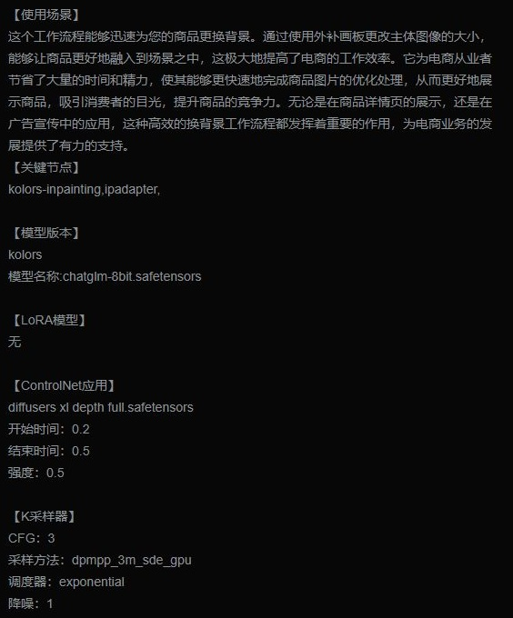
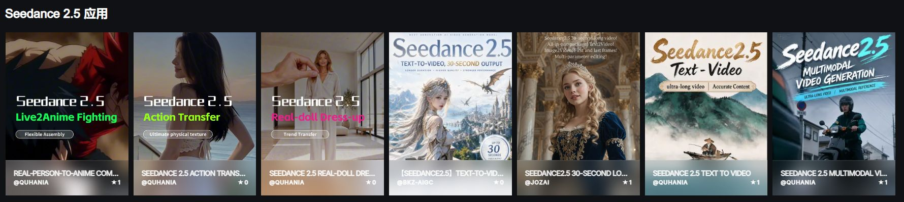
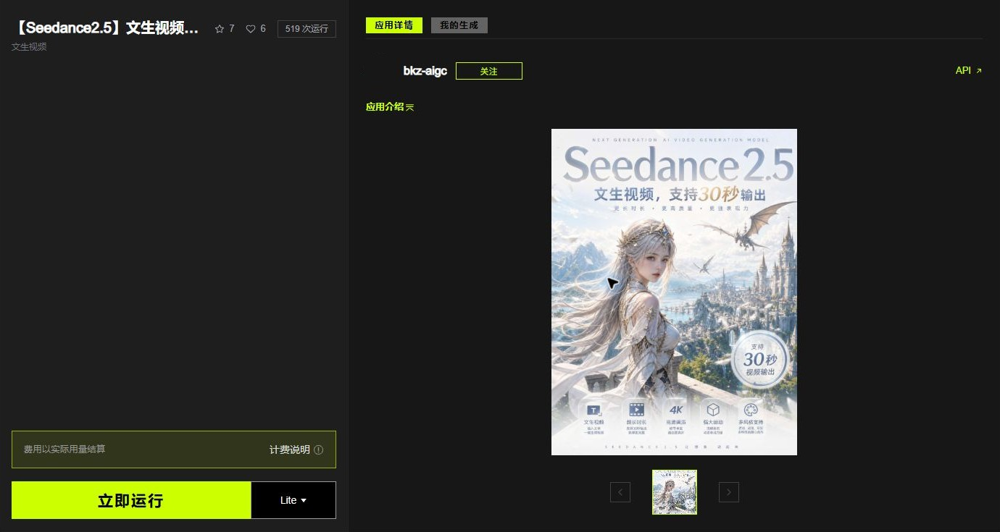
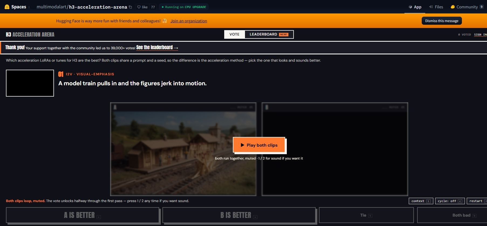
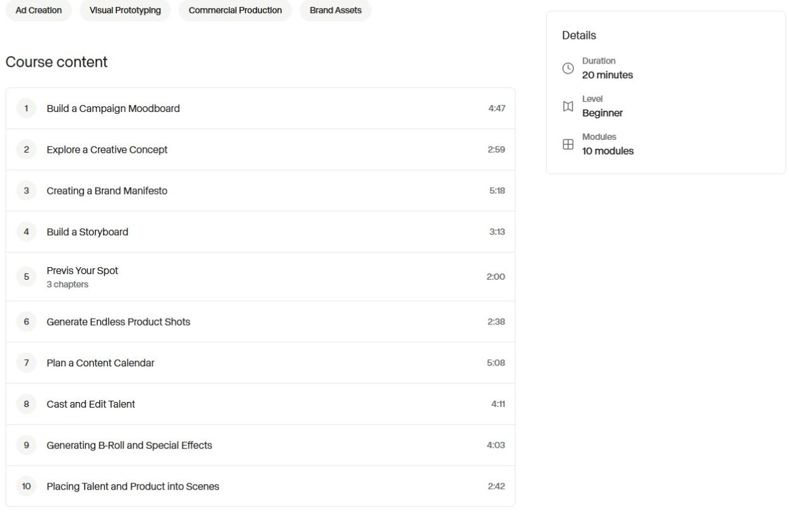
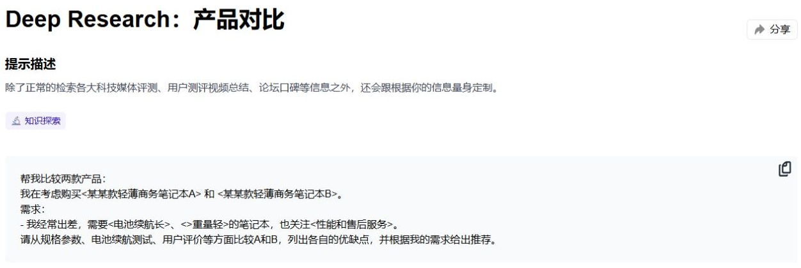
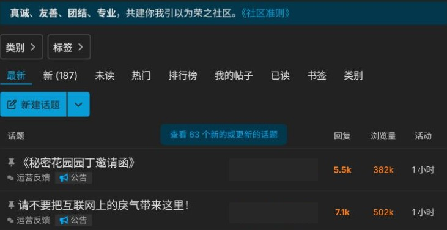
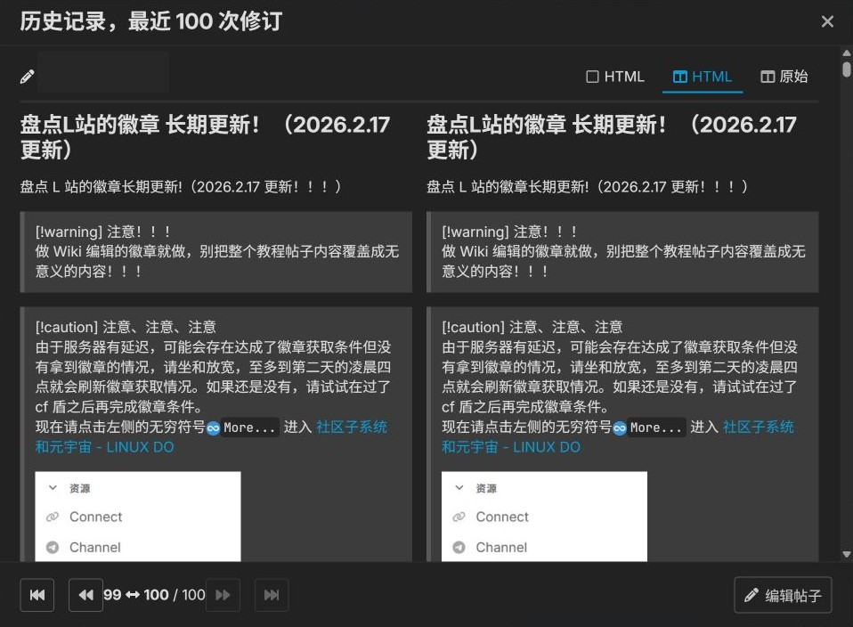
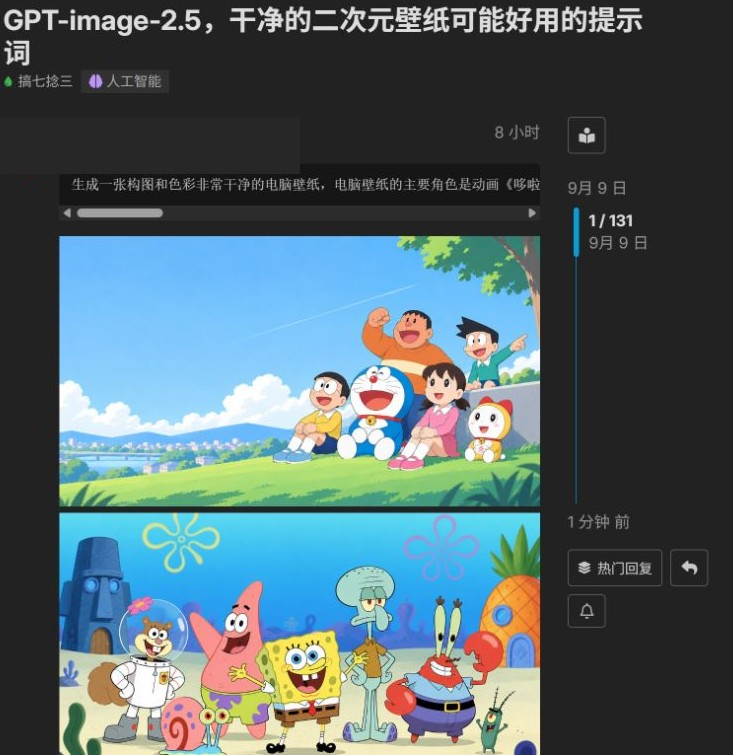
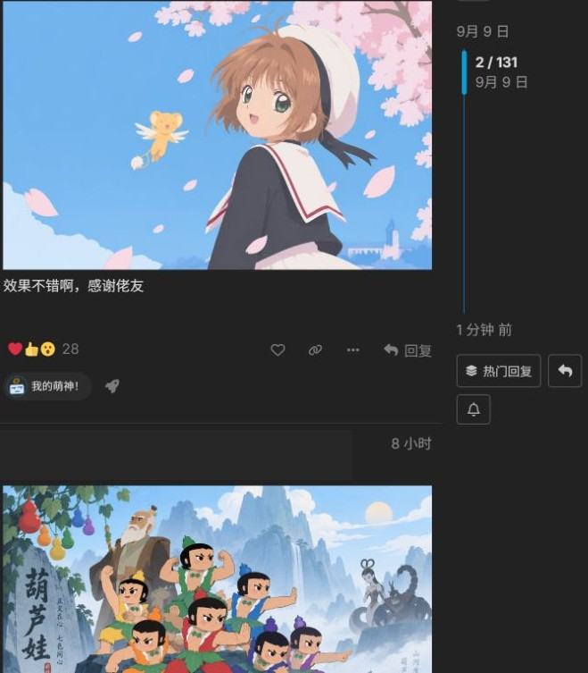

# 18个平台的内容形态研究

资料截至2026-09-09。

## 内容形态应该怎样分

16类内容可在同一页面组合。卡片与详情字段为设计建议，竞品实有字段见对应截图和来源。

### 灵感作品与完整成品

读者的问题：这是什么效果或表达，值不值得看完、收藏或继续了解？

代表平台：LiblibAI、吐司 / Tensor.Art、SeaArt、即梦AI、可灵AI / Kling AI、Midjourney、Leonardo.Ai、OpenArt、NightCafe、Runway

**卡片建议交代**

- 能代表内容的画面或文字节选
- 作品题目、作者与必要的题材说明
- 是否附制作说明；视频片长仅在有可靠值时展示

**详情建议交付**

- 可完整查看的作品和作品说明
- 创作者及必要署名，明确AI生成与人工制作的范围
- 若提供同款、参考或方法链接，说明它们对应哪些材料
- 如果是练习或参赛成果，附对应题面、评价含义及可公开的反馈

后续动作：看完整作品，再选择收藏、查看作者或进入其方法说明。

边界：欣赏价值本身成立，不必强行为每件艺术作品附教程；但不能将无过程材料的成品标成可复现案例。

依据：[tensor.art](https://tensor.art/images/726162984440804171?post_id=726162984436609871) · [www.seaart.ai](https://www.seaart.ai/explore/detail/cug2q2te878c73e48gqg?source=share_link) · [openart.ai](https://openart.ai/story) · [docs.midjourney.com](https://docs.midjourney.com/hc/en-us/articles/37460773864589-Video) · [aif.runwayml.com](https://aif.runwayml.com/) · [help.nightcafe.studio](https://help.nightcafe.studio/portal/en/kb/articles/posts-on-nightcafe) · [即梦AI官网：示例、画布与创意社区](https://jimeng.jianying.com/) · [未来影像计划：行业活动与获奖作品](https://jimeng.jianying.com/visionary) · [AI Kling公开探索专题](https://kling.ai/explore/ai_kling) · [Commercial Usage](https://intercom.help/leonardo-ai/en/articles/8044018-commercial-usage)

证据范围：混合了公开作品样本、官方功能说明和精选展映；官网演示、获奖作品不当成普通作者总体画像。

### 项目介绍与制作复盘

读者的问题：这个项目解决了什么问题，作者为什么这样做，哪些做法适合我的任务？

代表平台：Runway、可灵AI / Kling AI、即梦AI、WaytoAGI、LINUX DO

**卡片建议交代**

- 具体任务、项目或交付对象
- 一项有代表性的结果
- 官方示例、作者自述、商业推广或客户访谈的身份

**详情建议交付**

- 任务约束与最终交付
- 投入的材料、所用工具及人工环节
- 主要选择、修改和失败处理；未披露处明确留空
- 成效数字如有，附时间、计算口径与资料来源
- 若属项目推广，交代使用条件及与发布者的关系

后续动作：带走任务拆解和做法判断；有明确材料入口时再进入操作。

边界：官方精选和作者自述可以说明一个项目，不能推成普通用户平均效率；有代码链接的推广帖也不自动成为完整交付。

依据：[How Miro Produced Its Keynote Video for Four Global Markets with Runway](https://runway.com/news/customers/miro) · [Beyond Realism: How Kling Powered L'Ultimo Uomo Reale](https://kling.ai/blog/How-Kling-Powered-LUltimoUomoReale) · [未来影像计划：行业活动与获奖作品](https://jimeng.jianying.com/visionary) · [通往 AGI 之路：AIGCxChina 专访 AJ](https://www.xtlai.cn/h-nd-6.html) · [大理 Hacker House 活动归档](https://hackerhouse-dali.waytoagi.com/) · [开源推广与公益推广模板说明](https://linux.do/t/topic/1776670)

证据范围：包括精选客户案例、历史访谈/活动归档和推广内容规范；规范仅支持应提交哪些材料，不证明真实项目均已交付。

### 提示词、风格引用与视觉角色素材

读者的问题：我能把哪一部分带入自己的创作，哪些内容需要替换？

代表平台：Midjourney、OpenArt、NightCafe、WaytoAGI、可灵AI / Kling AI

**卡片建议交代**

- 用途或期望风格
- 有代表性的效果示例
- 交付的是提示、风格代码还是角色引用

**详情建议交付**

- 可取得的提示或引用，以及使用示例
- 可替换的内容与必须保留的上下文
- 适用模型或工具、参考素材要求
- 是否公开、可调用及允许再使用的范围

后续动作：复制文字、调用引用或选入角色后，填写自己的题材和材料。

边界：提示文本、风格代码和视觉角色引用的移植范围不同；取得引用不等于取得训练文件或全部参考图。此类角色服务于图像和视频创作，不与对话角色混算。

依据：[docs.midjourney.com](https://docs.midjourney.com/hc/en-us/articles/41308374558221-Style-Creator) · [openart.ai](https://openart.ai/features/ai-character/) · [www.waytoagi.com](https://www.waytoagi.com/zh/prompts/246) · [kling.ai](https://kling.ai/quickstart/klingai-element-library-3-user-guide) · [Moodboards](https://docs.midjourney.com/hc/en-us/articles/39193335040013-Moodboards) · [How to Keep Consistent Characters in AI Video Scenes](https://openart.ai/blog/consistent-characters-in-ai-video/) · [Promptle: The Daily AI Art Puzzle](https://help.nightcafe.studio/portal/en/kb/articles/promptle-daily-ai-art-puzzle)

证据范围：WaytoAGI提示有正文样本；风格/角色多由功能指南支持。Kling元素资产与生成公开视频的公开范围分开，不能写成公开素材库。

### 模型与能力资源

读者的问题：这项能力适合什么任务，我的环境能否用，能否按需要使用它的输出？

代表平台：Hugging Face、ModelScope 魔搭、吐司 / Tensor.Art、SeaArt、Civitai、Leonardo.Ai、LiblibAI

**卡片建议交代**

- 资源名称与用途
- 类型、版本或底模等关键兼容条件
- 在线可用、可下载或受限的实际状态

**详情建议交付**

- 用途、限制和有上下文的效果说明
- 版本、文件或调用入口
- 环境、输入和关键设置要求
- 资源许可及依赖许可的适用范围
- 如有评测，说明数据和评价条件

后续动作：先判断适配与许可，再选择在线调用或获取相应版本。

边界：模型卡、API数据结构与线上卡片不是同一证据；公开介绍不保证可下载，模型许可也不自动覆盖示例素材。

依据：[github.com](https://github.com/civitai/civitai-developer-docs/blob/main/site/reference/models.md) · [intercom.help](https://intercom.help/leonardo-ai/en/articles/10501488-how-to-train-and-use-elements-loras-and-datasets-on-leonardo-ai) · [www.liblib.art](https://www.liblib.art/modelinfo/a2c90169daeb4e548322fdc0dc88af46?from=personal_page) · [Model Cards](https://huggingface.co/docs/hub/model-cards) · [modelscope/modelscope_hub README](https://github.com/modelscope/modelscope_hub) · [Imam Ali Shrine FLUX LoRA版本页](https://www.tensor.art/models/818294207639855588/Imam-Ali-Shrine-2025-01-12-16:16:29) · [set LoRA模型版本页](https://www.seaart.ai/models/detail/107d1e226649c0eccfb00774bd0d722c)

证据范围：具体资源样本、推荐文档结构与开发接口说明的层级不同；Civitai不作为亲见卡片，Leonardo此训练资料标为Legacy。

### 输入样例与训练数据

读者的问题：开始之前需要准备什么材料，材料变化会怎样影响结果？

代表平台：ModelScope 魔搭、Leonardo.Ai、Hugging Face、Datawhale

**卡片建议交代**

- 材料用途与对象
- 样例预览或结构示例
- 仅作示范还是可下载使用

**详情建议交付**

- 材料组成、格式和字段含义
- 合格与不适合的输入示例
- 如何进入对应训练或任务
- 来源、使用许可及需要脱敏的内容
- 材料版本与对应的配置或训练结果

后续动作：取得有权限使用的样例，或按标准准备自己的输入，再进入相应方法。

边界：Hugging Face已有具体数据集样本；Leonardo与ModelScope的部分依据仍是训练指南或输入示例，不能统一说成公开数据市场。数据可预览不等于可无条件再分发。

依据：[huggingface.co](https://huggingface.co/datasets/nyu-mll/glue) · [huggingface.co](https://huggingface.co/docs/hub/data-studio) · [github.com](https://github.com/datawhalechina/all-in-rag) · [intercom.help](https://intercom.help/leonardo-ai/en/articles/10501488-how-to-train-and-use-elements-loras-and-datasets-on-leonardo-ai) · [modelscope/modelscope README](https://github.com/modelscope/modelscope)

证据范围：Hugging Face读到数据行结构；其余包含代码库材料组织与训练教程，不统一推成公开托管或可直接下载的数据资产。

### 可交互的任务应用与对话角色

读者的问题：它能替我完成什么，或提供怎样的互动；开始前还缺什么条件？

代表平台：RunningHub、吐司 / Tensor.Art、SeaArt、Leonardo.Ai、Runway、Hugging Face、ModelScope 魔搭、WaytoAGI

**卡片建议交代**

- 具体任务，或对话角色的身份与场景
- 输入输出类型，或可以期待的互动方式
- 运行资格与可能的消耗；未知时不写固定价格

**详情建议交付**

- 任务应用说明必填/可选输入、可改参数与固定条件
- 对话角色说明公开人设、开场和场景；隐藏定义不冒充已交付材料
- 结果数量、格式或互动范围
- 运行前可见的费用或额度条件
- 继续操作、保存结果或再次进入的办法

后续动作：任务应用承接输入与结果，对话角色承接持续对话。两者都提供交互入口，但应采用不同的字段和说明。

边界：直接交互不等于取得源配置。团队App、受保护Space、站外智能体入口和SeaArt角色各有权限边界；角色发布指南也不能证明全部人设会向使用者公开。

依据：[docs.seaart.ai](https://docs.seaart.ai/guide-1/2-seaart-ai-basic-function/2-5-ai-characters/how-to-create-your-own-character.md) · [modelscope/modelscope_hub README](https://github.com/modelscope/modelscope_hub) · [www.waytoagi.com](https://www.waytoagi.com/agents/723) · [Klein虚拟试衣与商品局部替换](https://www.runninghub.cn/post/2074049801244917760) · [Enhance Image with SUPIR + UPSCALE AI工具](https://www.tensor.art/template/813284647977979882) · [動画に文字（视频加文字）应用](https://www.seaart.ai/ja/app/d5rgjjle878c73a8b3vg) · [Blueprints by Leonardo.Ai](https://intercom.help/leonardo-ai/en/articles/12760267-blueprints-by-leonardo-ai) · [Publishing Workflows as Apps](https://help.runwayml.com/hc/en-us/articles/47865876793747-Publishing-Workflows-as-Apps) · [Spaces Overview](https://huggingface.co/docs/hub/spaces-overview)

证据范围：角色来自发布指南，未实见用户端全部字段；WaytoAGI样本承接站外服务，Runway与受保护仓库不当成公开源代码市场。

### 可复制的流程、应用模板与项目样例

读者的问题：能否把这套方法变成自己的版本，需要补什么才能继续用？

代表平台：LiblibAI、RunningHub、吐司 / Tensor.Art、Dify、Hugging Face、ModelScope 魔搭、SeaArt

**卡片建议交代**

- 要完成的任务及代表结果
- 交付的是画布、配置、代码还是仅有说明
- 依赖与最近适用版本的摘要

**详情建议交付**

- 完整可取得的配置或源材料；缺失时不声称完整复制
- 输入输出关系、关键步骤和可修改位置
- 需要另行准备的模型、数据、外部服务与权限
- 导入或搭建说明、预期结果和已知问题
- 副本与原作者更新之间的关系

后续动作：取得可复制部分，补足缺项，再修改为自己的任务。

边界：节点截图、下载链接和运行按钮都不单独证明配置完整；原作者的额度、私有数据、维护服务通常不是交付的一部分，具体以资源说明为准。

依据：[docs.seaart.ai](https://docs.seaart.ai/guide-1/2-seaart-ai-basic-function/2-10-workflow.md) · [marketplace.dify.ai](https://marketplace.dify.ai/template/langgenius/Code%20Converter?creationType=templates&language=en-US&templateId=09d8b8c8-9459-4ffb-b5e5-6f2255df410b) · [电商产品精修+背景替换（SDXL版）V1.0](https://www.liblib.art/modelinfo/6f92484476484efeb7bd5a0db113cbc0) · [电商产品精修+背景替换（FLUX）V2.0](https://www.liblib.art/modelinfo/7b89bfd25f7f418b82381e893a85c789?from=feed&versionUuid=791ecaae74b44c00a1b4423128084c10) · [Google图像工作流示例](https://www.runninghub.cn/post/2028347928716251138) · [Enhance Image with SUPIR + UPSCALE工作流](https://tensor.art/workflows/824922304248158170) · [Manage Apps](https://docs.dify.ai/en/cloud/use-dify/workspace/app-management) · [Publish Apps to Marketplace](https://docs.dify.ai/en/cloud/use-dify/publish/publish-to-marketplace) · [Spaces Overview](https://huggingface.co/docs/hub/spaces-overview) · [modelscope/modelscope README](https://github.com/modelscope/modelscope)

证据范围：存在下载/导入说明和源文件范例，但未导入或运行。Dify样本标题与设置说明不一致，只记录说明差异，不断言模板实际失败。

### 可安装工具与插件

读者的问题：安装后增加什么能力，它需要访问哪些服务和信息？

代表平台：Dify

**卡片建议交代**

- 能力用途与运行平台
- 版本与兼容条件
- 是否需要外部账号或付费服务

**详情建议交付**

- 安装包及对应说明、源码入口或来源
- 安装、配置和一个具体用法
- 权限、数据处理与外部服务要求
- 更新、卸载和失效后的处理说明

后续动作：先理解能力和权限，再按适用环境安装配置。

边界：明确的代表是Dify插件材料；插件不是应用模板，安装完成也不等于服务已配置或任务可成功运行。

依据：[marketplace.dify.ai](https://marketplace.dify.ai/plugin/langgenius/openai_api_compatible) · [marketplace.dify.ai](https://marketplace.dify.ai/plugin/langgenius/self_refine_agent) · [Publish a Plugin to Marketplace](https://docs.dify.ai/en/develop-plugin/publishing/marketplace-listing/submit-plugin-to-marketplace)

证据范围：模型提供商与Agent策略是不同插件类型；已读说明，未安装、配置或验证效果。

### 单项操作与排错指南

读者的问题：我卡在某一步，怎样处理，改动会牺牲什么？

代表平台：LiblibAI、吐司 / Tensor.Art、SeaArt、可灵AI / Kling AI、OpenArt、NightCafe、Leonardo.Ai、Dify、RunningHub、LINUX DO、ModelScope 魔搭

**卡片建议交代**

- 具体操作或错误症状
- 适用工具及必要版本
- 是否有完整步骤、对照或已验证结果

**详情建议交付**

- 开始条件和必要输入
- 可定位的步骤、设置位置及调整方向
- 改动前后对照
- 不适用情况和仍未解决的问题
- 作者复核状态与更新时间

后续动作：按与自己条件相符的步骤操作，再检查是否达到文中描述的结果。

边界：参数越多不代表教程越好；只有原因推测、报错截图或模型术语时，应标成线索，不能称为已解决方案。

依据：[tusi.cn](https://tusi.cn/articles/728359301611162291) · [www.runninghub.cn](https://www.runninghub.cn/blog/ai-prompts-use-cases/runninghub-ai-apps-guide) · [help.nightcafe.studio](https://help.nightcafe.studio/portal/en/kb/articles/inpainting-on-nightcafe) · [www.leonardo.ai](https://www.leonardo.ai/news/how-to-edit-videos-with-ai) · [linux.do](https://linux.do/t/topic/174250) · [modelscope.csdn.net](https://modelscope.csdn.net/69f16a720a2f6a37c5a6b88c.html) · [电商产品精修+背景替换（SDXL版）V1.0](https://www.liblib.art/modelinfo/6f92484476484efeb7bd5a0db113cbc0) · [動画字幕 / 動画に文字 2アプリ](https://www.seaart.ai/ja/articleDetail/d5rjqlde878c73ahljvg) · [How to Create AI Videos from Text or Images: Step-by-Step Guide](https://kling.ai/blog/how-to-create-ai-videos) · [AI Product Image Generator](https://openart.ai/features/ai-product-image-generator/) · [30-Minute Quick Start](https://docs.dify.ai/en/quick-start)

证据范围：包含历史版本指南、官方示例和作者教程；教程步骤存在不一致时保留原边界，不统一整理为已实操通过的配置。

### 课程与连续学习路径

读者的问题：我需要补哪段能力，先学什么，学完能独立完成什么？

代表平台：Datawhale、WaytoAGI、Runway、OpenArt

**卡片建议交代**

- 学习主题与对象
- 先备知识或难度
- 章节范围、材料类型与有依据的时长

**详情建议交付**

- 学习顺序与每节目标
- 讲义、演示、练习或代码材料
- 配套环境和所需工具
- 自学可得到的材料与当期答疑服务分别说明
- 版本适用范围和材料缺口

后续动作：按目标选择章节学习，再使用其练习或项目材料。

边界：课程目录不证明每节材料完整或学习有效；报名免费也不代表练习所需生成、算力和服务免费。

依据：[github.com](https://github.com/datawhalechina/all-in-rag) · [academy.runwayml.com](https://academy.runwayml.com/) · [academy.runwayml.com](https://academy.runwayml.com/course/ai-advertising) · [openart.ai](https://openart.ai/tutorials) · [组队学习规则](https://datawhalechina.github.io/learn-python-the-smart-way-v2/Schedule/team_learning/) · [课本编写与反馈收集](https://datawhalechina.github.io/learn-python-the-smart-way-v2/Contribute/contribute_detail/textbook_and_feedback/) · [关于 WaytoAGI（正文证据）](https://about.waytoagi.com/) · [大理 Hacker House 活动归档](https://hackerhouse-dali.waytoagi.com/)

证据范围：目录、课程仓库与外部视频入口分别记录；章节仍在规划、视频未播放和时长矛盾均不能用目录数量掩盖。

### 问题讨论、解决记录与引用式问答

读者的问题：有没有人遇到同类问题，当前解释和办法可靠吗？

代表平台：LINUX DO、Datawhale、Hugging Face、ModelScope 魔搭、NightCafe、WaytoAGI

**卡片建议交代**

- 具体症状或待讨论的问题
- 工具、环境等最必要条件
- 未解决、已有建议或提问者自报解决的实际状态
- 作者解答、社区回复或AI生成回答的来源身份

**详情建议交付**

- 预期结果、实际结果与脱敏报错
- 已有尝试和相关条件
- 回复如何补充信息、提出或否定原因
- 解决结论来自谁、适用何种条件
- 可用时链接到正式说明或已验证改动
- AI生成的回答应保留生成标识与参考资料，能回到原文检查

后续动作：对照条件查找线索；给出结论时保留证据和未解决部分。

边界：帖子被关闭、回复很多或作者说解决了，都不能单独证明方案普遍有效；AI回答有引用也不等于引用确实支持全部结论。

依据：[help.nightcafe.studio](https://help.nightcafe.studio/portal/en/kb/articles/posts-on-nightcafe) · [www.waytoagi.com](https://www.waytoagi.com/zh/question/82231) · [关于应用接入的问题请教佬友](https://linux.do/t/topic/1537782) · [How to Ask Questions](https://datawhalechina.github.io/learn-python-the-smart-way-v2/Question/question/) · [Pull Requests and Discussions](https://huggingface.co/docs/hub/repositories-pull-requests-discussions) · [断点续传功能问题 · Issue #1661](https://github.com/modelscope/modelscope/issues/1661)

证据范围：包括真实问题样本、提问规范与AI问答样本；规范不代表所有帖子达标，搜索/生成答案不当作已审定结论。

### 专题合集、资源导览与作者策展

读者的问题：为什么把这些内容放在一起，应该从哪一项开始？

代表平台：Hugging Face、NightCafe、WaytoAGI、Leonardo.Ai、Civitai、LiblibAI、LINUX DO

**卡片建议交代**

- 主题及筛选角度
- 代表条目或封面
- 整理者，以及更新状态（如已知）

**详情建议交付**

- 集合范围与选择理由
- 条目、简短注释和必要的顺序
- 原始内容入口及其身份
- 失效或缺失资源说明
- 公开、个人整理和协作范围

后续动作：沿有说明的条目进入原内容；需要动手时再看其各自材料。

边界：合集交付选择和组织，不自动携带原资源文件与许可。Civitai协作部分目前主要依据实现说明；TASTE等专题也不能推断全部作品由该平台生成。

依据：[help.nightcafe.studio](https://help.nightcafe.studio/portal/en/kb/articles/collections-on-nightcafe) · [www.leonardo.ai](https://www.leonardo.ai/news/taste-curation-no-3-sherbet) · [www.liblib.art](https://www.liblib.art/activities/49a6540f5b84400a9ed8ff6bcdfcaaa6/2025_envelopecover-models) · [linux.do](https://linux.do/t/topic/122079) · [Collections](https://huggingface.co/docs/hub/collections) · [关于 WaytoAGI（正文证据）](https://about.waytoagi.com/) · [Collaborative Collections](https://github.com/civitai/civitai/blob/main/docs/features/collaborative-collections.md)

证据范围：资源索引、视觉策展与协作合集不是同一种供给责任。Civitai协作机制是实现说明；专题和外部链接的历史状态沿用分组限制。

### 挑战题面、练习任务与征集规则

读者的问题：这项任务要交什么，如何参与和评判，成果会怎样被使用？

代表平台：NightCafe、即梦AI、Runway、吐司 / Tensor.Art、Datawhale、Midjourney

**卡片建议交代**

- 主题、待完成任务与交付对象
- 适用时间、认领或提交阶段
- 参与资格及奖励性质（如有）

**详情建议交付**

- 提交内容和素材/工具限制
- 截止、认领、评价与结果公布办法，以该任务实际规则为准
- 任务有反馈或奖项时，交代反馈责任、评分含义和兑现条件
- 作品、作业或教程的公开与后续使用条件
- 历史活动和未完成题目明确标注；有成果时链接实际交付

后续动作：先理解题目并取得参与材料；完成后的作品、方法或反馈应另有入口，不与待认领任务混计。

边界：赛事、课程作业、Promptle和图片偏好任务评判的对象不同，没有统一质量分。规则、已提交成果、结果与实际兑付要分别核对；任务条数不是已完成内容量。

依据：[aif.runwayml.com](https://aif.runwayml.com/) · [tusi.cn](https://tusi.cn/blackboard/forgecup) · [contributor.datawhale.cn](https://contributor.datawhale.cn/projects) · [Creating a Game (Community Challenge)](https://help.nightcafe.studio/portal/en/kb/articles/creating-a-game-community-challenge) · [Daily Challenge: Eligibility, Rating & Ranking](https://help.nightcafe.studio/portal/en/kb/articles/daily-challenge-eligibility-rating-ranking) · [Promptle: The Daily AI Art Puzzle](https://help.nightcafe.studio/portal/en/kb/articles/promptle-daily-ai-art-puzzle) · [即梦Dreamina×剪映未来影像计划AI短片挑战赛事细则](https://sf1-cdn-tos.douyinstatic.com/obj/ies-hotsoon-draft/vco/dc943398-71d6-4fd2-bb26-215c4a34ae21.html) · [组队学习规则](https://datawhalechina.github.io/learn-python-the-smart-way-v2/Schedule/team_learning/) · [作业发布与验证](https://datawhalechina.github.io/learn-python-the-smart-way-v2/Contribute/contribute_detail/homework/) · [Complete Tasks](https://docs.midjourney.com/hc/en-us/articles/33390759197197-Complete-Tasks)

证据范围：规则、展示档案和题目招募分别支持相应结构；吐司活动页年份未明，Datawhale招募只读到索引，不写成当前完整认领规则。

### 研究论文、评测报告与证据说明

读者的问题：这个结论根据什么得出，适用范围在哪里，能否找到原始材料？

代表平台：Hugging Face、ModelScope 魔搭

**卡片建议交代**

- 研究或评测的问题
- 论文、报告或摘要的明确身份
- 所涉方法/模型，以及必要的日期与条件

**详情建议交付**

- 原文、作者和出处；AI摘要单独标明
- 评测任务、模型/数据版本、设置与指标口径
- 主要结果及其适用范围，未取得的实验材料明确留空
- 可核查时提供关联数据、实现、演示和讨论入口

后续动作：从结论回到原文与条件，再检查实现或评测材料；材料不完整时保留判断边界。

边界：Hugging Face论文页已有具体样本；ModelScope评测报告依据官方功能指南，尚非一份实际报告的完整审读。论文被关联、生成摘要存在或报告可导出，都不直接证明结论正确。

依据：[huggingface.co](https://huggingface.co/papers/1804.07461) · [huggingface.co](https://huggingface.co/docs/hub/paper-pages) · [modelscope.csdn.net](https://modelscope.csdn.net/69f16a720a2f6a37c5a6b88c.html)

证据范围：论文页有原摘要和资源关系样本；PivotEval只核官方指南描述的报告形式，没有把报告导出能力当成已分析一份实际评测报告。

### 版本更新与维护说明

读者的问题：旧内容还能不能用，变化影响了哪里，需要迁移吗？

代表平台：LiblibAI、LINUX DO、Dify、Hugging Face、SeaArt、Civitai

**卡片建议交代**

- 受影响的内容、工具或服务
- 新旧版本或生效日期
- 主要变化与适用人群

**详情建议交付**

- 具体变化及与旧材料的关系
- 受影响的输入、依赖或操作
- 需要迁移的部分及保留条件
- 已知问题、当前处理结果和原文入口
- 计划、已经发布与已经核验的状态分别写清

后续动作：查明自己正在使用的版本，再决定继续使用、调整或切换。

边界：公告不证明全部账号已生效；提出修改不等于已经合并，发布新版也不意味着旧副本自动更新。

依据：[linux.do](https://linux.do/t/topic/1401642) · [marketplace.dify.ai](https://marketplace.dify.ai/plugin/langgenius/openai_api_compatible) · [电商产品精修+背景替换（FLUX）V2.0](https://www.liblib.art/modelinfo/7b89bfd25f7f418b82381e893a85c789?from=feed&versionUuid=791ecaae74b44c00a1b4423128084c10) · [動画に文字（视频加文字）应用](https://www.seaart.ai/ja/app/d5rgjjle878c73a8b3vg) · [動画字幕 / 動画に文字 2アプリ](https://www.seaart.ai/ja/articleDetail/d5rjqlde878c73ahljvg) · [LINUX DO Connect 备用端点公告](https://linux.do/t/topic/1144530) · [Publish Apps to Marketplace](https://docs.dify.ai/en/cloud/use-dify/publish/publish-to-marketplace) · [Pull Requests and Discussions](https://huggingface.co/docs/hub/repositories-pull-requests-discussions) · [The Creator Collab Update: 4 New Ways to Get Seen and Earn](https://civitai.com/articles/33872/the-creator-collab-update-4-new-ways-to-get-seen-and-earn)

证据范围：作者版本关系、公告、插件版本历史和协作修改提案均可留下维护信息；提案是否合并、规则何时适用仍须各看原文。

### 团队项目资料与运行记录

读者的问题：我们现在用的是哪份材料，谁能访问，下一步从哪里继续？

代表平台：Runway、Leonardo.Ai、Dify

**卡片建议交代**

- 项目、合集或会话的清楚名称
- 材料归属与当前可见范围
- 必要的版本或活动状态

**详情建议交付**

- 与项目对应的资产、流程和会话记录
- 输入输出或运行轨迹在权限内可追溯
- 成员访问及编辑范围
- 资料之间的关联和继续处理入口
- 对外公开时的授权、脱敏与可交付范围

后续动作：团队成员按权限接续工作；能整理为公开案例的部分另行发布。

边界：内部工作资料不是公开社区UGC，也不是可直接导出的教学包；不得把所有运行记录计为外部用户任务。

依据：[Introduction to Projects](https://help.runwayml.com/hc/en-us/articles/52913050653203-Introduction-to-Projects) · [Creating and Sharing Collections with Your Team](https://intercom.help/leonardo-ai/en/articles/13610244-creating-and-sharing-collections-with-your-team) · [Logs](https://docs.dify.ai/en/cloud/use-dify/monitor/logs)

证据范围：功能指南支持内部资料形态，未作为公开内容样本或实际活跃数据；公开分享、权限继承和日志完整度另有边界。

## 跨竞品发现

### 按选择条件设计卡片

成品卡片突出题材和画面；模型卡片交代兼容条件；应用卡片说明输入输出；课程卡片注明范围和难度。Runway课程目录已展示模块数和级别，SeaArt角色发布指南则要求互动设定。字段应随内容用途调整，具体展示以实见页面为准。

[academy.runwayml.com](https://academy.runwayml.com/) · [docs.seaart.ai](https://docs.seaart.ai/guide-1/2-seaart-ai-basic-function/2-5-ai-characters/how-to-create-your-own-character.md) · [Imam Ali Shrine FLUX LoRA版本页](https://www.tensor.art/models/818294207639855588/Imam-Ali-Shrine-2025-01-12-16:16:29) · [Blueprints by Leonardo.Ai](https://intercom.help/leonardo-ai/en/articles/12760267-blueprints-by-leonardo-ai) · [关于应用接入的问题请教佬友](https://linux.do/t/topic/1537782)

### 详情注明可取得的材料

复制提示词、调用风格、运行应用和取得源配置，各自需要不同准备。Dify模板、Hugging Face Space有依赖和权限条件，Runway App也不等同于源工作流。详情应列出可取得材料及需自行补齐的项目。

[Manage Apps](https://docs.dify.ai/en/cloud/use-dify/workspace/app-management) · [Spaces Overview](https://huggingface.co/docs/hub/spaces-overview) · [Moodboards](https://docs.midjourney.com/hc/en-us/articles/39193335040013-Moodboards) · [Publishing Workflows as Apps](https://help.runwayml.com/hc/en-us/articles/47865876793747-Publishing-Workflows-as-Apps)

### 分别评价作品、教学与开放范围

NightCafe允许作者控制提示词和起始图的复制，Promptle步骤也非默认公开；专业成片还可能经过人工处理。作品的表达质量、教学材料完整度和公开许可应分别评价。

[help.nightcafe.studio](https://help.nightcafe.studio/portal/en/kb/articles/how-to-hide-prompts) · [Promptle: The Daily AI Art Puzzle](https://help.nightcafe.studio/portal/en/kb/articles/promptle-daily-ai-art-puzzle) · [未来影像计划：行业活动与获奖作品](https://jimeng.jianying.com/visionary) · [How Miro Produced Its Keynote Video for Four Global Markets with Runway](https://runway.com/news/customers/miro)

### 操作说明需包含输入和排错条件

RunningHub样本交代了两份输入的用途，但缺修复步骤；ModelScope问题模板虽有字段，仍可能缺少完整复现命令。核查内容时应查看素材要求、失败条件和调整办法。

[Klein虚拟试衣与商品局部替换](https://www.runninghub.cn/post/2074049801244917760) · [断点续传功能问题 · Issue #1661](https://github.com/modelscope/modelscope/issues/1661) · [How to Ask Questions](https://datawhalechina.github.io/learn-python-the-smart-way-v2/Question/question/)

### 保留版本与关联材料

Liblib样本链接旧版，SeaArt应用关联操作文章，Hugging Face论文页连接实现和数据。Leonardo Legacy训练指南说明数据变化不会自动更新已有结果。关联资料与版本需要随内容一起维护。

[intercom.help](https://intercom.help/leonardo-ai/en/articles/10501488-how-to-train-and-use-elements-loras-and-datasets-on-leonardo-ai) · [huggingface.co](https://huggingface.co/papers/1804.07461) · [电商产品精修+背景替换（FLUX）V2.0](https://www.liblib.art/modelinfo/7b89bfd25f7f418b82381e893a85c789?from=feed&versionUuid=791ecaae74b44c00a1b4423128084c10) · [動画に文字（视频加文字）应用](https://www.seaart.ai/ja/app/d5rgjjle878c73a8b3vg) · [動画字幕 / 動画に文字 2アプリ](https://www.seaart.ai/ja/articleDetail/d5rjqlde878c73ahljvg) · [Publish Apps to Marketplace](https://docs.dify.ai/en/cloud/use-dify/publish/publish-to-marketplace)

## 对多元拾光的内容投入判断

多元拾光已有廉价Token/API中转与MakeNow两项业务，稳定人手为2名全栈研发、1名产品、1名运营；尚缺成熟案例与持续作者供给，画布分享/复制此前仍在规划。以下是基于这些条件的内容投入判断，不是功能定版、开发排期或用户验证任务。

### 先做

**先形成少量有过程材料的制作案例**

围绕团队或合作作者能够说明清楚的一个具体任务，同时保留成品、输入、关键选择、人工处理和已知失败。案例来自实际记录时才写效果与耗时。

依据：两项主营业务需要可理解的用途；现阶段最缺的是能持续交付这些材料的人，而不是更多发布形式。

条件与范围：不要先承诺行业覆盖或固定产出量；没有完整画布时，准确交代可公开的材料即可。

**从案例中抽出单项方法和问题说明**

把一个常见操作、一个失败症状或一次配置变化写成独立短条目，并指回对应案例与版本。已解决、自述解决和仍在排查分别写清。

依据：一份案例可以留下多种有用材料，产品和运营不必每次另找大选题，也能减少重复解释。

条件与范围：不能将推测的原因改写成确定答案；对尚未出现的问题不预造“用户经验”。

**让API内容落在具体调用用途和限制上**

采用能够说明来源和条件的最小调用示例、输入输出说明及有限范围的能力比较。成本或稳定性结论只使用已有可核验记录，并注明模型、接口及适用日期。

依据：API是现有业务，内容应帮助读者判断能做什么、怎样接入、会受什么限制；单独突出便宜不足以解释使用价值。

条件与范围：此处是内容方向，不新增接口承诺或工程方案，也不把某次调用成功当作长期服务保证。

**按任务整理已有材料**

用简短说明把成品、方法、输入要求和相关问题放在同一任务入口，指出阅读顺序与资料缺口。

依据：少量材料经过整理后，读者更容易找到下一步；当前可以先由运营维护选择和链接。

条件与范围：不需要把16类都做成频道，也不应建立大量没有内容支撑的专题。

### 后做

**在复制范围清楚后，提供画布与简化应用**

将已有案例整理成可复制配置；针对不改节点的人再提供简化输入说明。内容同时交代继承项、另备材料和版本关系。

依据：MakeNow的画布能力与这类内容直接相关，但现阶段还缺已经确认的分享交付及稳定方法。

条件与范围：前提是分享/复制能力、素材权限和配置一致性有明确证据；不能让内容先承诺产品尚未提供的交付。

**围绕稳定主题组织课程与练习**

当某一主题已有足够案例和愿意维护的作者，再组织成连续学习材料、有限练习与清楚的反馈说明。

依据：学习路径需要连贯内容和答疑责任，单次活动的投稿不能自动补足这些材料。

条件与范围：先明确维护人和可交付材料；不把持续出题、评审和奖励兑付默认为1名运营可以无成本承担。

**积累作者与作品的连续系列**

围绕已经持续合作的作者整理作品系列、方法差异和阶段性变化，让读者同时认识表达与做法。

依据：有连续作品后，作者介绍和策展才有可供选择的内容，也更容易保留不同创作风格。

条件与范围：作者故事不能替代真实作品和过程记录；不因被推荐就暗示全部由MakeNow完成或收入已得到证明。

### 暂不做

**综合模型、数据与插件分发市场**

暂不以大规模托管、上传和下载量扩充内容目录。相关资源可以在具体案例中引用并说明出处。

依据：资源分发会带来依赖、授权、更新和失效维护；这与当前缺案例、缺作者的主要问题并不相同。

条件与范围：不是否定专业资源价值；待现有业务和作者能力确实需要承担这些责任时再讨论。

**大型赛事、现金悬赏与复杂评价分配**

暂不以复杂赛事和现金回报作为内容供给基础。

依据：题面、评审、异常处理与兑现都需持续投入；竞品公开规则不能证明复制这些动作就能获得优质供给。

条件与范围：本建议不涉及新增奖励规则，也不把积分参与等同真实任务需求。

**把内部项目库和运行日志直接变成社区内容**

先从获准公开的资料中整理案例，不将项目文件、团队会话或原始运行日志默认向外展示。

依据：内部材料帮助团队接续工作，公开内容则需要解释背景、筛选材料和明确使用范围，不能直接按日志条数扩充供给。

条件与范围：团队协作能力可以有产品价值，但当前不能靠更复杂的工作区功能补齐社区内容。

**独立评测榜单与大量论文摘要**

可以在方法说明中引用有出处的研究；暂不把追逐榜单和批量摘要作为主要内容供给。

依据：独立比较需要一致条件、足够记录与维护责任，现有人手更需要把自己的任务案例说清楚。

条件与范围：引用论文不等于完成独立评测；没有完整条件与数据时，不自行给模型排总名次。

## 从卡片到详情：8组实际页面

在用户已登录的Chrome中只读访问公开内容；LINUX DO和Runway Academy按未登录状态查看。每组由同一条目的列表入口进入详情，Tensor样本的入口是模型页内的例图卡片。截图仅裁切页面和遮盖头像、账号区域，未重绘界面。计数为截取时的页面展示，不代表独立用户、成功生成或稳定效果。

### LiblibAI · 图片模板：电商产品商业级渲染精修

首页卡片点击进入相同标题、相同资源ID的模板详情；截图封面是轮播中的不同帧。

图片模型栏目内的模板卡片。封面直接呈现产品渲染用途，悬停后出现使用模板入口。

[来源页面](https://www.liblib.art/)

同一模板详情：效果图旁并列版本、基础模型、参考图数量和使用参数。

[来源页面](https://www.liblib.art/modelinfo/b3c0dc71aabb4496af0d178bfa347bc8)

卡片让人判断用途，详情才交代需要上传什么。模板价值取决于输入要求、说明与作者答复是否齐全，单靠效果封面无法判断。

**使用入口：**详情提供使用模板入口。停在说明页，未进入生成。

**限制：**正文的用途声明与右侧可商用标签存在冲突，作者评论又表示可以商用；需向平台或作者确认，不能从标题或单个标签得出许可结论。角度、文字一致性限制来自作者答复，未独立测试。

### RunningHub · 节点工作流：一键换背景：产品图摄影

从精选工具中同名商品换背景卡片进入该工作流帖子。

ComfyUI精选工具中的效果卡片，标题会截断；该列表卡片未展示节点。

[来源页面](https://www.runninghub.ai/zh-cn/page-workflow)

对应详情同时提供打开AI应用和运行工作流两条入口，并展示原图与效果。

[来源页面](https://www.runninghub.ai/zh-cn/post/1845758651062743041)

同页下方继续交付关键节点、模型、ControlNet和采样参数。

[来源页面](https://www.runninghub.ai/zh-cn/post/1845758651062743041)

封面仍以结果吸引点击，但详情交付了过程材料。对普通使用者保留应用入口，对需要调整流程的人提供工作流入口，两类需求在同一资源下分流。

**使用入口：**可见下载、API、打开AI应用、运行工作流入口；只读取介绍与参数，未下载、运行或验证节点依赖。

**限制：**详情显示2024年更新，属于较早资源；参数齐全不能证明现在仍可运行。封面、运行量和作者的效率描述均不作成功率证据。

### RunningHub · 封装后的AI应用：文生视频应用：支持30秒输出（作者标题）

直接点击列表第4张卡片打开该应用详情，名称与封面对应。

同一栏目中的应用卡片。对应样本为第4张白色封面，署名BKZ-AIGC。

[来源页面](https://www.runninghub.ai/zh-cn/ai-apps)

应用详情提供介绍、计费说明与立即运行；本次加载状态中，左侧尚未出现输入表单。

[来源页面](https://www.runninghub.ai/zh-cn/ai-detail/2086711729156894722)

应用详情的入口更集中，面向直接执行任务。但这个样本首屏主要还是宣传封面，输入要求没有在已观察区域说清楚，不能把应用详情等同于完整使用说明。

**使用入口：**可见立即运行入口，未提交运行。

**限制：**30秒和模型名称只是作者与页面的标注，未验证能力。部分列表视频未播放；当前未取得表单，不补写其输入字段。

### 吐司 / Tensor.Art · 模型例图与单张作品：MooMooE-commerce 的商品例图

从模型页第一张蓝色瓶子例图进入相同图片ID的单图详情。

模型详情内的例图卡片组。它是模型的效果样本区，并非独立的首页作品流。

[来源页面](https://tensor.art/models/662744072865292090/MooMooE-commerce-V1)

点击第一张蓝色瓶子例图后，单图详情明确提示没有生成数据。

[来源页面](https://tensor.art/images/662742037059162229?model_id=662744072865292090)

例图能证明平台展示了某种效果，未必交付可复现材料。模型信息、作品信息、生成参数是三个层次，不能因为图片挂在模型下就认为可画同款。

**使用入口：**此例图详情未提供生成数据。模型层的运行入口仍存在，但不能据此补全这张图的提示词或种子。

**限制：**这是Tensor.Art站点的两个相邻历史例图中的一个；邻图也显示无生成数据。不能外推全部作品，更不能当作吐司国内站的统一规则。

### Hugging Face · 可运行演示与评测应用：H3 Acceleration Arena

从Spaces周选卡片进入同一作者、同一仓库名的Space。

Spaces周选中的应用卡片，使用状态标签和用途摘要，未依赖一张生成作品封面。

[来源页面](https://huggingface.co/spaces)

详情直接承载可交互应用，并保留App、Files、Community入口。画面处于播放前状态。

[来源页面](https://huggingface.co/spaces/multimodalart/h3-acceleration-arena)

这类内容直接承载可交互工具。卡片说明用途和状态，详情呈现应用；另保留Files与Community入口，具体文件和讨论未检查。

**使用入口：**可见播放、盲评与排行榜入口。未播放、投票、检查代码或调用接口。

**限制：**Running状态只能说明页面当时报告的运行状态。页面的投票数属于该应用自述，不是Hugging Face平台活跃用户数，也未独立核验。

### Runway Academy · 结构化课程：AI for Advertising

从Academy首页的广告课程卡片点击View Details进入同名课程。

课程卡片先交代目标、章节数、难度和免费入学入口。

[来源页面](https://academy.runwayml.com/)

同一课程的详情展开学习目标与技能，展示开始学习入口。

[来源页面](https://academy.runwayml.com/course/ai-advertising)

同页10个模块的大纲和分项时长，可直接检查内容覆盖。

[来源页面](https://academy.runwayml.com/course/ai-advertising)

课程详情把任务拆成情绪板、概念、故事板、产品镜头等阶段。它比单篇技巧文章更能交代学习顺序，但也需要持续维护课程与产品版本。

**使用入口：**可见开始学习入口和章节列表；未入学、播放全课或验证学习结果。

**限制：**页面标总时长20分钟，10个模块时长合计36分59秒，存在不一致。免费课程入口不表示生成工具也免费。

### WaytoAGI · 文本提示词：Deep Research：产品对比

从提示词列表同名卡片进入编号1940详情。本样本与文字研究中的编号246是不同抽样。

无图片的文本卡片，用标题、摘要和类别完成筛选。

[来源页面](https://www.waytoagi.com/zh/prompts)

正文展开可替换的产品与需求变量，代码块右上有复制图标。

[来源页面](https://www.waytoagi.com/zh/prompts/1940)

提示词不必依靠视觉封面。详情最重要的是让人找到需要替换的内容；当前样本有模板文本，但没有同时交付输出样例或测试条件。

**使用入口：**可见复制图标；未执行复制或在模型中使用。

**限制：**未见适用模型版本、实测输出和失败情形，不能从完整正文推断效果。页面中的能力描述是作者提示，不是本报告保证。

### LINUX DO · 问题讨论：AI时代大家是怎么管理自己的知识库的？

未登录，从公开最新列表同名条目进入话题2868771。

论坛中的一行话题条目。截图遮盖参与者头像，保留标题、分类和数值。

[来源页面](https://linux.do/)

首帖先说明具体困扰，再接楼层回复；右侧保留阅读位置和时间轴。

[来源页面](https://linux.do/t/topic/2868771)

这种形态的内容会在回复中继续生长。卡片需要帮助识别问题和讨论状态，详情需要保留上下文；一条回复既可能提出办法，也可能指出问题本身的前提。

**使用入口：**只读首帖与首屏回复，未登录、回复或追踪后续。

**限制：**这是具体问题的公开讨论样本，不能代表用户群总体需求。浏览量不是人数，回复数不是解决率；截图是首屏，未读完全部讨论。

## 逐家研究及来源

## 成品与过程材料

成绩卡展示结果，操作记录解释过程，可执行配置支持继续创作。NightCafe Promptle允许作者选择是否在题目结束后公开步骤，因此同一场活动的成果未必都附带过程材料。[^22]

## 说明字段怎样帮助使用

Hugging Face模型卡包含任务、依赖与许可，Dify模板指南区分概要和设置步骤。用途帮助选择，输入与设置支持操作，版本和限制说明后续使用条件；推荐字段不代表每位作者均已填写。[^48][^60]

## 复制范围与补充材料

复制工作流、模板或样例后，使用者可能仍需补充素材、模型、外部服务及权限。Liblib要求结合工作流和底层模型判断许可，Dify模板示例需要配置外部服务。详情应分别说明配置、生成结果和素材的继承与使用条件。[^3][^60]

## 样本质量的判断

RunningHub试衣样本写明输入要求，但效果和原理未核验；ModelScope问题样本附错误信息，却缺完整复现命令。核查时应逐项查看输入、调整步骤与结果记录，样本结论不能外推全站质量。[^6][^55]

## 平台目录

- [LiblibAI](#liblib)
- [RunningHub](#runninghub)
- [吐司 / Tensor.Art](#tusi)
- [Civitai](#civitai)
- [SeaArt](#seaart)
- [OpenArt](#openart)
- [NightCafe](#nightcafe)
- [即梦AI](#jimeng)
- [可灵AI / Kling AI](#kling)
- [Midjourney](#midjourney)
- [Leonardo.Ai](#leonardo)
- [Runway](#runway)
- [WaytoAGI](#waytoagi)
- [Datawhale](#datawhale)
- [Hugging Face](#huggingface)
- [ModelScope 魔搭](#modelscope)
- [LINUX DO](#linuxdo)
- [Dify](#dify)

## LiblibAI

### 补充：卡片、详情与后续使用

#### 模型资源与使用说明

**卡片或索引**

- 待截图确认：模型列表是否展示底模、版本、LoRA类型和在线使用状态；不能把详情标题里的LoRA直接当成卡片徽标。

**详情材料**

- 动物主题LoRA的使用说明
- 建议画幅3:4
- 同作者另一底模版本的对比说明
- 提示词组成与示例
- 资源用途声明

后续使用与分析：读者先选模型，再用例图提示组织自己的描述。此页交付风格资源及使用方法，未交付节点编排；模型详情与工作流详情交付不同材料。

证据边界：已读作者正文，发布日期未标。底模效果优劣为作者判断；未读取训练材料、下载配置或执行生成。本文只记录有用途声明，不采纳作者的法律判断。

查阅：2026-09-09。[www.liblib.art](https://www.liblib.art/modelinfo/a2c90169daeb4e548322fdc0dc88af46?from=personal_page)

#### 主题资源专题

**卡片或索引**

- 专题正文有模型名称、效果图和风格用途描述；这是文章内推荐条目，不是已核的首页模型卡片。
- 首页进入该专题的卡片字段待截图确认。

**详情材料**

- 同一节日用途下的多款模型推荐
- 模型主页入口
- 触发词、权重、CFG检查说明
- 从返图区画同款的操作说明
- 提示词中保留项与替换项
- 关联活动入口

后续使用与分析：专题先帮助选风格，再指向模型和返图，最后解释如何改成自己的内容。这是编辑整理的资源导览，返图则是可继续创作的作品样本。

证据边界：样本为2025蛇年专题，不能当当前活动。文中自动填参属于操作说明，仍要求检查参数；未验证现在实际继承范围。收益、零成本及快速成功宣传均不采用。

查阅：2026-09-09。[www.liblib.art](https://www.liblib.art/activities/49a6540f5b84400a9ed8ff6bcdfcaaa6/2025_envelopecover-models)

#### 短视频教程与作品入口

**卡片或索引**

- 待截图确认：教程列表是否展示封面、时长、发布者、日期与难度。搜索摘要不是教程卡片。

**详情材料**

- 子弹时间运镜主题标题
- 简短用途说明
- 嵌入视频占位
- 指向imageinfo作品页的画同款链接

后续使用与分析：这类教程把观看与创作入口放在一起，但正文没有展开操作。视频内容与画同款的继承范围仍待核对。

证据边界：本次只取得搜索索引中的正文；直接打开教学页为空，作品页未取得。嵌入视频未播放，不能称已读完整教程或确认视频时长。所谓1分钟、无需提示等效果承诺不采用。

查阅：2026-09-09。[www.liblib.art](https://www.liblib.art/teaching/25faceacb75e444da13a9e897ea25e8a) · [www.liblib.art](https://www.liblib.art/imageinfo/a17bb10ccc574a718a580c1772cf7c76)

#### 商品精修模板

**卡片或索引**

- 截图已确认：效果封面、模板及底模标签、任务标题，悬停出现使用模板入口。

**详情材料**

- 电商产品商业级渲染精修标题与作者
- 1—4张参考图、提示词输入
- 推荐使用全能V2
- 作者补充角度与文字一致性的限制
- 正文用途声明、右侧许可区及作者评论

后续使用与分析：使用者除了准备输入，还需知道复杂文字可能需要人工后期。详情中的参数说明和作者答复共同补足任务条件，不能只按商业级标题判断可用程度。

证据边界：页面观察：正文限制直接售图并写仅娱乐学习分享，右侧则写生成内容可商用、原创可商用，作者评论也说可以商用。同页存在冲突，本稿不代其裁决。未执行生成，也不能把作者答复视为稳定一致性的验证。

查阅：2026-09-09。[www.liblib.art](https://www.liblib.art/modelinfo/b3c0dc71aabb4496af0d178bfa347bc8)

### 既有研究与样本

[官网](https://www.liblib.art/)

Liblib样本页包含效果图、节点说明、依赖、许可和版本信息。读者可以了解目标、处理步骤及使用条件；完整配置的可导出性与运行结果尚未核验。

### 主要内容形态

#### 任务工作流

围绕产品图处理的一套模块组合[^1]

实际字段与材料：

- 任务名称
- 精修/背景模块
- 节点示意图
- 输入说明
- 输出步骤

**具体示例或入口：**SDXL产品精修V1。

**使用者能获得的深度：**过程教学与工作流说明；未导出配置核验。

**看完之后的动作：**正文指导使用者进入对应模块准备素材。

**材料与使用限制：**没有可验证的完整模型版本、配置文件与成功率。

#### 局部操作与排错图解

针对某一步的参数和症状说明[^1]

实际字段与材料：

- 症状
- 参数位置
- 调整方向
- 示意图

**具体示例或入口：**模糊或撕裂时参考ControlNet预览调低权重。

**使用者能获得的深度：**可以拿走排查思路，深于单张结果图。

**看完之后的动作：**按说明定位相关节点；执行效果未重测。

**材料与使用限制：**没有失败素材包、通用阈值和回归结果。

#### 版本迁移说明

新版相对旧版的变化记录[^2]

实际字段与材料：

- V1链接
- 新模型组合
- 保留模块
- 输入变化
- 配置提示

**具体示例或入口：**FLUX V2的精修与背景迁移。

**使用者能获得的深度：**帮助选择版本和理解替换条件。

**看完之后的动作：**核对新版依赖后决定是否切换。

**材料与使用限制：**质量、速度改善是作者描述，没有同源测试表。

### 样本拆解：FLUX V2产品精修与背景替换页

同一作者的单条公开工作流；不代表全站内容标准。

**入口和对照**

标题区分V2，正文链接SDXL V1。[^2]

作用（分析）：分析：读者能知道这是同任务迭代，避免把版本当不同用途。

**精修模块**

说明逆采样、重新采样及高低频保留，并附节点图。[^2]

作用（分析）：分析：解释为何要分步处理，方便有经验者定位关键环节。

**背景模块输入**

要求产品图和背景图两份输入，并说明在背景图绘制遮罩。[^2]

作用（分析）：分析：明确素材准备责任，减少把同款理解成只改一句话。

**可选依赖与资源要求**

正文提示低显存替代，并说明缺部分模型时可忽略相关节点。[^2]

作用（分析）：分析：复用受到运行环境影响，应该先检查依赖。

尚缺的材料：

- 完整可导入配置及依赖版本清单的核验
- 用于对照的原始素材、失败结果与运行成本

没有证明跨商品可稳定复现，截图中的节点也未在运行。

### 复用能带走什么

**可取得或继承：**可读取模块设计、图解、操作文字及旧版链接；是否能完整导出配置未核。

**还需准备：**自己的产品/背景素材、遮罩操作，以及匹配的模型、节点和算力条件。

**无法直接迁移或尚未确认：**资源简介不是通用商用授权；工作流及其模型的许可需共同判断，具体示例素材的再使用权限未知。

依据[^1][^2][^3]

### 怎样判断内容是否有用

**有用内容的判断（分析）：**分析：好的方法内容应说明哪一步可独立用、输入准备和失败时改哪里；维护记录还能帮助识别是否值得再用。

**容易误判的内容（分析）：**分析：大量节点图不自动等于可复现；缺配置、素材和成本时，初学者仍需自行补齐执行条件。

依据[^1][^2]

### 多元拾光的采用条件

**可借鉴的工作：**MakeNow案例可拆成任务目标、输入、画布步骤、失败边界、版本与授权说明。

**需要先具备：**需要作者交出可用画布和可分享素材，产品再审核描述与实际行为一致。

**暂不适合照搬：**不能仅收集效果图后包装为工作流教程，也不宜未核便写“各种商品通用”。

### 仍待确认的内容问题

- 下载配置与页面演示是否同版，停用节点怎样标注？
- 普通资源的输入样例、失败说明和许可字段是否普遍齐全？

## RunningHub

### 补充：卡片、详情与后续使用

#### 按任务分类的AI应用

**卡片或索引**

- 官方教程说明应用广场按精选、短剧工具与创意玩法寻找入口；逐卡标题、预览、作者及计数待截图确认。

**详情材料**

- 应用任务说明
- 图片上传、Prompt或角色/风格/场景等输入类别
- 生成结果与下载/继续创作路径
- 输入准备与结果检查建议

后续使用与分析：官方教程把应用界定为封装后的常用任务。应用表单服务直接使用；需要改模型和节点的人再进入专业工作流，两类详情应分别展示。

证据边界：2026-07-02教程只说明不同应用可能采用哪些输入，不能说每个应用都有全部字段。未检查具体应用表单，也没有证明打开应用就能取得完整工作流。

查阅：2026-09-09。[www.runninghub.cn](https://www.runninghub.cn/blog/ai-prompts-use-cases/runninghub-ai-apps-guide) · [www.runninghub.cn](https://www.runninghub.cn/ai-apps)

#### 角色制作图文教程

**卡片或索引**

- 详情的相关推荐能读到文章标题与链接；博客主列表封面、摘要和日期的位置待截图确认。

**详情材料**

- 作者署名与2026-07-02日期
- 目录、分步说明、FAQ
- 短剧定妆照Prompt示例
- 角色身份、场景、风格的替换项
- 建议保持的年龄、发型、服装等条件

后续使用与分析：文章让读者带走描述方法和检查顺序，再进入应用。这是官方示例教法，区别于一个作者工作流页附外部教程链接。

证据边界：未给该示例的具体应用ID、完整模型/参数、输入成品配对和成本记录。可复制的是文字示例，不能标成已交付可执行配置。

查阅：2026-09-09。[www.runninghub.cn](https://www.runninghub.cn/blog/ai-prompts-use-cases/runninghub-ai-apps-guide)

#### 活动工作流与投稿材料

**卡片或索引**

- 待截图确认：活动相关工作流卡片是否标期次、版本、参赛状态。详情里的挑战赛标题不能证明卡片有活动标记。

**详情材料**

- 挑战赛期次与V1工作流名称
- 图生视频/视频生视频标签
- 1:1、20秒内的作者转述要求
- 循环舞蹈与过渡舞蹈两个方向
- 姿态/深度素材外链
- 活动说明、投稿与运行入口

后续使用与分析：使用者从创作题目取得素材方向，再运行作者提供的方法，最后另到投稿入口。这条资源是辅助参赛的方法，不是已提交、合格或获奖的作品。

证据边界：单个作者页面，更新2025-09-10；未核外部官方活动规则、素材许可或投稿记录，不能认定RunningHub主办。页面含推广与外部服务，未采用其奖励承诺和个人联系信息。

查阅：2026-09-09。[www.runninghub.cn](https://www.runninghub.cn/post/1965685855086104578)

#### RHTV画布教程

**卡片或索引**

- 相关文章区域确认标题与链接；RHTV模板或项目列表的缩略图、作者、公开状态待截图确认。

**详情材料**

- 2026-07-03官方教程日期
- 新项目、系统模板或空白画布入口说明
- 商品主图、Logo、渲染图或视频素材类别
- 镜头节点与视觉风格要求
- 复制工作流并修改局部内容的说明

后续使用与分析：交付对象扩展到一个项目的组织方法。文章按商品素材、镜头和版本解释如何继续制作，说明RunningHub的内容不应只统计ComfyUI资源。

证据边界：文档说明个人项目可继续使用，未提供该商品演示的公开模板链接或可导入文件；不能据此确认跨作者画布共享。降低成本、跨商品稳定性与投放成效未验证。

查阅：2026-09-09。[www.runninghub.cn](https://www.runninghub.cn/blog/ai-prompts-use-cases/rhtv-product-ad-video-guide)

### 既有研究与样本

[官网](https://www.runninghub.cn/)

RunningHub分别提供直接运行的AI应用和可查看、修改的工作流。详情需要说明输入、参数、依赖与输出检查；同一主题下的两类资源应保留关联和各自的使用条件。

### 主要内容形态

#### 任务型工作流说明

一个具体用途的资源介绍页[^6]

实际字段与材料：

- 任务标题
- 用途标签
- 示例图
- 输入/输出说明
- 工作原理段
- 运行入口

**具体示例或入口：**Klein试衣与商品局部替换。

**使用者能获得的深度：**具有输入指导，配置实际内容未核。

**看完之后的动作：**页面支持进入应用或工作流；未点击生成。

**材料与使用限制：**技术原理属于作者陈述，不能当作模型实现证据。

#### 教程导流型作品页

效果示例加外部教程入口[^5]

实际字段与材料：

- 标题
- 示例图
- 文生图/图生图标签
- 站外教程链接
- 关注收藏
- 更新时间

**具体示例或入口：**Google图像工作流页。

**使用者能获得的深度：**可看效果与找到教程，站内正文几乎不讲操作。

**看完之后的动作：**可前往应用、工作流或外部资料；外部教程未读。

**材料与使用限制：**标题价格及福利未核；下载按钮不证明包含全部依赖。

#### 场景精选卡片

任务专区的一条内容入口[^4]

实际字段与材料：

- 任务名称
- 结果示例
- 创作链接

**具体示例或入口：**已核验的首页商品试穿、产品动画等卡片。

**使用者能获得的深度：**展示与导航，不能替代详情交付。

**看完之后的动作：**选一个用途进入创作；沿用页面记录。

**材料与使用限制：**字段较少，缺输入、成本和失败条件；首页超时。

### 样本拆解：Klein试衣页的四层材料

2026-06-13更新的单一作者资源说明；未验证生成。

**需求与分类**

标题和标签指向局部重绘、图生图、商品替换。[^6]

作用（分析）：分析：说明任务范围，但不能证明覆盖所有商品。

**输入材料与用途**

正文区分模特/场景图、商品单品图和替换指令。[^6]

作用（分析）：分析：明确两张图承担不同作用，比只要求上传图片更可操作。

**预期输出与解释**

有输出描述和模型工作原理段，使用了强效果承诺。[^6]

作用（分析）：分析：帮助理解目标；承诺与原理需另证，不能按字数视为深度。

**操作与问题尾段**

应用/工作流入口并列；尾段提到边缘穿模、变色和光影问题。[^6]

作用（分析）：分析：识别常见失败症状，但未交付如何修复。

尚缺的材料：

- 与示例对应的完整参数、模型版本及输入原图
- 失败修正的具体步骤、重试数和任务成本

页面文案中的完美融合、算法机制、全商品适用性均未独立验证。

### 复用能带走什么

**可取得或继承：**可读取用途、输入要求和运行入口；Google样本还能取得教程链接。

**还需准备：**自己的参考图和商品素材，正确绑定图一/图二与指令；账户额度和配置依赖仍需运行前确认。

**无法直接迁移或尚未确认：**没有验证下载是否携带模型、节点或第三方服务；生成入口不附带素材与通用商用权。

依据[^5][^6][^7]

### 怎样判断内容是否有用

**有用内容的判断（分析）：**分析：内容应明确每份输入的作用，给出可核对输出，并把失败症状接到调整办法。

**容易误判的内容（分析）：**分析：模型原理术语、大片承诺、邀请链接都能增加篇幅，却不能补上缺失配置。

依据[^5][^6]

### 多元拾光的采用条件

**可借鉴的工作：**MakeNow详情可把输入、可修改项、输出范围与失败处理置于主要位置，再提供复制画布。

**需要先具备：**作者须交代实际素材与设置，产品审核效果陈述，运营标出外部依赖。

**暂不适合照搬：**不要将“上传—运行”三步包装为完整案例，也不要以福利链接替代使用说明。

### 仍待确认的内容问题

- 应用和工作流入口究竟继承哪些字段，两个版本是否一致？
- 常见问题有没有对应维护记录或可访问的作者答复？

## 吐司 / Tensor.Art

### 补充：卡片、详情与后续使用

#### 单图作品与生成信息

**卡片或索引**

- 待截图确认：Posts列表卡片的标题、提示摘要、模型标签及互动图标。单图详情里的数字不能自动认作卡片计数。

**详情材料**

- Tensor.Art单图媒体、作者和2024-05-10发布日期
- 关联Checkpoint与多个LoRA版本
- 正向/负向提示
- Sampler、Steps、CFG、Seed、Clip Skip、Size
- Remix及相关帖子入口

后续使用与分析：此单图样本可追溯一组生成参数，再进入Remix；它不同于只有成品的帖子，也不同于可编辑节点图。吐司2024年指南另说明从帖子做同款进入工作台，并单列种子选择。

证据边界：单图样本不代表全部作品。中文站指南更新2024-05-17，不作为两站当前完全继承的实测；参考图、模型权重、后期和资源许可仍未核。

查阅：2026-09-09。[tensor.art](https://tensor.art/images/726162984440804171?post_id=726162984436609871) · [tusi.cn](https://tusi.cn/articles/728615058323724621)

#### 图文操作教程

**卡片或索引**

- 待截图确认：Articles列表的封面、标签、作者、更新时间。已核这些字段出现在文章详情，未据此移植到卡片。

**详情材料**

- 教程标题、官方作者、SD教程标签、更新时间
- 白底黑字素材准备与排版要求
- 基础模型和ControlNet选择
- 正负提示与参数文本
- 步骤配图与结果图

后续使用与分析：幻术图教程让读者先准备特定输入，再配模型与控制条件。说明教程不是给结果附一段介绍，而要接上准备、执行与核对材料。

证据边界：更新2024-05-16，旧模型/界面现在是否可用未核；文中canny权重建议0.9，参数文本写1，两者存在差异。不得整理成统一、已验证的标准配置。

查阅：2026-09-09。[tusi.cn](https://tusi.cn/articles/728359301611162291)

#### TensorForge活动作品与画布

**卡片或索引**

- 活动页的六个方向条目可读到示例图、方向名称、推荐受众和简短说明；属于创作方向卡片。
- 真实投稿卡片与首页活动卡片待截图确认。

**详情材料**

- 创作方向与质量条件
- 过程/关键步骤截图、高清成品要求
- 图文或视频笔记格式
- 画布链接和站外笔记链接
- 发布时间段与原创要求

后续使用与分析：规则要求站内创作发布，再整理过程用于站外教学，并提交两个链接。该内容包同时支持展示、学习与作品归属核对，区别于只交一张成片。

证据边界：规则时间表列6.12—7.10但未标年份；不称当前在征集。GOODCASE明确是占位演示，不能当真实优质投稿。画布链接不证明观看者可完整复制；未核实际投稿和奖励。

查阅：2026-09-09。[tusi.cn](https://tusi.cn/blackboard/forgecup)

### 既有研究与样本

[吐司官网](https://tusi.cn/) · [Tensor.Art官网](https://tensor.art/)

Tensor.Art同一作者可发布模型、节点工作流和封装工具。模型说明所用能力，工作流展示组合方法，工具页接受输入并运行。三类对象的使用次数应分别统计。

### 主要内容形态

#### 模型版本页

一项资源的一个版本[^11]

实际字段与材料：

- LoRA类型
- 底模
- 上传/更新时间
- 训练步骤与轮次
- 触发词
- 权限区

**具体示例或入口：**Imam Ali Shrine的FLUX.1 LoRA版本页。

**使用者能获得的深度：**资源信息与使用条件；完整训练数据未公开。

**看完之后的动作：**可按底模与触发词选择使用；未运行。

**材料与使用限制：**页面明确禁止转载；权限列表的勾选状态未在文本中完整保留，不能据名称判断允许。

#### 节点工作流页

节点组合和过程说明[^8]

实际字段与材料：

- 工作流标题
- 更新时间
- 示例图
- 参数取舍
- 节点名称及数量
- 排错说明

**具体示例或入口：**SUPIR + UPSCALE的32节点工作流。

**使用者能获得的深度：**可理解组合与局部修改；未导出验证。

**看完之后的动作：**查看节点及输入后决定是否运行或修改。

**材料与使用限制：**节点清单不包含可核验的全部配置与依赖版本。

#### AI工具页

面向直接使用的同名工具[^10]

实际字段与材料：

- 示例图
- 作者
- 更新时间
- 标签
- 操作说明
- API参数链接

**具体示例或入口：**SUPIR工具页，更新2025-05-21。

**使用者能获得的深度：**使用教学，具体输入表单仅加载到Loading状态。

**看完之后的动作：**阅读说明并进入工具；API链接存在未等于已调用。

**材料与使用限制：**作者同时承认可能增加细节；“不改变原图”不能按字面保证。

### 样本拆解：同作者SUPIR工作流与AI工具对照

一个作者的两条同名内容，各自URL与更新日期不同；不是配置一致性测试。

**工作流示例与节点清单**

工作流页有示例图，列32个节点及加载、采样、保存等节点类型。[^8]

作用（分析）：分析：可判断复杂程度和依赖方向，不能还原所有参数。

**相似度取舍**

正文解释Control Scale的变化会影响接近原图的程度，并给出建议起点。[^8]

作用（分析）：分析：使用者必须先决定保真还是重构细节。

**提示与采样调整**

可移除自动描述节点；作者说明小图与采样器的兼容问题。[^8]

作用（分析）：分析：把提示控制和故障处理变成可操作线索。

**工具的重复使用说明**

同名工具页建议保存一次处理的结果后再次上传，同时提醒细节可能变化。[^10]

作用（分析）：分析：重复操作是用户判断后的选择，不是无损还原证明。

尚缺的材料：

- 两页配置差异、实际输入字段和对应模型版本
- 同一输入逐次处理的对照与成本

不能因作者主页同时列两页就认定自动封装关系、参数同步或完全保真。

### 复用能带走什么

**可取得或继承：**模型页可读取底模和触发词；工作流提供节点与参数说明；工具提供操作方法和API入口。

**还需准备：**使用者仍需输入图片、匹配依赖，并决定相似度与细节变化的可接受程度。

**无法直接迁移或尚未确认：**模型禁止转载不能被在线使用按钮覆盖；导出文件是否含依赖未知，同名工具也不是工作流配置副本的证据。

依据[^8][^10][^11]

### 怎样判断内容是否有用

**有用内容的判断（分析）：**分析：资源应区分版本、声明修改会牺牲什么，并把工具页与完整方法的关系解释清楚。

**容易误判的内容（分析）：**分析：调用数、星标、节点数分别描述不同对象；字段齐全仍不能保证输入兼容或结果保真。

依据[^8][^9][^10]

### 多元拾光的采用条件

**可借鉴的工作：**MakeNow可区分直接套用案例与完整画布说明，记录对应版本和可修改参数。

**需要先具备：**需作者交付对照输入、输出及兼容说明，运营不能仅按同名自动归并。

**暂不适合照搬：**不应将画质增强写成事实还原，也不要在未核许可时鼓励资源搬运。

### 仍待确认的内容问题

- 工具和工作流复制后各继承哪些参数，如何核对版本？
- 模型与工作流的权限状态能否在用户复用前完整说明？

## Civitai

### 补充：卡片、详情与后续使用

#### 模型资源与版本文件

**卡片或索引**

- 待截图确认：未看到模型卡片，不把API中的名称、类型、标签和计数直接写成卡片字段。

**详情材料**

- 官方API文档把模型与版本分层：模型有说明和许可字段，版本关联底模、发布时间和实际文件。
- 文件记录可有格式、大小、哈希和下载地址；是否支持站内生成另有标记。

后续使用与分析：资源详情交付的是可识别版本的资源及使用条件。分析：读者需先判断依赖与许可，再决定在线调用或下载；单张例图不能替代这些判断。

证据边界：这是官方API说明，非线上模型页实测；样例计数不作经营数据。 文档说明非公开文件会被隐藏，归档等状态还可能移除下载信息；存在模型记录不等于现在能下载或调用。

查阅：2026-09-09。[github.com](https://github.com/civitai/civitai-developer-docs/blob/main/site/reference/models.md)

#### 按内容类型投稿的合集

**卡片或索引**

- 待截图确认：名称、封面、简介和条目数量的卡片展示方式未见，不能用合集编辑字段反推消费卡片。

**详情材料**

- 实现文档区分图片、帖子和模型合集。
- 开放的图片/帖子合集描述了详情页投稿入口；模型合集通过保存选择器加入。
- 合集保存的是被组织的条目；投稿和协作权限不是同一字段。

后续使用与分析：分析：合集详情首先回答收集范围，其次才是能否投稿及从哪里投稿。阅读合集、保存条目和加入协作对应不同权限。

证据边界：仅按公开实现文档加深，不保证当前生产账号可用。 合集链接不交付原作品全部素材和配置；不能因可投稿就认为也能修改他人内容。

查阅：2026-09-09。[github.com](https://github.com/civitai/civitai/blob/main/docs/features/collaborative-collections.md)

### 既有研究与样本

[官网](https://civitai.com/)

Civitai以例图展示效果，以资源标注说明模型来源，用合集整理作品与资源。实现文档的字段未全部核对到生产页面，模型关联也未覆盖完整制作过程。

### 主要内容形态

#### 例图及资源归因

一张图像与其关联模型版本的记录。[^12]

实际字段与材料：

- 模型与版本名称
- 底模/资源类型
- 可选权重
- 检测或作者声明的关联方式

**具体示例或入口：**Image Resource Tracking 的资源返回结构。

**使用者能获得的深度：**资源追溯层；尚不是完整流程。

**看完之后的动作：**文档支持按所用模型筛选、查找相关资源；未点运行。

**材料与使用限制：**这些是实现记录，不确认界面逐字段展示；手填信息可能不对应真实生成。

#### 协作合集

按主题组合图片、帖子或模型的容器。[^13]

实际字段与材料：

- 名称
- 说明
- 封面
- 内容条目
- 协作者角色

**具体示例或入口：**Collaborative Collections 的管理与详情说明。

**使用者能获得的深度：**策展和协作组织层。

**看完之后的动作：**按权限阅读或参与；未实测。

**材料与使用限制：**可看不代表能投稿；成员数不能作作者数。

#### 功能公告与改作说明

解释新参与方式和奖励条件的文章。[^14]

实际字段与材料：

- 标题与日期
- 机制解释
- 采用后的展示说明
- 活动期限

**具体示例或入口：**Creator Collab Update，已读正文。

**使用者能获得的深度：**参与说明；内容应帮助作者理解怎么加入和能得到什么。

**看完之后的动作：**可以据公告寻找相关投稿入口；未复测。

**材料与使用限制：**不是用户改作样本，也没有某件作品完整的参数、输入和操作录像。

### 样本拆解：图像资源记录：归因结构如何影响可复用程度

拆解官方实现说明中的数据结构，属于文档示例，不是新采集的线上作品。

**定位资源**

记录图像与模型版本关系，返回可含模型名称、类型、底模和版本名。[^12]

作用（分析）：帮助判断该资源是否与自己环境、任务相符；不能只记一个模型大类。

**关联方式**

detected 区分从元数据检测与上传者声明；后者可经帖子的版本关系或手工添加。[^12]

作用（分析）：这是证据强弱线索，应与效果示例一起阅读。

**可选参数**

结构保留资源强度，但并非每个关联必有。[^12]

作用（分析）：单个权重提供局部信息，不能补出采样器、节点、参考图和后期。

尚缺的材料：

- 未取得一件作品的完整输入、流程及外部后期材料
- 未核所有资源许可、可下载性或站内调用资格
- 未取得同一方法换素材后的失败样本

不能证明站内多数图像有完整可复现信息，也不证明声明关联一定错误。

### 复用能带走什么

**可取得或继承：**文档支持追溯资源和按主题整理；公告支持改作投稿的参与形式。

**还需准备：**仍需有效资源、相容环境与自己的输入；某合集的权限也可能限制参与。

**无法直接迁移或尚未确认：**模型关联和合集链接本身不能带走原始素材、完整节点与后期判断；能否导出全部过程，资料不足。

依据[^12][^13][^14]

### 怎样判断内容是否有用

**有用内容的判断（分析）：**分析：优先看版本是否明确、归因来自哪里、作者有无解释输入和失败条件。内容可被追溯，比仅附热门模型标签更有价值。

**容易误判的内容（分析）：**分析：很大的合集、很多模型标签或高关注数，都不能替代一个完整任务的材料；它们只证明被收集或被关联。

依据[^12][^13]

### 多元拾光的采用条件

**可借鉴的工作：**多元拾光案例记录效果、输入、资源版本、关键步骤、结果是否由作者自行复核，再单列使用者变体。

**需要先具备：**需要作者能交出过程材料，而运营能识别资源声明与实际试做记录的区别。

**暂不适合照搬：**不把“关联了模型”包装成“已验证同款”；也不要求所有用户先交复杂完整画布才能表达简单经验。

### 仍待确认的内容问题

- 公开作品里完整流程材料的覆盖率多大？
- 读者实际带走模型、提示、收藏还是可执行配置？
- 失效资源及旧版本说明是否被持续修订？

## SeaArt

### 补充：卡片、详情与后续使用

#### 作品、生成记录与后续操作

**卡片或索引**

- 待截图确认：Explore列表的作者、提示摘要、模型标签与计数。详情页不能证明列表全显示。

**详情材料**

- 咖啡场景作品媒体与作者
- Generation Info、Records及Prompts
- 尺寸、2025-02-03日期、Mode、Type
- Checkpoint & LoRA区域及标签
- Remix、Video Generation与评论区

后续使用与分析：作品页从观看承接到同平台再创作，并提供局部生成背景。它是结果与记录的组合，AI应用页则提供执行表单，两者不宜用同一套详情字段分析。

证据边界：当前文本的Type为cell，含义未核，不翻译成内容类型。若干数字缺图标含义，不记成下载或运行数；未确认Remix实际带走的字段与素材。

查阅：2026-09-09。[www.seaart.ai](https://www.seaart.ai/explore/detail/cug2q2te878c73e48gqg?source=share_link) · [docs.seaart.ai](https://docs.seaart.ai/guide-1/2-seaart-ai-basic-function/2-7-post.md)

#### AI角色设定与互动入口

**卡片或索引**

- 待截图确认：Cyberpub角色卡片展示的名称、图像、分类或对话计数；发布表单字段不等于公共卡片字段。

**详情材料**

- 官方发布指南列角色图和可选简介
- 名称、角色描述、Persona
- 语音、First Message
- 创作者说明、Scenario、Example Dialogue
- 分类、预览与发布步骤

后续使用与分析：作者先设定互动对象，使用者随后与角色对话。它的内容价值在持续互动条件，不能按图片模板、模型下载或生成作品来统计。

证据边界：这是官方指南的字段，不是已抽到的真实角色详情。人设全文哪些向使用者公开、能否复制角色定义尚未核；文档示例不作为真实活跃用户或角色质量证据。

查阅：2026-09-09。[docs.seaart.ai](https://docs.seaart.ai/guide-1/2-seaart-ai-basic-function/2-5-ai-characters/how-to-create-your-own-character.md)

#### Swift预设工具

**卡片或索引**

- 指南确认入口AI Apps—More；工具卡片的预览、分类、使用按钮和收费标记待截图确认。

**详情材料**

- 按工具分别要求原图、模板或草图
- 风格/滤镜选择
- 部分工具提供强度或其他参数
- 生成动作，去背景工具另给下载路径

后续使用与分析：官方工具将效果形式和任务绑定，如滤镜、妆效、放大、草图转图。应与用户发布的ComfyUI应用分开，避免把所有应用数量都当成UGC供给。

证据边界：指南明确这些工具由官方创建；逐工具当前可用性和输入数量未实测。不能把一项的强度参数写成所有工具都有，也不采纳无损增强等效果承诺。

查阅：2026-09-09。[docs.seaart.ai](https://docs.seaart.ai/guide-1/2-seaart-ai-basic-function/2-4-ai-apps/swift-ai-apps.md)

#### 工作流配置与AI应用界面

**卡片或索引**

- 待截图确认：同作者工作流/应用是否分别成卡、是否有相互入口、各自计数对应什么行为。

**详情材料**

- 发布指南先要求完成ComfyUI节点效果
- 随后分ComfyUI信息与AI App信息
- 发布步骤包含配置图示
- 节点工作流指南解释保存与共享方法

后续使用与分析：官方文档支持将工作流整理成更易使用的应用，因此应分开核对源方法与应用输入。原稿单个应用的个人历史恢复，也不能代替这层公开发布关系。

证据边界：发布字段主要位于文档配图，本次未读图，不能编造具体字段。文档所说保存共享不证明一项应用会公开全部源节点，二者版本同步与复制权限待核。

查阅：2026-09-09。[docs.seaart.ai](https://docs.seaart.ai/guide-1/portugues/2-funcoes-basicas-do-seaart-ai/2-4-apps-de-ia/como-publicar-como-app) · [docs.seaart.ai](https://docs.seaart.ai/guide-1/2-seaart-ai-basic-function/2-10-workflow.md)

### 既有研究与样本

[官网](https://www.seaart.ai/)

SeaArt资源包括可运行表单、操作文章和模型信息。表单接受输入，文章解释配置与排错，模型页注明底模、触发词和来源；封装工具仍可能需要使用者自行判断首次配置。

### 主要内容形态

#### 任务应用与表单

一项可执行的视频处理工具[^15]

实际字段与材料：

- 视频上传
- 音频开关
- 三组文字启用项
- 淡入淡出开关
- 历史入口
- 修复说明

**具体示例或入口：**日文“视频加文字”应用。

**使用者能获得的深度：**在线执行界面及使用说明；未提交。

**看完之后的动作：**准备视频和文字后设置参数。

**材料与使用限制：**文本抓取未保留所有无标签输入值；不能认定默认项正确。

#### 关联操作文章

解释两款工具差异与参数的图文说明[^17]

实际字段与材料：

- 两款应用链接
- 位置坐标
- 字体/颜色说明
- 文字块开关
- 起止帧
- 错误处理

**具体示例或入口：**《视频字幕/视频文字 两款应用》。

**使用者能获得的深度：**教学和排错，可指导设置但没有配置文件。

**看完之后的动作：**根据视频尺寸、字幕位置与时段配置。

**材料与使用限制：**依赖该作者工具；含作者报告的平台校验问题，未独立验证。

#### 模型版本与来源页

一项LoRA资源及版本说明[^16]

实际字段与材料：

- LoRA类型
- 版本
- 底模
- 触发词
- 推荐权重
- 来源与许可栏目

**具体示例或入口：**服装LoRA“set”页面标来源Civitai。

**使用者能获得的深度：**资源元信息与使用说明。

**看完之后的动作：**可查看来源、选择版本或在线创作；未下载。

**材料与使用限制：**页面日期不一致，权限图标状态未完整提取，不判断所有许可选项均开放。

### 样本拆解：“视频加文字”应用与关联文章

单个作者的一项工具及说明；日文正文，只读。

**输入与开关**

表单显示视频上传、音频开关、三组文字和淡入淡出开关。[^15]

作用（分析）：分析：用户操作不止输入提示词，必须决定哪些元素生效。

**位置与时段**

文章用X/Y说明位置，用Start/End指定显示帧区间。[^17]

作用（分析）：分析：将审美目标转成坐标和时间控制。

**校验与字体限制**

作者说明未启用块也不宜留空，并提示部分字体可能缺字。[^17]

作用（分析）：分析：解释表单校验和素材语言造成的失败；不是模型能力介绍。

**复用与修复记录**

应用说明从历史Remix恢复设置，并记有2026-02-21修复。[^15]

作用（分析）：分析：把第一次配置变为可再次使用的个人模板。

尚缺的材料：

- 完整默认参数、示例输入输出及跨视频尺寸对照
- 可导出配置、所用节点版本和每次执行消耗

作者称历史可恢复设置，不代表跨账号、跨工具或离线可复用；没有验证修复效果。

### 复用能带走什么

**可取得或继承：**应用可承接操作；正文提供参数含义、失败提醒和个人历史复用办法。

**还需准备：**自有视频、准确时段、坐标、文字与字体选择；换尺寸或语言时需要重新检查。

**无法直接迁移或尚未确认：**本例确认的是同平台个人历史恢复；没有取得跨账号模板或离线配置。模型页的来源声明也不等于下载后可任意转售。

依据[^15][^16][^17]

### 怎样判断内容是否有用

**有用内容的判断（分析）：**分析：内容应把无效输入、参数边界和复用范围写出来；程序已经封装并不免除这些说明。

**容易误判的内容（分析）：**分析：很多开关和节点只能说明复杂，不能证明易用；作者报告的显示节点数异常更不适合做质量指标。

依据[^15][^17]

### 多元拾光的采用条件

**可借鉴的工作：**MakeNow案例应提供默认输入、需修改项、失败提示和再次使用方法，复杂画布另附操作说明。

**需要先具备：**需要作者理解实际表单、节点与输出，运营记录已知问题并保持链接同步。

**暂不适合照搬：**不要只靠“点复制即可”掩盖首次配置成本，也不宜在未测试时承诺跨账号完整继承。

### 仍待确认的内容问题

- 复制内容是否包含素材、参数和权限，哪些只存在个人历史？
- 不同语言、画幅和输入时长下，说明是否仍适用？

## OpenArt

### 补充：卡片、详情与后续使用

#### 分章视频教程目录

**卡片或索引**

- 列表文本可读：教程标题、时长，以及新内容、入门课、视频、图像、编辑等分类。
- 入门条目在标题中使用Part/Module编号；卡片缩略图、讲师和互动字段待截图确认。

**详情材料**

- 条目链接指向YouTube视频；目录本身没有提供文字步骤、素材包或完整配置。
- 可辨认从图片到视频、角色等不同学习入口，但未取得视频字幕或观看内容。

后续使用与分析：从目录选择所需技能，再转入视频学习。分析：时长和章节能帮助安排学习；它与作品详情的复制按钮承担不同任务。

证据边界：站内引用外部教程不等于每条由平台自制，也不证明都能照做。 部分标题有营销或比较措辞，只记录它们在目录中的存在，不采用其效果结论。 列表中存在不同标题指向同一视频链接的情况，不能按条目数直接算独立教程量。

查阅：2026-09-09。[openart.ai](https://openart.ai/tutorials)

#### 故事作品与制作表单

**卡片或索引**

- /story列表文本可读故事类型和标题，类型包括音乐视频、讲解、角色Vlog、ASMR和从零制作。
- 多个条目均显示0:00，不能当真实片长；封面、播放和作者/互动字段待截图确认。

**详情材料**

- 所点社区故事独立URL仍返回同一列表正文，未读到专属分镜或复制资料。
- 另读官方Character Vlog制作页，表单区分角色选择、主题、画幅、视觉风格、音乐、时长和进阶模型设置，并列预览分镜与生成完整视频。

后续使用与分析：分析：社区故事是结果发现入口，制作表单是任务配置入口。现有证据没有证明某条社区故事能把分镜、人物、音乐和提示完整传给表单。

证据边界：不能把制作页通用字段当成公开故事详情已披露的字段。 表单显示的积分和预计耗时属于当次默认状态，不是所有故事固定价格或实测耗时；未生成。 未核音乐来源许可、完整项目分享或他人角色可用范围。

查阅：2026-09-09。[openart.ai](https://openart.ai/story) · [openart.ai](https://openart.ai/story/community/37ITn3XLnO55ct0T9VI9) · [openart.ai](https://openart.ai/story/create/vlog)

#### 可复用角色资产

**卡片或索引**

- 当前/suite/character正文有Browse Library、搜索和角色图像/视频等快捷入口。
- 未读取角色库实际条目；姓名、缩略图、风格标签、作者和调用数均待截图确认，不能补造。

**详情材料**

- 官网角色说明列出参考图、文字和结构化创建三种路径，定义后的角色可被后续图像/视频任务引用。
- 当前工具页将角色与普通媒体、项目等资产入口分开；旧/characters地址重定向到功能介绍。

后续使用与分析：分析：这里的内容单位可以是反复调用的人物身份资产，而非一张成图或一篇教程。选择角色后实际带入的参考与身份信息仍待确认。

证据边界：仅确认功能说明和入口；没有证明公共角色库的作者授权、跨账号共享或下载源模型。 官网的一致性措辞不是独立测试；不要写成任何角度、服装和模型都能无损保持身份。 新旧页面同时可读，不据此推断所有账号已经迁到同一界面。

查阅：2026-09-09。[openart.ai](https://openart.ai/features/ai-character/) · [openart.ai](https://openart.ai/suite/character)

### 既有研究与样本

[官网](https://openart.ai/)

OpenArt商品任务页说明输入和目标，角色指南讲解连续制作，合作规则约定作者交付。合作规则属于供稿要求，不能算作已发表教程；当前材料未提供可导入节点配置。

### 主要内容形态

#### 商品图任务说明

围绕一类商品素材处理的功能页。[^20]

实际字段与材料：

- 参考图入口
- 场景描述示例
- 分步说明
- 比较和下载建议
- FAQ限制

**具体示例或入口：**AI Product Image Generator。

**使用者能获得的深度：**展示加简明操作；非可执行工作流。

**看完之后的动作：**页面引向图像工具；用户按说明准备照片、描述和选片。

**材料与使用限制：**未给完整参数包、原始素材下载或逐模型结果对照。

#### 角色连续制作指南

解释跨镜头人物变化及处理顺序的文章。[^19]

实际字段与材料：

- 问题描述
- 参考准备
- 多角度材料
- 角色保存
- 镜头与选片建议

**具体示例或入口：**2026-08-07 一致角色指南。

**使用者能获得的深度：**过程教学，包含前置材料和再次使用方式。

**看完之后的动作：**按文档准备并保存角色，再用于后续镜头；未生成。

**材料与使用限制：**文章自身不是角色资产文件，未提供成功率或失败成本分布。

#### 合作作者的公开帖子

项目接受的教程、实验、演示或作品说明。[^18]

实际字段与材料：

- 至少一个产品生成输出
- 作者自己的形式与表达
- 公开发布及品牌提及

**具体示例或入口：**OpenArtist 项目内容要求；不是抽样到的实际帖子。

**使用者能获得的深度：**供稿规格，可能是展示或教程，深度由作者作品决定。

**看完之后的动作：**规则鼓励受众了解工具；是否能照做仍需逐篇查。

**材料与使用限制：**项目规则不要求每篇都有输入包、完整参数、操作录像或失败样本。

### 样本拆解：两类任务说明的结构对照：商品图入门与角色连续制作

选择两份官方教学/功能正文作结构对照，不作为真实客户案例，也不计入作者帖子样本。

**任务和前置素材**

商品页要求上传清晰参考，或从文字开始，并把场景描述单独列为一步。[^20]

作用（分析）：让读者先知道自己需要准备什么；也提醒无照片和有照片是不同输入条件。

**输出选择**

商品页要求比较不同模型输出后下载；没有提供完整评测表。[^20]

作用（分析）：承认用户仍需判断，并不证明推荐模型可互换或都适合每件商品。

**中间资产**

角色指南区分主参考、多个角度和保存的角色。[^19]

作用（分析）：把可重复使用的中间材料与最终视频区分，内容不只剩一段成片。

**失败后处理**

角色指南保留额外尝试、并排选择及漂移修正章节。[^19]

作用（分析）：告诉读者生成不理想时还有判断步骤；这是教法，不是零失败承诺。

尚缺的材料：

- 同一案例的原始参考、全套提示与参数包
- 失败尝试到最终采用的完整列表和成本
- 一名普通用户替换素材后的复现结果

两份官方说明不能证明社区作者普遍提供同等过程，也不能证明生产任务已可一键完成。

### 复用能带走什么

**可取得或继承：**可学习输入要求、场景描述方式、参考组织和结果比较顺序；产品文档说明角色可以保存再用。

**还需准备：**需要自己的可用照片或角色素材、相应模型访问、生成额度和最终质量判断。

**无法直接迁移或尚未确认：**文章不能导入成完整工作流；保存角色能否跨账户、跨工具连同全部设置迁移，资料不足。合作身份和作者受众也不是可复制内容资产。

依据[^20][^19][^18]

### 怎样判断内容是否有用

**有用内容的判断（分析）：**分析：内容应说清用户是学一个判断、得到一组参考，还是拿到可执行配置，并让每个承诺与材料对应。

**容易误判的内容（分析）：**分析：模型列表和成片很多，仍可能缺少怎样选择、何时重试、哪些参数不可替换；这些缺口不能由宣传语补齐。

依据[^20][^19]

### 多元拾光的采用条件

**可借鉴的工作：**多元拾光把案例拆成准备素材、操作步骤、中间结果、选片标准和再次使用方式，并另标能否复制画布。

**需要先具备：**合作作者需保留原始输入与尝试过程，运营将实际记录整理成读者能检查的材料。

**暂不适合照搬：**不要把功能页的几步介绍或品牌合作帖子直接包装成已验证教程；没有完整素材时明确交付深度。

### 仍待确认的内容问题

- 真实作者帖子有多少能提供完整可复用材料？
- 公开角色或模板实际继承哪些字段？
- 内容中选择与后期的劳动通常占多少？

## NightCafe

### 补充：卡片、详情与后续使用

#### 图文帖、提问与提示词

**卡片或索引**

- 官方说明：发布作品时可选择将描述开头叠在信息流图片上。
- 普通帖卡片的标题、摘要、附件预览、评论数和布局未见，待截图确认；不能把作品叠字选项写成所有帖子默认样式。

**详情材料**

- Posts可承载图组、博客式表达和问题，并插入作品、GIF、合集和挑战等附件。
- 支持基本Markdown；标为prompt的代码块可带复制/使用按钮。

后续使用与分析：分析：一篇帖可以先交代问题，再附素材，最后提供可带走的提示。这比单张结果图多了讨论语境，也比完整工作流轻。

证据边界：官方功能说明，不是已抽样到的真实帖子；未确认站内普遍采用率。 复制提示词仍不保证继承模型、起始图、参数或许可；附件链接也不是源文件包。

查阅：2026-09-09。[help.nightcafe.studio](https://help.nightcafe.studio/portal/en/kb/articles/posts-on-nightcafe)

#### 公开合集与个人收藏

**卡片或索引**

- 待截图确认：合集卡片未见。官方说明要求公开合集具备简介和主图，但未证明二者都在卡片上完整展示。

**详情材料**

- 创建字段包含标题，可选简介、标签和主图；公开合集出现在个人主页，并可通过链接查看。
- 一个作品可通过生成前选择、单条加入或批量方式归入合集。

后续使用与分析：分析：合集交付主题选择和组合关系，适合连续系列或方法变体；它不是完整项目的同义词，也不能替代每件作品的材料说明。

证据边界：可见性有例外：作者自己的未发布作品置入公开合集后可被所有人看见；他人的未发布作品及已归档作品有不同限制。 公开合集不能等同所有作品已经发布到Explore；未核实际卡片和跨账号材料权限。

查阅：2026-09-09。[help.nightcafe.studio](https://help.nightcafe.studio/portal/en/kb/articles/collections-on-nightcafe)

#### 作品与制作参数的公开设置

**卡片或索引**

- 待截图确认：作品卡上是否提示复制保护或评论关闭，正文没有说明。
- 不把有可见成图、点赞或评论入口推断为提示和起始图也公开。

**详情材料**

- 官方编辑说明把Comments与Copy Protection作为独立控制项。
- 作者可控制评论，以及他人复制/复用提示和起始图；还可配置默认发布偏好。

后续使用与分析：分析：作品详情应同时评价视觉结果和实际开放的制作材料。没有复用按钮可能是作者选择，不能直接归因为平台没有复用能力。

证据边界：核的是权限说明，未选取公开/保护两条作品做对照。 隐藏设置、内容可见和版权许可属于不同问题；不从按钮状态推出通用授权。

查阅：2026-09-09。[help.nightcafe.studio](https://help.nightcafe.studio/portal/en/kb/articles/how-to-hide-prompts)

#### 基于作品改作的教程

**卡片或索引**

- 待截图确认：这是一篇官方帮助文，非新采集作品卡。文档描述作品库的DNA/Evolve入口，但未见当前卡片。

**详情材料**

- Inpainting教程用起始图、局部蒙版和改写提示逐步示范。
- 文中说明从作品演化可预填原提示与设置，并在适用来源下把结果作为起始图；同时说明失败可能和调节方向。

后续使用与分析：分析：这类详情交付的是一步接一步的修改理由。读者可以学习局部修复，而不是只复制整句提示。

证据边界：页面前后对支持模型的枚举并不完全一致，不采用完整兼容列表。 本例是平台收录的作者教程，不代表所有模型都有相同继承行为；没有运行。

查阅：2026-09-09。[help.nightcafe.studio](https://help.nightcafe.studio/portal/en/kb/articles/inpainting-on-nightcafe)

### 既有研究与样本

[官网](https://creator.nightcafe.studio/)

NightCafe挑战题面规定任务，参赛作品与Promptle成绩卡展示结果，作者公开的步骤提供学习材料。三者可相互链接，但应分别统计。

### 主要内容形态

#### 成员挑战题面

一场有主题和阶段的小型游戏。[^21]

实际字段与材料：

- 主题
- 提示/模型规则
- 公开范围
- 评分或排序方式
- 阶段与时间

**具体示例或入口：**Creating a Game 官方配置说明。

**使用者能获得的深度：**参与规则；告诉作者该做什么、何时交。

**看完之后的动作：**按题面准备作品并参赛；只读规则。

**材料与使用限制：**不是实际游戏样本；题面未必有示范作品和合格/不合格对照。

#### 每日挑战条目与结果

适用某题资格的一件作品及其评审结果。[^24]

实际字段与材料：

- 作品
- 适用题目
- 演化链资格
- 评分或排序结果

**具体示例或入口：**Daily Challenge Eligibility, Rating & Ranking。

**使用者能获得的深度：**作品展示和竞赛结果。

**看完之后的动作：**可以按规则评审或据作品寻找表达方向。

**材料与使用限制：**排名无法单独说明制作方法；完整提示和输入是否公开取决于内容。

#### Promptle 题目、成绩卡与可选步骤

在指定起点和目标间进行编辑的每日练习。[^22]

实际字段与材料：

- 起始图
- 目标图
- 最终图
- 匹配分数
- 每步颜色标记
- 可选编辑提示

**具体示例或入口：**Promptle 官方玩法与分享说明。

**使用者能获得的深度：**成绩卡为结果摘要；自愿公开的提示步骤提供部分过程。

**看完之后的动作：**成绩卡可分享/下载；闭题后能看已同意公开者的步骤。

**材料与使用限制：**默认不分享提示，成绩卡不会自动成为Explore作品；功能仍Alpha。

### 样本拆解：Promptle：结果摘要与学习材料分开

拆官方帮助中的练习结构，不是新完成的一局或真实玩家结果。

**给定起点与目标**

题目展示两张图并设有限编辑步数。[^22]

作用（分析）：任务范围可比较，作者不需要先自行想题；这适合练习，不代表开放生产任务。

**中间过程**

每次编辑作用于上一张结果，而非重新作用于起始图。[^22]

作用（分析）：解释步骤顺序为何影响结果；只有最终提示词不足以还原整局。

**结果摘要**

分享卡包含分数、起点、目标、最终图和步骤颜色。[^22]

作用（分析）：适合快速展示成绩，但颜色不包含实际的编辑文字。

**额外学习层**

提示分享须主动同意，并在当天题目结束后才向他人显示。[^22]

作用（分析）：把竞争阶段的信息控制与赛后学习分开。

尚缺的材料：

- 某名玩家完整尝试及失败选择记录
- 公开步骤被别人重做后的结果
- 提示分享者占参赛者的比例

玩法文档无法证明多数玩家愿意公开步骤，也不能证明成绩更高的人能处理商业素材。

### 复用能带走什么

**可取得或继承：**读者可以看已公开的题面和成绩，并在适用时读玩家自愿分享的编辑顺序。

**还需准备：**相同题目条件、相应模型和输入仍影响结果；换成自有素材需要重新判断。

**无法直接迁移或尚未确认：**成绩卡不携带完整可执行配置；Promptle 的计分和编辑限制属于特定练习，不能直接等同 MakeNow 任务验收。

依据[^21][^22]

### 怎样判断内容是否有用

**有用内容的判断（分析）：**分析：好的练习内容说明起点、目标、限制和反馈；若希望可学习，还要接上作者愿意公开的步骤与失败解释。

**容易误判的内容（分析）：**分析：排行榜、徽章和漂亮成品可以促成表达，但缺少制作过程时只属于展示证据。不能因为活动内容很多就认定教程供给充足。

依据[^22][^23]

### 多元拾光的采用条件

**可借鉴的工作：**多元拾光可把活动结果和方法材料分别验收：前者看完成表达，后者检查输入、改动和失败原因。

**需要先具备：**合作作者愿意保留步骤，运营获得明确公开许可，并承担整理与提问。

**暂不适合照搬：**不要求全部参与者公开客户素材；也不把任务分数包装成跨任务通用创作能力。

### 仍待确认的内容问题

- 多少挑战作品同时提供可学习的过程？
- 赛后方法页实际被查看或重用多少次？
- 面对不同素材的失败说明是否长期保留？

## 即梦AI

### 补充：卡片、详情与后续使用

#### 官方演示与社区作品

**卡片或索引**

- 官网图片演示有题材/风格描述与即梦成片标识；视频演示区另说明文/图输入与首尾帧。
- 官网社区区域文本可读到作者显示和创作同款；数字含义及是否对应点赞待截图确认。

**详情材料**

- 演示提供简短画面描述
- 功能说明区解释可用输入类别
- 普通社区作品详情的提示、模型、参考图、同款继承字段均待截图确认

后续使用与分析：能力演示让人理解工具，社区作品让人发现作者与尝试同款。需要区分来源：官网示范不能当普通用户作品样本，示范的功能参数也不能代填作品详情。

证据边界：本次公开HTML正文已读取，未访问登录作品详情。首尾帧属于功能说明，不证明首页每个视频都用了两帧；同款入口未操作。

查阅：2026-09-09。[jimeng.jianying.com](https://jimeng.jianying.com/)

#### 画布过程材料

**卡片或索引**

- 待截图确认：是否存在可公开浏览的画布/模板卡片。只看到智能画布能力介绍，不列为已确认社区资源形态。

**详情材料**

- 官网说明多图层、多图融合、局部重绘、扩图、消除与抠图
- 历史精选作品的作者阐述提到用画布处理局部内容
- 画布文件、图层、素材归属和可复制配置尚未取得

后续使用与分析：分析：一件成片可能由多个编辑步骤完成。若将其定义为可跟做案例，需补画布过程；现有证据只能解释创作环节，不能承诺读者取得该画布。

证据边界：这是需要继续采样的交付层，不是新确认的公开市场。个人能够编辑、多图融合或导出成品，均不足以证明其他用户能继承图层及原素材。

查阅：2026-09-09。[jimeng.jianying.com](https://jimeng.jianying.com/) · [jimeng.jianying.com](https://jimeng.jianying.com/visionary)

#### 赛事投稿与展映档案

**卡片或索引**

- 未来影像计划页面可读到行业活动名称、历史日期、获奖作品入口，以及精选作品的作者、标题与阐述。
- 条目的卡片边界、媒体类型及普通投稿列表待截图确认。

**详情材料**

- 2024赛事规则的工具、时长、画幅与清晰度要求
- 样片初审与正式投稿的区别
- 公开可见、原创及首发要求
- 精选档案中的创作意图、工具和音乐/后期署名

后续使用与分析：投稿材料用于资格与评审，展映档案用于解释作品和作者。可从规则判断平台征集什么，但不能用精选档案代表所有投稿，也不能把两者合成一个完整教程。

证据边界：规则明确是2024-05-08至06-07的历史比赛；档案另含2025征集记录，两者不能当成同一届名单。作品展示授权不等于观看者获准使用素材，未核实际投稿量和完整工程。

查阅：2026-09-09。[sf1-cdn-tos.douyinstatic.com](https://sf1-cdn-tos.douyinstatic.com/obj/ies-hotsoon-draft/vco/dc943398-71d6-4fd2-bb26-215c4a34ae21.html) · [jimeng.jianying.com](https://jimeng.jianying.com/visionary)

### 既有研究与样本

[官网](https://jimeng.jianying.com/)

即梦的提示词示例和同款作品提供风格参考及创作入口；完整成片与作者阐述解释表达目标。获奖作品通常未附完整制作材料，不能标成提示词复刻教程。

### 主要内容形态

#### 提示词与效果示例

一段描述对应的图片或视频示意[^25]

实际字段与材料：

- 主题描述
- 效果媒体
- 创作入口

**具体示例或入口：**首页游戏人物、太空插画和电影感场景示例。

**使用者能获得的深度：**展示能力和灵感，少量提示词可以参考。

**看完之后的动作：**官网提供前往创作，参数继承未验证。

**材料与使用限制：**没有公开每例模型版本、种子、重试和后期。

#### 社区同款作品卡片

作者作品和继续创作入口[^25]

实际字段与材料：

- 作品媒体
- 作者显示
- 创作同款入口

**具体示例或入口：**首页创意社区区域。

**使用者能获得的深度：**结果展示与操作入口；详细继承内容资料不足。

**看完之后的动作：**可从同款入口开始，不能称已复制成功。

**材料与使用限制：**卡片本身不交代输入资产与制作流程。

#### 成片、作品阐述与制作署名

一项完整作品及作者说明[^26]

实际字段与材料：

- 作品标题
- 作者
- 媒体展示
- 创作意图
- 工具组合
- 音乐或后期说明

**具体示例或入口：**未来影像计划中的《灵眸幻境画中游》与《诗经》实验动画。

**使用者能获得的深度：**作品展示与创作背景，部分过程线索；不是完整教程。

**看完之后的动作：**可理解表达与工具分工，不能直接继承项目。

**材料与使用限制：**各作品披露字段不同；原始素材、分镜与工程文件未提供。

### 样本拆解：《灵眸幻境画中游》作者阐述

历史精选作品页的一篇作者说明，不代表官方生产示例或普通用户水平。

**表达来源**

作者说明借传统绘画的叙事方式构建长轴画面。[^26]

作用（分析）：分析：解释内容为何这样设计，不只评价模型画质。

**呈现方式**

作品说明包含卷轴移动与音乐安排。[^26]

作用（分析）：分析：视频意义来自画面顺序和声音，单张图不能承载全流程。

**工具分工**

说明列ChatGPT构思、SD相关生成与训练、即梦图生视频和画布修改。[^26]

作用（分析）：分析：让读者识别即梦承担的环节，避免误把全部产出归给一个模型。

**可复用材料缺口**

页面提供阐述和展示，没有附完整提示、素材及画布配置。[^26]

作用（分析）：分析：可以学习做法方向，无法仅凭该页复现作品。

尚缺的材料：

- 分镜脚本、输入素材、每段提示与模型版本
- 后期工程、实际尝试次数及素材再使用许可

不能从工具名单推断各工具贡献比例、工时或完整成片一键生成。

### 复用能带走什么

**可取得或继承：**可参考题材描述、作品表达和工具分工；同款入口提供开始路径，但继承范围未核。

**还需准备：**个人素材、叙事设计及必要后期；画布修改需要自己的可用资源与对应账户能力。

**无法直接迁移或尚未确认：**历史活动中的平台展示授权并不授予所有观看者复刻素材的权利；精选成片也不是可下载项目包。

依据[^25][^26][^27]

### 怎样判断内容是否有用

**有用内容的判断（分析）：**分析：展示内容应说明制作边界；若声称可跟做，还应附输入、关键步骤和具体修改点。

**容易误判的内容（分析）：**分析：作者长篇表达可以帮助理解作品，却不能代替参数；优质成片不自动构成优质教程。

依据[^26]

### 多元拾光的采用条件

**可借鉴的工作：**多元拾光可分别制作灵感作品和可跟做案例，详情明确是否有MakeNow画布与可分享素材。

**需要先具备：**需作者提供过程材料，产品审核哪些步骤确在MakeNow完成，运营整理完整署名与限制。

**暂不适合照搬：**不要把精选艺术作品一律标成可复制案例，也不应以成片质量推定新手能达到同样结果。

### 仍待确认的内容问题

- 同款复制究竟保留提示、参考、模型还是其他配置？
- 日常作品是否系统披露后期、授权和失败尝试？

## 可灵AI / Kling AI

### 补充：卡片、详情与后续使用

#### 教程与编辑文章列表

**卡片或索引**

- Blog正文可读到文章标题、日期和文章链接。
- 分类有Video Creation、Image Creation、Product Features、AI Tools & Creation、Content Marketing；分类属于列表导航。
- 封面、摘要、阅读时长是否进卡片待截图确认。

**详情材料**

- 官方作者、日期、阅读时长
- 任务或概念说明
- 示例、步骤、FAQ及相关功能链接
- 相关/精选文章区域

后续使用与分析：读者可从问题型标题进入学习或选型，再被引向创作。它是官方编辑内容，不是社区作品Feed；更新数量不能换算成活跃创作者数量。

证据边界：这里只核字段与组织形式，不采纳榜单文章对其他产品的比较结论。栏目名称存在也不能证明每篇文章都分类准确或带来转化。

查阅：2026-09-09。[kling.ai](https://kling.ai/blog) · [kling.ai](https://kling.ai/blog/cartoon-styles-for-ai)

#### 风格对照指南

**卡片或索引**

- Blog列表确认标题Cartoon Styles for AI及2026-08-31日期；缩略图和摘要待截图确认。

**详情材料**

- 风格类别、视觉特征与适用用途对照表
- 风格比较例图
- 参考图—Prompt—结果配对
- 纯文字输入与结果
- 系列图像示例

后续使用与分析：此类内容先帮助选择表达方式，再提供修改线索，区别于逐节点教程或纯灵感图。读者带走的是对照方法与文字描述，未拿到完整项目。

证据边界：2026-08-31官方示例；未核每张图的种子、模型设置、尝试次数及原图许可。风格化图像不代表矢量源文件、3D模型或可编辑动画。

查阅：2026-09-09。[kling.ai](https://kling.ai/blog/cartoon-styles-for-ai)

#### MCP任务教程

**卡片或索引**

- Blog列表确认教程标题和2026-08-27日期；未看到可下载工作流标记，待截图确认。

**详情材料**

- 连接与检查可用工具的步骤
- 活动视觉参考与商品参考的分工
- 先审静态商品、再制作运动的步骤
- 全身/半身/细节镜头说明
- 少量测试、批量任务配对与分类排错

后续使用与分析：教程提供一组可继续使用的任务指令和人工检查点，再由用户自己的连接调用工具。材料能支持组织制作，但不等于平台交付了公开工作流文件或自动批准所有生成。

证据边界：未执行连接、调用或生成。功能可用性以用户连接实际暴露工具为准；批量指多个协调任务，不应描述为单次生成整套成片。案例没有完整素材包及实测成本。

查阅：2026-09-09。[kling.ai](https://kling.ai/blog/claude-kling-mcp-fashion-video-workflow?tab=all)

#### Elements资产与公开视频

**卡片或索引**

- 元素库实际卡片的缩略图、名称、类别和语音标记待截图确认；它不是已确认的公开Explore资源卡片。

**详情材料**

- 指南列主参考图与补充视角
- 主体类型、唯一名称、描述
- 角色语音或无语音选择
- Assets内Use Element与创作中的引用方法
- FAQ单列他人是否可使用元素

后续使用与分析：2026-02-05指南明确元素暂不支持分享到Explore；使用元素生成的视频可公开，并允许他人一键再创作。应把个人资产、公开作品和作品再创作三层分别记录。

证据边界：未实测他人再创作继承哪些原图、语音或隐藏描述，不能称完整复制元素。文档稳定性宣传未验证；当前个人可继续使用也不证明跨账号可编辑或跨工具导出。

查阅：2026-09-09。[kling.ai](https://kling.ai/quickstart/klingai-element-library-3-user-guide)

### 既有研究与样本

[官网](https://kling.ai/)

可灵作品卡片用于选择内容，步骤教程说明生成前后的操作，项目案例介绍工具参与的制作环节。项目成片未提供完整配置，不能直接作为可复制教程。

### 主要内容形态

#### 作品推荐卡片

一项图片或短片的入口[^28]

实际字段与材料：

- 媒体预览
- 作品名
- 作者
- 部分时长
- 部分作者身份标记

**具体示例或入口：**已核验的公开探索专题中的周年短片和图像作品。

**使用者能获得的深度：**展示与发现。

**看完之后的动作：**可浏览相关创作；未复测登录后动作。

**材料与使用限制：**专题落地页不代表主推荐流，未提供完整提示和项目材料。

#### 制作步骤与官方示例

围绕制作过程的一篇教学文章[^29]

实际字段与材料：

- 场景规划
- 提示组成
- 镜头表
- 参考图
- 结果媒体
- 审片检查项

**具体示例或入口：**2026-09-07文/图生视频指南。

**使用者能获得的深度：**过程教学和示例材料，未附可导入项目。

**看完之后的动作：**按步骤准备镜头、生成后检查修改；这是文档指导。

**材料与使用限制：**示例没有公开完整种子、重试与后期明细。

#### 专业项目案例

影片和制作团队经验的编辑文章[^31]

实际字段与材料：

- 项目/品牌
- 影片媒体
- 创意目标
- 制作难点
- 团队观点
- 创作入口

**具体示例或入口：**The RealReal广告影片案例。

**使用者能获得的深度：**项目背景和方法线索，非逐镜教程。

**看完之后的动作：**可按相同问题选择参考方式；不能直接复制影片。

**材料与使用限制：**宣传来源，未附全部素材、工程、成本或客户验收。

### 样本拆解：文/图生视频指南的材料结构

官方教学文章，其中摩托车序列与图生视频均为官方示例，不称真实用户任务。

**准备与提示组织**

文章要求先明确主体、动作、场景、镜头与声音。[^29]

作用（分析）：分析：帮助读者把需求拆成可描述的部分。

**分镜示例**

摩托车示例列多个镜头方向，区分自动多镜头与自定义多镜头。[^29]

作用（分析）：分析：说明镜头表是制作材料，不能只交一句总体主题。

**输入与结果对照**

图生视频示例分别展示提示、首帧、角色参考与结果媒体。[^29]

作用（分析）：分析：读者能看见参考材料承担的作用，深于只放成片。

**结果检查与修改**

文中安排动作、一致性、镜头、声音和节奏检查，建议先修改最弱的一项。[^29]

作用（分析）：分析：给出迭代顺序，但没有证明该次示例只需一次成功。

尚缺的材料：

- 每个展示结果的完整参数、种子、重试次数与计费
- 可复用素材包、后期工程和原文件授权

文章可以教学，不等于读者可原样复制结果；品牌影片也不证明该指南的普通完成率。

### 复用能带走什么

**可取得或继承：**可拿走提示组织方法、镜头结构和检查思路，参考官方展示的输入类型。

**还需准备：**自有或获授权的图片/视频/声音、对应模型权限，以及对角色连续性、动作和节奏的判断。

**无法直接迁移或尚未确认：**没有取得可导入完整配置；影片创意、音乐、人物和制作工程不因出现在官方文章就获得再使用授权。

依据[^29][^31]

### 怎样判断内容是否有用

**有用内容的判断（分析）：**分析：有用教学应把输入与结果配对，说明不满意时修改什么；项目案例则应披露哪些环节由人工或其他工具完成。

**容易误判的内容（分析）：**分析：奖项、名人证言和高分辨率展示能够建立兴趣，却不能替代实际材料、成本和失败边界。

依据[^29][^30][^31]

### 多元拾光的采用条件

**可借鉴的工作：**MakeNow视频案例可固定提供素材、镜头表、对应输出和检查项，另用项目故事解释业务用途。

**需要先具备：**需要作者保留输入与制作记录，并说明实际试错和后期；产品核查可复制部分。

**暂不适合照搬：**不应只收成片便称完整教程，也不要把项目成功全部归功于一个模型或画布功能。

### 仍待确认的内容问题

- 官方示例能否取得完整配置与素材授权？
- 社区普通作品是否提供同等级的输入与失败说明？
- 专业项目怎样区分生成、人工后期和其他工具贡献？

## Midjourney

### 补充：卡片、详情与后续使用

#### 风格索引与风格代码

**卡片或索引**

- 官方2025-09-04发布说明：每个缩略项用一组提示展示同一SREF代码的效果，可喜欢收藏或Try Style。
- 这是历史发布说明，不是卡片实见；代码是否常驻展示、当前排序与详情布局待截图确认。

**详情材料**

- 当前Style Creator帮助仍描述样式项的尝试、展开详情和收藏入口。
- 内容核心是可重复调用的风格引用及效果示例，不能当作某个作者完整图片提示或训练文件。

后续使用与分析：分析：风格索引让用户先选审美，再将自己的题材带入该风格。Try Style会用提示栏当前内容生成，读者需要知道这是执行动作而非纯预览。

证据边界：未读取真实风格详情的全部字段，也未确认是否有作者、许可或下载项。 SREF、Moodboard和完整作品不是同一种内容单位；不能把历史V1展示方式当成当前全部界面。

查阅：2026-09-09。[updates.midjourney.com](https://updates.midjourney.com/style-explorer-v1/) · [docs.midjourney.com](https://docs.midjourney.com/hc/en-us/articles/41308374558221-Style-Creator)

#### 风格调试过程与结果

**卡片或索引**

- 待截图确认：官方说明中，每轮有预览缩略图；悬停可看更大预览，结束后的结果留在Create页。
- 没有亲见真实会话卡片，不能填入轮次标签、按钮位置或结果计数。

**详情材料**

- Style Creator按用户选择生成新的风格预览与代码，各轮可保留不同代码。
- 结束会话后不能重开该会话；已有预览和代码仍保存，可用于后续提示。

后续使用与分析：分析：这里交付的不是一次“喜欢”，而是选择过程留下的多个可继续使用结果。它属于个人创作记录，不能直接算为公开UGC供给。

证据边界：预览消耗GPU时间，不能把连续选风格视作完全无成本浏览。 帮助说明该工具预览使用V7；不能从最新模型名称推断全部流程都使用新版本。 代码可调用，不等于已提供输入图片的导出包或原训练材料。

查阅：2026-09-09。[docs.midjourney.com](https://docs.midjourney.com/hc/en-us/articles/41308374558221-Style-Creator)

#### 图片生成视频、续段与循环

**卡片或索引**

- 待截图确认：帮助说明Create页视频可悬停播放，也有续段入口；这不是Explore卡片观察。
- 当前公开视频卡是否显示片长、作者、首帧和参数，资料不足。

**详情材料**

- 帮助说明作品详情可将图像动画化，视频可自动或手动续段，并可设置循环/结束帧。
- 用户可下载视频或GIF；动态作品与起始图、动作提示、续段操作关联。

后续使用与分析：分析：详情交付可继续加工的片段，而非已经剪辑完的故事。起始图是否继承、动作提示是否能改、续段是否重新执行，需要分别确认。

证据边界：从图像进入视频会移除原图像生成参数；不能称完整原参数直接迁移。 这些说明主要针对个人Create/Organize流程，不能外推他人公开视频都能被完整复制。 生成与续段耗费GPU时间；没有生成、播放或导出验证。

查阅：2026-09-09。[docs.midjourney.com](https://docs.midjourney.com/hc/en-us/articles/37460773864589-Video)

### 既有研究与样本

[官网](https://www.midjourney.com/)

Midjourney作品展示结果，Moodboard组织风格参考，Tasks采集成员判断。复用时需注明取得的是图片、风格版本还是过程材料。

### 主要内容形态

#### 可查看详情的作品

Explore 策展候选中的一幅图像及详情。[^32]

实际字段与材料：

- 图像
- 作者
- 提示文字
- 收藏动作

**具体示例或入口：**Complete Tasks 的 Curate Explore 示例。

**使用者能获得的深度：**展示和提示参考；并非完整工作流。

**看完之后的动作：**文档支持打开详情、收藏和投票；未执行。

**材料与使用限制：**所读任务页没有承诺每件作品公开全部参考、后期和生成参数。

#### Moodboard风格组

一组被选择的图像及可调用的风格引用。[^33]

实际字段与材料：

- 名称
- 参考图片
- Moodboard ID
- 版本代码
- 提示中的调用参数

**具体示例或入口：**Moodboards 官方创建、调用和管理说明。

**使用者能获得的深度：**可用于生成的风格配置，深于仅看图片。

**看完之后的动作：**可在提示中使用板ID或历史代码；新调用按工具条件处理。

**材料与使用限制：**适用版本和参数有边界；风格板不是参考图文件的通用导出包。

#### 图片评价任务

由平台给定候选材料并要求选择的交互题。[^32]

实际字段与材料：

- 任务用途说明
- 图组或图片对
- 选择动作
- 适用时的跳过动作

**具体示例或入口：**个人审美、Curate Explore、新版本评价。

**使用者能获得的深度：**结构化偏好输入；不是公开作品评分榜的统一单位。

**看完之后的动作：**可按说明贡献选择；奖励只适用于部分任务。

**材料与使用限制：**不同任务产出的数据用途不同，不可合并成同一内容质量分。

### 样本拆解：Moodboard：可变的参考组与可追溯的调用代码

官方文档示例拆解，没有读取或使用用户私人风格板，也未生成对照图。

**参考材料**

允许从设备、图片URL和自己的图库加入图像，并命名风格板。[^33]

作用（分析）：让创作意图通过一组视觉参照表达，名称只帮助识别，不能替代图片内容。

**当前状态**

板有ID，内容更新会产生新的版本代码。[^33]

作用（分析）：ID适合继续沿用当前选择；讨论旧结果时需要保留当时状态。

**调用痕迹**

提示可使用ID或过去提示中的代码；提交后ID转换为具体代码。[^33]

作用（分析）：让结果与一个风格版本有关联，便于描述使用条件。

**停止维护后的边界**

删除板后不能再添加参考，但已产生代码仍可使用。[^33]

作用（分析）：可继续引用与可继续编辑是不同能力，不能只用“已删除”概括全部效果。

尚缺的材料：

- 一个真实风格板的完整参考来源和许可
- 不同主题、模型版本下的重复输出对照
- 他人继承板时实际取得哪些原始图片

代码继续有效不证明长期效果不变，更不能证明跨工具还原同样审美。

### 复用能带走什么

**可取得或继承：**已公开作品详情可提供图片与提示线索；风格板文档提供ID、历史代码和调用方式。

**还需准备：**仍需自己的任务提示、相容模型与参数、生成资源，以及输出选择和必要编辑。

**无法直接迁移或尚未确认：**风格代码是平台内引用，不是可在任意工具执行的节点图；原始参考的跨账户继承范围资料不足。

依据[^32][^33]

### 怎样判断内容是否有用

**有用内容的判断（分析）：**分析：好的方法说明应把结果与当时参考、版本和修改意图连接；如果只是分享风格，应直说它只能帮助审美方向。

**容易误判的内容（分析）：**分析：一串代码、很多收藏和高评分都不能替代输入条件及错误示例；选择任务产生的数据也不应冒充用户实际制作的成果。

依据[^33][^32]

### 多元拾光的采用条件

**可借鉴的工作：**多元拾光区分素材、参考组和可执行画布，并在案例里保留实际使用版本。

**需要先具备：**需要作者记录参考与关键改动，产品说明哪些可继承，运营能用另一份输入检查。

**暂不适合照搬：**不要把可打开、可引用、可编辑和可运行都写成“可复制”；这些承诺需要不同证据。

### 仍待确认的内容问题

- 作品详情通常缺失哪些影响再用的参数？
- 风格板跨用户继承与分享权限如何实际执行？
- 社区里的方法说明是否持续记录版本变化？

## Leonardo.Ai

### 补充：卡片、详情与后续使用

#### 图文教程与短技巧

**卡片或索引**

- Learn列表文本可读：标题、类型、摘要、日期，部分新闻/指南另列预计阅读时间。
- 真实卡片截断、封面与字段排列待截图确认；不同栏目不能强行统一字段。

**详情材料**

- 视频编辑指南详情有目录、分步说明、参考图处理建议和发布日期/更新日。
- 所点Bringing Sketches to Life短技巧页仅抽取到标题、简短介绍、媒体与套餐入口，未得到详细步骤。

后续使用与分析：分析：长指南可用于理解材料和操作顺序；短技巧页是否能教会读者，还要看其媒体内容。目录标题写着教程，不足以确认实际教学深度。

证据边界：视频编辑文章发布2026-05-05、更新05-15，其时明确只支持编辑站内生成视频；不把该限制未经复测地称为当前永久限制。 文中泛举的拍摄素材用途不等于当时已可上传任意视频。 短技巧媒体未观看；没有证明两类内容均提供源素材、提示包或完整项目。

查阅：2026-09-09。[www.leonardo.ai](https://www.leonardo.ai/learn) · [www.leonardo.ai](https://www.leonardo.ai/news/how-to-edit-videos-with-ai) · [www.leonardo.ai](https://www.leonardo.ai/learn/hacks/bringing-sketches-to-life)

#### 策展专栏与作者作品

**卡片或索引**

- 待截图确认：未找到TASTE专栏列表卡，不能把文章头部的题名、分类、5分钟阅读时间和日期直接称为卡片字段。

**详情材料**

- TASTE第3期按主题组织多位作者，提供创作背景、作品方向和作者站外延伸链接。
- 文章标发布2025-05-06、更新2026-04-27；读到的是一个具体编辑专题。

后续使用与分析：分析：该内容帮助读者认识作者和审美方向，下一步是看其作品或背景；它与可复制案例交付的材料不同。

证据边界：作者被Leonardo策展收录，不等于所有展示作品均由Leonardo生成，也不证明其为付费活跃用户。 页面没有逐件交付模型、提示、素材或完整工程；不能据宣传性评价判断平均作品质量。 源文称月度专栏，但单期证据不能证明截至始终按月更新。

查阅：2026-09-09。[www.leonardo.ai](https://www.leonardo.ai/news/taste-curation-no-3-sherbet)

#### Elements训练资产与数据集

**卡片或索引**

- 待截图确认：未访问Your Elements的真实条目，名称、缩略图、基模和强度是否同时上卡未知。

**详情材料**

- 官方训练指南把数据集和训练结果区分开，Element有自己的名称、说明与基模；使用时可调强度。
- 修改训练数据不会自动更新现有Element，需要重新训练。

后续使用与分析：分析：这一内容单位是可重复施加的样式、对象或角色能力，不能与一张参考图混为一谈。维护时要记录数据集变化和训练结果的对应关系。

证据边界：指南位于Legacy功能栏目，标2026-02-19；并非所有模型兼容。 只核训练/使用文档，未证明可公开分享、跨账号安装或下载模型；不计作已确认的公共社区模型市场。 调强度可能影响一致性与变化范围，不能把训练资产宣传为固定可靠的事实还原。

查阅：2026-09-09。[intercom.help](https://intercom.help/leonardo-ai/en/articles/10501488-how-to-train-and-use-elements-loras-and-datasets-on-leonardo-ai)

### 既有研究与样本

[官网](https://leonardo.ai/)

Leonardo公开作品提供提示和参考，Blueprint提供任务输入界面，Collection整理素材。模板输入可见不代表内部模型、提示词与完整流程均已交付。

### 主要内容形态

#### 公开作品详情

可以继续操作的一张公开图像。[^36]

实际字段与材料：

- 图像
- 提示词
- Remix动作
- 参考/视频等后续入口

**具体示例或入口：**Commercial Usage 帮助中的公开Feed示例。

**使用者能获得的深度：**展示与局部方法参考。

**看完之后的动作：**文档支持从作品继续修改或用作参考；未操作。

**材料与使用限制：**不保证附有全部生成素材；帮助中的经营人物属于官方假设示例。

#### 现成Blueprint

带分步输入、预期输出和成本的任务配置。[^34]

实际字段与材料：

- 任务名称
- 说明
- 必填/可选输入
- 输出类型
- 成本

**具体示例或入口：**Product Photography 官方演示。

**使用者能获得的深度：**平台内可执行的任务入口。

**看完之后的动作：**按输入引导使用，输出可继续编辑；不等同导出节点图。

**材料与使用限制：**现成入口已在帮助中说明，自建及社区分享仍列为后续。

#### 团队Collection

允许团队整理同组图像的共享容器。[^35]

实际字段与材料：

- 名称
- 选入的图像
- Your Collections/Shared with You归属
- 成员访问权限

**具体示例或入口：**Creating and Sharing Collections with Your Team。

**使用者能获得的深度：**素材管理与协作层，不是教程。

**看完之后的动作：**可按权限查看、增删或整理；文档支持生成前选入。

**材料与使用限制：**团队规则不能外推所有免费个人账号；合集不自动记录完整制作过程。

### 样本拆解：Product Photography：输入、输出与源方法的距离

来自官方Blueprint帮助的商品摄影示例，不是完成的商品任务。

**对象输入**

上传商品图。[^34]

作用（分析）：用户提供的是自己的对象，因此示例图再漂亮，也需要检验轮廓、文字和细节是否在新素材上保留。

**意图输入**

指定商品场景，照片描述为可选项。[^34]

作用（分析）：表单简化了参数，但把任务成败集中到了少量描述是否足以表达用户要求。

**输出承诺**

Blueprint 通用帮助说明会按任务展示输出类型与生成成本；未核商品摄影示例的准确输出数量及全部类型。[^34]

作用（分析）：购买判断需要输出范围与费用；缺少准确输出数量时不应只按模板标题估算。

**结果接续**

结果可进入编辑、Library及分享路径；原始Blueprint源码并未在此说明中交付。[^34]

作用（分析）：继续改成品与修改生产方法不是同一权限，这决定读者实际学到或能带走什么。

尚缺的材料：

- 本示例的全部内部模型、提示及节点配置
- 带产品原图的逐步结果和失败对照
- 换三类商品时的合格标准、成本及重试记录

低输入门槛不等于高成功率；官方商品示例也不能代表全部Blueprint都是商品工具。

### 复用能带走什么

**可取得或继承：**公开Feed给图像及提示线索；Blueprint可作为任务入口；团队合集可共享许可范围内的素材。

**还需准备：**自己的输入、额度和相应权限；用户仍需检查商品是否准确并选择后续编辑。

**无法直接迁移或尚未确认：**Blueprint链接是方法入口，结果只读链接是成品展示；包含输入图的直接社媒分享受限。文档未证明可以复制内部配置或完整跨工具迁移。

依据[^34][^36][^35]

### 怎样判断内容是否有用

**有用内容的判断（分析）：**分析：内容应列出输入示例、预期输出、可改范围和失败边界。对商品任务，能否正确保留对象信息比模板名称或画面华丽程度更有意义。

**容易误判的内容（分析）：**分析：一个结果被保存、分享或标公开，只说明管理状态；若没有过程，无法判断这件作品能否教别人稳定完成同类任务。

依据[^34][^35]

### 多元拾光的采用条件

**可借鉴的工作：**多元拾光区分案例说明、可执行画布和成品素材集，分别标出可继承的内容。

**需要先具备：**作者交付真实输入、合格和失败样本，产品定义验收点，运营整理修改记录。

**暂不适合照搬：**不要用“模板可用”概括各种输入都能成功，也不要把结果分享按钮写成画布复制能力。

### 仍待确认的内容问题

- 公开Blueprint是否提供准确输出数量与完整成本边界？
- 团队共享继承的是素材还是生成上下文？
- 模板变更后旧结果如何追溯当时的方法？

## Runway

### 补充：卡片、详情与后续使用

#### 按职业任务组织的课程

**卡片或索引**

- Academy列表文本可读课程名称、用途简介、模块数、难度和免费报名/详情入口。
- 卡片封面、尺寸与字段排列待截图确认；课程模块数不等于独立视频数。

**详情材料**

- AI for Advertising详情有课程团队、学习目标、技能标签及10个模块的标题和时长。
- 目录从情绪板、概念、分镜到产品镜头等组织学习任务；Start Learning为下一步入口。

后续使用与分析：分析：课程详情在开始学习前交代范围与结构，可帮助读者估计需要补哪些技能。它不直接交付用户项目的可执行工作流。

证据边界：页面标总时长20分钟，但已列10项时长相加为36分59秒；两个口径不一致，不采用总时长估算学习成本。 免费报名不等于练习生成免费；未报名、观看各模块或检查附件。 学习目标中的商业效果和制作质量属于课程承诺，不是学习成效数据。

查阅：2026-09-09。[academy.runwayml.com](https://academy.runwayml.com/) · [academy.runwayml.com](https://academy.runwayml.com/course/ai-advertising)

#### 提示词参考与过程对照

**卡片或索引**

- Academy首页文本提供镜头术语、简短含义和提示示例作为入口。
- 实际条目卡和Prompt Library页签的完整字段待截图确认；不编造复制按钮。

**详情材料**

- Prompting Guide把文生视频、图生视频的说明分开，并用三次锦鲤场景提示修改配结果示意。
- 详情将视觉描述与运动信息拆开讨论，存在Prompt Library页签，但没有读取该页签内容。

后续使用与分析：分析：这类内容交付概念、可参考句法和调整顺序，适合在生成前查阅；不能仅看最终提示而丢掉前后对照。

证据边界：示例属于官方教学材料，未给全部参数、重复试验或失败比例。 文档以Gen-4.5等适用语境说明，不能保证跨模型照搬；没有运行示例。 没有取得素材包或可执行流程；页签存在不证明库中每项可一键运行。

查阅：2026-09-09。[academy.runwayml.com](https://academy.runwayml.com/) · [academy.runwayml.com](https://academy.runwayml.com/guides/prompting-guide)

#### 影展作品与活动档案

**卡片或索引**

- AIF2026正文可读获奖作品题名、作者、奖项、简介；部分作品有片长，相关图片替代文本也标奖项。
- 这些是列表文本证据；卡片/展开层如何分配简介、播放器、署名，待截图确认。

**详情材料**

- 页面同时有影片获奖组、广告/设计等Best Of项目组，以及城市照片和论坛活动记录。
- Film规则要求一定片长、使用生成视频和完整线性叙事；这说明其评价对象是成片，不是单次模型输出。

后续使用与分析：分析：影展内容负责观看、发现创作者和了解作品定位；活动照片记录发生过的场景，两者不应都算作可学习教程。

证据边界：看到2026获奖名单与简介，没有进入独立影片详情或播放验证。 获奖不证明全部由Runway制作，页面没有为每件作品交付完整提示、输入、工具分工和工程文件。 不从精选作品或活动照片推断普通用户留存、制作成本和整体质量；未确认所有奖项已完成付款。

查阅：2026-09-09。[aif.runwayml.com](https://aif.runwayml.com/)

### 既有研究与样本

[官网](https://runway.com/)

Runway客户故事解释采用原因，App封装工作流供成员使用，Projects保存团队项目。客户案例不可直接运行，App可能仅在工作区内可见，项目资产也未必公开。

### 主要内容形态

#### 客户制作案例

以一个交付任务组织的采访和项目说明。[^39]

实际字段与材料：

- 客户及用途
- 任务背景
- 制作过程
- 人员分工
- 成效自述

**具体示例或入口：**Miro 的Canvas26活动视频案例。

**使用者能获得的深度：**应用论证和部分过程，非完整可执行教程。

**看完之后的动作：**读者可判断任务相似性，并进入企业咨询；未联系。

**材料与使用限制：**官方精选，未交付完整项目文件或成本台账。

#### Workflow封装的App

将已有流程呈现为简化操作界面。[^37]

实际字段与材料：

- App名称
- 输入/输出标签
- 显示或隐藏项
- 锁定配置
- 分享设置

**具体示例或入口：**Publishing Workflows as Apps 文档。

**使用者能获得的深度：**workspace内的方法使用入口。

**看完之后的动作：**有权限者使用；维护者回源流程更新或取消发布。

**材料与使用限制：**未确认可导出完整源流程，更未确认全站公开模板交易。

#### 项目资料集合

围绕共同制作归集的会话、流程与资产。[^38]

实际字段与材料：

- 会话
- 工作流
- 资产
- 成员可见范围
- 管理员可查的项目费用信息

**具体示例或入口：**Introduction to Projects。

**使用者能获得的深度：**团队内部生产上下文。

**看完之后的动作：**按权限共享或移出，继续项目；未实测。

**材料与使用限制：**不是公开内容样本，费用从workspace统一管理而非单独项目账单。

### 样本拆解：Miro案例：能说明采用条件，仍不足以复制交付

官方客户采访，涉及四城活动开场视频；是选择性成功案例，不代表普通自助用户。

**任务约束**

案例交代具体场地、本地化和非常规宽屏需求。[^39]

作用（分析）：让读者理解为何通用素材不足；先判断需求相似性，不能只比较工具名。

**制作方法**

先试静态图，再多次生成视频，另叠加动效与3D品牌元素。[^39]

作用（分析）：区分模型输出和最终成片，成品质量不能全部归因于一次生成。

**支持条件**

客户称得到Runway创意人员专门辅导。[^39]

作用（分析）：厂商支持可能改变采用门槛，因此普通账号复制时不能默认拥有同等条件。

**成效表述**

页面列节省制作时间等指标，但无原始核算附件。[^39]

作用（分析）：数字说明客户自述收益，缺少基准、工时与费用分母就无法做通用ROI模型。

尚缺的材料：

- 参考照片、提示、模型版本和完整项目文件
- 所有尝试与淘汰结果，后期工程及支持费用
- 与原制作方式口径一致的成本和验收记录

没有这几项材料，不能得出每个团队都能同样省时，也不能据此估算普通作者接单利润。

### 复用能带走什么

**可取得或继承：**客户案例能带走任务拆解思路；App文档说明如何提供受控入口；Projects支持成员间共享制作资料。

**还需准备：**自己的合法可用素材、任务要求、相应workspace权限、额度及制作判断。

**无法直接迁移或尚未确认：**公开案例未给源工程；App可使用不等于能编辑内部流程；项目外部的人也不自动取得素材。三类引用不能合称一键复制。

依据[^39][^37][^38]

### 怎样判断内容是否有用

**有用内容的判断（分析）：**分析：有用的专业内容说明任务、输入和人工环节，明确哪些材料已交付；能帮助读者判断自己缺什么，比单报节省比例更可靠。

**容易误判的内容（分析）：**分析：成片、客户品牌和行业奖项只能展示被选中的结果。若缺少失败、后期和支持条件，读者很难据此预算自己的任务。

依据[^39]

### 多元拾光的采用条件

**可借鉴的工作：**多元拾光案例可分成业务目标、画布方法、输入素材、人工处理和最终验收；成片旁标出可公开的过程范围。

**需要先具备：**合作作者需保留原始输入及操作记录，运营和产品能够核对哪些成果来自MakeNow。

**暂不适合照搬：**不要用专业厂商参与的成片宣传普通用户无需学习即可完成；不承诺未实际提供的源工程下载。

### 仍待确认的内容问题

- 公开成片中有多少提供可复用过程和素材？
- App使用者能继承或调整哪些上下文？
- 哪些项目内容可以转为公开教学，谁负责授权和整理？

## WaytoAGI

### 补充：卡片、详情与后续使用

#### 智能体介绍与使用入口

**卡片或索引**

- 分类列表正文分成AI站点与AI智能体两组；条目可读名称、用途短述和分类。
- 待截图确认：上述字段的卡片布局、封面，以及外链按钮是否直接出现在列表。

**详情材料**

- AnalyzePaper详情有标题、简介、能力和使用场景说明，附外部Open入口及相关推荐。
- 入口指向外部智能体服务；未取得系统提示词、知识文件或可导入的智能体配置。

后续使用与分析：读者先判断用途，再跳到外部服务使用。详情交付的是选择依据与访问入口，不能据此称为站内可复制智能体。

证据边界：样本介绍中的能力属于页面自述，未验证输出质量。 未实际跳转使用或确认外部服务当前权限；详情不是工作流文件。

查阅：2026-09-09。[www.waytoagi.com](https://www.waytoagi.com/zh/category/7) · [www.waytoagi.com](https://www.waytoagi.com/agents/723)

#### 提示词正文

**卡片或索引**

- 待截图确认：读取的是提示词详情及其相关推荐，未目视主列表卡片。
- 相关推荐正文可读名称、短描述和分类；不能直接推广为所有列表的固定字段。

**详情材料**

- “剧本编剧”详情把提示描述与完整提示词正文分开。
- 正文包含角色、背景、约束、目标、语气与工作流程；这是一段可供其他模型执行的任务指令。

后续使用与分析：读者可以取用指令结构，补上自己的任务背景再使用。相比一般经验文章，其交付物是可编辑的提示词文本。

证据边界：未核验复制按钮或执行生成。 样本未给出可核对的模型版本、运行结果与效果对照；能读到正文不代表已经验证有效，也不替代授权判断。

查阅：2026-09-09。[www.waytoagi.com](https://www.waytoagi.com/zh/prompts/246)

#### 附参考资料的AI问答

**卡片或索引**

- 详情中的“其他人在问”可读问题标题、答案摘录和日期。
- 待截图确认：主问答列表卡片与详情内相关推荐是否采用相同字段。

**详情材料**

- “知识库目录”页面以问题为标题，回答明确标注AI生成及所用问答服务。
- 回答之后列参考资料、原文链接和摘录，并提供重新提问入口。

后续使用与分析：读者可以从回答获得线索，再回到参考资料核查；这与作者独立审校的教程、可复制提示词承担不同任务。

证据边界：AI回答本身不能确认所列目录是平台当前完整目录。 没有重新提问或调用服务；参考链接存在也不等于每个回答已由人工审核。

查阅：2026-09-09。[www.waytoagi.com](https://www.waytoagi.com/zh/question/82231)

### 既有研究与样本

[官网](https://waytoagi.com/)

WaytoAGI的实践记录保留探索过程，课程材料安排学习顺序，活动档案提供背景。现场照片、工具链接和操作手册提供的材料不同，需要分别评价。

### 主要内容形态

#### 作者实践记录

围绕一次工具尝试或问题处理形成的说明。[^40]

实际字段与材料：

- 尝试主题
- 过程经验
- 工具或方法说明

**具体示例或入口：**访谈讲述成员围绕同一机器人应用继续尝试、补写笔记。

**使用者能获得的深度：**过程教学；具体笔记的完整字段未逐篇核验。

**看完之后的动作：**读者可照着思路尝试并补充，依据历史访谈，非实测。

**材料与使用限制：**访谈不能证明每篇都有输入、参数和失败处理。

#### 开放学习资料

按主题组织的知识入口及学习内容。[^42]

实际字段与材料：

- 主题入口
- 学习资料
- 延伸资源

**具体示例或入口：**核验的 About 页对开放知识内容的说明。

**使用者能获得的深度：**导航与学习材料；不等于可直接导入的工作流。

**看完之后的动作：**按需要进入学习主题；未重新打开具体课程目录。

**材料与使用限制：**复用旧证据，当前每项内容的结构与维护状态资料不足。

#### 活动归档与实践手册

一场活动的背景、过程资料和整理后的使用说明。[^41]

实际字段与材料：

- 招募及日程
- 原始笔记
- 主题手册
- 展示及影像记录

**具体示例或入口：**大理 Hacker House 公开归档。

**使用者能获得的深度：**活动记录与过程教学并存，展示材料不等同项目交付。

**看完之后的动作：**可选相关手册继续查阅；没有实际执行手册或复用项目。

**材料与使用限制：**入口介绍了整理方法，未逐份检查手册中的代码、权限和测试记录。

### 样本拆解：大理 Hacker House 归档首页

只拆解公开归档入口；页面写 5 月 24—30 日，未独立确认年份，不代表所有线下活动。

**活动背景**

归档保留招募文案和正式日程入口。[^41]

作用（分析）：分析：帮助读者区分最初计划与后来形成的成果。

**原始过程**

页面说明保留原始笔记中的决策、工具链接与选择过程。[^41]

作用（分析）：分析：使最终结论有上下文，便于判断自己的条件是否相同。

**再整理材料**

手册覆盖选题、原型、部署支付、增长、演示等主题，强调步骤和检查事项。[^41]

作用（分析）：分析：把活动参与者的经历改成外部读者可以按问题查找的材料。

**活动展示**

页面保留 Demo 与影像记录相关入口。[^41]

作用（分析）：分析：说明发生过什么，但不能单独证明项目已可长期运行。

尚缺的材料：

- 没有逐一取得手册的依赖清单和复用测试结果。
- 项目后续是否更新、是否仍可访问，尚未逐项核验。

单个归档不能证明所有活动都能产出成熟手册，也不能把公开成员卡片数当实际参与或成功人数。

### 复用能带走什么

**可取得或继承：**能拿走的是选题线索、实践描述和手册中的操作思路；归档还保留相关原始材料入口。

**还需准备：**需要自己的任务和素材，重新确认工具版本、权限、成本与材料许可；这些条件未逐项核验。

**无法直接迁移或尚未确认：**现场答疑、共同工作环境和参与者隐性经验无法随文档复制。是否提供完整工程包或可复制画布，资料不足。

依据[^41][^40]

### 怎样判断内容是否有用

**有用内容的判断（分析）：**分析：有价值的手册应让读者知道任务前提、过程取舍和下一步检查什么；原始记录与整理版相互指向，比只展示结论更可判断。

**容易误判的内容（分析）：**分析：链接数量、活动照片和成员介绍可以提供背景，却不能代替任务结果、失败边界和后续维护。

依据[^41]

### 多元拾光的采用条件

**可借鉴的工作：**每个 MakeNow 案例同时保留简短成品说明、可重做步骤和关键过程记录，三者互相链接。

**需要先具备：**作者必须能解释素材、参数和选择理由；运营有时间将原始经验补成别人可用的材料。

**暂不适合照搬：**不要把素材搬运、工具目录或活动报道统一包装成可复现案例。

### 仍待确认的内容问题

- 有多少篇资料附带完整输入、输出和可再次运行的文件？
- 旧教程如何标记版本变化与失效，是否有独立使用者补充结果？

## Datawhale

### 补充：卡片、详情与后续使用

#### 项目目录与课程仓库

**卡片或索引**

- 贡献平台搜索索引可辨项目名称、类型、简介和仓库路径；索引含GitHub项目、社区招募、助教招募等不同类型。
- 待截图确认：该列表正文抓取未成功，索引中的筛选和字段不能当成已目视界面。

**详情材料**

- all-in-rag仓库README列学习对象、前置能力、分章节目录，以及代码、数据与专题目录。
- 部分章节仍标规划中或优化中；许可为CC BY-NC-SA 4.0。

后续使用与分析：读者从项目简介进入一套课程材料，按章节安排学习并准备运行环境；交付单元包括讲解和附件，不能按目录条数计算已完成教程。

证据边界：列表证据仅搜索索引；详情证据来自已读取的官方仓库。 没有运行代码。许可包含非商业条件，不能把公开仓库概括成可任意商用搬运。

查阅：2026-09-09。[contributor.datawhale.cn](https://contributor.datawhale.cn/projects) · [github.com](https://github.com/datawhalechina/all-in-rag)

#### 实践专题包

**卡片或索引**

- 仓库主目录可进入Extra-chapter专题区；待截图确认专题是否在社区首页另有独立卡片。
- 目录中的文件夹与链接属于仓库导航，不是已确认的平台消费卡片。

**详情材料**

- 专题贡献说明要求独立目录及readme.md，按需要附图片、代码、依赖和示例数据。
- 推荐围绕背景、场景问题、方案、步骤与经验组织正文，并解释环境、引用与实验边界；这些推荐结构不等于所有专题已经具备。

后续使用与分析：一个专题应能脱离主线课程独立阅读和引用，必要附件随正文交付。它比学习打卡更接近可维护的实践材料。

证据边界：来源是专题编写与贡献规范，不是所有现有专题的质量验收结果。 草稿可先讨论，再通过PR提交；提交不等于合并，未投稿或执行示例。

查阅：2026-09-09。[github.com](https://github.com/datawhalechina/all-in-rag/blob/main/Extra-chapter/README.md)

#### 题目招募与任务认领

**卡片或索引**

- 搜索索引出现AI实践教程共创的企业职场、通用生活两组招募条目，并显示类型、主题标签和招募状态。
- 待截图确认：当前状态、条目日期与任务入口；没有取得完整详情。

**详情材料**

- 索引描述期望产出别人可以照做的实践教程；这只能证明招募方向。
- 资料不足：未读到完整题目清单、认领进度、资格与验收规则。

后续使用与分析：这是面向供给者的待完成任务，带走的是创作选题或参与线索；不能把招募选题数算成已交付内容量。

证据边界：仅搜索索引，不据此认定当前仍开放、奖酬有效或全部任务已有成果。 不把招募说明与已发布课程混在同一内容供给统计中。

查阅：2026-09-09。[contributor.datawhale.cn](https://contributor.datawhale.cn/projects)

### 既有研究与样本

[官网](https://www.datawhale.cn/)

Datawhale用讲义解释方法、练习检查操作、问题记录整理障碍。公开材料将三者关联，并要求提问者提供具体条件，便于定位问题。

### 主要内容形态

#### 课程讲义与录播

围绕一个教学主题的 Notebook、直播材料和整理文本。[^44]

实际字段与材料：

- Jupyter Notebook
- 直播录播
- 文本整理

**具体示例或入口：**Python 课程的教材与反馈贡献说明。

**使用者能获得的深度：**过程教学；代码单元与讲解互相配合。

**看完之后的动作：**读者可按课程练习，贡献者可整理教材，依据文档说明。

**材料与使用限制：**没有逐节运行 Notebook；不同版本的文本与录播可能不同步。

#### 练习及学习记录

课程布置的编码练习与学习者留下的完成证据。[^43][^46]

实际字段与材料：

- 作业入口
- 作业系统记录
- 学习笔记

**具体示例或入口：**Python 学习规则中的编码与完成检查。

**使用者能获得的深度：**练习和评估记录，不是可直接交付的业务作品。

**看完之后的动作：**按要求完成练习并提供可查询记录；未提交。

**材料与使用限制：**未取得单题正文及测试用例，不虚构统一题目字段；旧协作页仍留迁移说明。

#### 带排查条件的问题

一条能够让其他人了解环境、重建错误并判断目标的提问。[^45]

实际字段与材料：

- 系统与 Python 版本
- 完整报错
- 预期结果
- 尝试步骤及结果

**具体示例或入口：**How to Ask Questions 课程提问指南。

**使用者能获得的深度：**问题讨论，质量取决于信息是否足以推进排查。

**看完之后的动作：**依据指南向课程公开讨论入口提问；助教是否响应不受保证。

**材料与使用限制：**这是官方格式要求，不能当成所有已发布问题都完整遵守。

### 样本拆解：Python 课程官方提问格式

选取的是要求说明，不是真实学员提问；用于检查一条问题材料应具备什么。

**运行环境**

要求说明操作系统和 Python 版本。[^45]

作用（分析）：分析：先缩小版本与环境差异，避免把不同问题误作同一故障。

**实际失败**

要求完整错误信息。[^45]

作用（分析）：分析：保留故障位置和错误类型，使回答者有可检查对象。

**想得到的结果**

要求写出预期结果。[^45]

作用（分析）：分析：区分代码没有运行与代码运行但不符合任务，两者需要不同解释。

**已经做过的排查**

要求描述尝试和结果，并表达自己的思考。[^45]

作用（分析）：分析：避免回答者重复同样建议，也呈现学习者卡在何处。

尚缺的材料：

- 格式页不能替代具体输入文件、最小代码或答案的实证。
- 未取得按该格式提交的问题样本及后续修订链。

不能据此计算提问质量、解决率或助教服务效果。

### 复用能带走什么

**可取得或继承：**课程提供的代码材料、讲解和问题结构可以作为学习与排查起点；活动仓库也保留自学入口。

**还需准备：**学习者需准备相应环境并实际运行；问题材料应脱敏后保留足够上下文。重新分发课程材料还需检查对应仓库许可。

**无法直接迁移或尚未确认：**直播中的互动答疑和当期助教服务不会随文件复制。旧文档保留工具迁移计划，不证明当前迁移仍未完成，使用时须确认有效入口。

依据[^44][^47][^46]

### 怎样判断内容是否有用

**有用内容的判断（分析）：**分析：好的练习材料应能检查完成结果，好的问题记录应让下一位读者了解条件和尝试过程；两者各有用处。

**容易误判的内容（分析）：**分析：只有学习心得或截图，没有输入、错误和结果，难以支持别人判断；教材正文再完整，运行入口过期也会中断使用。

依据[^43][^45][^46]

### 多元拾光的采用条件

**可借鉴的工作：**将 MakeNow 教程、练习提交和问题帖分别设计字段；问题帖至少包含素材条件、节点版本、失败表现和已尝试办法。

**需要先具备：**作者能判断练习是否完成，并提供一组可对照结果；运营能维护相关链接和已知问题。

**暂不适合照搬：**不要把心得篇幅、打卡截图数量或一道练习得分包装成真实创作能力。

### 仍待确认的内容问题

- 课程练习是否有公开输入、标准答案与可解释的评分依据？
- 课程变更后，旧讲义、录播、作业入口怎样互相标注版本？

## Hugging Face

### 补充：卡片、详情与后续使用

#### 数据集详情与数据预览

**卡片或索引**

- GLUE论文页中的关联数据集条目可读仓库标识、部分标签或预览提示。
- 待截图确认：全站数据集列表的封面、计数与筛选布局；不把README意义的Dataset card当成列表卡片。

**详情材料**

- nyu-mll/glue详情有数据集介绍、文件、社区与数据预览入口，并展示任务、语言、格式、许可等信息。
- 预览能按subset与split查看样本；所读样本包含premise、hypothesis、label、idx等字段。
- Data Studio文档还描述筛选、搜索、SQL和数据分布查看。

后续使用与分析：详情不仅说明数据是什么，还允许读者检查样本结构，再按用途、权限和许可决定是否获取。

证据边界：部分大数据集的预览或搜索存在处理范围限制，不能把预览行视为全量数据。 未下载、执行SQL或评估数据质量；样本字段属于该数据集，不是平台全部数据集的统一业务结构。

查阅：2026-09-09。[huggingface.co](https://huggingface.co/datasets/nyu-mll/glue) · [huggingface.co](https://huggingface.co/docs/hub/data-studio) · [huggingface.co](https://huggingface.co/papers/1804.07461)

#### 论文、资源与讨论

**卡片或索引**

- 待截图确认：论文推荐列表的标题、时间、票数和作者等视觉字段，未目视主列表。
- 重点取得GLUE论文独立页，不用详情字段反推列表。

**详情材料**

- 论文页有论文标识、原始摘要、arXiv/PDF入口，以及明确标注生成来源的AI摘要。
- 页面将社区讨论、引用它的模型/数据集/Spaces及相关Collections接在论文之后。
- 官方说明：仓库README中的论文引用可被识别为关联资源。

后续使用与分析：读者可以从研究论点继续寻找实现、数据和演示，再进入相关讨论。交付的是可追踪的资源关系，超出一般论文资讯摘编。

证据边界：AI摘要与原始摘要须分开。 引用关联不代表资源由论文作者制作、得到作者认证或已成功复现；未验证关联实现。

查阅：2026-09-09。[huggingface.co](https://huggingface.co/papers/1804.07461) · [huggingface.co](https://huggingface.co/docs/hub/paper-pages)

#### Gradio Space接口说明

**卡片或索引**

- 待截图确认：Space列表卡片和具体演示页的API入口；使用官方功能文档。
- API参数不是列表字段，不能因文档有参数就写成卡片可见信息。

**详情材料**

- Gradio Space的Use via API说明包括端点、输入参数及类型，以及Python或JavaScript调用示例。
- 文档另述API recorder与OpenAPI描述，使网页演示能够承接程序调用。

后续使用与分析：用户除了在网页尝试，也可据接口说明把演示接入自己的任务；需要带走的材料是输入约定和调用方法，而非仅一张结果图。

证据边界：这一判断针对Gradio Space，不能推广为所有SDK类型的Space。 未调用接口；服务权限、队列与配额仍会影响可用性，接口公开不等于免费且无限可用。

查阅：2026-09-09。[huggingface.co](https://huggingface.co/docs/hub/spaces-api-endpoints)

### 既有研究与样本

[官网](https://huggingface.co/)

Hugging Face模型卡说明用途与条件，Space提供应用和可能可见的代码，Collection整理相关资源，讨论与PR记录问题和修改。复制范围取决于可见性、依赖和许可。

### 主要内容形态

#### 模型卡

一个模型仓库的 README 说明与 YAML 元数据。[^48]

实际字段与材料：

- 用途和限制
- 训练或数据背景
- 评估结果
- 任务与库标记
- 许可及基础模型

**具体示例或入口：**官方 Model Cards 文档的字段与标记说明。

**使用者能获得的深度：**资源说明，不是结果已获独立验证的证明。

**看完之后的动作：**据此筛选模型、查看文件或使用方式；文档支持，未下载运行。

**材料与使用限制：**不同作者填写深度不同，不能把模板字段视为已完整提供。

#### 交互演示与工程材料

一个 Space 的应用、README 配置和运行文件。[^52][^49]

实际字段与材料：

- 应用代码
- SDK 配置
- 依赖文件
- 输入界面
- 输出界面

**具体示例或入口：**官方 Gradio 热狗图片分类示例。

**使用者能获得的深度：**可执行代码示例；未运行。

**看完之后的动作：**按说明创建环境或在有权限时复制 Space。

**材料与使用限制：**公开应用不总公开代码，外部依赖和计算资源仍需准备。

#### 专题集合

有主题说明和顺序的一组资源引用。[^51]

实际字段与材料：

- 标题
- 说明
- 条目
- 条目注释
- 条目顺序

**具体示例或入口：**Collections 文档的组织集合机制。

**使用者能获得的深度：**有编辑说明的资源导航，不包含被引用资源的全部文件。

**看完之后的动作：**沿条目进入原仓库，再判断能否使用。

**材料与使用限制：**合集公开不改变原资源权限与许可。

#### 讨论与修改请求

针对一个资源的问题讨论或文件改动提议。[^50]

实际字段与材料：

- 讨论内容
- 评论
- 文件改动（PR）
- 讨论状态

**具体示例或入口：**仓库 Community 页所承载的 Discussions 与 PR。

**使用者能获得的深度：**讨论或可审阅改动；两者不能混成已合并版本。

**看完之后的动作：**可提问、补充或提交修改，依赖仓库开关和权限。

**材料与使用限制：**提出 PR 不等于作者接受，也不意味着发布版已经修复。

### 样本拆解：Gradio 热狗图片分类官方示例

官方教学示例，不是真实付费用户作品；只读代码与说明，没有检查在线应用或执行推理。

**运行配置**

README 声明使用 Gradio，可指定 SDK 版本。[^52]

作用（分析）：分析：把界面依赖从图片展示补成可识别的运行条件。

**依赖材料**

示例用 requirements.txt 声明模型推理相关依赖。[^52]

作用（分析）：分析：让读者知道代码之外还需安装什么。

**输入与处理**

应用接收图像并调用指定的图片分类模型。[^52]

作用（分析）：分析：明确需要用户准备的输入及主要处理环节。

**输出约定**

返回输入图像和类别分值，并以标签组件展示。[^52]

作用（分析）：分析：可检查应用是否完成预期动作，但分值不等于分类一定正确。

尚缺的材料：

- 没有在当前环境的实际运行记录。
- 未独立检查示例模型的许可适用范围与多类输入误判。

单个教程不能代表所有 Space 都提供完整代码或都能稳定运行。

### 复用能带走什么

**可取得或继承：**公开 Space 可按文档复制；代码、普通变量和应用结构可成为自己的起点。模型卡和集合则主要传递说明与引用。

**还需准备：**复制者需重新提供 secrets，并确认模型权限、算力和依赖；具体资源许可另查。

**无法直接迁移或尚未确认：**受保护 Space 的源码不随公开应用开放；原作者的运行资源和维护服务不能视为副本自带。

依据[^49][^48]

### 怎样判断内容是否有用

**有用内容的判断（分析）：**分析：可判断的资源说明应写清适用任务、限制与版本；可运行示例还应给输入、依赖和输出约定。

**容易误判的内容（分析）：**分析：只看演示成功画面，无法知道异常输入、运行成本或私有依赖；只有合集名也不能证明条目经过测试。

依据[^48][^52][^51]

### 多元拾光的采用条件

**可借鉴的工作：**把案例详情分成任务说明、可复用材料和问题记录，明确哪些是引用、哪些可以复制。

**需要先具备：**作者交付一组可检查的输入输出与依赖说明；MakeNow 的画布分享需清楚显示素材和权限是否随副本带走。

**暂不适合照搬：**不要把分享页面直接叫作可复现案例，更不要把模型卡字段堆成普通用户看不懂的技术表单。

### 仍待确认的内容问题

- 哪些公开示例存在私有依赖或已经无法运行？
- 普通用户能否依据模型卡判断授权与适用限制，仍缺任务实测证据。

## ModelScope 魔搭

### 补充：卡片、详情与后续使用

#### 功能指南与服务入口

**卡片或索引**

- ModelScope在CSDN的社区列表正文可读标题、摘要、发布组织与日期。
- 待截图确认：该发布面的卡片布局与封面；它不是ModelScope主站模型列表。

**详情材料**

- 2026-04-29的PivotEval指南分背景、使用步骤、配图、结果说明及FAQ，并链接相关源码与文档。
- 它围绕如何使用评测服务组织内容，与模型仓库的文件、权重和调用示例不同。

后续使用与分析：读者从发布文章理解一项能力，再进入对应服务或资料。文章承担解释与导流，未直接交付可导入的工作流。

证据边界：来源是ModelScope组织在CSDN的发布面；不能将其字段归为主站统一卡片。 没有按教程运行；文章提供步骤不等于已验证完整复现。

查阅：2026-09-09。[modelscope.csdn.net](https://modelscope.csdn.net/) · [modelscope.csdn.net](https://modelscope.csdn.net/69f16a720a2f6a37c5a6b88c.html)

#### 结构化评测报告

**卡片或索引**

- 待截图确认：实际任务列表和报告入口，未取得独立报告样本。

**详情材料**

- PivotEval官方指南说明可输出Markdown结果和交互HTML报告。
- 说明中包括难度或领域分析，并区分模型评估与性能测试；这里只确认官方列出的交付形式。

后续使用与分析：这类内容可作为一次任务的结果存档与分享材料。比较报告时仍应保留模型、评测任务和参数背景，避免只看结论数字。

证据边界：没有执行评测，也未读到可独立访问的实际报告，报告字段及可交互范围待核。 不能把官方所述报告形态当作已经取得的测试证据。

查阅：2026-09-09。[modelscope.csdn.net](https://modelscope.csdn.net/69f16a720a2f6a37c5a6b88c.html)

#### 创空间界面与源码

**卡片或索引**

- 待截图确认：创空间列表和应用详情的实际卡片字段。
- 官方客户端列出的封面、简介、SDK等配置参数不等于前台一定展示这些字段。

**详情材料**

- 官方modelscope_hub文档支持为Studio配置简介、许可、SDK类型及运行环境；列出的SDK包括Gradio、Streamlit、Docker和Static。
- Studio还支持protected可见性：应用可公开，而代码仓库隐藏。

后续使用与分析：应用页面可以交付一次可体验的功能，但用户能否带走代码或复制部署，需要另外检查仓库权限和依赖。

证据边界：证据来自官方客户端文档，未核对主站当前界面。 应用公开不能推出源码公开或可完整复制；也不能将名为modelscope-studio的组件库直接当成创空间产品。

查阅：2026-09-09。[github.com](https://github.com/modelscope/modelscope_hub)

### 既有研究与样本

[官网](https://www.modelscope.cn/)

魔搭的代码示例说明调用，版本文件保存资产，训练样例提供操作材料，问题记录保留失败条件。模型名称和封面帮助发现资源，实际使用仍需这些材料。

### 主要内容形态

#### 模型任务示例

围绕一种任务的最小调用代码与结果说明。[^53]

实际字段与材料：

- 任务名称
- 输入样例
- 调用代码
- 输出字段

**具体示例或入口：**官方 SDK README 的人像抠图示例。

**使用者能获得的深度：**可执行代码示例，未在运行。

**看完之后的动作：**按文档准备环境后尝试自己的输入。

**材料与使用限制：**最小示例没有覆盖所有输入质量、成本和异常处理。

#### 仓库文件与修订

归属明确、可以按路径和版本定位的资源文件。[^54]

实际字段与材料：

- 仓库标识与类型
- 可见性
- 许可
- 文件路径
- 修订版本

**具体示例或入口：**Hub SDK 创建仓库与上传下载接口说明。

**使用者能获得的深度：**可取得的资产及管理参数，属于客户端文档。

**看完之后的动作：**有权限时按路径或修订获取文件；没有下载。

**材料与使用限制：**字段可以声明不等于材料许可已获核实；不能当成网站表单实测。

#### 数据与训练示例

说明数据如何接入训练过程的一段示例。[^53]

实际字段与材料：

- 训练及测试数据
- 字段映射
- 训练器
- 训练参数

**具体示例或入口：**SDK README 的中文诗歌相关训练示例。

**使用者能获得的深度：**开发过程示例，不是普通用户可以直接发布的内容成品。

**看完之后的动作：**开发者研究数据适配与训练调用方式。

**材料与使用限制：**未训练或评价效果，也未核示例数据的具体再使用许可。

#### 故障议题

一次使用障碍的描述、环境材料和后续讨论。[^55]

实际字段与材料：

- 问题描述
- 复现区域
- 错误信息
- 环境区域
- 标签与处理元数据

**具体示例或入口：**#1661 中断下载后失败报告。

**使用者能获得的深度：**讨论证据；不等于已经写好的解决教程。

**看完之后的动作：**可对照症状并补充复现信息；没有核验可用修复步骤。

**材料与使用限制：**模板字段可能未填，该例复现命令保留占位。

### 样本拆解：官方人像抠图调用示例

SDK README 的教学代码，选择它是因为输入、处理和输出可识别；未运行或检查图像质量。

**输入样例**

示例提供一张图像的地址作为调用输入。[^53]

作用（分析）：分析：读者知道需要准备的是图像，而非从展示图反猜输入。

**处理任务**

用 portrait-matting 任务创建 pipeline 并调用。[^53]

作用（分析）：分析：把能力名称连接到实际使用入口。

**输出字段**

从结果中读取 output_img。[^53]

作用（分析）：分析：说明程序返回什么，便于区分成功返回与展示步骤。

**结果保存**

代码将返回图像写成 result.png。[^53]

作用（分析）：分析：给出一个可检查的结果位置，但不证明背景处理质量。

尚缺的材料：

- 没有获取对应版本下的实际输出与失败输入。
- 最小片段没有交代完整成本、硬件和异常处理方案。

一个官方示例不能证明全站模型有同样完整的说明或可用性。

### 复用能带走什么

**可取得或继承：**可参考官方调用代码；Hub 工具支持按文件与修订获取资源，使所用资产更容易定位。

**还需准备：**需要匹配环境、网络和运行资源，准备输入并检查资源权限与许可；实际条件随模型而变。

**无法直接迁移或尚未确认：**模型仓库文件不自动带走完整训练环境、数据权利和维护者支持；Studio 操作说明也不能当成无限免费算力承诺。

依据[^53][^54]

### 怎样判断内容是否有用

**有用内容的判断（分析）：**分析：可以被再次使用的材料，应让人定位输入、版本、处理和输出；问题记录应提供实际命令，而不只是长报错。

**容易误判的内容（分析）：**分析：格式完整的空模板仍缺证据；下载工具宣称支持恢复，也不能替某个环境下的实际失败作解释。

依据[^55][^54]

### 多元拾光的采用条件

**可借鉴的工作：**案例至少交付素材要求、画布或节点版本、操作过程和输出判定；失败记录整理后再转成帮助内容。

**需要先具备：**作者有实际运行记录，研发能确认工具版本，运营能区分未解决问题与已验证教程。

**暂不适合照搬：**不要把仓库卡片当作完整案例，也不要把尚未复验的问题答案直接挂成标准解法。

### 仍待确认的内容问题

- 具体模型页有多少能提供明确版本、输入输出和使用限制？
- 公开问题中有多少真正补齐复现条件，并关联已验证的资源更新？

## LINUX DO

登录补核，2026-09-09。

登录后，已经看到从求助、建议到作者反馈的完整实例，也看到图片尝试回传、共建修订和推广领取等不同参与形式。LINUX DO 值得研究的是这些行为怎样被组织、找回和约束。回复、编辑、投票的数量需要分别解释，不能合成一个代表内容价值的活跃指标。

在用户已登录的内置浏览器中只读查看首页、6 个主题、话题通知选项、Wiki 修订历史和官方订阅页；另复核公开管理公告与文档。6 个主题按内容用途有意选择，并非随机样本；长帖只检查列明的部分，不代表全站分布。未发帖、评论、点赞、投票、编辑、改变订阅设置或发起付款。

[完整研究](./linuxdo-login-study.md)

### 技术求助与采纳答案

列表：标题、用途分类、快问快答标签、回复数、浏览量和最后活动信息。

详情：错误描述 → 补充环境 → 排查建议 → 作者反馈；已采纳答案可出现在首帖摘要。

内容价值（分析）：后来者能看到适用条件和处理结果；回答者有机会凭有效解答获得认可。

边界：两条样本的结果记录完整度不同。未复现，不把采纳当作技术正确性保证。

[关于应用接入的问题请教佬友](https://linux.do/t/topic/1537782) · [工具首字延迟求助](https://linux.do/t/topic/2880961)

### 提示词、结果图与成员回传

列表：仍以话题标题和标签呈现，读者进入详情后才看到图片材料。

详情：首帖给提示词和结果图，成员以回复上传自己的图片并评价。

内容价值（分析）：同一讨论里出现多个结果，能为尝试方向提供参考。

边界：没有统一运行环境、完整参数或工作流文件；未核实每张图是否使用首帖方案，也未完成生成。

[壁纸提示词与结果回传](https://linux.do/t/topic/2879086)

### 可以修订的长文与知识目录

列表：标题注明长期更新；文档共建分类和精华标签帮助辨认用途。

详情：正文按主题分节，配操作示意、原页链接、说明与目录；另有修订历史和讨论。

内容价值（分析）：经验能在原位置继续补充，读者不用从大量楼层重新拼出完整说明。

边界：本样本存在打卡内容混入。最新活动时间不等于知识更新时间，标题更新日也不等于每段材料都已核查。

[盘点 L 站的徽章：长期更新](https://linux.do/t/topic/342888)

### 商业推广与领取活动

列表：标题强调服务或优惠，分类、推广标签和商家头衔提示身份。

详情：责任说明、服务介绍、费用口径、领取条件、使用入口及回复；活动也可能要求站外步骤。

内容价值（分析）：读者可发现服务、查看条件；推广方收集线索和处理咨询。

边界：样本注册赠额在标题与正文不同位置有差异；不能据此承诺优惠。未领资源、未加入群组、未验证服务质量或合规履行。

[SoleAPI 新站试运营高级推广](https://linux.do/t/topic/2866001)

### 社区建设申请与投票

列表：申请类标题配当前票数与讨论活动信息。

详情：拟建板块名称、用途、理由、版主人选，以及成员回复和投票入口。

内容价值（分析）：把“开一个新板块”变成能讨论用途与维护责任的材料。

边界：仅检查一条申请的首帖与入口；未确认审批结果、投票去重口径或后续供给。

[1818黄金眼板块申请](https://linux.do/t/topic/2848343)

### 管理公告与规则修订

列表：公告标签与置顶让共同规则持续可见。

详情：说明调整原因、适用范围和后续要求，讨论可继续引用原公告。

内容价值（分析）：管理员公开解释方向与治理变化，为后续判断提供出处。

边界：新旧官方页面也可能不一致，规则存在不代表执行效果已经验证。

[秘密花园园丁邀请函](https://linux.do/t/topic/847468) · [别刷了，别刷了，服务器顶不住了](https://linux.do/t/topic/1409175) · [注册机制调整](https://linux.do/t/topic/2317378)

### 结果记录对照

- **工具首字延迟求助**：首帖及全部 4 条回复，共 5 帖。 问题提出不同工具的响应差异；成员补充可能原因和类似经历。 截至观察未见提问者的结果反馈；不能据此判断问题是否在站外解决。 [工具首字延迟求助](https://linux.do/t/topic/2880961)
- **NEWAPI 接入求助**：首帖、前部追问和第 7–9 帖；沿用样本并在登录界面复核。 首帖有已解决摘要，第 7 帖带解决方案标记，第 8 帖由提问者确认，第 9 帖链接维护公告。 确认结果记录与采纳展示；未独立复现，未保存配置截图。 [关于应用接入的问题请教佬友](https://linux.do/t/topic/1537782)
- **壁纸提示词与图片反馈**：首帖及第 2、3 帖；未审阅后续全部讨论。 一段提示词、首帖两张图；两个后续帖子各回传一张图并评价。 观察到尝试与结果反馈，模型名称、完整参数和是否完全沿用原方法均未核。 [壁纸提示词与结果回传](https://linux.do/t/topic/2879086)
- **长期更新的徽章教程**：首帖目录、关键段落、修订入口与最新可见差异；未审阅全部修订。 历史窗口显示最近 100 次修订，最新差异含“+1”；Wiki 编辑段混有打卡文字。 有效资料与低信息量改动并存；入口数字 4603 仅记录为页面显示，未作为有效修订数使用。 [盘点 L 站的徽章：长期更新](https://linux.do/t/topic/342888)
- **SoleAPI 高级推广**：首帖与末尾 7 条已加载回复；末尾入口为 /753，不把帖子序号当回复总数。 领取规则要求评论与加群；7 条回复围绕注册、领取或支持，未见使用结果说明。 只证明这组回复的内容，不能推算全帖反馈分布、领取完成率或实际客户数。 [SoleAPI 新站试运营高级推广](https://linux.do/t/topic/2866001)
- **1818黄金眼板块申请**：首帖申请材料、投票入口与首条回复。 列出用途、理由和版主人选；观察时显示 182 票。 确认意见征集的形态，未确认板块成立，也不把票数当独立需求人数。 [1818黄金眼板块申请](https://linux.do/t/topic/2848343)

### 登录首页：发现入口与置顶话题卡片

可见阅读进度入口、分类、标签和置顶主题；卡片同时显示回复、浏览与活动。

边界：人物头像已遮挡。新话题提示数与账号和时点有关，不作为平台规模。

[LINUX DO 登录首页](https://linux.do/)

### 长文的修订比较与维护提示

历史弹窗允许比较修订，正文开头提醒避免破坏教程。

边界：编辑者身份已遮挡。截图并非全部修订记录，不能推算有效编辑人数。

[盘点 L 站的徽章：长期更新](https://linux.do/t/topic/342888)

### 提示词详情：文字与两张结果图

结果与提示词保留在同一首帖；提示词使用横向滚动文本区。

边界：作者身份已遮挡。模型名称为原帖标题，研究者未验证；图片不是生成结果。

[壁纸提示词与结果回传](https://linux.do/t/topic/2879086)

### 成员在回复中回传图片

第 2、3 帖出现不同角色的图片结果，其中一帖同时评价效果。

边界：身份已裁去或遮挡。尚未核实参数、素材与是否完全沿用原提示词。

[壁纸提示词与结果回传](https://linux.do/t/topic/2879086)

### 仍缺的证据

- 没有通知送达、再次访问和长期使用的跟踪记录，不能用入口证明留存效果。
- 没有随机或分层内容样本，不能估算问题解决率、低质回复占比、作者集中度。
- 没有订阅成交、有效付费人数、续费、定制推广金额和论坛财务数据。
- 没有验证 Credit 交换、Connect 授权接入、实际生成或第三方 API 服务交付。
- 没有核实管理工时、编辑回退情况、举报处理质量或积分规则调整的净效果。
- 没有联系成员或获取人口属性，不能把这些角色分析当作第一批种子用户已找到。

## Dify

### 补充：卡片、详情与后续使用

#### 模型提供商插件

**卡片或索引**

- 市场列表正文把插件与模板分开；插件类型含Models、Tools、Data Source等。
- 列表条目可读名称、类型、简介及部分作者或验证信息；待截图确认具体条目的字段组合与视觉排列。

**详情材料**

- OpenAI-API-compatible插件详情包含功能介绍、配置说明、版本与要求、版本历史及反馈入口。
- 配置涉及服务地址、模型类型与能力选项；其作用是连接已有模型服务。

后续使用与分析：用户得到的是安装和连接能力，仍须准备自己的模型服务及授权；插件不是模型权重，也不是已经完成业务任务的应用。

证据边界：未安装、配置或调用；不保存任何凭证。 验证标记不证明任意兼容服务都能正确运行，安装量也不能视为独立使用人数或成功数。

查阅：2026-09-09。[marketplace.dify.ai](https://marketplace.dify.ai/) · [marketplace.dify.ai](https://marketplace.dify.ai/plugin/langgenius/openai_api_compatible)

#### Agent策略插件

**卡片或索引**

- 市场区分Agent Strategy类型，不能把它与模型、工具或模板合并为同一种资源。
- 待截图确认：Self-Refine Agent列表条目的类别标签、封面与简介。

**详情材料**

- Self-Refine Agent详情解释执行、评价、批评和修改的过程。
- 参数含模型、工具、指令、输入及迭代上限；另有停止条件、参考论文、许可与版本要求。

后续使用与分析：它交付一种供应用选择的执行策略，安装后还需配置模型与任务。它与填好完整任务逻辑的模板有不同复用条件。

证据边界：改进输出是作者对策略用途的说明，未验证效果。 模型自评不能替代独立质量验收；没有安装或运行迭代。

查阅：2026-09-09。[marketplace.dify.ai](https://marketplace.dify.ai/) · [marketplace.dify.ai](https://marketplace.dify.ai/plugin/langgenius/self_refine_agent)

#### 任务模板、设置与配置

**卡片或索引**

- 官方创建者页的搜索索引可见Code Converter标题与简介；待截图确认其模板卡片。
- 索引中的使用计数不与详情快照混用，也不解释为成功运行或独立用户。

**详情材料**

- Code Converter详情提供Open in Dify、Download、类型、分类、语言、兼容版本和插件要求。
- 标题与简介指向代码转换，但Setup steps转而描述分析代码、解释伪代码和找错，说明文字的任务口径不一致。

后续使用与分析：用户可从详情进入应用或获取配置，再准备所需插件与授权。卡片表达的任务能否由配置实现，仍要检查实际模板。

证据边界：这里只确认说明层面不一致，不能断言实际模板无法转换代码。 未下载、导入或运行；公开下载入口不代表依赖、授权和运行成本已经一并解决。

查阅：2026-09-09。[marketplace.dify.ai](https://marketplace.dify.ai/creator/langgenius?publisher_type=organization) · [marketplace.dify.ai](https://marketplace.dify.ai/template/langgenius/Code%20Converter?creationType=templates&language=en-US&templateId=09d8b8c8-9459-4ffb-b5e5-6f2255df410b)

### 既有研究与样本

[官网](https://dify.ai/)

Dify教程讲解搭建过程，模板传递应用结构，插件增加工具能力。运行日志属于应用维护记录。复制模板时仍需补齐未随配置提供的数据、服务和权限。

### 主要内容形态

#### 应用搭建教程

围绕一个任务解释节点、变量和测试过程。[^64]

实际字段与材料：

- 任务目标
- 用户输入
- 节点与连接
- 变量引用
- 输出及测试

**具体示例或入口：**官方多平台内容生成器快速入门。

**使用者能获得的深度：**过程教学，带具体配置说明；未运行。

**看完之后的动作：**按教程搭建并测试自己的应用。

**材料与使用限制：**示例输出与模型选择、输入有关；文案中的效率承诺未验证。

#### 应用模板及说明

应用配置加上用途介绍和使用准备。[^60][^62]

实际字段与材料：

- 名称与图标
- 分类
- 语言
- 概要
- 设置步骤

**具体示例或入口：**Creator Center 的应用模板投稿要求。

**使用者能获得的深度：**可导入配置及说明，不能等同完整业务系统。

**看完之后的动作：**选择模板后准备数据、依赖和授权；未实测导入。

**材料与使用限制：**逻辑变更需另建条目；旧副本怎样迁移需另行处理。

#### 插件安装包与使用材料

一份可安装包及与其一致的源码和说明。[^61]

实际字段与材料：

- 版本与类型
- 运行文件
- 依赖
- 使用说明
- 隐私说明
- 源码入口

**具体示例或入口：**当前 Marketplace 插件投稿指南。

**使用者能获得的深度：**可执行扩展；审核材料与宣传介绍分开。

**看完之后的动作：**按权限安装并配置所需服务；未安装。

**材料与使用限制：**包可安装不代表外部服务免费，也不证明任何输入均可安全处理。

#### 运行记录与反馈

应用的一次会话或工作流运行记录。[^63]

实际字段与材料：

- 输入输出
- 节点轨迹
- 状态
- 用户反馈
- 运营评分

**具体示例或入口：**应用管理的 Logs 页。

**使用者能获得的深度：**排查资料，通常在工作区内，不是公共内容流。

**看完之后的动作：**维护者可根据节点和输入定位问题。

**材料与使用限制：**测试记录的收录因应用类型不同；不可将全部记录直接视为外部真实用户。

### 样本拆解：官方多平台内容生成器

2026-07-29 更新的教学示例；没有执行生成，不当作真实客户采用案例。

**任务输入**

输入包含原稿、可选附件、语气、目标平台和语言。[^64]

作用（分析）：分析：把抽象生成需求拆成使用者能准备的条件。

**输入整理与分流**

先提取平台，再校验；图片和文档分别处理后汇总资料。[^64]

作用（分析）：分析：内容不只有提示词，还说明不同材料怎样进入处理过程。

**按平台生成**

迭代环节逐个平台处理，并返回平台名和正文的结构化结果。[^64]

作用（分析）：分析：一次输入对应多个输出，模板应说明两者的对应关系。

**输出与检查**

模板节点整理结果，教程给出测试入口和节点日志排查说明。[^64]

作用（分析）：分析：使用者能检查任务是否跑完，但仍须判断生成内容是否准确和适用。

尚缺的材料：

- 没有实际输出、不同输入失败情况和运行成本。
- 教程中模型生成的平台建议未作独立规则核验。

官方示例不代表平台用户持续采用，也不证明生成内容可直接发布。

### 复用能带走什么

**可取得或继承：**DSL 可带应用配置、节点、模型参数、提示词及知识库连接；应用副本独立保存。

**还需准备：**接收方仍需自己的知识库数据、外部授权和可用依赖，并检查导入版本。

**无法直接迁移或尚未确认：**第三方 API 密钥、知识库内容及日志不随 DSL 导出；Secret 类型环境变量在导出时可以选择是否包含，不能笼统称所有秘密都自动移除。

依据[^62]

### 怎样判断内容是否有用

**有用内容的判断（分析）：**分析：可用模板必须让人分清目的、输入、依赖和可检查的输出；教程还应解释分流和错误处理的理由。

**容易误判的内容（分析）：**分析：只有最终画布截图或长提示词，使用者难以重建数据连接；运行日志也需要上下文，不能直接改写成客户成功案例。

依据[^64][^62][^63]

### 多元拾光的采用条件

**可借鉴的工作：**MakeNow 案例以成品、输入材料、可复制画布、补充设置和结果检查构成一组交付；说明哪些数据不会复制。

**需要先具备：**作者提供已跑通的版本和对照输出；研发确认复制范围，产品与运营补清使用说明。

**暂不适合照搬：**不要将教程、模板、插件都放进同一个没有字段差别的投稿表，也不要承诺复制即可成功。

### 仍待确认的内容问题

- 多少模板附带可公开分发的测试输入与预期结果？
- 导入遇到私有依赖、版本差异或插件变化时，有多少内容给出有效处理办法？

## 来源与适用范围

资料查阅于2026-09-09。官方规则、公开样本、实现说明和历史材料分别标注；没有重新测量实际留存、作者收益或平台盈利。

[^1]: Liblib公开作者内容，[电商产品精修+背景替换（SDXL版）V1.0](https://www.liblib.art/modelinfo/6f92484476484efeb7bd5a0db113cbc0)，未标注，查阅2026-09-09。读取正文；author-content。支持：分模块、参数排错及返图邀请。范围：复读旧样本；未生成。

[^2]: Liblib公开作者内容，[电商产品精修+背景替换（FLUX）V2.0](https://www.liblib.art/modelinfo/7b89bfd25f7f418b82381e893a85c789?from=feed&versionUuid=791ecaae74b44c00a1b4423128084c10)，未标注，查阅2026-09-09。读取正文；author-content。支持：版本关系、输入、节点和配置取舍。范围：未核配置文件和效果承诺。

[^3]: LiblibAI，[LiblibAI创作图片商业使用规范](https://www.liblib.art/activities/e0aa50f25b874722ac60be71adb8c9cb/Commercial_Guidelines)，未标注，查阅2026-09-09。读取正文；official-rule。支持：组合许可、会员边界和详情字段优先。范围：规则并非所有资源权利已核验的证明。

[^4]: RunningHub，[RunningHub任务专区首页](https://www.runninghub.cn/)，未标注；此前于2026-09-09读取，查阅2026-09-09。沿用核验；official-page。支持：任务编排与卡片入口。范围：沿用v8已核验正文。读取超时，不称重新观察。

[^5]: RunningHub公开作者内容，[Google图像工作流示例](https://www.runninghub.cn/post/2028347928716251138)，更新2026-03-02，查阅2026-09-09。读取正文；author-content。支持：统一外壳、导流正文与操作入口。范围：未采用作者价格、福利和个人标识。

[^6]: RunningHub公开作者内容，[Klein虚拟试衣与商品局部替换](https://www.runninghub.cn/post/2074049801244917760)，更新2026-06-13，查阅2026-09-09。读取正文；author-content。支持：输入结构、输出描述、正文和动作入口。范围：模型原理与效果为作者陈述；不视为技术事实。

[^7]: RunningHub，[RunningHub付费服务协议](https://www.runninghub.cn/defray-protocol)，未标注；此前于2026-09-09读取，查阅2026-09-09。沿用核验；official-rule。支持：会员/RH币区分和许可适用范围缺口。范围：沿用v7已核验正文。未复读，不推出全面商用禁令。

[^8]: Tensor.Art公开作者内容，[Enhance Image with SUPIR + UPSCALE工作流](https://tensor.art/workflows/824922304248158170)，更新2025-01-31，查阅2026-09-09。读取正文；author-content。支持：参数取舍、采样排错与节点清单。范围：未导出或运行；节点类别文本可能不保留所有界面状态。

[^9]: Tensor.Art公开作者页面，[SUPIR样本作者资源主页](https://www.tensor.art/u/776247603095579677)，页面更新未标注，查阅2026-09-09。读取正文；author-content。支持：同作者模型、工具与工作流的分类连接。范围：不采用个人汇总数推断活跃和收入。

[^10]: Tensor.Art公开作者内容，[Enhance Image with SUPIR + UPSCALE AI工具](https://www.tensor.art/template/813284647977979882)，更新2025-05-21，查阅2026-09-09。读取正文；author-content。支持：工具说明、细节变化、重复上传与API入口。范围：正文完整，运行表单未完整加载；未核配置与效果。

[^11]: Tensor.Art公开作者内容，[Imam Ali Shrine FLUX LoRA版本页](https://www.tensor.art/models/818294207639855588/Imam-Ali-Shrine-2025-01-12-16:16:29)，上传及更新2025-01-13，查阅2026-09-09。读取正文；author-content。支持：底模、训练字段、触发词与权限栏目。范围：文本未保留各许可勾选状态，仅采用明确的禁止转载文字。

[^12]: Civitai 官方代码库，[Image Resource Tracking](https://github.com/civitai/civitai/blob/main/docs/features/image-resources.md)，未标绝对更新日；读取main，查阅2026-09-09。读取正文；implementation-doc。支持：图像资源字段、来源区别及过滤用途。范围：实现说明，不是线上字段覆盖和可复用性证明。

[^13]: Civitai 官方代码库，[Collaborative Collections](https://github.com/civitai/civitai/blob/main/docs/features/collaborative-collections.md)，未标绝对更新日；读取main，查阅2026-09-09。读取正文；implementation-doc。支持：角色、邀请、队列、所有者会员门槛及失效处理。范围：未实测生产；不能从文档宣称全量上线和效果。

[^14]: Civitai，[The Creator Collab Update: 4 New Ways to Get Seen and Earn](https://civitai.com/articles/33872/the-creator-collab-update-4-new-ways-to-get-seen-and-earn)，浏览器显示发布2026-08-20；时区可能差一天，查阅2026-09-09。沿用核验；official-page。支持：改作采用后的展示和活动说明。范围：沿用实读，未复读；限时奖励不推为当前常态。

[^15]: SeaArt公开作者内容，[動画に文字（视频加文字）应用](https://www.seaart.ai/ja/app/d5rgjjle878c73a8b3vg)，正文记修复2026-02-21；发布日未标，查阅2026-09-09。读取正文；author-content。支持：表单项目、历史复用和修复记录。范围：部分输入标签缺失；没有提交运行。

[^16]: SeaArt公开资源页，[set LoRA模型版本页](https://www.seaart.ai/models/detail/107d1e226649c0eccfb00774bd0d722c)，页面有2024-02-20、03-26、05-28等不同字段；首次发布未定，查阅2026-09-09。读取正文；author-content。支持：底模、触发词、权重、来源和认领入口。范围：不采用奖励弹层、个人计数、未保留状态的许可选项。

[^17]: SeaArt公开作者内容，[動画字幕 / 動画に文字 2アプリ](https://www.seaart.ai/ja/articleDetail/d5rjqlde878c73ahljvg)，页面发布2026-01-26，查阅2026-09-09。读取正文；author-content。支持：坐标、时段、字体、校验和发布维护说明。范围：属于作者经验与个案，未复测平台问题。

[^18]: OpenArt，[The OpenArtist Program](https://openart.ai/program/openartist)，未标发布日期，查阅2026-09-09。读取正文；official-rule。支持：筛选、作者内容要求、按篇回报及表现评估。范围：未核合同；档位30–60日与FAQ30日评估口径有差异，不作固定周期承诺。

[^19]: OpenArt Team，[How to Keep Consistent Characters in AI Video Scenes](https://openart.ai/blog/consistent-characters-in-ai-video/)，发布2026-08-07，查阅2026-09-09。读取正文；official-page。支持：参考材料、角色复用、镜头与失败后判断。范围：教学含推广；不采用笼统模型技术结论或成功承诺。

[^20]: OpenArt，[AI Product Image Generator](https://openart.ai/features/ai-product-image-generator/)，未标发布日期，查阅2026-09-09。读取正文；official-page。支持：商品输入、场景描述、比较下载和FAQ结构。范围：仅采用正文教法，不采用模型性能、首遍成功、商用或替代实拍比例宣传。

[^21]: NightCafe，[Creating a Game (Community Challenge)](https://help.nightcafe.studio/portal/en/kb/articles/creating-a-game-community-challenge)，未标绝对日期，查阅2026-09-09。读取正文；official-rule。支持：题面、主持与公开范围、四阶段和推进条件。范围：规则用例，不是已组织游戏的结果。

[^22]: NightCafe，[Promptle: The Daily AI Art Puzzle](https://help.nightcafe.studio/portal/en/kb/articles/promptle-daily-ai-art-puzzle)，未标绝对日期；标Alpha，查阅2026-09-09。读取正文；official-rule。支持：每日编辑题、卡片/提示分离、赛后披露和活动奖励。范围：仅限试验功能；没有实际留存。

[^23]: NightCafe，[Streaks & Badges](https://help.nightcafe.studio/portal/en/kb/articles/streaks-and-badges)，未标绝对日期，查阅2026-09-09。读取正文；official-rule。支持：UTC连续创作、断档、徽章类型与奖励领取。范围：相关推荐含旧免费奖励说明；本稿不把不同奖励合为固定每日额度。

[^24]: NightCafe，[Daily Challenge: Eligibility, Rating & Ranking](https://help.nightcafe.studio/portal/en/kb/articles/daily-challenge-eligibility-rating-ranking)，未标绝对日期；v8于2026-09-09复核，查阅2026-09-09。沿用前轮核验；official-rule。支持：资格、评分/排序与异常票。范围：沿用v8，不同挑战以自身规则为准。

[^25]: 即梦AI，[即梦AI官网：示例、画布与创意社区](https://jimeng.jianying.com/)，未标注，查阅2026-09-09。读取正文；official-page。支持：示例、同款与创作入口。范围：公开页面，不是登录实操。

[^26]: 即梦AI及入选作者，[未来影像计划：行业活动与获奖作品](https://jimeng.jianying.com/visionary)，活动记录2024-06-17、2025-01-24；更新未标，查阅2026-09-09。读取正文；historical-report。支持：作品展示、表达与多工具过程披露。范围：入选历史样本，不能代表常态。

[^27]: 即梦Dreamina、剪映官方赛事规则，[即梦Dreamina×剪映未来影像计划AI短片挑战赛事细则](https://sf1-cdn-tos.douyinstatic.com/obj/ies-hotsoon-draft/vco/dc943398-71d6-4fd2-bb26-215c4a34ae21.html)，活动2024-05-08至2024-06-07；页面发布未标，查阅2026-09-09。读取正文；official-rule。支持：初审、评审、公开要求、奖励履约与平台展示授权。范围：仅一届历史活动；未确认实际执行，不保存报名者信息。

[^28]: Kling AI，[AI Kling公开探索专题](https://kling.ai/explore/ai_kling)，未标注；此前于2026-09-09读取，查阅2026-09-09。沿用核验；official-page。支持：作品字段、身份标记与展示结构。范围：沿用v8已核验正文。未重读该URL；不代表登录主推荐。

[^29]: Kling AI，[How to Create AI Videos from Text or Images: Step-by-Step Guide](https://kling.ai/blog/how-to-create-ai-videos)，发布2026-09-07，查阅2026-09-09。读取正文；official-page。支持：步骤、示例材料、审片与修改方法。范围：未复现示例；不采用文中法律概括。

[^30]: Kling AI及受邀作者，[Kling AI Turns Two: In Creators’ Own Words](https://kling.ai/blog/kling-ai-turns-two-in-creators-own-words)，发布2026-06-12，查阅2026-09-09。沿用核验；official-page。支持：受邀作者经历与周年内容组织。范围：沿用v8已核验正文。未复读；受邀成功样本。

[^31]: Kling AI，[Beyond Realism: How Kling Powered L'Ultimo Uomo Reale](https://kling.ai/blog/How-Kling-Powered-LUltimoUomoReale)，发布2026-08-20，查阅2026-09-09。读取正文；official-page。支持：影片目标、团队观点、制作难点与案例结构。范围：未独立核奖项、效果和交易。

[^32]: Midjourney，[Complete Tasks](https://docs.midjourney.com/hc/en-us/articles/33390759197197-Complete-Tasks)，未标绝对日期，查阅2026-09-09。读取正文；official-rule。支持：评价任务用途、作品详情、跳过、奖励查看和适用订阅。范围：没有投票权重、异常处理和任务成效。

[^33]: Midjourney，[Moodboards](https://docs.midjourney.com/hc/en-us/articles/39193335040013-Moodboards)，未标绝对日期，查阅2026-09-09。读取正文；official-rule。支持：参考、ID、代码版本、删除后引用及参数边界。范围：未测试真实风格与跨用户转移。

[^34]: Leonardo.Ai，[Blueprints by Leonardo.Ai](https://intercom.help/leonardo-ai/en/articles/12760267-blueprints-by-leonardo-ai)，页面显示两周多前更新；绝对日期未核，查阅2026-09-09。读取正文；official-rule。支持：商品示例、输入、输出、成本及分享/自建边界。范围：帮助示例而非实测；未公开内部流程，不采用稳定效果宣传。

[^35]: Leonardo.Ai，[Creating and Sharing Collections with Your Team](https://intercom.help/leonardo-ai/en/articles/13610244-creating-and-sharing-collections-with-your-team)，页面日期2026-02-18，查阅2026-09-09。读取正文；official-rule。支持：归档、批量整理、共享与View/Edit/No Access。范围：仅团队文档；未实测不同计划账户。

[^36]: Leonardo.Ai，[Commercial Usage](https://intercom.help/leonardo-ai/en/articles/8044018-commercial-usage)，v8显示两周多前更新；绝对日期未核，查阅2026-09-09。沿用核验；official-rule。支持：公开Feed提示、参考和后续动作示例。范围：沿用v8；不把文档人物称真实客户，也不作完整法律结论。

[^37]: Runway，[Publishing Workflows as Apps](https://help.runwayml.com/hc/en-us/articles/47865876793747-Publishing-Workflows-as-Apps)，未标绝对日期，查阅2026-09-09。读取正文；official-rule。支持：App字段、受控输入、workspace用途、更新与取消发布。范围：不证明公开市场或完整源流程复制。

[^38]: Runway，[Introduction to Projects](https://help.runwayml.com/hc/en-us/articles/52913050653203-Introduction-to-Projects)，未标绝对日期，查阅2026-09-09。读取正文；official-rule。支持：项目资料、共享、成员/管理员可见性与费用管理。范围：未访问真实项目，不能当社区内容规模。

[^39]: Runway / Miro客户访谈，[How Miro Produced Its Keynote Video for Four Global Markets with Runway](https://runway.com/news/customers/miro)，Canvas26项目；发布日期未标，查阅2026-09-09。读取正文；official-page。支持：任务约束、多次尝试、人工后期及厂商支持。范围：官方精选案例；无完整工时、源文件或对照核算。

[^40]: 小陀螺 AIGC / AIGCxChina，[通往 AGI 之路：AIGCxChina 专访 AJ](https://www.xtlai.cn/h-nd-6.html)，未标注；创始人回顾早期实践，查阅2026-09-09。读取正文；historical-report。支持：材料供给、编辑筛选、共学起因与成员继续尝试的历史自述。范围：访谈自述不等于当前组织架构、产能或效果

[^41]: WaytoAGI，[大理 Hacker House 活动归档](https://hackerhouse-dali.waytoagi.com/)，页面列5月24—30日；年份未独立核验，查阅2026-09-09。读取正文；official-page。支持：活动材料结构、原始笔记与手册整理、后续活动入口。范围：仅查看公开归档入口；不将卡片数视作实际参加或成功人数

[^42]: WaytoAGI，[关于 WaytoAGI（正文证据）](https://about.waytoagi.com/)，页面未标独立更新日；未重新取得正文，查阅2026-09-09。沿用核验；official-page。支持：开放知识、进阶训练与企业服务的区分。范围：复用o8-way-about；访问受限，不更新收费与学校数字

[^43]: Datawhale / Learn Python the Smart Way，[组队学习规则](https://datawhalechina.github.io/learn-python-the-smart-way-v2/Schedule/team_learning/)，页脚2022—2024；整页更新日未标注，查阅2026-09-09。读取正文；official-rule。支持：编码练习、完成检查与助教要求。范围：不把规则套用所有课程；不将练习得分等于真实任务能力

[^44]: Datawhale / Learn Python the Smart Way，[课本编写与反馈收集](https://datawhalechina.github.io/learn-python-the-smart-way-v2/Contribute/contribute_detail/textbook_and_feedback/)，页脚2022—2024；整页更新日未标注，查阅2026-09-09。读取正文；official-page。支持：Notebook与直播整理、反馈收集与协作修订。范围：说明还称没有统一写作规范；未核当前执行

[^45]: Datawhale / Learn Python the Smart Way，[How to Ask Questions](https://datawhalechina.github.io/learn-python-the-smart-way-v2/Question/question/)，页脚2022—2024；整页更新日未标注，查阅2026-09-09。读取正文；official-rule。支持：提问格式、公开问答价值与志愿助教边界。范围：格式要求，不是已发布问题的普遍质量

[^46]: Datawhale / Learn Python the Smart Way，[作业发布与验证](https://datawhalechina.github.io/learn-python-the-smart-way-v2/Contribute/contribute_detail/homework/)，页脚2022—2024；整页更新日未标注，查阅2026-09-09。读取正文；official-page。支持：出题权限与旧作业系统迁移记录。范围：历史计划不能证明当前仍未迁移；页面自称说明尚不完善

[^47]: Datawhale / Hello ROCm，[Hello ROCm 共学说明](https://raw.githubusercontent.com/datawhalechina/hello-rocm/master/docs/zh/learning/index.md)，活动日程2026-06-10—24及06-16—30；均已结束，查阅2026-09-09。读取正文；official-page。支持：特定共学日程、优秀作品资格、自学课程入口。范围：单期活动规则；不称当前正在招募，不泛化至所有课程

[^48]: Hugging Face，[Model Cards](https://huggingface.co/docs/hub/model-cards)，未标注独立更新日，查阅2026-09-09。读取正文；implementation-doc。支持：模型卡内容与元数据的资源说明、发现作用。范围：规范与示例，不代表所有作者填写完整

[^49]: Hugging Face，[Spaces Overview](https://huggingface.co/docs/hub/spaces-overview)，未标注独立更新日，查阅2026-09-09。读取正文；implementation-doc。支持：运行、可见性、复制、变量与secrets、算力选择。范围：未创建或复制Space；不把公开应用等同公开源码

[^50]: Hugging Face，[Pull Requests and Discussions](https://huggingface.co/docs/hub/repositories-pull-requests-discussions)，未标注独立更新日，查阅2026-09-09。读取正文；implementation-doc。支持：仓库讨论开关、PR无需Fork、权限和讨论管理。范围：功能说明不是所有仓库的维护质量

[^51]: Hugging Face，[Collections](https://huggingface.co/docs/hub/collections)，未标注独立更新日，查阅2026-09-09。读取正文；implementation-doc。支持：集合字段、组织协作编辑、可见性与历史。范围：未核真实集合采用或维护数据

[^52]: Hugging Face，[Using Gradio in Spaces](https://huggingface.co/docs/hub/spaces-sdks-gradio)，未标注独立更新日，查阅2026-09-09。读取正文；implementation-doc。支持：热狗分类官方示例的配置、依赖、输入、处理与输出。范围：教学示例，未运行或验证线上演示；不推断应用质量普遍性

[^53]: ModelScope，[modelscope/modelscope README](https://github.com/modelscope/modelscope)，未标整页更新日；部分数量与示例为历史内容，查阅2026-09-09。读取正文；implementation-doc。支持：模型接入、任务调用、人像抠图及数据训练示例。范围：未执行；不采用旧资源总量、当前免费或质量承诺

[^54]: ModelScope，[modelscope/modelscope_hub README](https://github.com/modelscope/modelscope_hub)，发布记录含2026-09-01 v0.4.0，查阅2026-09-09。读取正文；implementation-doc。支持：仓库字段、文件版本、上传下载、缓存与发布记录。范围：客户端说明，不是网站操作实测；更新不证明某条问题已解决

[^55]: ModelScope GitHub 公开议题参与者，[断点续传功能问题 · Issue #1661](https://github.com/modelscope/modelscope/issues/1661)，2026-04-01创建，查阅2026-09-09。读取正文；user-report。支持：中断下载问题、部分环境、模板字段缺失与维护元数据。范围：单例自述，未复现或取得修复复验；不保存身份和个人路径

[^56]: LINUX DO，[LINUX DO 社区指南](https://linux.do/guidelines)，页面版本2608252340；注明可能变动，查阅2026-09-09。读取正文；official-rule。支持：分类排序、关注、精选、规则效力及推广条件。范围：仅公开阅读；规则不等于当前登录态实测或治理效果，上游默认代码不代替本站实现

[^57]: LINUX DO 公开主题参与者，[关于应用接入的问题请教佬友](https://linux.do/t/topic/1537782)，2026-01-29，查阅2026-09-09。读取正文；user-report。支持：接入问题的追问、处理自述及旧公告引用。范围：单例，未独立复验；不保存身份、截图或配置

[^58]: LINUX DO 管理者，[LINUX DO Connect 备用端点公告](https://linux.do/t/topic/1144530)，2025-11-07，查阅2026-09-09。读取正文；official-page。支持：历史接入配置更新，被后续求助主题引用。范围：历史公告；未测端点当前可用性

[^59]: LINUX DO 管理者，[开源推广与公益推广模板说明](https://linux.do/t/topic/1776670)，2026-03-18，查阅2026-09-09。读取正文；official-rule。支持：推广类型、模板资格声明及真实性要求。范围：历史公告，不覆盖当前指南；未抽查实际执行

[^60]: Dify，[Publish Apps to Marketplace](https://docs.dify.ai/en/cloud/use-dify/publish/publish-to-marketplace)，最后修改2026-07-02，查阅2026-09-09。读取正文；official-rule。支持：投稿前运行、概要与设置、作者反馈及逻辑变化另建条目。范围：未投稿；模板uses定义未获说明，不等于用户或成功运行

[^61]: Dify，[Publish a Plugin to Marketplace](https://docs.dify.ai/en/develop-plugin/publishing/marketplace-listing/submit-plugin-to-marketplace)，最后修改2026-09-09，查阅2026-09-09。读取正文；official-rule。支持：源码与安装包、单包PR、验证和风险说明、审核分工、合并分发。范围：旧release-to-dify-marketplace地址跳转至此；采用当前正文，不沿用旧固定检查数或SDK门槛

[^62]: Dify，[Manage Apps](https://docs.dify.ai/en/cloud/use-dify/workspace/app-management)，最后修改2026-07-29，查阅2026-09-09。读取正文；implementation-doc。支持：独立复制、DSL导出范围、环境变量选项与版本兼容。范围：未导入导出；配置可复制不等于数据、权限和服务可用

[^63]: Dify，[Logs](https://docs.dify.ai/en/cloud/use-dify/monitor/logs)，最后修改2026-08-07，查阅2026-09-09。读取正文；implementation-doc。支持：会话与运行、节点排查、终端反馈与运营评分、编辑测试边界。范围：工作区管理文档，不是公开竞品用户数据

[^64]: Dify，[30-Minute Quick Start](https://docs.dify.ai/en/quick-start)，最后修改2026-07-29，查阅2026-09-09。读取正文；implementation-doc。支持：多平台内容生成器的输入、分流、迭代、结构化输出与测试。范围：官方教程，未运行；不采用效率或直接可发布承诺

## 服务条件核查（2026-09-11）

### LiblibAI

完整版本链接本次可读：电商V2将精修与背景替换分开，要求产品图和背景图，并保留模型替换与多次尝试的说明。内容价值在输入条件和取舍，不只是效果封面。

未取得买方输入、返图及成图验收。

[电商产品精修+背景替换（FLUX）V2.0](https://www.liblib.art/modelinfo/7b89bfd25f7f418b82381e893a85c789?from=feed&versionUuid=791ecaae74b44c00a1b4423128084c10)

### RunningHub

可复用内容不仅是工作流JSON，还包括模型与节点适配说明；一位求助者跑通后将适配文件链接回传，转成了供给者。

第三人是否成功采用该文件未知。

[help me use runninghub for workflow so confused — Discussion #176](https://huggingface.co/RuneXX/LTX-2.3-Workflows/discussions/176)

### 吐司 / Tensor.Art

模型能存在却难被搜到；普通用户会改查作品来源、作者页或收藏，资源发现的负担没有随模型数量增加自动消失。

当前搜索修复状态和总体检索成功率未知。

[I cannot find Loras on the searcher](https://www.reddit.com/r/TensorArt_HUB/comments/1l7jinf/i_cannot_find_loras_on_the_searcher/)

### Civitai

一位使用者希望更新半年前的头像作品；相同提示再次混合生成遇到拦截。这表明已有作品和参数也可能在之后的环境下难以复用。

模型版本、审核判定及可重现输入不足，不能认定误判。

[civitai is a waste of money now](https://www.reddit.com/r/civitai/comments/1la9yyw/civitai_is_a_waste_of_money_now/)

### SeaArt

一位使用约一年的用户靠作者关系链找目标模型，更新后失去原路径；开发者引导到模型Square，但没有本人找到资源的确认。

当前资源发现是否恢复及分享图是否实际采用未知。

[SeaArt AI: Photo & Video Maker — Ratings & Reviews](https://apps.apple.com/us/app/seaart-ai-photo-video-maker/id6478189868?see-all=reviews)

### OpenArt

新增短片作者公开角色资产、静帧检查、声音处理及外部剪辑方法，并给成片链接。这比只展示效果图更能说明采用条件，但尚未获得完整输入、工程文件或陌生用户复现结果。

24个镜头原始参考/完整提示/淘汰片段未齐；作品链接未播放验质。

[What I learned making a 24-shot psychological thriller with OpenArt Director](https://www.reddit.com/r/aifilmmaking/comments/1voq2yu/what_i_learned_making_a_24shot_psychological/)

### NightCafe

同一讨论中的贺卡任务说明：用户需要的是一张可发送的图，而非更多生成额度。任务采用必须与生成、参赛和积攒积分分开记录。

仅有自述，无参考图与最终作品核对。

[What do you think about the recent update?](https://www.reddit.com/r/nightcafe/comments/1qzw54q/what_do_you_think_about_the_recent_update/)

### 即梦 AI

新增复盘展示角色、场景和故事板图，并说明从长剧本删减到短片、改图和剪映处理；方法笔记另有2026-08-15的分镜/角色提示模板。已发布方法内容不等于普通读者复现成功。

方法笔记来源与实际执行不全；作品页仅壳，未观看成片或验证工程。

[关于第一次做AI小视频的复盘。](https://linux.do/t/topic/2201600)；[day26-即梦全流程](https://www.cnblogs.com/fuminer/p/22498715)

### 可灵 Kling AI

长片作者说明数千短片段拼接和连续性失败，并保留早期粗糙作品供对照；成片频道打开失败。可提炼世界设定、镜头/声音连续性和淘汰理由的需求，但未取得全量工程材料。

6部逐部完成及质量未经独立核验；没有公开全量提示/输入/重试账本。

[I made six ~1-hour AI films: here’s my experiment with long-form AI filmmaking](https://www.reddit.com/r/aifilmmaking/comments/1w7dhg3/i_made_six_1hour_ai_films_heres_my_experiment/)

### Midjourney

同一作者把作品页、2025教程和2026复盘互链，公开角色主提示、参考图/脸部裁切及后期办法；2026年读者求完整提示，作者11天后给提示和多次生成/参考复用方法，读者是否复现未知。

非完整工程包；没核全部页图、版权链和买方验收。

[How To Make Comics With AI (Midjourney 2025)](https://michaelbrig.com/how-to-make-comics-with-ai-midjourney-2025/)；[How to Make AI Comics with Midjourney (2026 | V7)](https://michaelbrig.com/how-to-make-ai-comics-with-midjourney-2026-v7/)；[The Last Superhero – Part 5 (AI Comic)](https://michaelbrig.com/the-last-superhero-5/)

### Leonardo.Ai

交付包括博客配图、角色图、概念封面与播客视觉；训练师明确还需在Canva处理字体、布局、品牌。作品展示、方法讲解和客户最终验收应分开。

未逐件核验外部售卖产品或客户验收；公开教程没有读者成功复现记录。

[Feedback for Leonardo.ai devs](https://www.reddit.com/r/leonardoai/comments/1rs2isl/feedback_for_leonardoai_devs/)；[How I Use Leonardo AI](https://theanewcomb.co.uk/how-i-use-leonardo-ai/)；[How to train and use Elements and Datasets](https://intercom.help/leonardo-ai/en/articles/10501488-how-to-train-and-use-elements-loras-and-datasets-on-leonardo-ai)

### Runway

可观察同一Finch项目的第1、5、14集公开帖子，以及作者解释真人配音、Act 1到Act 2的驱动处理；全片工作流同时涉及Midjourney、Hailuo和DaVinci。公开连续发布不等于40集均已逐集验看。

未逐集观看与验收；观众增长、完播、收入、教学跟做成功未知。

[The Finch Files episode 1/40](https://www.reddit.com/r/runwayml/comments/1qoofo0/the_finch_files_episode_140_for_completed/)；[The Finch Files Reality Bleed episode 5/40](https://www.reddit.com/r/runwayml/comments/1qu66l2/the_finch_files_reality_bleed_episode_540/)；[The Finch Files She Never Existed ep14/40](https://www.reddit.com/r/runwayml/comments/1r5leo9/the_finch_files_she_never_existed_ep_1440/)；[Finch作者LinkedIn整片工作流介绍](https://www.linkedin.com/posts/antneely_thefinchfiles-aifilmmaking-innovation-activity-7421597817275723776-lNTZ)

### WaytoAGI

知识库提供学习路径和可追溯来源；活动连接现场交流、作品与共创。API接入文档是单独工具材料，不证明知识库内容能直接生成结果。

知识条目实际复用率及API教程完整任务成功率未测。

[关于WaytoAGI](https://about.waytoagi.com/)；[WayToAGI API文档](https://llm.waytoagi.com/docs)；[Gemini CLI接入指南](https://llm.waytoagi.com/docs/zh-CN/agent-tools/gemini-cli)

### Datawhale

课程包含章节、代码、数据及实践；当前README标明文档改进PR只接受Extra-chapter优质内容，并对完整度、实践深度与参考价值审查。教材为CC BY-NC-SA 4.0，不能把可读等同任意商用。

每章现时可运行性和全部依赖可用性未测试。

[all-in-rag课程README](https://github.com/datawhalechina/all-in-rag)

### Hugging Face

Space把代码、运行界面与协作入口放在同一资源下；公开、受保护和私有空间的源码可见性及复制条件不同。复制不会带出原作者私有授权配置，用户仍需补运行前提。

公开资源的平均完整性、复做率与结果可采用程度未测。

[Spaces Overview](https://huggingface.co/docs/hub/spaces-overview)

### ModelScope 魔搭

模型与数据仓库通过SDK提供发现、版本、缓存及加载；创空间承接应用演示。模型源码/权重、平台SDK许可、运行资源权益须分别核对。

各资源许可和当前动态文档完整规则未逐项取得。

[ModelScope SDK官方README](https://github.com/modelscope/modelscope)；[xGPU创空间介绍](https://modelscope.cn/docs/studios/xGPU)；[API推理介绍](https://www.modelscope.cn/docs/model-service/API-Inference/intro)

### LINUX DO

当前规则支持技术交流、资源与文档、交易等不同内容类型，并区分内容归属和推广要求。徽章 Wiki 同时包含可复用说明和为领取徽章留下的低信息编辑；不能把编辑次数直接算成有效知识产出。

Wiki 独立贡献者数和有效修订比例,哪些内容产生后续复用

[LINUX DO 社区准则](https://linux.do/guidelines)；[盘点 L 站的徽章：长期更新 Wiki](https://linux.do/t/topic/342888)

### Dify

产品供给包括工作流、知识检索、插件及发布能力；实际有用性须看结果是否交付。开放问题显示检索测试命中与 Workflow 节点结果不一致，也显示工具成功生成文件不等于 Agent 把文件送达用户。

模板或插件真实复用频次,典型任务的成功率与维护成本

[Dify Cloud Pricing](https://dify.ai/pricing/dify-cloud)；[Issue 42114: Agent binary tool output handling](https://github.com/langgenius/dify/issues/42114)；[Issue 42087: Knowledge retrieval succeeds in testing but is empty in workflow](https://github.com/langgenius/dify/issues/42087)
